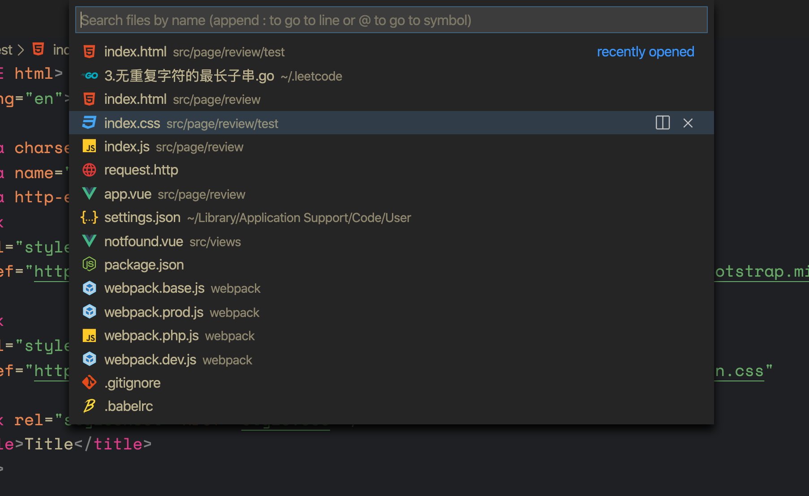

## 主命令框

`F1` 或 `Ctrl+Shift+P`: 打开命令面板。在打开的输入框内，可以输入任何命令，例如：

- 按一下 `Backspace` 会进入到 `Ctrl+P` 模式
- 在 `Ctrl+P` 下输入 `>` 可以进入 `Ctrl+Shift+P` 模式

在 `Ctrl+P` 窗口下还可以:

- 直接输入文件名，跳转到文件
- `?` 列出当前可执行的动作
- `!` 显示 `Errors`或 `Warnings`，也可以 `Ctrl+Shift+M`
- `:` 跳转到行数，也可以 `Ctrl+G` 直接进入
- `@` 跳转到 `symbol`（搜索变量或者函数），也可以 `Ctrl+Shift+O` 直接进入
- `@` 根据分类跳转 `symbol`，查找属性或函数，也可以 `Ctrl+Shift+O` 后输入:进入
- `#` 根据名字查找 `symbol`，也可以 `Ctrl+T`

## 列模式

`shift` + `option` + 单击