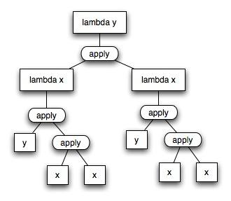

# Lambda演算 — 重复

在前面的几个帖子里，我已经建立了如何把`lambda`演算变成一个有用的系统的点点滴滴。 我们已经有了数字，布尔值和选择运算符。我们唯一欠缺的是重复。

这个有点棘手。`lambda`演算使用递归实现循环。 但是，由于在`lambda`演算里函数没有名字，我们得采取一些非常手段。这就是所谓的`Y`组合子，又名`lambda`不动点运算符。

### factorial

让我们先来看看 `lambda` 演算之外的一个简单的递归函数。阶乘函数，这是标准的例子：

```ts
let factorial = (n) => n > 0 ? n * factorial(n-1) : 1;
```

如果我们要用 `lambda` 演算来写的话，我们需要几个工具……我们需要一个测试是否为零的函数，一个乘法函数，以及一个减 `1`的函数。

为了检查是否为零，我们将使用一个命名函数`IsZero`，它有三个参数：一个数字，两个值。如果数字为0，则返回第一个值；如果它不为0，则返回第二个值。

对于乘法——我们假设在制定出递归之前写不出乘法。但我们可以假设目前有一个乘法函数 `Mult x y`。

最后，减1函数，我们用`Pred x`表示`x`的前驱——即`x - 1`。

```ts
λn.IsZero n 1 (Mult n (shouldBeARecursice (Pred n))) 
```

现在的问题是，我们怎么填上“shouldBeARecursice”，使其递归？

### Y组合子

答案是一些所谓的组合子。一个组合子是一种特殊的高阶函数，它们只引用函数应用。(一个高阶函数是一个函数，它接受函数作为参数，并且返回的结果也是函数)。

`Y` 组合子非常特殊，它有近乎神奇的功能使得递归成为可能。它的样子如下：

```ts
let Y = λy.(λx. y(x x)) (λx. y(x x))
```

看了公式，你就就明白为什么叫它 `Y` 了，因为它的递归树的“形状”像一个 `Y`。为了让这一点更清晰，有时我们把它写成树的形式。下面是 `Y` 组合子的树：



`Y` 组合子的特别之处在于它应用自身来创造本身，也就是说 `(Y Y) = Y (Y Y)`。让我们从`(Y Y)`开始看看它如何工作：

+ `Y Y`；
+ 展开第一个 `Y`：`(λy.(λx. y(x x)) (λx. y(x x))) Y`；
+ 对展开式做 `Beta`规约：`(λx. Y(x x)) (λx. Y(x x))`；
+ 使用`Alpha[x/z]`转换第二个 `lambda` 表达式里面的 `x`：`(λx. Y(x x)) (λz. Y(z z))`：
+ 再次使用 `Beta` 规约：`Y((λz. Y(z z)) (λz. Y(z z)))`；
+ 展开第一个 `Y` ：`(λy.(λx. y(x x)) (λx. y(x x))) ((λz. Y(z z)) (λz. Y(z z)))`;
+ 使用 `Alpha[x/a][y/b]`转换：`(λb.(λa. b(a a)) (λa. b(a a))) ((λz. Y(z z)) (λz. Y(z z)))`;
+ 再做 `Beta` 规约：`(λa.[((λz. Y(z z)) (λz. Y(z z)))](a a)) (λa.[((λz. Y(z z)) (λz. Y(z z)))](a a))`;

记得前面的`(Y Y) = (λx. Y(x x)) (λx. Y(x x))`吧。仔细看这个表达式，这是`(Y (Y Y))`。所以， `Y Y = Y (Y Y)`，这是Y的魔力：它再造了本身。`(Y Y) = Y (Y Y) = Y (Y (Y Y))`，子子孙孙无穷匮也。

### back to factorial

好吧，让我们拿我们的第一次尝试做一下修改。给它取个名字，并尝试使用该名字重写：

```ts
let fact = λn.IsZero n 1 (Mult n (fact (Pred n))) 
```

问题是我们现在写的 `fact` 并不是定义中的标识符，它是不存在的，那么我们如何搞出来这个 `fact` 的引用呢，我们可以做一个`lambda` 抽象，让 `fact` 函数作为参数传过去；于是，如果我们能找到一种方法来写 `fact`，使得我们可以把它作为一个参数传给它自己，事情就搞定了。我们称之为 `_fact`。

```ts
let _fact = lambda fact . (lambda n . IsZero n 1 (Mult n (fact (Pred n)))) 
```

现在，如果我们可以应用 `_fact` 到本身，我们就得到了我们的阶乘函数。也就是说，

```ts
fact n = (_fact _fact) n
<= (λf1.λt1.t1 ? 1 : t1 * f1(P(t1))) (λf2.λt2.t2 ? 1 : t2 * f2 (P(t2))) n
<= (λt1.t1 ? 1 : t1 * (λf2.λt2. t2 ? 1 : t2 * f2 (P(t2))) (P(t1))) n
<= n ? 1 : n * (λf2.λt2. t2 ? 1 : t2 * f2 (P(t2))) (P(n))
<= n ? 1 : n * (λf2. P(n) ? 1 : P(n) * f2 (P(P(n))))
// (n - 1) * fact(n - 2) === fact(n - 1)
<= n ? 1 : n * (λf. f (P(n)))
```

