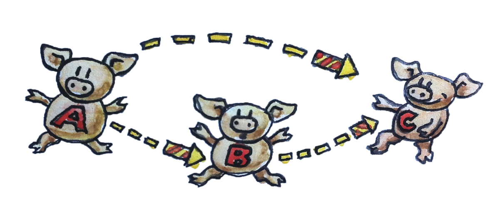

# Category: The Essence of Composition

范畴是一个相当相当相当简单的概念。一些对象以及对象之间存在的一些箭头就构成了一个范畴。所以，范畴很容易用图形来表示。对象可以画成圆或点，箭头就画成箭头。范畴的本质是组合 `compose`，反过来也可以说组合 `compose` 的本质是范畴。

箭头可以复合，因此如果你有一个从 `A` 指向 `B` 的箭头，又有一个从 `B` 指向 `C` 的箭头，那么就必定有一个复合箭头——从 `A` 指向 `C` 的箭头。



> [小贴士：]()在范畴论中，如果有一个箭头从 `A` 指向 `B`，又有一个箭头从 `B` 指向 `C`，那么就必定存在一个从 `A` 指向 `C` 的箭头，它是前两个箭头的组合。这幅图并非一个完整的范畴，因为它没有自态射（详见后文）。

## Arrows as Functions

现在来点实在的，将箭头想象为函数，虽然它的学名叫**态射**。

你有一个函数 `f`，它接受一个 `A` 类型的值，返回一个 `B` 类型的值。你还有一个函数 `g`，它接受一个 `B` 类型的值，返回一个 `C` 类型的值。你可以将 `f` 的返回值传递给 `g`，这样就完成了这两个函数的复合，你得到的是一个新的函数，它接受一个 `A` 类型的值，返回一个 `C` 类型的值。

来看看一个 `typescript` 的示例：

```ts
let f = (a: A) => b;
let g = (b: B) => c;

let composedFG = (a: A) => g(f(a));
```

在数学中，这样的复合可以用一个小圆点连接两个函数来表示，即 `g∘f`。 注意，复合是从右向左发生的。

我们希望 `ts` 中提供一个运算符，它能够接受两个函数然后返回它们的复合，但是可惜并没有这样的运算符。所以我们只能试试 `Haskell` 了。下面是一个从 A 到 B 的函数的声明：

```haskell
f :: A -> B
```

类似的还有

```haskell
g :: B -> C
```

它们复合为：

```haskell
g . f
```

作为一门正统的函数式编程语言，`haskell` 写起来就是如此的性感，

这也是我们的 `Haskell` 第一课：两个冒号的意思是`『 类型为…… 』`。一个函数的类型是由两个类型中间插入一个箭头而构成的。要对两个函数进行复合，只需在二者之间插入一个 `.`。

## Properties of Composition

在任何范畴的组合之中有两条性质必须被满足：

### associative 结合律

组合支持结合律，如果你有三个态射，`f`，`g` 与 `h`，它们能够被复合（也就是它们的对象能够首尾相连），那么你就没必要在复合表达式中使用括号。在数学中，可表示为：
$$
h∘(g∘f) = (h∘g)∘f = h∘g∘f
$$
在 `typescript` 可表示为：

```ts
compose(h, (g, f)) === compose((h, g), f) === compose(h, g, f)
```

对于函数的处理，结合律相当清晰，但是在其他范畴中可能就不这么清晰了。

### identity morphisms 自态射

任意一个对象 `A`都有一个箭头作为组合的最小单元，这个箭头从对象出发成环形指回对象自身。作为组合的最小单元的意思为任何从 `A` 触发最后又指向 `A` 的箭头都是一致的。对象的最小单元箭头称之为 `id𝐴 (identity on 𝐴)`

在数学表示中，如果 `f` 从 `A` 到 `B`，那么就有
$$
𝑓 ∘ id_𝐴 = 𝑓
$$

$$
id_B∘f = f
$$

在处理函数时，恒等箭头就是作为一个恒等函数实现的，这个函数的唯一工作就是直接返回它所接受的参数值。对于所有的类型，都可以这么实现恒等，这意味着这个函数是多态的。

在 `typescript` 可以被如下这么定义：

```ts
type id<T> = (x: T) => T;
```

在 `Haskell` 中，恒等函数是标准库（即 `Prelude`）中的一部分，其定义如下：

```haskell
id :: a -> a
id x = x
```

`Haskell` 函数的定义由尾随着形参的函数名构成，这里只有一个形参 `x`。函数体在 `=` 号之后。这种简洁扼要的风格经常令新手愕然，但你很快就会发现它的魅力所在。

函数体总是由一个表达式构成，亦即函数中没有语句。一个函数的返回结果就是这个表达式本身——在此就是 `x`。

这就是我们的 `Haskell` 第二课。

恒等条件可写为（还是伪 `Haskell` 代码）：

```haskell
f . id == f
id . f == f
```

可能你会问：为何需要这个什么也不做的恒等函数？其实你应该这样问，为什么需要数字 `0`？

`0` 是一个表示无的符号。古罗马人有一个没有 `0` 的数字系统，他们能够修建出色的道路与水渠，有些直到今天还能用。

类似 `0` 这样的东西，在处理符号变量的时候特别有用。这就是罗马人不擅长代数学的原因，而阿拉伯人与波斯人因为熟悉 `0` 的概念，因此他们能够很好的掌握代数学。

当恒等函数作为高阶函数的参数值或返回值时，它的价值会得以体现。高阶函数能像处理符号那样处理函数，它们是函数的代数。

## Composition is the Essence of Function Programming

在编程中我们是如何求解问题的？我们把大问题分解为更小的问题。如果更小的问题还是还是很大，我们再继续进行分解，以此类推。最后，我们写出求解这些小问题的代码，然后就出现了编程的本质：我么将这些代码片段组合起来，从而产生大问题的解。如果我们不能将代码片段整合起来并还原回去，那么问题的分解就毫无意义。

那么，对于组合程序而言，正确的代码块是怎样的？它们的表面积必须要比它们的体积增长的更为缓慢。我喜欢这个比喻，因为几何对象的表面积是以尺寸的平方的速度增长的，而体积是以尺寸的立方的速度增长的，因此表面积的增长速度小于体积。

代码块的表面积是是我们组合代码块时所需要的信息。代码块的体积 是我们为了实现它们所需要的信息。一旦代码块的实现过程结束，我们就可以忘掉它的实现细节，只关心它与其他代码块的相互影响。在面向对象编程中，类或接口的声明就是表面。在函数式编程中，函数的声明就是表面。我把事情简化了一些，但是要点就是这些。

在避免我们窥探对象内部方面，范畴论意义非凡。范畴论中的一个对象，像一个星云。对于它，你所知的只是它与其他对象之间的关系，亦即它与其他对象相连接的箭头。

在面向对象编程中，一个理想的对象应该是只暴露它的抽象接口（纯表面，无体积），其方法则扮演箭头的角色。如果为了理解一个对象如何与其他对象进行组合，当你发现不得不深入挖掘对象的实现之时，你所用的编程范式的原本优势就荡然无存了。

