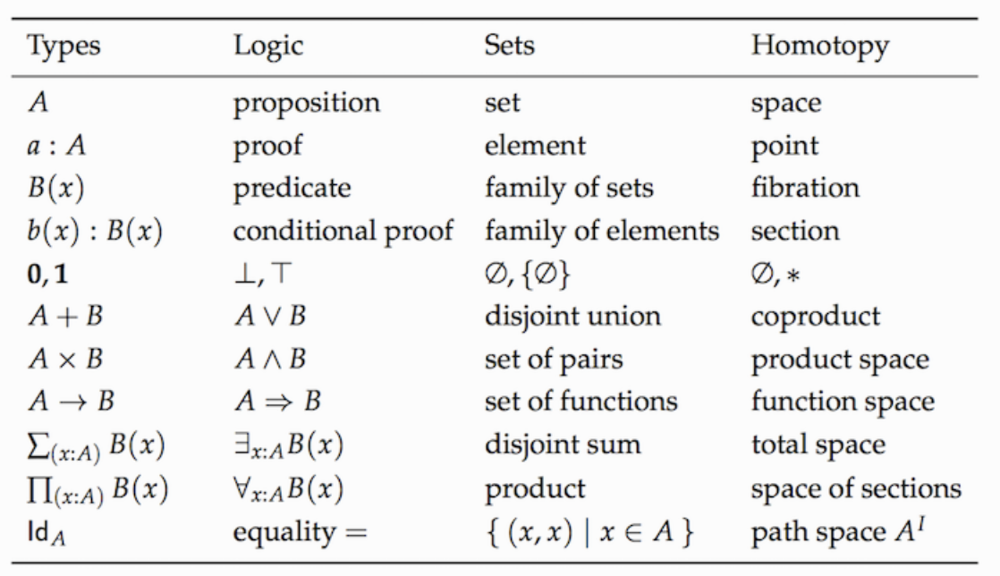

# Types and Functions

类型与函数构成的范畴在编程中担任着重要的角色。我们讨论一下类型是什么，为什么需要它。

## Do We Needs Types?

关于静态 vs 动态，强类型 vs 弱类型，似乎存在着一些争论。下面我用一个思想实验让这些选择变得更直观一些。想象一下，无数只猴子在快乐的随机敲打着键盘，产生程序，编译，然后运行。


对于机器语言来说，猴子们产生的任何字节的组合都会被计算机接受并运行(且不论是否存在意义)，值得庆幸的是高级的语言，因为有负责检查词法与语法错误的编译器的存在，导致大部分猴子因为努力敲打键盘却未得到香蕉而拂手而去，而剩下的那些猴子胡乱敲打所生成的程序如果能通过编译，它们更有可能变成有用的程序。

类型检查也提供了一个门槛，可以拦截无意义的程序。此外，在强类型的静态语言中，可以在编译期间发现类型错误，从而在大部分不正确的程序运行之前就干掉了它们，而动态类型语言只能在运行时进行类型检查……

这个关于猴子的思想实验，通常的目标是让打字的猴子们创作一部莎士比亚全集的。在这个过程中，如果有拼写检查与语法检查，就可以提高成功的可能性。类型检查的比喻具有更重要的意义，因为它可以确定，一旦罗密欧被识别为人类，那么他就无法生根发芽长出树叶或者在他强大的重力场中捕获光子。

## Types For Composability

范畴论与箭头的复合有关。但是并非任意两个箭头都可以复合。一个箭头的目标对象必须与下一个箭头的源对象相同，这样的两个箭头方能复合。

在编程中，我们将一个函数的返回结果传递给另一个函数。如果目标函数不能正确的解析源函数传递来的数据，程序就不会工作。首尾必须相连，方能实现复合。编程语言的类型系统越强，箭头的配合就越容易描述与检验。

对于 `typescript` 来说，强大的类型系统以及泛型编程就是她的全部。

而在 `Haskell` 中，大部分场合，类型声明并非必须。不过 `Haskell` 程序猿还是趋向于使用类型声明，因为他们可以让代码具有语义，也能使得编译错误更容易理解。`Haskell` 的实际编程中，往往是在项目的一开始就进行类型设计，然后用类型的声明驱动程序的实现，最终类型声明会变成代码注释，但是这种注释对于编译器是有意义的。

## What Are Types?

对于类型，最简单的直觉就是它是值的集合。`Bool` 类型（记住，Haskell 中具体类型是大写字母开头）是一个含有 2 个元素 `True` 与 `False` 的集合。`Char` 类型是所有 Unicode 字符的集合。

集合可能是有限或无限的。`String` 类型，它与 `Char` 列表同义，它就是个无限集的例子。

当我们将 `x` 声明为 `Integer` 时：

```go
var x: int;
```

```haskell
x :: Integer
```

我们想说的是，`x` 是一个整型数集中的一个元素。在`Haskell` 中，`Integer` 是无限集，它能够用于任意精度的算术。还有个有限集，叫 `Int`，它与机器类型有关，就像 `go` 的 `int`。

前面我们曾经提到过，范畴学（``category theory``）是数学中的一个抽象分支，能够形式化诸如集合论（``set theory``）、类型论（``type theory``）：



其中范畴学中的集合论(集合的范畴)是一个绝妙的概念，集合的范畴就称为 `Set`，在 **Set** 中，对象是集合，态射(箭头)是函数。

**Set** 是个非常特殊的范畴，因为我们实际上只能从它的内部拮取一些对象，并通过操作这些对象来认识它。例如，我们知道空集不包含任何元素。我们知道存在只含有一个元素的集合。我们知道函数可以将一个集合中的元素映射到另一个集合。它们也能将两个元素映射为一个，但是却不能将一个元素映射为 2 个。我们还知道恒等函数可以将一个元素映射为本身，等等。

在理想世界中，我们可以说 Haskell 的数据类型是集合，Haskell 的函数是集合之间的数学函数。只不过有个小问题：数学函数不可被执行——它只知道答案。Haskell 函数必须要计算出答案。如果答案可以在有限步骤中被计算出来，这不是什么问题，然而步骤的数量可能会很大。有些计算是递归的，它可能永远不会终止。在 Haskell 中我们不能阻止停不下来的函数，因为这就是著名的停机问题。这就是为什么计算机科学家搞出来一个聪明的点子，也可以说是一个巨大的 hack，这取决于你的视角；他们为每一种类型增加了一个特殊值，叫做**底**（Bottom），用符号表示为 `_|_`，也可以用 Unicode 字符 `⊥`。这个『值』与无休止计算有关。因此，若一个函数声明为：

```
f :: Bool -> Bool
```

它可以返回 `True`，`False` 或 `_|_`；后者表示它不会终止。

有趣的是，一旦你接受了将**底**作为类型系统的一部分，就可以将每一种运行时错误作为**底**来对待，甚至可以容许函数显式地返回**底**——通常用于未定义的表达式，例如：

```
f :: Bool -> Bool
f x = undefined
```

这种类型的定义之所以能通过类型检查，是因为 `undefined` 的求值结果是底，而底可以是任何类型的值，所以它也是 `Bool` 类型的值。甚至，你可以这样不要那个 `x`，即：

```
f :: Bool -> Bool
f = undefined
```

因为底也是类型 `Bool->Bool` 这种类型的值。

可以返回底的函数被称为偏函数，与全函数相对，后者总是对于每种可能的参数值返回有效的结果。

由于底的存在，你将会看到 Haskell 类型与函数的范畴会被称为 Hask，而不是 Set。从理论上来看，这是导致出现无休止的复杂性的源头，因此在这一点我要动用我的庖丁之刀将复杂砍掉。从实用的角度来看，不理睬无休止的函数与底是没有问题的，将 Hask 视为一个友善的 Set 即可

## Pure Function、Dirty Function

在编程语言中，我们称之为函数的东西，与数学上被称为函数的东西是不同的。数学上的函数是值到值的映射。

在编程语言中，我们能够实现数学上的函数：一个函数，给它一个输入值，它就计算出一个输出的值。一个平方函数就是输入值自身的乘积。每次被调用时，对于相同的输入，它总是能保证产生同样的输出。一个数的平方不会随着时间的变化而变化。

再者，计算一个数的平方也不会对与之不相关的东西产生副作用。如果有一个『函数』有副作用，那么它的模型就与数学里的函数存在很大差异。

在命令式语言中，给予相同输入总是能得到相同输出的函数，被称为**纯函数**。在一种纯函数式语言中，例如 `Haskell`，所有的函数都是纯的。正是因为这一点，`Haskell` 更易于赋予语言以指称语义，并使用范畴论进行建模。对于其他语言，也可以构造出一个纯的子集，或者对副作用谨慎对待。

而排除掉纯函数，剩下的都是脏函数。

## Type Example

### Void

一旦意识到类型是集合，你就可以思考一些相当生僻的类型。例如，空集这种类型是什么？在 `Haskell` 中，空集是 `Void`，虽然  `typescript` 中也有个 `void`，但它俩不是一回事。

`Haskell` 中的 `Void` 是一个不存储任何值的类型。你可以定义一个接受 `Void` 的函数，但是你永远无法调用它。因为，要调用这个函数，必须向它提供一个 `Void` 类型的值，但这种类型的值并不存在。至于这个函数的返回值，不需要作任何限制。它可以返回任何类型，反正它根本没有机会运行。换句话说，它是一个具有多态返回类型的函数。`Haskell` 程序员将其命名为：

```
absurd :: Void -> a
```

记住，`a` 是一个类型变量，它可接受任何类型。函数的名字不太相符。这种类型与函数，在逻辑学上有更深入的解释，它们被称为 Curry-Howard 自同态。`Void` 类型表示谎言，`absurd` 函数的类型相当于『由谎言可以推出任何结论』，也就是逻辑学中所谓的『爆炸原理』。

### Singleton

下一个类型相当于单例集合。它是只有一个值的类型。你可能意识不到，它实际上就是 `typescript` 中的 `void`。考虑那些输入是 `void` 以及返回是 `void` 的函数。一个输入是 `void` 的函数总是能够被调用。如果它是纯函数，它就总是能返回相同的结果。例如：

```ts
f44(): number { return 44; }
```

### Unit

让函数返回 `void` 类型会怎样，或者说，在 Haskell 中，让函数返回 unit 会怎样？在 typescript 中，这样的函数通常担当具有副作用的函数，但是我们知道这种函数并非数学意义上的函数。一个返回 unit 的纯函数，它什么也不做，或者说，它唯一做的就是丢弃它所接受的输入。

在数学上，一个从集合 A 到单例集合的函数会将 A 中的每个元素映射为单例集合中的元素。对于每个 A 都存在这样的函数。例如对于 `Integer`，有：

```haskell
fInt :: Integer -> ()
fInt x = ()
```

你向这个函数提供任何整数，它都会给你返回一个 unit。本着简明扼要的精神，Haskell 允许你使用通配符模式，可以用下划线来替代要忽略的输入。这样你就不需要再为它重新弄个名字。上述函数可改写为：

```haskell
fInt :: Integer -> ()
fInt _ = ()
```

注意，这个函数的实现不仅不依赖传给它的参数，它也不依赖参数的类型。

对于任意类型都具有相同形式的函数，称为参数型多态。用类型变量来代替一个具体的类型，就可以实现一个函数族。我们要怎么称呼一个从任意类型到 unit 的函数？当然，要称它为 `unit`：

```haskell
unit :: a -> ()
unit _ = ()
```

### Boolean

我们的类型学里的下一个类型是二元集合。在 C++ 中，这个集合被称为 `bool`，在 Haskell 中则称为 `Bool`。二者的区别是，`typescript` 的 `bool` 是内建类型，而 Haskell 的则可以自行定义：

```haskell
data Bool = True | False
```

这个定义得这么读：`Bool` 要么是 `True`，要么是 `False`。理论上，`typescript` 也可以用枚举来定义一个 `Bool` 类型：

```haskell
enum BOOLEAN {
    true,
    false
};
```

但是 `typescript` 的 `enum` 的类型本质上是整型。输出 `Bool` 的函数被称为**谓词**。例如，Haskell 库 `Data.Char` 充满了类似 `isAlpha` 或 `isDigit` 这样的谓词。在 `Ramda` 这样的库中也有很多的谓词：`is`、`isEmpty`、`isNil`。


