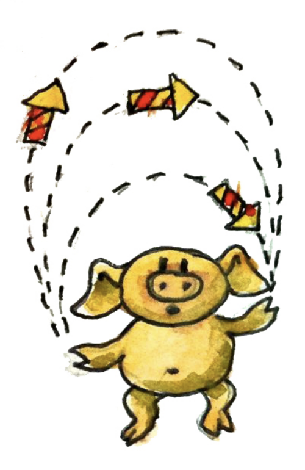

# Categories Great and Small

可能你已经通过研究一些案例对范畴有所体悟了，但是范畴是变化多端的且可以在任何地方出现，我们可以从很简单的东西上来观察它。

## No Objects ==空==

最小的范畴是拥有 0 个对象的范畴。因为没有对象，自然也就没有态射。这个范畴挺悲哀的，因为它只拥有自己。不过，对于其它范畴而言，它可能是挺重要，例如所有范畴的范畴。

## Simple Graphs ==图==

用箭头将对象连接起来就可以构造出范畴。在一个有向图上增加一些箭头，就可以将它变成一个范畴。首先，要为每个结点增加恒等箭头。然后为任意两个首尾相邻的箭头（也就是任意两个可复合的箭头）增加一个复合箭头。每次添加一个新的箭头，你必须得考虑它本身与其他箭头（除了恒等箭头）的复合。你会画到自己实在不想画了，不过这样就足够了，这个有向图已经变成了范畴。

从另一个角度看这个过程，图中每个结点是一个对象，图中的边所构成**链**就是态射。可以认为恒等态射就是长度为 `0` 的链。

这种由给定的图而产生的范畴，被称为**自由范畴**。它是一种自由构造的示例，即给定一个结构，用符合法则（在此，就是范畴论法则）的最小数量的东西来扩展它。接下来，会有更多的例子来说明这一点。

## Orders ==序==

### 前序集

现在，截然不同的东西出现了！有这样一个范畴，它所包含的态射描述的是两个对象之间的关系——**小于或等于**。来检查一下它是不是一个真正的范畴。

**Q：**它有恒等态射吗？

**A：**每个对象都小于或等于它自身，[通过！]()

**Q：**态射可以复合么？

**A：**如果 `a <= b，b <= c`，那么 `a <= c`，[通过！]()

**Q：**态射遵守结合律么？

**A：** `a<=(b<=c)  === (a<=b)<=c  ` ，[通过！]()

伴随这种关系的集合被称为**前序**集，因此一个前序集实际上是一个范畴。

### 偏序集

我们在前序集对象之间关系上再加一条，**如果  `a <= b，b <= a`，那么 `a` 肯定等于 `b`**。如果一个集合中只有部分元素之间存在这个关系，这个集合叫**偏序**集。

### 全序集

最后，如果一个集合中的任意两个元素之间存在偏序关系，那么这种集合就叫做**全序**集。

### 瘦范畴

可以将这些有序集描绘为范畴。前序集所构成的范畴，从任意对象 `a` 到任意对象 `b` 的态射最多只有一个。这样的范畴叫瘦范畴。

### hom集

在一个范畴 `C` 中，从对象 `a` 到对象 `b` 的态射集被称为 `hom-`集，记为 `C(a,b)`，有时也这样写 ：
$$
Hom_C(a,b)
$$
前序集内的每个 `hom-`集要么是空集，要么是单例（`Singleton`）。在任一前序集构成的范畴内，`C(a,a)` 也是 `hom-`集，不过它肯定是个单例，只包含着恒等态射。前序集是允许出现环的，而这种东西在偏序集内则是禁止的。

弄清楚前序、偏序与全序是非常重要的，因为排序需要它们。像快速排序、桶排序、归并排序之类的排序算法，它们只能处理全序集。偏序集可以使用拓扑排序算法来处理。

## Monoid as Set `幺半群`

幺半群(`Monoid`)是一个相当简单但是功能强大的概念。它是基本算数幕后的概念：只要有加法或乘法运算就可以形成幺半群。编程中，幺半群无处不在。它们表现为字符串、列表、可折叠数据结构，并发编程中的一些东西，函数式响应编程中的事件，等等。

传统的幺半群被定义为伴有一个二元运算的集合。这个二元运算只需满足结合律。集合中包含着一个特殊的元素，对于这个二元运算，该元素的行为像一个返回其自身的 `unit`。

例如，包含 `0` 的自然数伴随着加法运算就可以形成一个幺半群。所谓的结合律，即：
$$
(a+b)+c=a+(b+c)
$$
也就是说，在数字相加的时候，括号可忽略。

那个理想是永远保持中立的元素是 0，因为：
$$
0 + a = a ~~~ a+0=a
$$
加法运算符合交换律，`a + b = b + a`，但是交换律并非幺半群的定义所需要。例如，字符串连接运算就不遵守交换律，但它可以构成幺半群。对于字符串连接运算，中立元素是空的字符串，它可以挂接到一个字符串的任意一侧而不产生对象变化。

在 Haskell 中，我们可以为幺半群定义一个类型类——一种包含着中立元素 `mempty` 并伴随二元运算 `mappend` 的类型：

```haskell
class Monoid m where
    mempty :: m
    mappend :: m -> m -> m
```

具有两个参数的函数，其类型为 `m -> m -> m`，乍一看挺古怪，但是在我们懂得柯里化（Currying）之后，就能感受到这种形式的美。可以用两种基本方式来解释这多个箭头的意义：(1) 一个函数有多个参数，最右边的类型是返回值的类型；(2) 一个函数，它接受一个参数（最左边的那个），返回一个函数。在括号的帮助下，第二种解释可以被直观化为 `m -> (m -> m)`，不过括号是多余的，因为箭头是从右向左结合的。

注意，在 Haskell 中，无法解释 `mempty` 与 `mappend` 的幺半群性质，也就是说 `mempty` 是个什么样的中立者，`mappend` 符合怎样的结合律。因为这是程序猿的责任，毕竟 Haskell 不能未卜先知。

`Haskell` 里的类不像 `ts` 的类那样咄咄逼人。当你定义一个新的类型时，不需要声明它所属的类。为一个给定的类型，声明它是某个类的实例，这种事可以向后延迟（有点类似 `go` 的隐式接口实现）：

例如，我们可以将 `String` 声明为一个幺半群，并为它提供 `mempty` 与 `mappend` 的实现（当然，在 Haskell 的标准库（Standard Prelude）里已经做了此事）：

```haskell
instance Monoid String where
    mempty = ""
    mappend = (++)
```

在此，我们重用了列表的连接运算 `(++)`，因为 `String` 是列表，字符列表。

简单的说说 Haskell 的一个语法：任何中缀运算符，被括号围住之后，就可以转化为两个参数的函数。（在学习 Haskell 时，这可能是最难适应的东西。）

注意了啊，Haskell 允许函数相等。不过，在概念上，

```haskell
mappend = (++)
```

与函数产生值时的相等

```haskell
mappend s1 s2 = (++) s1 s2
```

是不同的。前者是 Hask 范畴（如果忽略底的话，是 **Set**）中态射的相等。像这样的方程不仅更简洁，也经常被泛化至其他范畴。后者被称为**外延**相等，陈述的是对于任意两个输入的字符串，`mappend` 与 `(++)` 的输出是相同的。因为参数的值有时也称为**point**（情同：f 在点 x 处的值），外延相等也被称为 point-wise 相等。未指定参数的函数的相等，称为 point-free 相等。

## Monoid as Category

集合形式的幺半群，现在我们知道了。但是你知道的，在范畴论中，我们所尝试的事情是放弃集合，我们要讨论的是对象与态射。因此，我们的视角应当改变一下，从范畴的角度来看作用于集合的『移动』或『转移』二元运算。

例如，有一个将每个自然数都加 ``5`` 的运算，它会将 ``0`` 映射为 ``5``，将 ``1`` 映射为 ``6``，``2`` 映射为 ``7``，等等。这样就在自然数集上定义了一个函数，挺不错的，我们有了一个函数与一个集合。通常，对于任意数字 ``n``，都会有一个加 ``n`` 的函数—— ``n`` 的『``adder``』。

这些 `adder` 们如何复合？加 `5` 的函数与加 `7` 的函数复合起来，是加 `12`。因此 `adder` 们的复合等同于加法规则。这也很好，我们可以用函数的复合来代替加法运算。

等一下，事情还没完：还有一个 `adder` 是面向中立元素 `0` 的。加 `0` 不会改变任何东西，因此它是自然数集上的恒等函数。

即使不以传统的加法规则作为参照，照样能给出 `adder` 们的复合规则。注意，`adder` 们的复合是符合结合律的，因为函数的复合是符合结合律的，而且我们也有个加 `0` 的函数作为恒等函数。

敏锐的读者可能会注意到，从整型到 adder 的映射符合 `mappend` 类型签名的第二种解释，即 `m -> (m -> m)`。这意味着 `mappend` 将幺半群的一个元素映射为作用于这个集合的一个函数。这类似一个偏函数：

```haskell
mappend 5
```

现在，我希望你忘掉你在处理自然数集，只是将它视为一个单一的对象，它伴随着一捆态射——`adder` 们。一个幺半群，是一个单对象的范畴。事实上，幺半群的名字来自希腊语 `mono`，它的意思是单个的。每个幺半群都能被表述为带有一个态射集的单对象范畴，这些态射皆符合复合规则。



字符串的连接是一个有趣的例子，因为我们要选择是定义左 `appender`，还要定义右 `appender`。这两个态射是彼此镜象的。很容易确定这一点，将「`bar`」挂到「`foo`」的右侧，相当于将「`foo`」挂到「`bar`」的左侧。

你可能会问，是否每个范畴化的幺半群都会定义一个唯一的伴随二元运算的集合的幺半群。事实上我们总是能够从单个对象的范畴中抽出一个集合。这个集合是态射的集合——在前面的例子里就是 `adder` 们。换句话说，对于只含单个对象 `m` 的范畴 `M`，我们有一个 `hom-`集 `M(m, m)`。在这个集合上，我们很容易定义一个二元运算：两个元素相乘相当于两个态射的复合。如果你给我 `M(m, m)` 中的两个元素 `f` 与 `g`，它们的乘积就相当于 `g`∘`f`。复合总是存在的，因为这些态射的源对象与目标对象是同一个对象。这种乘法运算也符合范畴论法则中的结合律。恒等态射也是肯定存在的。因此，我们总是能够从幺半群范畴中复原出幺半群集合。无论从哪个角度来说，它们都是同一个东西。

> 幺半群的 `hom-` 集看上去是态射，也是点集。