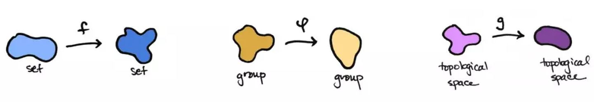

## 范畴论

函数式编程的起源，是一门叫做范畴论`Category Theory`的数学分支。

理解函数式编程的关键，就是理解范畴论。它是一门很复杂的数学，认为世界上所有的概念体系，都可以抽象成一个个的"范畴" `category`。

### 范畴的概念

> [wiki]()
>
> `In mathematics, a category is an algebraic structure that comprises "objects" that are linked by "arrows". `—— 范畴就是使用箭头连接的物体。

也就是说，彼此之间存在某种关系的概念、事物、对象等等，都构成"范畴"。随便什么东西，只要能找出它们之间的关系，就能定义一个"范畴"。

上图中，各个点与它们之间的箭头，就构成一个范畴。

箭头表示范畴成员之间的关系，正式的名称叫做"态射"`morphism`。范畴论认为，同一个范畴的所有成员，就是不同状态的"变形"`transformation`。通过"态射"，一个成员可以变形成另一个成员。

