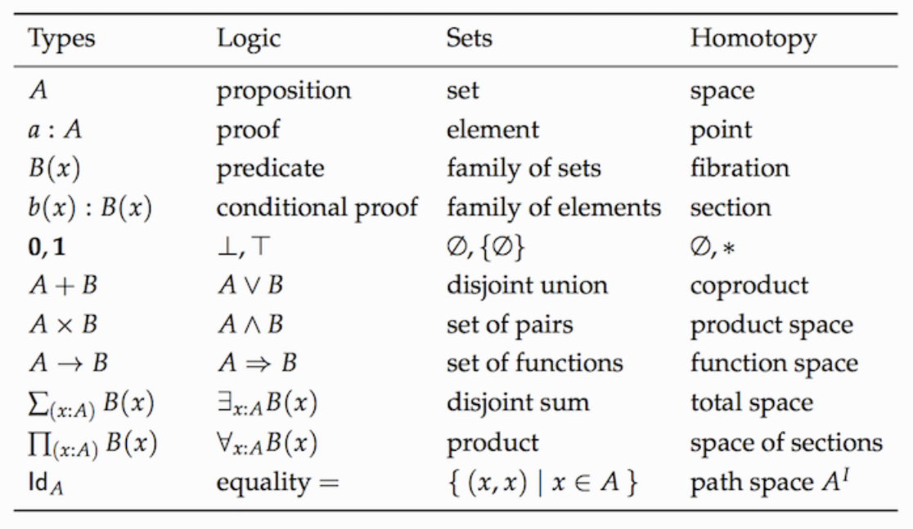
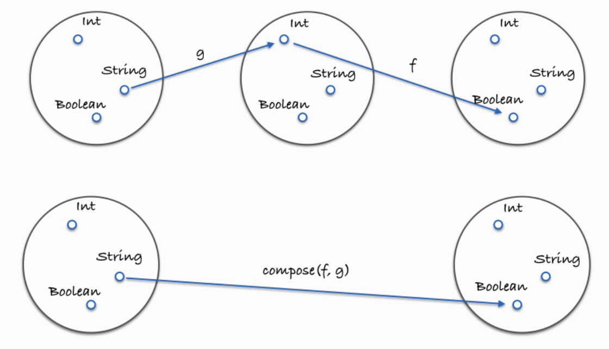

## 代码组合 compose

这就是 组合（`compose`，以下将称之为组合）：

```ts
var compose = function(f,g) {
  return function(x) {
    return f(g(x));
  };
};
```

`f` 和 `g` 都是函数，`x` 是在它们之间通过“管道”传输的值。

组合看起来像是在繁衍函数。你就是饲养员，选择两个有特点又遭你喜欢的函数，让它们结合，产下一个崭新的函数拥有结合两个素材的特性。组合的用法如下：

```ts
var toUpperCase = function(x) { return x.toUpperCase(); };
var exclaim = function(x) { return x + '!'; };
var shout = compose(exclaim, toUpperCase);

shout("send in the clowns");
//=> "SEND IN THE CLOWNS!
```

在 `compose` 的定义中，`g` 将先于 `f` 执行，因此就创建了一个从右到左的数据流。这样做的可读性远远高于嵌套一大堆的函数调用，如果不用组合，`shout` 函数将会是这样的：

```ts
var shout = function(x){
  return exclaim(toUpperCase(x));
};
```

### 特性：从右至左

组合函数，让代码从右向左运行，而不是由内而外运行。我们来看一个顺序很重要的例子：

```ts
function head(x) { return x[0]; };
function reverse(arr) {
    return arr.reduce(function (pv, cv, pi, ci) {
        return [cv].concat(pv);
    }, []);
}

var last = compose(head, reverse);

last(['jumpkick', 'roundhouse', 'uppercut']);
```

`reverse` 反转列表，`head` 取列表中的第一个元素；所以结果就是得到了一个 `last` 函数，虽然它性能不高。这个组合中函数的执行顺序应该是显而易见的。尽管我们可以定义一个从左向右的版本，但是从右向左执行更加能够反映数学上的含义——是的，组合的概念直接来自于数学课本。

### 特性：结合律

结合律意味着不管你是把 `g` 和 `h` 分到一组，还是把 `f` 和 `g` 分到一组都不重要。

```ts
// 结合律（associativity）
let associative = compose(foo, compose(bar, opp)) === compose(compose(foo, bar), opp); // true
```

所以，如果我们想把字符串变为大写，可以这么写：

```ts
compose(toUpperCase, compose(head, reverse));
// 或者
compose(compose(toUpperCase, head), reverse);
```

因为如何为 `compose` 的调用分组不重要，所以结果都是一样的。这也让我们有能力写一个可变的组合(`variadic compose`，用法如下：

```ts
var lastUpper = compose(toUpperCase, head, reverse);

lastUpper(['jumpkick', 'roundhouse', 'uppercut']);
//=> 'UPPERCUT'


var loudLastUpper = compose(exclaim, toUpperCase, head, reverse)

loudLastUpper(['jumpkick', 'roundhouse', 'uppercut']);
//=> 'UPPERCUT!
```

## 范畴论

范畴学（`category theory`）是数学中的一个抽象分支，能够形式化诸如集合论（`set theory`）、类型论（`type theory`）、群论（`group theory`）以及逻辑学（`logic`）等数学分支中的一些概念。范畴学主要处理对象（`object`）、态射（`morphism`）和变化式（`transformation`），而这些概念跟编程的联系非常紧密。下图是一些相同的概念分别在不同理论下的形式：



在范畴学中，有一个概念叫做...范畴。有着以下这些组件（`component`）的集合（`collection`）就构成了一个范畴：

+ 对象的集合
+ 态射的集合
+ 态射的组合
+ `identity` 自态射

范畴学抽象到足以模拟任何事物，不过目前我们最关心的还是类型和函数，所以让我们把范畴学运用到它们身上看看。

### 对象的集合

对象就是数据类型，例如 `String`、`Boolean`、`Number` 和 `Object` 等等。通常我们把数据类型视作所有可能的值的一个集合（`set`）。像 `Boolean` 就可以看作是 [`true, false`] 的集合，`Number` 可以是所有实数的一个集合。把类型当作集合对待是有好处的，因为我们可以利用集合论（`set theory`）处理类型。

### 态射的集合

态射是标准的、普通的纯函数。

### 态射的组合

你可能猜到了，这就是本章介绍的新玩意儿——组合。我们已经讨论过 compose 函数是符合结合律的，这并非巧合，结合律是在范畴学中对任何组合都适用的一个特性。

这张图展示了什么是组合：



### identity 自态射

让我们介绍一个名为 `id` 的实用函数。这个函数接受随便什么输入然后原封不动地返回它：

```ts
var id = function(x){ return x; };
```

你可能会问“这到底哪里有用了？”。别急，我们会在随后的章节中拓展这个函数的，暂时先把它当作一个可以替代给定值的函数——一个假装自己是普通数据的函数。

`id` 函数跟组合一起使用简直完美。下面这个特性对所有的一元函数（`unary function`）（一元函数：只接受一个参数的函数） `f` 都成立：

```ts
// identity
compose(id, f) == compose(f, id) == f;
// true
```

这就是实数的单位元（`identity property`）嘛！如果这还不够清楚直白，别着急，慢慢理解它的无用性。很快我们就会到处使用 `id` 了，不过暂时我们还是把它当作一个替代给定值的函数。这对写 `pointfree` 的代码非常有用。

## debug in compose

代码组合之后 `debug` 会变得困难，我们需要尝试去监听中间状态，这并不困难只要再 `compose` 的函数中间添加 `trace` 这个不纯(调用了 `console` )的 `debug` 函数：

```ts
var trace = curry(function(tag, x){
  console.log(tag, x);
  return x;
});

var dasherize = compose(join('-'), toLower, split(' '), replace(/\s{2,}/ig, ' '));

dasherize('The world is a vampire');
// TypeError: Cannot read property 'apply' of undefined

var dasherize = compose(join('-'), toLower, trace("after split"), split(' '), replace(/\s{2,}/ig, ' '));
// after split [ 'The', 'world', 'is', 'a', 'vampire' ]
```

`trace` 函数允许我们在某个特定的点观察数据以便 `debug`。

## point-free

`Point-free` 是一种编程风格，永远不必说出你的数据（译者注：此处原文是“``Pointfree style means never having to say your data``”，源自 ``1970`` 年的电影 ``Love Story`` 里的一句著名台词“``Love means never having to say you``'``re sorry``”）。

它的意思是说，其中函数定义不引用函数的参数。不用关心将要操作的数据是什样的。一等公民的函数、柯里化（``curry``）以及组合协作起来非常有助于实现这种模式。

> 范畴论中 `point-free` 相等表示着与参数无关的相等(`point` 有时被称为参数)，在 `Fp` 里被引用为不引用参数的函数。

```ts
// 非 Point-free. 因为函数引用了参数name
var greet = function(name) {
  return ('hello ' + name).toUpperCase();
}

// Point-free 先定义基本的函数，不用关心中间变量str是什么，抽象基本结构 
var toUpperCase = str => str.toUpperCase(); 
var hello = str => `hello ${str}`; 
var greet = compose(hello, toUpperCase); 
greet('renbo');
```

另外，`pointfree` 模式能够帮助我们减少不必要的命名，让代码保持简洁和通用。对函数式代码来说，`pointfree` 是非常好的石蕊试验，因为它能告诉我们一个函数是否是接受输入返回输出的小函数。

并非所有的函数式代码都是 `pointfree` 的，不过这没关系。可以使用它的时候就使用，不能使用的时候就用普通函数。

### demo

假设我们从服务器获取这样的数据：

```js
var data = {
  result: "SUCCESS",
  tasks: [
    {id: 104, complete: false,            priority: "high",
              dueDate: "2013-11-29",      username: "Scott",
              title: "Do something",      created: "9/22/2013"},
    {id: 105, complete: false,            priority: "medium",
              dueDate: "2013-11-22",      username: "Lena",
              title: "Do something else", created: "9/22/2013"},
    {id: 107, complete: true,             priority: "high",
              dueDate: "2013-11-22",      username: "Mike",
              title: "Fix the foo",       created: "9/22/2013"},
    {id: 108, complete: false,            priority: "low",
              dueDate: "2013-11-15",      username: "Punam",
              title: "Adjust the bar",    created: "9/25/2013"},
    {id: 110, complete: false,            priority: "medium",
              dueDate: "2013-11-15",      username: "Scott",
              title: "Rename everything", created: "10/2/2013"},
    {id: 112, complete: true,             priority: "high",
              dueDate: "2013-11-27",      username: "Lena",
              title: "Alter all quuxes",  created: "10/5/2013"}
  ]
};
```

###### getIncompleteTaskSummaries 函数

我们需要一个名为 ``getIncompleteTaskSummaries`` 的函数，接收一个 ``username`` 作为参数，从服务器获取数据之后筛选出这个用户未完成的任务的 ``ids``、``priorities``、``titles``、和 ``dueDate`` 数据，并且按照日期升序排序。

以 `Scott` 为例，最终筛选出的数据为

```js
[
    {id: 110, title: "Rename everything", 
        dueDate: "2013-11-15", priority: "medium"},
    {id: 104, title: "Do something", 
        dueDate: "2013-11-29", priority: "high"}
]
var getIncompleteTaskSummaries = function(membername) {
     return fetchData()
         .then(function(data) {
             return data.tasks;
         })
         .then(function(tasks) {
             return tasks.filter(function(task) {
                 return task.username == membername
             })
         })
         .then(function(tasks) {
             return tasks.filter(function(task) {
                 return !task.complete
             })
         })
         .then(function(tasks) {
             return tasks.map(function(task) {
                 return {
                     id: task.id,
                     dueDate: task.dueDate,
                     title: task.title,
                     priority: task.priority
                 }
             })
         })
         .then(function(tasks) {
             return tasks.sort(function(first, second) {
                 var a = first.dueDate,
                     b = second.dueDate;
                 return a < b ? -1 : a > b ? 1 : 0;
             });
         })
         .then(function(task) {
             console.log(task)
         })
};

getIncompleteTaskSummaries('Scott')
```

###### Point-free 模式

```js
// 拆分基础函数
var prop = curry(function(name, obj) {
    return obj[name];
});

var propEq = curry(function(name, val, obj) {
    return obj[name] === val;
});

var filter = curry(function(fn, arr) {
    return arr.filter(fn)
});

var map = curry(function(fn, arr) {
    return arr.map(fn)
});

var pick = curry(function(args, obj){
    var result = {};
    for (var i = 0; i < args.length; i++) {
        result[args[i]] = obj[args[i]]
    }
    return result;
});

var sortBy = curry(function(fn, arr) {
    return arr.sort(function(a, b){
        var a = fn(a),
            b = fn(b);
        return a < b ? -1 : a > b ? 1 : 0;
    })
});
// 拼装
var getIncompleteTaskSummaries = function(membername) {
    return fetchData()
        .then(prop('tasks'))
        .then(filter(propEq('username', membername)))
        .then(filter(propEq('complete', false)))
        .then(map(pick(['id', 'dueDate', 'title', 'priority'])))
        .then(sortBy(prop('dueDate')))
};

getIncompleteTaskSummaries('Scott')
```

###### 利用 ramda.js 实现 getIncompleteTaskSummarie

如果直接使用 `ramda.js`，你可以省去编写基本函数

```js
var getIncompleteTaskSummaries = function(membername) {
    return fetchData()
        .then(R.prop('tasks'))
        .then(R.filter(R.propEq('username', membername)))
        .then(R.filter(R.propEq('complete', false)))
        .then(R.map(R.pick(['id', 'dueDate', 'title', 'priority'])))
        .then(R.sortBy(R.prop('dueDate')))
};

getIncompleteTaskSummaries('Scott')
```

###### 利用 compose 实现 getIncompleteTaskSummaries

可以从右到左：

```js
var getIncompleteTaskSummaries = function(membername) {
    return fetchData()
        .then(R.compose(
            R.sortBy(R.prop('dueDate')),
            R.map(R.pick(['id', 'dueDate', 'title', 'priority'])),
            R.filter(R.propEq('complete', false)),
            R.filter(R.propEq('username', membername)),
            R.prop('tasks')
        ))
};

getIncompleteTaskSummaries('Scott')
```

###### 利用 ramda.js 提供的 R.pipe 函数

可以从左到右：

```js
var getIncompleteTaskSummaries = function(membername) {
    return fetchData()
      .then(R.pipe(
          R.prop('tasks'),
          R.filter(R.propEq('username', membername)),
          R.filter(R.propEq('complete', false)),
          R.map(R.pick(['id', 'dueDate', 'title', 'priority']),
          R.sortBy(R.prop('dueDate'))
      ))
};
```

