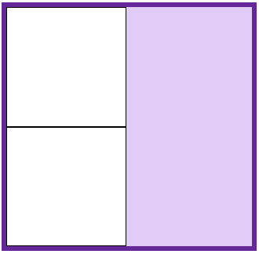
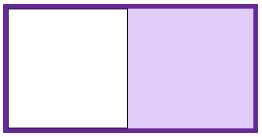
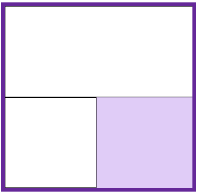
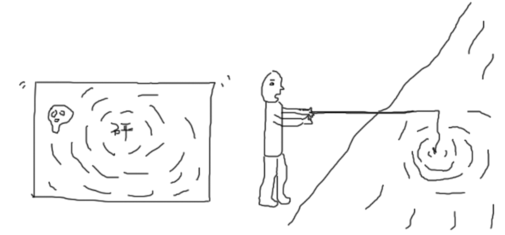
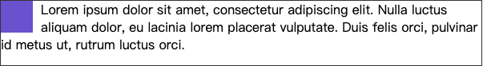

## BFC

-----

**块格式化上下文（Block Formatting Context，BFC）** 是 `Web` 页面的可视 `CSS` 渲染的一部分，是块盒子的布局过程发生的区域，也是浮动元素与其他元素交互的区域。也就是说所谓的`BFC`就是`css`布局的一个概念，是一块区域，一个环境。

**FC**是 `formatting context` 的首字母缩写，直译过来是格式化上下文，它**是页面中的一块渲染区域**，有一套渲染规则，决定了其**子元素如何布局，以及和其他元素之间的关系和作用。**

常见的`FC`有`BFC`、`IFC`（行级格式化上下文），还有`GFC`（网格布局格式化上下文）和`FFC`（自适应格式化上下文），这里就不再展开了。

下列方式会创建**块格式化上下文**：

+ 根元素（`<html>`）
+ 浮动元素（元素的 [`float`](https://developer.mozilla.org/zh-CN/docs/Web/CSS/float) 不是 `none`）
+ 绝对定位元素（元素的 [`position`](https://developer.mozilla.org/zh-CN/docs/Web/CSS/position) 为 `absolute` 或 `fixed`）
+ 行内块元素（元素的 [`display`](https://developer.mozilla.org/zh-CN/docs/Web/CSS/display) 为 `inline-block`）
+ 表格单元格（元素的 [`display`](https://developer.mozilla.org/zh-CN/docs/Web/CSS/display) 为 `table-cell`，HTML表格单元格默认为该值）
+ 表格标题（元素的 [`display`](https://developer.mozilla.org/zh-CN/docs/Web/CSS/display) 为 `table-caption`，HTML表格标题默认为该值）
+ 匿名表格单元格元素（元素的 [`display`](https://developer.mozilla.org/zh-CN/docs/Web/CSS/display) 为 `table`、`table-row`、 `table-row-group`、`table-header-group`、`table-footer-group`（分别是HTML table、row、tbody、thead、tfoot 的默认属性）或 `inline-table`）
+ [`overflow`](https://developer.mozilla.org/zh-CN/docs/Web/CSS/overflow) 计算值(`Computed`)不为 `visible` 的块元素
+ [`display`](https://developer.mozilla.org/zh-CN/docs/Web/CSS/display) 值为 `flow-root` 的元素
+ [`contain`](https://developer.mozilla.org/zh-CN/docs/Web/CSS/contain) 值为 `layout`、`content `或 paint 的元素
+ 弹性元素（[`display`](https://developer.mozilla.org/zh-CN/docs/Web/CSS/display) 为 `flex` 或 `inline-flex `元素的直接子元素）
+ 网格元素（[`display`](https://developer.mozilla.org/zh-CN/docs/Web/CSS/display) 为 `grid` 或 `inline-grid` 元素的直接子元素）
+ 多列容器（元素的 [`column-count`](https://developer.mozilla.org/zh-CN/docs/Web/CSS/column-count) 或 [`column-width`](https://developer.mozilla.org/zh-CN/docs/Web/CSS/column-width) 不为 `auto，包括 ``column-count` 为 `1`）
+ `column-span` 为 `all` 的元素始终会创建一个新的BFC，即使该元素没有包裹在一个多列容器中（[标准变更](https://github.com/w3c/csswg-drafts/commit/a8634b96900279916bd6c505fda88dda71d8ec51)，[Chrome bug](https://bugs.chromium.org/p/chromium/issues/detail?id=709362)）。

#### BFC布局规则

在块级格式化上下文中，块元素排布遵循如下规则：

1. 内部的 `Box `会在垂直方向，一个接一个地放置。
2. `Box`垂直方向的距离由`margin`决定。属于同一个`BFC`的两个相邻`Box`的`margin`会发生重叠
3. 每个元素的`margin box`的左边， 与包含块`border box`的左边相接触(对于从左往右的格式化，否则相反)。即使存在浮动也是如此。
4. `BFC`的区域不会与`float box`重叠。
5. `BFC`就是页面上的一个隔离的独立容器，容器里面的子元素不会影响到外面的元素。反之也如此。
6. 计算`BFC`的高度时，浮动元素也参与计算

**BFC布局规则1：*内部的Box会在垂直方向，一个接一个地放置。***

这个规则很清晰明了，就是块级元素会一个一个垂直的放置。



**BFC布局规则2：*Box垂直方向的距离由margin决定。属于同一个BFC的两个相邻Box的margin会发生重叠。***

在块级格式化上下文中，两个相邻的 `Box` 的 `margin` 会塌陷，也就是相同的部分会重叠。这里相邻指的是物理位置的相邻，而不是元素层级的相邻，比如下面这种情况也会产生内边距塌陷：

```html
<div class="top"></div>
<div class="container">
    <div class="bottom"></div>
</div>
<style>
 .aside {
   margin-bottom: 100px;
   height: 150px;
  }
  
  .bottom {
    margin-top: 100px;
    height: 200px;
  }
</style>
```

想要避免这种情况的发生，我们可以给上面的 `bottom` 外面包裹一个 `BFC` 来让两个盒子(`top` 和 `bottom`)不属于同一个`BFC`：

```css
<style>  
  .container {
		overflow: hidden;
  }
</style>
```

**BFC布局规则3：*父元素的 border 和子元素的 margin 水平方向上重合重合***

每个元素的 `margin` 的左边与包含块 `box` 的左边 `border` 相接触，即使存在浮动也是如此，只不过右浮动的时候就是正好相反。



**BFC布局规则4：*BFC的区域不会与float box重叠。***

浮动流和文档流相互重叠是很正常的事情，而 `BFC` 区域不会和文档流重叠，可以很好的清除浮动。



通过这个特性，我们可以使用 `float` 元素清除浮动，最简单的方法就是：

```css
.a {
  overflow: hidden;
  position: absolute;
}
```

**BFC布局规则4：*`BFC`就是页面上的一个隔离的独立容器，***

`BFC`就是页面上的一个隔离的独立容器，容器里面的子元素不会影响到外面的元素。内部子元素再怎么翻江倒海都不会影响外部的元素。所以，避免 `margin` 穿透啊，清除浮动什么的也好理解了。



## BFC和自适应布局

------

自适应布局这里主要指自适应两栏布局，一图胜千言，不使用 `BFC` 根据流体特性，我们可以使用 `margin` 和 `float` / `position` 来实现一个自适应两栏布局：


代码如下，同理使用定位将元素镶嵌到左上角也是可以的：

```html
<div style="width: 600px; height: 81px; border: 1px solid #333;">
  <div class="aside"></div>
  <div class="content">
    Lorem ipsum dolor sit amet, consectetur adipiscing elit. Nulla luctus aliquam dolor, eu lacinia lorem placerat vulputate. Duis felis orci, pulvinar id metus ut.
  </div>
</div>
<style>
  .content {
    margin-left: 100px;
  }
  .aside {
    width: 80px;
    height: 80px;
    background-color: slateblue;
    float: left;
  }
</style>
```

然而，利用块状元素流体特性实现的自适应布局有个不足，就是，我们需要知道浮动或绝对定位内容的尺寸。然后，流体内容才能有对应的`margin`或`padding`或`border`值进行位置修正。于是，问题来了，我们没法单纯使用一个公用的类名，类似`.clearfix`这样，整站通用。因为不同自适应场景的留白距离是不一样的。

#### BFC自适应

首先我们知道 `float`产生浮动之后周围的文字会有文本环绕效果：



如果我们能让文本部分和左边的浮动元素不接触 (并且不使用 `margin`)，那就做成了一个自适应两栏布局，实现起来也很简单，上文说了，`BFC` 不会和浮动元素接触。所以我们只要给右边的盒子产生一个 `BFC` 就能形成一个自适应布局。

```html
<div style="width: 600px; height: 81px; border: 1px solid #333;">
  <div class="aside"></div>
  <div class="content">
    Lorem ipsum dolor sit amet, consectetur adipiscing elit. Nulla luctus aliquam dolor, eu lacinia lorem placerat vulputate. Duis felis orci, pulvinar id metus ut.
  </div>
</div>
<style>
  .content {
    overflow: hidden;
  }
  .aside {
    width: 80px;
    height: 80px;
    background-color: slateblue;
    float: left;
    margin-right: 10px;
  }
</style>
```

