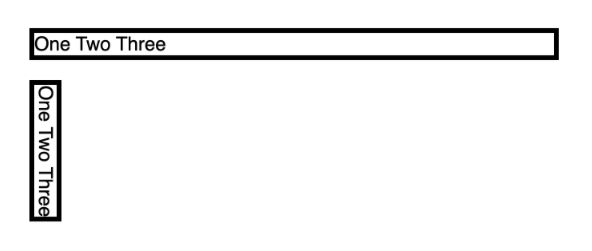
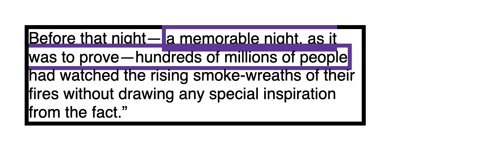
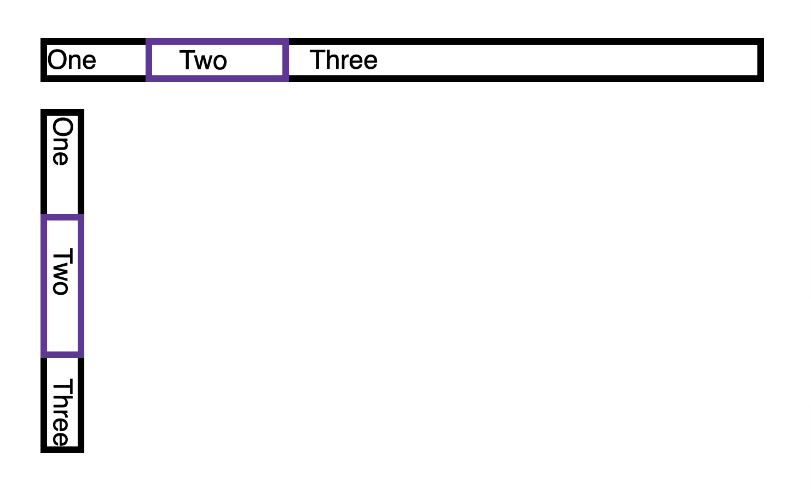
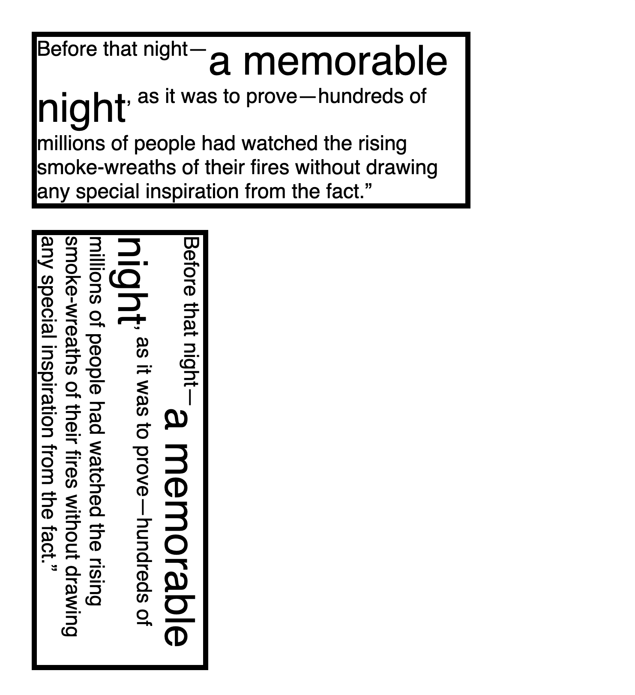
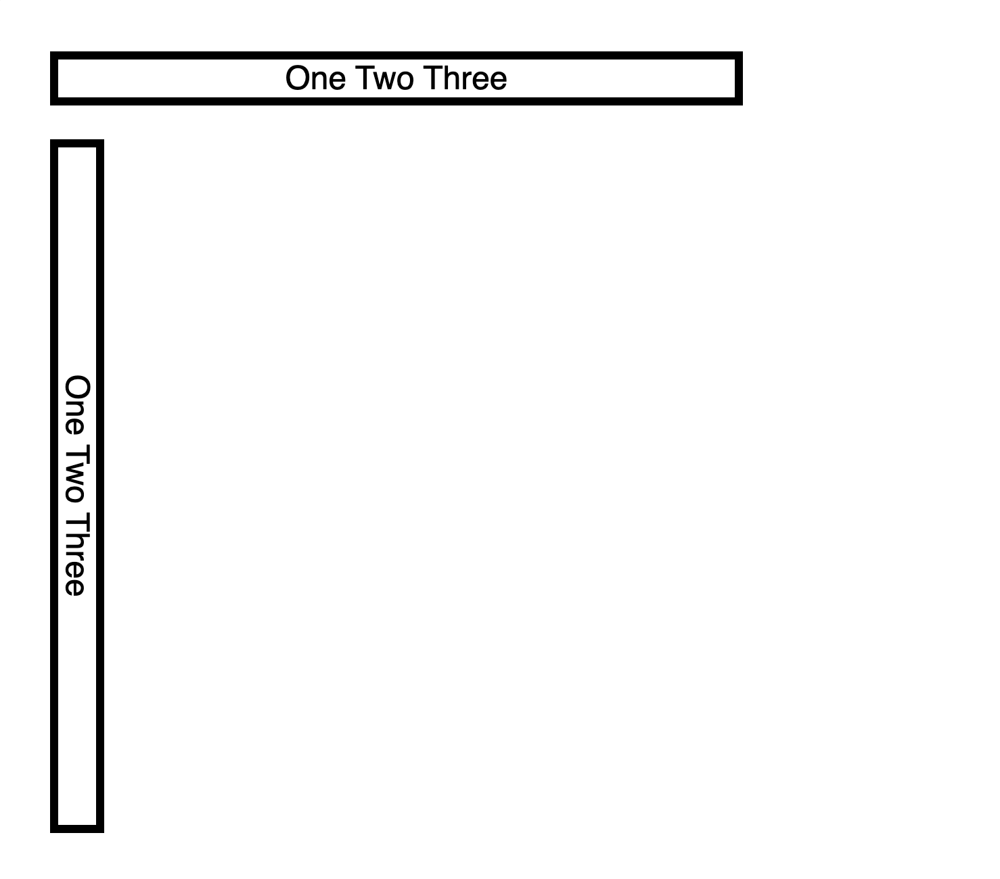
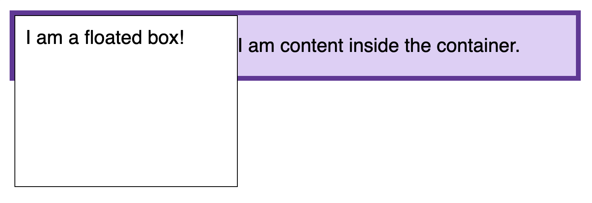

## 行内格式化上下文

------

行内格式化上下文是一个网页的渲染结果的一部分。其中，各行内框 `inline boxes` 一个接一个地排列，其排列顺序根据书写模式 `writing-mode` 的设置来决定：

+ 对于水平书写模式，各个框从左边开始水平地排列
+ 对于垂直书写模式，各个框从顶部开始水平地排列

**所有的行内级盒子参与行内格式化是上下文。**

在下面给出的例子中，带黑色边框的两个 
 元素组成了一个[块级格式化上下文（block formatting context）](https://developer.mozilla.org/zh-CN/docs/Web/Guide/CSS/Block_formatting_context)，其中的每一个单词都参与一个行内格式化上下文中。水平书写模式下的各个框水平地排列，垂直书写模式下的各个框垂直地排列。

各个框组成了一行，而该行位于一个称为“行框（`line box`）”的矩形区域之中。该行框的大小将足以包含该行中所有的行内框（`inline boxes`）；如果一行的空间不够，将在行内方向上新开一行。因此，一个段落实际上是一系列行框的集合，这些行框在块的方向上排列。

一个行内框（`inline box`）被分割到多行中时， `margins, borders`, 以及 `padding` 的设定均不会在断裂处生效。 下例中有一个 () 元素，它包裹了一系列单词，占据了两行。可以看见在断裂处，`` 的 `border` 同样发生了断裂。

`Margins, borders`, 以及 `padding` 的设置，在行的方向上是生效的。在下例中，可以看见行内元素 `` 的 `margin`， `border` 以及 `padding` 是被加上了的。

#### 在块的方向上对齐

行内框（`Inline boxes`）可使用`vertical-align`属性，以不同的方式在块的方向上进行对齐（因此在垂直书写模式下，`vertical-align` 中的“`vertical`”根本是名不副实——此时行内框将在水平方向上进行对齐）。 

下例中，字号较大的文本使得第一个句子的行框变大，因此 `vertical-align` 能让行内框（`inline boxes`）分布于上侧或下侧。例子里用的值是 `top`, 可以试试 `middle`, `bottom`, 或 `baseline` 这些值。

#### 在行内方向上对齐

如果行内方向上还有额外空间，那么 `text-align` 可用于将各行内框（`inline boxes`）在行框（`line box`）内对齐。 可以试试把 `text-align` 的值改成 `end` 。

#### 浮动造成的效果

在行内方向上，各行框（`Line Boxes` ）通常具有相同的尺寸，即在水平书写模式下，它们有同样的宽度；在垂直书写模式下，它们有同样的高度。但是，如果同一个块格式化上下文中存在一个 `float`，则这个浮动元素将导致包裹了它的各行框变短。

