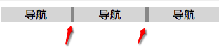
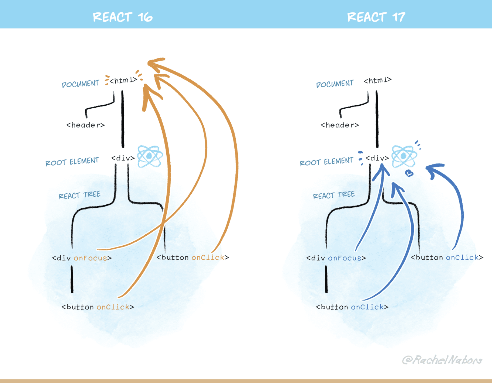

## 行内格式化上下文

------

行内格式化上下文是一个网页的渲染结果的一部分。其中，各行内框 `inline boxes` 一个接一个地排列，其排列顺序根据书写模式 `writing-mode` 的设置来决定：

+ 对于水平书写模式，各个框从左边开始水平地排列
+ 对于垂直书写模式，各个框从顶部开始水平地排列

**所有的行内级盒子参与行内格式化是上下文。**

在下面给出的例子中，带黑色边框的两个 <div/> 元素组成了一个[块级格式化上下文（block formatting context）](https://developer.mozilla.org/zh-CN/docs/Web/Guide/CSS/Block_formatting_context)，其中的每一个单词都参与一个行内格式化上下文中。水平书写模式下的各个框水平地排列，垂直书写模式下的各个框垂直地排列。


各个框组成了一行，而该行位于一个称为“行框（`line box`）”的矩形区域之中。该行框的大小将足以包含该行中所有的行内框（`inline boxes`）；如果一行的空间不够，将在行内方向上新开一行。因此，一个段落实际上是一系列行框的集合，这些行框在块的方向上排列。

一个行内框（`inline box`）被分割到多行中时， `margins, borders`, 以及 `padding` 的设定均不会在断裂处生效。 下例中有一个 (<span>) 元素，它包裹了一系列单词，占据了两行。可以看见在断裂处，`<span>` 的 `border` 同样发生了断裂。


`Margins, borders`, 以及 `padding` 的设置，在行的方向上是生效的。在下例中，可以看见行内元素 `<span>` 的 `margin`， `border` 以及 `padding` 是被加上了的。


#### 在块的方向上对齐

行内框（`Inline boxes`）可使用`vertical-align`属性，以不同的方式在块的方向上进行对齐（因此在垂直书写模式下，`vertical-align` 中的“`vertical`”根本是名不副实——此时行内框将在水平方向上进行对齐）。 

下例中，字号较大的文本使得第一个句子的行框变大，因此 `vertical-align` 能让行内框（`inline boxes`）分布于上侧或下侧。例子里用的值是 `top`, 可以试试 `middle`, `bottom`, 或 `baseline` 这些值。


#### 在行内方向上对齐

如果行内方向上还有额外空间，那么 `text-align` 可用于将各行内框（`inline boxes`）在行框（`line box`）内对齐。 可以试试把 `text-align` 的值改成 `end` 。


#### 浮动造成的效果

在行内方向上，各行框（`Line Boxes` ）通常具有相同的尺寸，即在水平书写模式下，它们有同样的宽度；在垂直书写模式下，它们有同样的高度。但是，如果同一个块格式化上下文中存在一个 `float`，则这个浮动元素将导致包裹了它的各行框变短。


## 水平间隙问题

-----

`inline-block` 元素综合了 `block` 元素与 `inline` 元素的一些特点，可以设置宽高还能在一行显示：

```html
<div class="nav">
  <a class="nav-item" href="#">导航</a>
  <a class="nav-item" href="#">导航</a>
  <a class="nav-item" href="#">导航</a>
</div>
<style>
.nav {
  background: #999;
}
.nav-item{
  display:inline-block; /* 设置为inline-block */
  width: 100px;
  background: #ddd;
}
</style>
```

效果图如下：



我们从效果图中可以看到列表 `item` 之间有一点小空隙，但是我们在代码中并没有设置 `margin` 水平间距。那么这个空隙是如何产生的呢？

这是因为我们编写代码时输入空格、换行都会产生空白符。而浏览器是不会忽略空白符的，且对于多个连续的空白符浏览器会自动将其合并成一个，故产生了所谓的间隙。

对于上面实例，我们在列表 `item` 元素之间输入了回车换行以方便阅读，而这间隙正是这个回车换行产生的空白符。

同样对于所有的行内元素（`inline`，`inline-block`），换行都会产生空白符的间隙。

### 如何消除空白符

从上面我们了解到空白符，是浏览器正常的表现行为。但是对于某些场景来说，并不美观，而且间隙大小非可控，所以我们往往需要去掉这个空白间隙。一般来说我们有两种方法来去掉这个换行引起间隙：代码不换行和设置 `font-size`。

#### 代码不换行

我们了解到，由于换行空格导致产生换行符，因此我们可以将上述例子中的列表 item 写成一行，这样空白符便消失，间隙就不复存在了。其代码如下：

```html
<div class="nav">
  <div class="nav-item">导航</div><div class="nav-item">导航</div><div class="nav-item">导航</div>
</div>
```

但考虑到代码可读及维护性，我们一般不建议连成一行的写法。

#### 设置 Font-Size

首先要理解空白符归根结底是个字符，因此，我们可以通过设置 `font-size` 属性来控制其产生的间隙的大小。我们知道如果将 `font-size` 设置为 `0`，文字字符是没法显示的，那么同样这个空白字也没了，间隙也就没了。

于是顺着这个思路就有了另一个解决方案：通过设置父元素的 `font-size` 为 `0` 来去掉这个间隙，然后重置子元素的 `font-size`，让其恢复子元素文字字符。

```css
.nav {
  background: #999;
  font-size: 0; /* 空白字符大小为0 */
}
.nav-item{
  display:inline-block;
  width: 100px;
  font-size: 16px; /* 重置 font-size 为16px*/
  background: #ddd;
}
```

使用该方法时需要特别注意其子元素一定要重置 `font-size`，不然很容易掉进坑里（文字显示不出来）。

## 垂直间隙问题

-----

由于 `inline-block` 垂直对齐使用的是 `vertical-align` 属性，而该属性默认的对齐方式为 `baseline`，在前面 `IFC` 的 `demo` 中，我们已经了解到，基线的位置为小写英文字母`x`的下端沿。该线离底线（`text-bottom`）还是有点距离的。

下面以实例论证，如下：

```html
<div style="background: burlywood;">
  
</div>
```

效果图如下：



按道理来说，`div` 的高度应该是图片撑开的高度，所以不可能看到如图所示的大概 `3px` （不同的字体大小，这个间隙会不一样）的背景色。所以为了解决这个问题，我们可以设置 `img` 的 `vertical-align` 的值为 `middle`，`text-top`，`text-bottom`都可以（前提是父元素 `line-height` 计算的高度要小于图片的高度）。

所以一般为了避免这个垂直的间隙，在设置 `inline-block` 的时候，还需要顺手带个 `vertical-align`: `middle`;

## Inline-block 和 float

----

`inline-block`和`float`的区别：

+ 文档流（`Document flow`）:浮动元素会脱离文档流，并使得周围元素环绕这个元素。而`inline-block`元素仍在文档流内。因此设置`inline-block`不需要清除浮动。当然，周围元素不会环绕这个元素，你也不可能通过清除`inline-block`就让一个元素跑到下面去。

+ 水平位置（`Horizontal position`）：很明显你不能通过给父元素设置`text-align`:`center`让浮动元素居中。事实上定位类属性设置到父元素上，均不会影响父元素内浮动的元素。但是父元素内元素如果设置了`display`：`inline-block`，则对父元素设置一些定位属性会影响到子元素。（这还是因为浮动元素脱离文档流的关系）。

+ 垂直对齐（`Vertical alignment`）：`inline-block`元素沿着默认的基线对齐。浮动元素紧贴顶部。你可以通过`vertical`属性设置这个默认基线，但对浮动元素这种方法就不行了。这也是我倾向于`inline-block`的主要原因。

+ 空白（`Whitespace`）：`inline-block`包含`html`空白节点。如果你的`html`中一系列元素每个元素之间都换行了，当你对这些元素设置`inline-block`时，这些元素之间就会出现空白。而浮动元素会忽略空白节点，互相紧贴.
