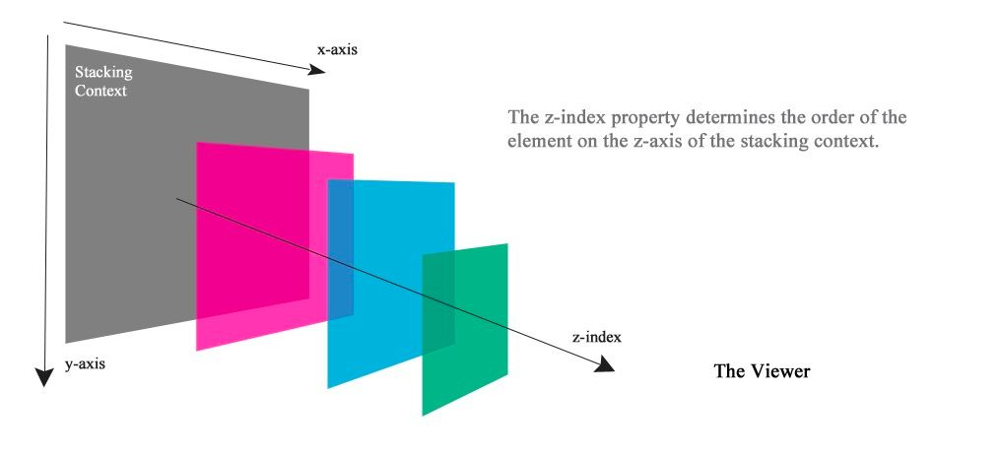
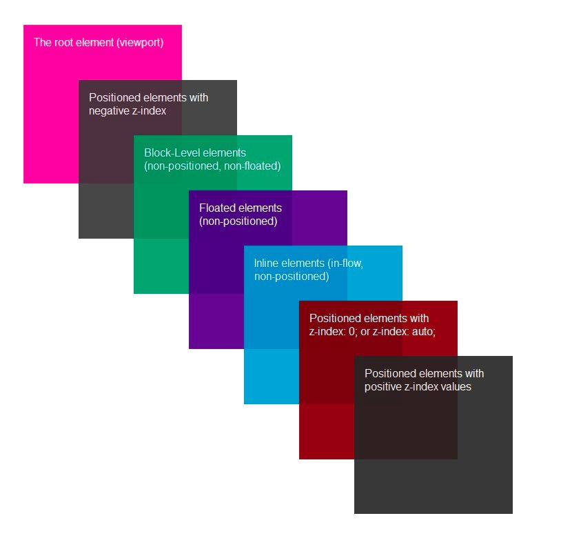
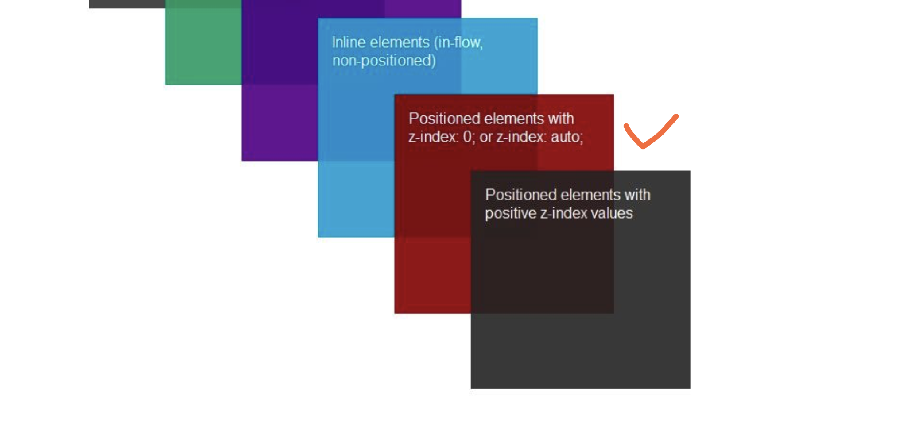
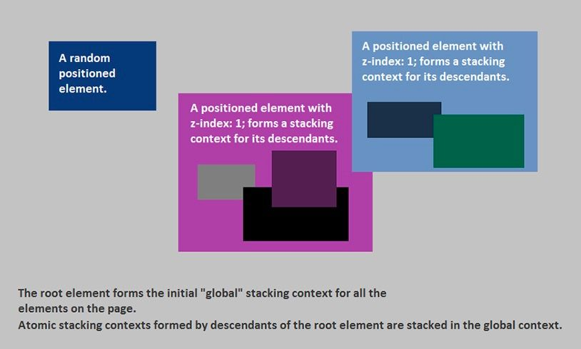
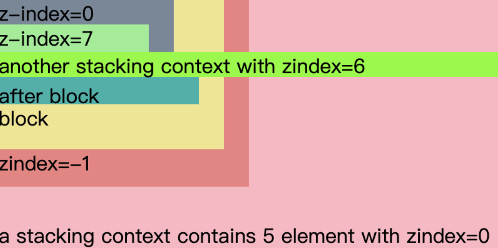

## 层叠上下文

------

层叠上下文，英文称作”`stacking context`”. 是`HTML`中的一个三维的概念。如果一个元素含有层叠上下文，我们可以理解为这个元素在`z`轴上就“高人一等”。

你可以**把「层叠上下文」理解为当官**：换句话说，页面中的元素有了层叠上下文，就好比我们普通老百姓当了官，一旦当了官，相比普通老百姓而言，离皇帝更近了，对不对，就等同于网页中元素级别更高，离我们用户更近了。

普通元素的层叠水平优先由层叠上下文决定，因此，**层叠水平的比较只有在当前层叠上下文元素中才有意义**。

需要注意的是，千万不要把层叠水平和`CSS`的`z-index`属性混为一谈。没错，某些情况下`z-index`确实可以影响层叠水平，但是，只限于定位元素以及`flex`盒子的孩子元素；而层叠水平所有的元素都存在。

## 层叠等级 (Stacking Level)

------

层叠等级 (层叠水平, `Stacking Level)` 决定了在同一个层叠上下文中，元素在 `z` 轴上的显示的顺序：

1. 普通元素的层叠等级优先由其所在的层叠上下文决定；
2. 层叠等级的比较，只有在同一个层叠上下文元素中才有意义；
3. 在同一个层叠上下文中，层叠等级描述定义的是该层叠上下文中的元素在 z 轴上的上下顺序；

另外，层叠等级并不一定由 `z-index` 决定，只有定位元素`(relative/absolute/fixed/sticky、不包括static)`的层叠等级才由 `z-index` 决定，其他类型元素的层叠等级由层叠顺序、他们在 `HTML` 中出现的顺序、他们的祖先元素的层叠等级一同决定。

#### **z-index**

`z-index` 只适用于定位的元素，对非定位元素无效，它可以被设置为正整数、负整数、 `0`、 `auto`，如果一个定位元素没有设置 `z-index`，那么默认为 `auto`；

元素的 `z-index` 值只在同一个层叠上下文中有意义。如果父级层叠上下文的层叠等级低于另一个层叠上下文的，那么它 `z-index` 设的再高也没用。所以如果你遇到 `z-index` 值设了很大，但是不起作用的话，就去看看它的父级层叠上下文是否被其他层叠上下文盖住了。

## 层叠顺序

------

层叠顺序 (层叠次序, 堆叠顺序, `Stacking Order)` 描述的是元素在同一个层叠上下文中的顺序规则（之前的层叠上下文和层叠等级是概念），从层叠的底部开始，共有七种层叠顺序：

**为什么内联元素的层叠顺序要比浮动元素和块状元素都高？**

这是因为诸如`border`/`background`一般为装饰属性，而浮动和块状元素一般用作布局，而内联元素都是内容。网页中最重要的是什么？当然是内容了哈，对不对！

**-z-index能否突破次元壁？**

答案是不能的，因为当前层叠上下文根元素的层叠水平是最低的。

#### 层叠上下文与层叠顺序

一旦普通元素具有了层叠上下文，其层叠顺序就会变高。其原因在于我们默认比较堆叠顺序实在页面根元素上下文中进行比较的，那它的层叠顺序究竟在哪个位置呢？

这里需要分两种情况讨论：

1. 如果层叠上下文元素不依赖`z-index`数值，即其层叠顺序是`z-index:auto`可看成`z:index:0`级别；

   

   这也是为什么定位元素会层叠在普通元素的上面，其根本原因就在于，元素一旦成为定位元素，其`z-index`就会自动生效，此时其`z-index`就是默认的`auto`，也就是`0`级别，根据上面的层叠顺序表，就会覆盖`inline`或`block`或`float`元素。

2. 如果层叠上下文元素依赖`z-index`数值，则其层叠顺序由`z-index`值决定，如果元素支持 `z-index` 值，则层叠顺序就要好理解些了，比较数值大小嘛，本质上是应用的“谁大谁上”的准则。

## 层叠规则

------

除层叠顺序优先级规则之外，还有一条后来居上规则：同一个层叠顺序的元素按照在 HTML 里出现的顺序依次层叠。这两个规则共同决定浏览器元素在文档中是如何层叠的合称层叠规则：

1. **谁大谁上：**当具有明显的层叠水平标示的时候（上文的七个层叠顺序），如识别的z-index值，在同一个层叠上下文领域，层叠水平值大的那一个覆盖小的那一个
2. **后来居上：**当元素的层叠水平一致、层叠顺序相同的时候，在DOM流中处于后面的元素会覆盖前面的元素。

## 层叠上下文的创建

--------

层叠上下文 1` (Stacking Context 1)`是由文档根元素形成的， 层叠上下文 2 和 3 `(Stacking Context 2, 3)` 都是层叠上下文 1 `(Stacking Context 1) `上的层叠层。他们各自也都形成了新的层叠上下文，其中包含着新的层叠上下文。

在层叠上下文中，其子元素按照上面解释的规则进行层叠。形成层叠上下文的方法有：

- **根层叠上下文**：
  - 指的是页面根元素，也就是滚动条的默认的始作俑者`<html>`元素。这就是为什么，绝对定位元素在`left`/`top`等值定位的时候，如果没有其他定位元素限制，会相对浏览器窗口定位的原因。
- **定位元素与传统层叠上下文**：
  - 包含有`position:absolute|relative`的定位元素，**当其`z-index`值不是`auto`的时候**，会创建层叠上下文。
  - `position` 值为 `fixed|sticky`，会创建层叠上下文。
- **CSS3与新时代的层叠上下文**：
  - `z-index`值不为`auto`的`flex-item`。(父元素`display:flex|inline-flex`)。
  - 元素的`opacity`值不是`1`
  - 元素的`transform`值不是`none`
  - 元素的`mix-blend-mode`值不是`normal`
  - 元素的`filter`值不是`none`
  - 元素的`isolation`值是`isolate`
  - 元素的`will-change`指定的属性值为上面任意一个
  - 元素的`-webkit-overflow-scrolling`设为`touch`

#### 层叠上下文的特性

层叠上下文元素有如下特性：

- 层叠上下文的层叠水平要比普通元素高；
- 层叠上下文可以阻断元素的混合模式；
- 层叠上下文可以嵌套，内部层叠上下文及其所有子元素均受制于外部的层叠上下文。
- 每个层叠上下文和兄弟元素独立，也就是当进行层叠变化或渲染的时候，只需要考虑后代元素。
- 每个层叠上下文是自成体系的，当元素发生层叠的时候，整个元素被认为是在父层叠上下文的层叠顺序中。

## Example

-------

