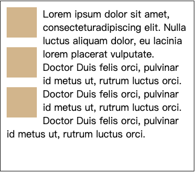
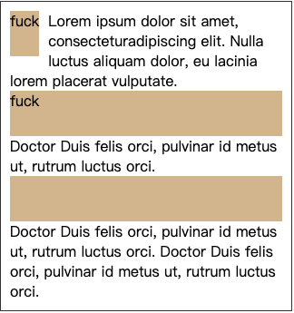

## 浮动

----

浮动曾被用来实现整个网站页面的布局，它使信息列得以横向排列（默认的设定则是按照这些列在源代码中出现的顺序纵向排列）。目前出现了更新更好的页面布局技术，所以使用浮动来进行页面布局应被看作传统的布局方法。

浮动让元素脱离正常流，向父容器的左边或右边移动直到碰到包含容器的 `padding` 或者碰到其他浮动元素。文本和行内元素将环绕浮动元素。

#### 文字环绕

浮动属性产生之初是为了实现“文字环绕”的效果，让文字环绕图片在网页实现类似 `word` 中“图文混排”。文字会自动环绕在浮动元素的周围：



看看下面的代码：

```html
<div class=container>
  <div class="a"></div> 
  Lorem ipsum dolor sit amet, consecteturadipiscing elit. Dr luctus 
  aliquam dolor, eu lacinia lorem placerat vulputate.  
  <div class="a"></div>  
  Doctor Duis felis orci, pulvinar id metus ut, rutrum luctus orci. 
  <div class="a"></div>  
  Doctor Duis felis orci, pulvinar id metus ut, rutrum luctus orci. 
  Doctor Duis felis orci, pulvinar id metus ut, rutrum luctus orci.
</div>
```

#### 包裹性

包裹性指的是元素尺寸刚好容纳内容，下面三个 `div`，只有第一个添加了浮动，第二个第三个默认沾满整行。



具有包裹性的其他属性：

+ `display`: `inline-block/table-cell/...`
+ `position`: `absolute/fixed/sticky...`
+ `overflow`: `hidden/scroll...`

## 清除浮动

--------

#### clear

`clear` 属性规定元素的哪一侧不允许有其他浮动元素。

取值：

+ `left`: 元素左侧不允许有浮动元素
+ `right`: 元素右侧不允许有浮动元素
+ `both`: 元素左右两侧均不允许有浮动元素
+ `none`: 默认值，允许浮动元素出现在两侧

 清除浮动可两大类方法

+ 兄弟元素设置 `clear:both`
+ 父元素生成 `BFC`

```css
.clearfix::after {
  clear: both;
  content: '';
  font-size: 0;
  height: 0;
  visibility: hidden;
  display: block;
}
.clearfix {
  zoom: 1;
}
```

