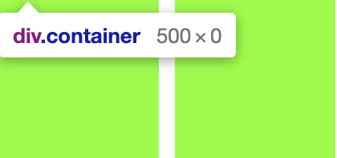
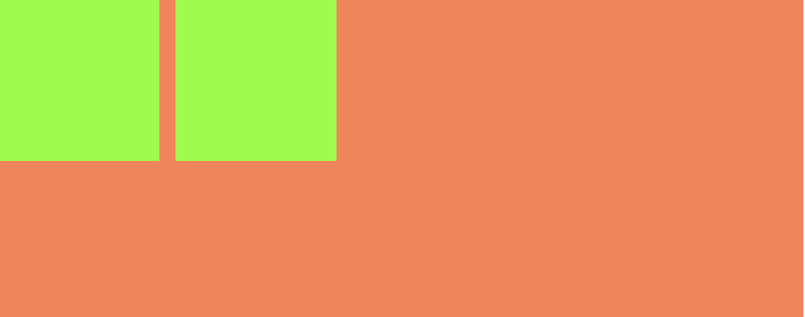
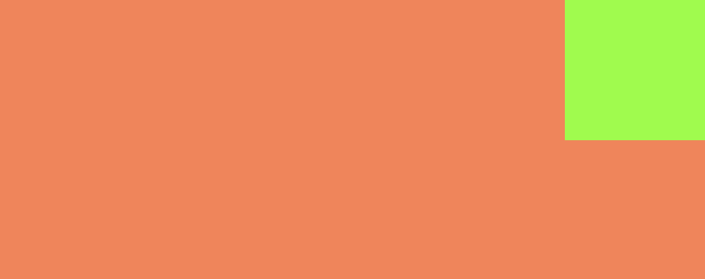
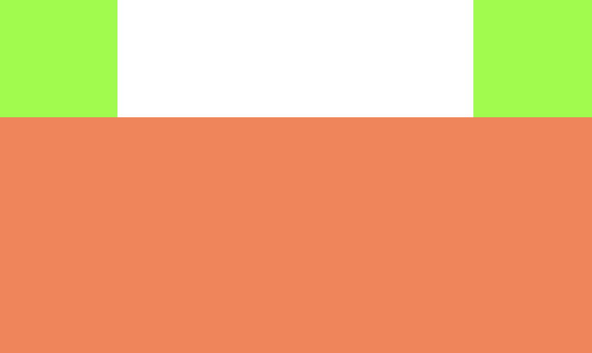

## 浮动

----

浮动曾被用来实现整个网站页面的布局，它使信息列得以横向排列（默认的设定则是按照这些列在源代码中出现的顺序纵向排列）。目前出现了更新更好的页面布局技术，所以使用浮动来进行页面布局应被看作传统的布局方法。

浮动让元素脱离正常流，向父容器的左边或右边移动直到碰到包含容器的 `padding` 或者碰到其他浮动元素。文本和行内元素将环绕浮动元素。

#### 无法撑开父元素

在非`IE`浏览器（如`Firefox`）下，当容器的高度为`auto`，且容器的内容中有浮动（`float`为`left`或`right`）的元素，在这种情况下，容器的高度不能自动伸长以适应内容的高度，使得内容溢出到容器外面而影响（甚至破坏）布局的现象。



#### 脱离文档流

设置为 `float` 的元素会脱离文档流，水平显示：



#### 文字环绕

浮动属性产生之初是为了实现“文字环绕”的效果，让文字环绕图片在网页实现类似 `word` 中“图文混排”。文字会自动环绕在浮动元素的周围：


看看下面的代码：

```html
<div class=container>
  <div class="a"></div> 
  Lorem ipsum dolor sit amet, consecteturadipiscing elit. Dr luctus 
  aliquam dolor, eu lacinia lorem placerat vulputate.  
  <div class="a"></div>  
  Doctor Duis felis orci, pulvinar id metus ut, rutrum luctus orci. 
  <div class="a"></div>  
  Doctor Duis felis orci, pulvinar id metus ut, rutrum luctus orci. 
  Doctor Duis felis orci, pulvinar id metus ut, rutrum luctus orci.
</div>
```

#### 包裹性

包裹性指的是元素尺寸刚好容纳内容，下面三个 `div`，只有第一个添加了浮动，第二个第三个默认沾满整行。


具有包裹性的其他属性：

+ `display`: `inline-block/table-cell/...`
+ `position`: `absolute/fixed/sticky...`
+ `overflow`: `hidden/scroll...`

#### 设置元素浮动后，该元素的 display 值是多少？

自动变成 `display:block`。

`display:inline` 后不应该再使用 `width`、`height`、`margin`、`padding` 以及 `float`。`display:inline-block` 后不应该再使用 `float`。`display:block` 后不应该再使用 `vertical-align`。`display:table-*` 后不应该再使用 `margin` 或者 `float`。

## 清除浮动原理

--------

在非`IE`浏览器（如`Firefox`）下，当容器的高度为`auto`，且容器的内容中有浮动（`float`为`left`或`right`）的元素，在这种情况下，容器的高度不能自动伸长以适应内容的高度，使得内容溢出到容器外面而影响（甚至破坏）布局的现象。这个现象叫浮动溢出，为了防止这个现象的出现而进行的`CSS`处理，就叫`CSS`清除浮动。


````html
<div class="container">
  <div class="pic-l"></div>
  <div class="pic-r"></div>
</div>
<div class="info"></div>

<style>
  .container {
    width: 500px;
  }
  .pic-l {
    width: 100px;
    height: 100px;
    background: chartreuse;
    float: left;
  }

  .pic-r {
    width: 100px;
    height: 100px;
    background: chartreuse;
    float: right;
    margin-left: 10px;
  }
  
  .info {
    width: 100px;
    height: 200px;
    background: coral;
    overflow: hidden;
  }
<style>

````

#### clear

`clear` 属性规定元素的哪一侧不允许有其他浮动元素。

```css
.clearfix::after {
  clear: both;
  content: '';
  font-size: 0;
  height: 0;
  visibility: hidden;
  display: block;
}
.clearfix {
  zoom: 1;
}
```

取值：

+ `left`: 元素左侧不允许有浮动元素
+ `right`: 元素右侧不允许有浮动元素
+ `both`: 元素左右两侧均不允许有浮动元素
+ `none`: 默认值，允许浮动元素出现在两侧

`Clear: left` 不会对 `float: right` 的元素生效：



```html
<div class="container">
  <div class="pic-r"></div>
  <div class="info"></div>
</div>

<style>
  .pic-r {
    width: 100px;
    height: 100px;
    background: chartreuse;
    float: right;
  }

  .info {
    clear: left;
    width: 500px;
    height: 200px;
    background: coral;
  }
</style>
```

但是如果设置 `clear: left` 的同时有 `float: left`，同时还有`float: right` 那么 `float: right`  的元素因为和 `float: left` 走同一个浮动流所以会清除浮动：



```html
<div class="container">
  <div class="pic pic-l"></div>
  <div class="pic pic-r"></div>
  <div class="info"></div>
</div>

<style>
  .pic {
		width: 100px;
    height: 100px;
    background: chartreuse;
  }
  
  .pic-l {
  	float: left;  
  }

  .pic-r {

    float: right;
  }

  .info {
    clear: left;
    width: 500px;
    height: 200px;
    background: coral;
  }
</style>
```

#### BFC

父元素生成 `BFC`，`BFC`元素在计算高度的时候会包括浮动元素：

```css
overflow: hidden;
```

#### 给父元素高度

原理和 `BFC` 差不多，只是手动的：

```css
height: float_height
```

#### 父级div定义zoom

`Zoom` 会触发父元素的 `hasLayout`，类似 `IE6` 的` BFC`，通常用于兼容 `IE6-7`：

```css
_zoom: 1;
```

## 常用的四种清除浮动方法

----

#### **额外标签法**

在最后一个浮动标签后，新加一个标签，给其设置 `clear：both；`，这样虽然很简单，但是添加无意义标签，语义化差，不推荐：

```css
<div class="container">
  <div class="pic pic-l"></div>
  <div class="pic pic-r"></div>
  <div class="clear"></div>
</div>
<div class="info"></div>

<style>
  .pic {
		width: 100px;
    height: 100px;
    background: chartreuse;
  }
  
  .pic-l {
  	float: left;  
  }

  .pic-r {

    float: right;
  }
	
  .clear {
    clear: both;
  }

  .info {
    width: 500px;
    height: 200px;
    background: coral;
  }
</style>
```

#### **父级添加overflow属性**

父元素添加 `overflow:hidden`，内容增多的时候容易造成不会自动换行导致内容被隐藏掉，无法显示要溢出的元素，不推荐：

```css
<div class="container">
  <div class="pic pic-l"></div>
  <div class="pic pic-r"></div>
</div>
<div class="info"></div>

<style>
  .pic {
		width: 100px;
    height: 100px;
    background: chartreuse;
  }
  
  .pic-l {
  	float: left;  
  }

  .pic-r {

    float: right;
  }
	
  .container {
    overflow: hidden;
  }

  .info {
    width: 500px;
    height: 200px;
    background: coral;
  }
</style>
```

#### **使用after伪元素清除浮动**

这种方法的原理和第一种相同，符合闭合浮动思想，结构语义化正确，不过`ie6-7`不支持伪元素：`after`，需要使用`zoom`:`1`触发`hasLayout`。

```css
<div class="container clearfix">
  <div class="pic pic-l"></div>
  <div class="pic pic-r"></div>
</div>
<div class="info"></div>

<style>
  .pic {
		width: 100px;
    height: 100px;
    background: chartreuse;
  }
  
  .pic-l {
  	float: left;  
  }

  .pic-r {

    float: right;
  }
	
 	.clearfix:after {/*伪元素是行内元素 正常浏览器清除浮动方法*/
   	content: "";
   	display: block;
   	height: 0;
   	clear:both;
   	visibility: hidden;
  }

  .clearfix {
    *zoom: 1;/*ie6清除浮动的方式 *号只有IE6-IE7执行，其他浏览器不执行*/
  }

  .info {
    width: 500px;
    height: 200px;
    background: coral;
  }
</style>
```

#### **使用before和after双伪元素清除浮动**

缺点和前面的一致：

```css
.clearfix:after,.clearfix:before{
  content: "";
  display: table;
}
.clearfix:after{
  clear: both;
}
.clearfix{
  *zoom: 1;
}
```

