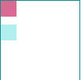
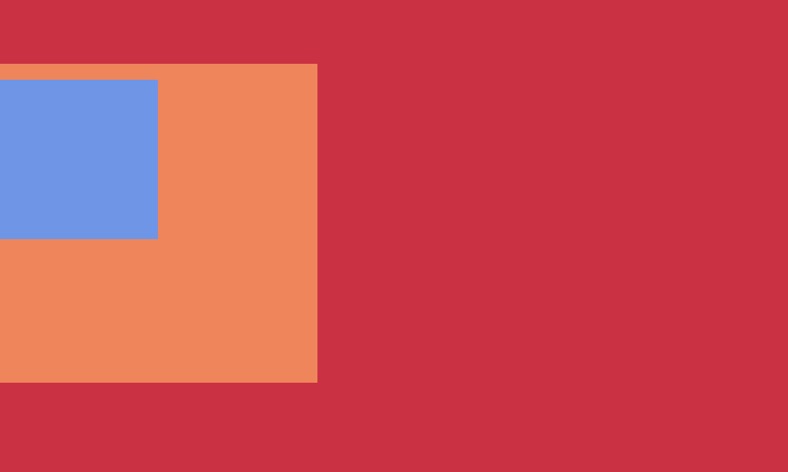

## 文档流

-----

定位是一个相当复杂的话题，所以我们深入了解代码之前，让我们审视一下布局理论，并让我们了解它的工作原理。

 **正常的布局流**（在布局介绍文章中提到）是将元素放置在浏览器视口内的系统。默认情况下，块级元素在视口中垂直布局——每个都将显示在上一个元素下面的新行上，并且它们的外边距将分隔开它们。

内联元素表现不一样——它们不会出现在新行上；相反，它们互相之间以及任何相邻（或被包裹）的文本内容位于同一行上，只要在父块级元素的宽度内有空间可以这样做。如果没有空间，那么溢流的文本或元素将向下移动到新行。

### position跟display、overflow、float这些特性相互叠加后会怎么样？

`display`属性规定元素应该生成的框的类型；`position`属性规定元素的定位类型；`float`属性是一种布局方式，定义元素在哪个方向浮动。

类似于优先级机制：`position：absolute/fixed`优先级最高，有他们在时，`float`不起作用，`display`值会自动调整为自动变成 `display:block`。

如果 `position: relative`的同时设置了 `float: right`，那么会先将 `float: right` 生效，然后再根据浮动完之后的位置计算相对位置。

## 定位

------

定位允许您从正常的文档流布局中取出元素，并使它们具有不同的行为，例如放在另一个元素的上面，或者始终保持在浏览器视窗内的同一位置。

| 属性值   | 含义                                                         | 描述                                                         |
| -------- | ------------------------------------------------------------ | ------------------------------------------------------------ |
| Static   | 元素框正常生成。块级元素生成一个矩形框，作为文档流的一部分，行内元素则会创建一个或多个行框，置于其父元素中。 | 默认值。没有定位，元素出现在正常的流中                       |
| Relative | 元素框偏移某个距离。元素仍保持其未定位前的形状，它原本所占的空间仍保留。 | 生成相对定位的元素，相对于其正常位置进行定位。               |
| Absolute | 元素框从文档流完全删除，并相对于其包含块定位。               | 生成绝对定位的元素，相对于 static 定位以外的第一个父元素进行定位。 |
| fixed    | 元素框的表现类似于将 position 设置为 absolute，不过其包含块是视窗本身 | 生成绝对定位的元素，相对于浏览器窗口进行定位。               |
| inherit  |                                                              | 规定应该从父元素继承 position 属性的值。                     |

#### top, bottom, left,  right

[`top`](https://developer.mozilla.org/zh-CN/docs/Web/CSS/top), [`bottom`](https://developer.mozilla.org/zh-CN/docs/Web/CSS/bottom), [`left`](https://developer.mozilla.org/zh-CN/docs/Web/CSS/left), 和 [`right`](https://developer.mozilla.org/zh-CN/docs/Web/CSS/right) 来精确指定要将定位元素移动到的位置。 要尝试这样做，请在CSS中的 `.positioned` 规则中添加以下声明：

```css
top: 30px;
left: 30px;
```

有许多不同类型的定位，您可以对HTML元素生效。要使某个元素上的特定类型的定位，我们使用[`position`](https://developer.mozilla.org/zh-CN/docs/Web/CSS/position)属性。

#### 静态定位

静态定位是每个元素获取的默认值——它只是意味着“**将元素放入它在文档布局流中的正常位置**”。

```css
position: static;
```

#### 相对定位

相对定位是我们将要看的第一个位置类型。 它与静态定位非常相似，占据在正常的文档流中，除了你仍然可以修改它的最终位置，包括让它与页面上的其他元素重叠。

```css
position: relative;
```

相对定位在没设置上下文时，相对于自己进行定位，`top` 设置为 `10` 效果如下：



#### 绝对定位

设置为绝对定位的元素框从文档流完全删除，并相对于其包含块定位，包含块可能是文档中的另一个元素或者是初始包含块。元素原先在正常文档流中所占的空间会关闭，就好像该元素原来不存在一样。

```css
position: absolute;
```

使用绝对定位并且没有设置上下文时，其默认使用初始块容器作为父元素，`top`和`left` 都为 `0`时效果如下：


#### 固定定位

还有一种类型的定位覆盖——`fixed`。 这与绝对定位的工作方式完全相同，只有一个主要区别：绝对定位固定元素是相对于 [``](https://developer.mozilla.org/zh-CN/docs/Web/HTML/Element/html) 元素或其最近的定位祖先，而固定定位固定元素则是相对于浏览器视口本身。 

```css
position: fixed;
```

使用固定定位并且没有设置上下文时，其默认使用初始块容器作为父元素，`top`和`left` 都为 `0`时效果如下：


#### 定位上下文

哪个元素是绝对定位元素的“包含元素“？这取决于绝对定位元素的父元素的`position`属性。

如果所有的父元素都没有显式地定义`position`属性，那么所有的父元素默认情况下`position`属性都是`static`。结果，绝对定位元素会被包含在初始块容器中。这个初始块容器有着和浏览器视口一样的尺寸，并且`<html>`元素也被包含在这个容器里面。

如果有任何父元素里有 `position` 属性切非 `static`，则可以改变**定位上下文**，那个元素就是绝对定位元素的相对位置元素。通过设置其中一个父元素的定位属性 —— 也就是包含绝对定位元素的那个元素（如果要设置绝对定位元素的相对元素，那么这个元素一定要包含绝对定位元素）。 

```css
position: relative;
position: absolute;
position: fixed;
```

撅个例子，这里的 `Son` 块就是基于 `grandpa` 的，而不是它的包裹容器 `father`：



```html
<style>
  .grandpa {
    width: 500px;
    height: 300px;
    background: crimson;
    position: absolute;
  }
  .father {
    margin-top: 40px;
    width: 200px;
    height: 200px;
    background: coral;
  }

  .son {
    position: absolute;
    top: 50px;
    height: 100px;
    width: 100px;
    background: cornflowerblue;
  }
</style>

<div class="grandpa">
  <div class="father">
    <div class="son"></div>
  </div>
</div>
```

## 粘性定位

-----

`position: sticky` 是一个比较新的定位属性，称之为粘性定位，单词sticky的中文意思是“粘性的”，`position:sticky`表现也符合这个粘性的表现。基本上，可以看出是`position`:`relative`和`position`:`fixed`的结合体——当元素在屏幕内，表现为`relative`，就要滚出显示器屏幕的时候，表现为`fixed`。例如，可以滚动下面这个框框感受下交互表现：

<div style="width: 500px;background:#fff"><iframe width="414" height="480" src="https://www.zhangxinxu.com/study/201812/position-sticky.html" frameborder="0" style="max-width:100%;border:1px solid #ddd;"></iframe></div>

其中导航元素设置了如下CSS：

```css
nav {
    position: -webkit-sticky;
    position: sticky;
    top: 0;
}
```

于是，正如大家看到，随着页面的滚动，当导航距离上边缘0距离的时候，黏在了上边缘，表现如同`position:fixed`。

> *注意*
>
> `position`:`sticky`要想生效，`top`属性或则`left`属性（看滚动方向）是必须要有明确的计算值的，否则`fixed`的表现不会出现。

#### 粘性计算规则

`position:sticky`有个非常重要的特性，那就是 `sticky` 黏着特性受制于父级元素们：

1. 父级元素不能有任何`overflow:visible`以外的overflow设置，否则没有粘滞效果。因为改变了滚动容器（即使没有出现滚动条）。因此，如果你的`position:sticky`无效，看看是不是某一个祖先元素设置了`overflow:hidden`，移除之即可。

2. 父级元素设置和粘性定位元素等高的固定的`height`高度值，或者高度计算值和粘性定位元素高度一样，也没有粘滞效果。

   ```html
   <div><nav class="stick"></nav></div> <!-- 无效 -->
   ```

   

