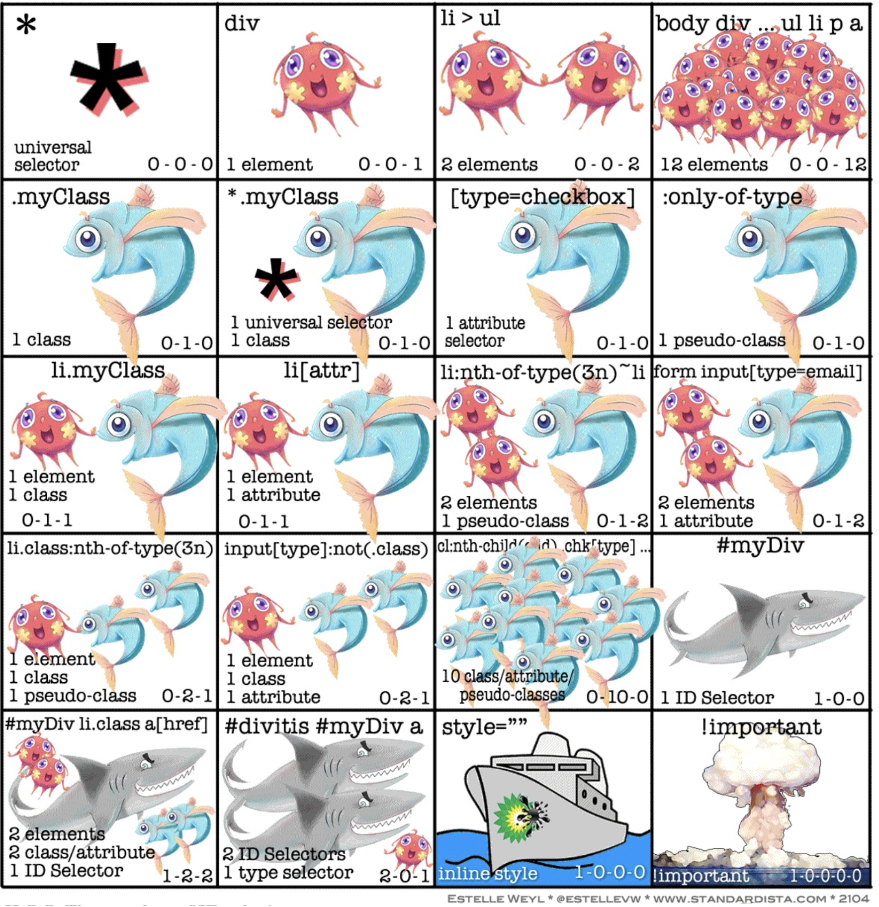

# CSS Selector Pro



## LeveL1

### 元素选择器

所有匹配的`html`元素。

```css
div { }
```

### 相邻属性选择器

**相邻兄弟选择器** (`+`) 介于两个选择器之间，当第二个元素*紧跟在*第一个元素之后，并且两个元素都是属于同一个父[`元素`](https://developer.mozilla.org/zh-CN/docs/Web/API/元素)的子元素，则第二个元素将被选中。

```css
former_element + target_element { style properties }

/* 图片后面紧跟着的段落将被选中 */
img + p {
  font-style: bold;
}
```

### 通用兄弟选择器

兄弟选择符，位置无须紧邻，只须同层级，`A~B` 选择`A`元素之后所有同层级`B`元素。

```css
former_element ~ target_element { style properties }

p ~ span {
  :;
}
```

### 子选择器

当使用  `>` 选择符分隔两个元素时,它只会匹配那些作为第一个元素的**直接后代(**子元素)的第二元素。

```css
father_element > son_element { style properties }

div > span {
  background-color: DodgerBlue;
}
```

### 后代选择器

当使用 `␣` 选择符 (这里代表一个空格,更确切的说是一个或多个的空白字符) 连接两个元素时使得该选择器可以只匹配那些由第一个元素作为祖先元素的所有第二个元素(后代元素) 。

```css
acestor_element son_element { style properties }

div span { 
  background-color: DodgerBlue; 
}
```

#### 并集选择器

当两个类名连着写的时候，就是声明一个并集选择器，只有元素同时拥有两个类名的时候才生效：

```css
.a.b {
  width: 100px;
  height: 100px;
  background: #000;
}
```

## LeveL 3

### 属性选择器：

表示带有以 attr 命名的属性的元素：

```css
[attr]
```

表示带有以 attr 命名的属性，且属性值为 value 的元素。

```css
[attr=value]
```

表示带有以 attr 命名的属性的元素，并且该属性是一个以空格作为分隔的值列表，其中至少有一个值为 value。

```css
[attr~=value]
```

表示带有以 attr 命名的属性的元素，属性值为“value”或“value-”为前缀（"`-`"为连字符，Unicode 编码 U+002D）开头。

```css
[attr|=value]
```

表示带有以 attr 命名的属性，且属性值是以 value 开头的元素。

```css
[attr^=value]
```

表示带有以 attr 命名的属性，且属性值是以 value 结尾的元素。

```css
[attr$=value]
```

表示带有以 attr 命名的属性，且属性值包含有 value 的元素。

```css
[attr*=value]
```

在属性选择器的右方括号前添加一个用空格隔开的字母 `i`（或 `I`），可以在匹配属性值时忽略大小写。

```css
[*attr* *operator* *value* i]
```

在属性选择器的右方括号前添加一个用空格隔开的字母 `s`（或 `S`），可以在匹配属性值时区分大小写。

```css
[*attr* *operator* *value* s]
```

**例子：**

```css
/* 存在title属性的<a> 元素 */
a[title] {
  color: purple;
}

/* 存在href属性并且属性值匹配"https://example.org"的<a> 元素 */
a[href="https://example.org"] {
  color: green;
}

/* 存在href属性并且属性值包含"example"的<a> 元素 */
a[href*="example"] {
  font-size: 2em;
}

/* 存在href属性并且属性值结尾是".org"的<a> 元素 */
a[href$=".org"] {
  font-style: italic;
}

/* 存在class属性并且属性值包含"logo"的<a>元素 */
a[class~="logo"] {
  padding: 2px;
}

/* 将所有语言为中文的 <div> 元素的文本颜色设为红色，无论是简体中文（zh-CN）还是繁体中文（zh-TW） */
div[lang|="zh"] {
  :;
}
```

### 伪元素选择器

伪元素选择器即可以在所选节点子代创建一个伪元素，其实只是为了规范化 `:before` 和 `:after`。

**::before**

> `:before` 用于在父节点的第一个子节点位置创建一个伪元素。

**::first**

> `:after` 用于在父节点的最后一个子节点位置创建一个伪元素。

### 伪类选择器

#### **:empty**

> `:empty` [CSS](https://developer.mozilla.org/en-US/docs/Web/CSS) [伪类](https://developer.mozilla.org/zh-CN/CSS/Pseudo-classes) 代表没有子元素的元素。子元素只可以是元素节点或文本（包括空格）。

```css
/* Selects any <div> that contains no content */
div:empty {
  background: lime;
}
```

####  **:enabled**

> `:enabled` CSS [伪类](https://developer.mozilla.org/zh-CN/CSS/Pseudo-classes) 表示任何启用的（enabled）元素。如果一个元素能够被激活（如选择、点击或接受文本输入）或获取焦点，则该元素是启用的。元素还有一个禁用的状态（disabled state），在被禁用时，元素不能被激活或获取焦点。

```css
/* 选择任何启用状态的 <input> */
input:enabled {
  color: blue;
}
```

####  **:disabled**

> 选择器选中元素的dom属性的sdisable为true的时候生效。

```css
/* Selects any disabled <input> */
input:disabled {
  background: #ccc;
}
```

#### **:first-child**

>  **:first-child** CSS伪类，表示在一组**兄弟元素**中的第一个元素。

```css
/* Selects any <p> that is the first element among its siblings */
p:first-child {
  color: lime;
}
```

####  **:last-child**

> :last-child CSS [伪类](https://developer.mozilla.org/en-US/docs/Web/CSS/Pseudo-classes) 代表**父元素**的最后一个子元素。

```css
li:last-child {
  background-color: lime;
}
```

#### **:root&&***

> **:root** 这个 CSS [伪类](https://developer.mozilla.org/zh-CN/docs/Web/CSS/Pseudo-classes)匹配文档树的根元素。对于 HTML 来说，**:root** 表示 [``](https://developer.mozilla.org/zh-CN/docs/Web/HTML/Element/html) 元素，除了[优先级](https://developer.mozilla.org/zh-CN/docs/Web/CSS/Specificity)更高之外，与 `html` 选择器相同。在声明全局 [CSS 变量](https://developer.mozilla.org/en-US/docs/Web/CSS/--*)时 **:root** 会很有用：

```css
:root {
  --main-color: hotpink;
  --pane-padding: 5px 42px;
}
```

#### **:nth-child(an+b)**

> **:nth-child(an+b)** 这个 [CSS 伪类](https://developer.mozilla.org/en-US/docs/CSS/Pseudo-classes)首先找到所有当前元素的兄弟元素，然后按照位置先后顺序从1开始排序，选择的结果为CSS伪类:nth-child括号中表达式（an+b）匹配到的元素集合（n=0，1，2，3...）。示例：
>
> - `0n+3` 或简单的 `3` 匹配第三个元素。
> - `1n+0` 或简单的 `n` 匹配每个元素。（兼容性提醒：在 Android 浏览器 4.3 以下的版本 `n` 和 `1n` 的匹配方式不一致。`1n` 和 `1n+0` 是一致的，可根据喜好任选其一来使用。）
> - `2n+0` 或简单的 `2n` 匹配位置为 2、4、6、8...的元素（n=0时，2n+0=0，第0个元素不存在，因为是从1开始排序)。你可以使用关键字 **even** 来替换此表达式。
> - `2n+1` 匹配位置为 1、3、5、7...的元素。你可以使用关键字 **odd** 来替换此表达式。
> - `3n+4` 匹配位置为 4、7、10、13...的元素。
>
> `a` 和 `b` 都必须为整数，并且元素的第一个子元素的下标为 1。换言之就是，该伪类匹配所有下标在集合 { an + b; n = 0, 1, 2, ...} 中的子元素。另外需要特别注意的是，`an` 必须写在 `b` 的前面，不能写成 `b+an` 的形式。

#### **:nth-of-type**

> **:nth-of-type** 和上一个的行为基本一致，只是 `:nth-of-type` 限制了类型，换句话说是用来选择兄弟元素中同类型的元素。

#### **:only-child**

> `:only-child `   CSS 伪类代表了属于某个父元素的唯一一个子元素.等效的选择器还可以写成 `:first-child:last-child`或者`:nth-child(1):nth-last-child(1)`,当然,前者的权重会低一点.

####  **:focus**

> 聚焦

##### **:focus-within**

>  **:focus-within** [CSS](https://developer.mozilla.org/en-US/docs/Web/CSS) [伪类](https://developer.mozilla.org/en-US/docs/Web/CSS/Pseudo-classes) ，表示一个元素获得焦点，或，该元素的后代元素获得焦点。换句话说，元素自身或者它的某个后代匹配`:focus伪类`。

##### **:in-range**

>  ：in-range CSS 伪类代表一个 input元素，其当前值处于属性`min` 和`max` 限定的范围之内.

##### :out-range

> **:out-of-range** [CSS](https://developer.mozilla.org/en-US/docs/Web/CSS) [伪类](https://developer.mozilla.org/en-US/docs/CSS/Pseudo-classes) 表示一个 [``](https://developer.mozilla.org/zh-CN/docs/Web/HTML/Element/input) 元素，其当前值处于属性 `min` 和 `max` 限定的范围外。

##### :valid

> `:valid` CSS [伪类](https://developer.mozilla.org/en/CSS/Pseudo-classes)表示内容[验证](https://developer.mozilla.org/en/HTML/HTML5/Constraint_validation)正确的[``](https://developer.mozilla.org/zh-CN/docs/Web/HTML/Element/input) 或其他 [``](https://developer.mozilla.org/zh-CN/docs/Web/HTML/Element/form) 元素。这能简单地将校验字段展示为一种能让用户辨别出其输入数据的正确性的样式。现在html5自带一些表单校验。

##### :invalid

> **:invalid** [CSS](https://developer.mozilla.org/en-US/docs/Web/CSS) [伪类](https://developer.mozilla.org/en-US/docs/Web/CSS/Pseudo-classes) 表示任意内容未通过验证的 [``](https://developer.mozilla.org/zh-CN/docs/Web/HTML/Element/input) 或其他 [``](https://developer.mozilla.org/zh-CN/docs/Web/HTML/Element/form) 元素 .

##### :required

> `:required` CSS [伪类](https://developer.mozilla.org/en/CSS/Pseudo-classes) 表示 任意 [``](https://developer.mozilla.org/zh-CN/docs/Web/HTML/Element/input) 元素表示任意拥有`required`属性的 [``](https://developer.mozilla.org/zh-CN/docs/Web/HTML/Element/input) 或 [``](https://developer.mozilla.org/zh-CN/docs/Web/HTML/Element/textarea) 元素使用它. 它允许表单在提交之前容易的展示必填字段并且渲染其外观. 

##### :read-write

> **:read-write** `CSS` `伪类` 代表一个元素（例如可输入文本的 input元素）可以被用户编辑。

##### :read-only

>  **:read-only** [CSS](https://developer.mozilla.org/en-US/docs/Web/CSS) [伪类](https://developer.mozilla.org/en-US/docs/CSS/Pseudo-classes) 表示元素不可被用户编辑的状态（如锁定的文本输入框）。

##### :optionsal

> `:optional` CSS [伪类](https://developer.mozilla.org/en/CSS/Pseudo-classes) 表示任意没有`required`属性的 [``](https://developer.mozilla.org/zh-CN/docs/Web/HTML/Element/input)，[``](https://developer.mozilla.org/zh-CN/docs/Web/HTML/Element/select) 或  [``](https://developer.mozilla.org/zh-CN/docs/Web/HTML/Element/textarea) 元素使用它。

