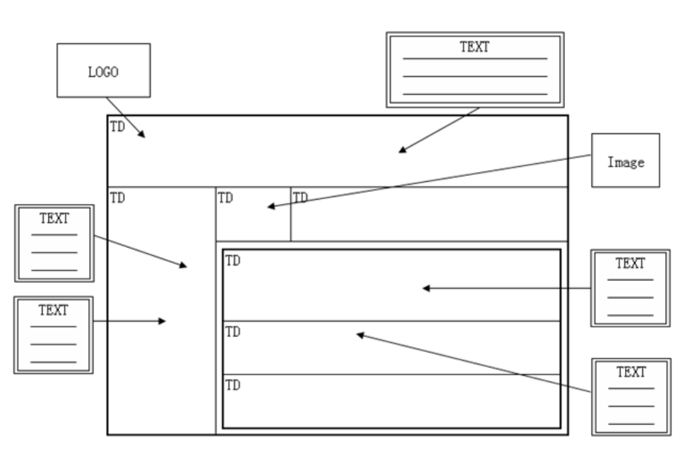
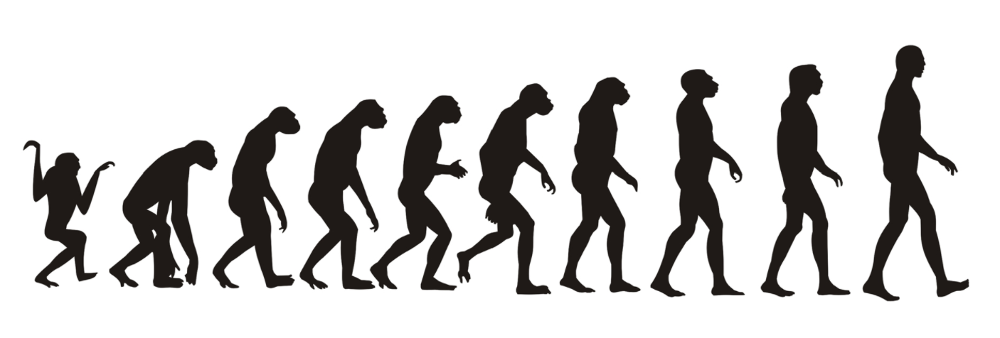

# CSS 布局简介

简单来说，CSS 布局就是将元素显示在**视窗的正确位置**。打个简单的比喻就是把乱七八糟的狗窝变得干净整洁。

## Table 时代

-----

在很久很久之前，网页都是使用 table 来搞定的，每个格子里面填进对应的内容，就形成了最终的网页。

那个时代，Adobe Fireworks 是网页三剑客之一，必学软件之一。但是随着技术的发展，时代的需求，table 终将慢慢落幕，回归到它的本质工作。

## CSS 时代

------

但是在2003年5月，随着 [CSS Zen Garden](http://www.csszengarden.com/) 的横空出世，宣告正式由 table 布局进入了 CSS 布局时代。其作者 Dave Shea 更是对一份 [HTML 结构](http://layout.imweb.io/article/www.csszengarden.com/00/)，通过设计不同的 CSS 带来了5个风格迥异的作品，于是 CSS 正式华丽走入布局舞台，table 慢慢成为被遗弃的孩子。

由于 CSS 布局对于标签要求不是很严格，主要的火候在于对 CSS 的控制，而 div 标签又没有什么特殊的语义，除了默认是个块级元素外，其他什么都没有，于是正好搭上 CSS 顺风车，遍地开花。甚至于有了一个不成明的布局对比：table 布局 与 div + CSS 布局。当然我们要明白的是真正的主角是不可替换的 CSS，div 只是为了与 table 标签形成对比而辅助赠送的。

虽然 CSS 布局开始如火如荼烧遍整个 Web 战场，但其常用的布局技术就是：inline-block、float、position，而且整整十年没变。这并不是说这些技术已经够用了，相反这些都算不上真正的为布局而生的技术，都是被逼上布局这个“梁山”的。譬如剩余宽度的处理，分布对齐的问题始终是个难题。

然而技术终究是发展的，时代的年轮总是滚滚向前。CSS3 的到来给整个 CSS 带来了翻天覆地的变化，而真正为布局而生的 flexbox 更是经历了三次浴火重生来到我们面前，一扫从前的荆棘，为我们提供更好的布局服务。除此之外，另一布局担当 Grid 也已拥有洪荒之力，就看你的能耐发挥了。（同样 HTML5 也是带来了更多语义化标签来替代千变一律的 div）

稍微再展望下未来，我们还有 CSS Houdini 这一强大利器蓄势待发。所以一路走来，也许磕磕碰碰，但是前景还是值得憧憬的。

