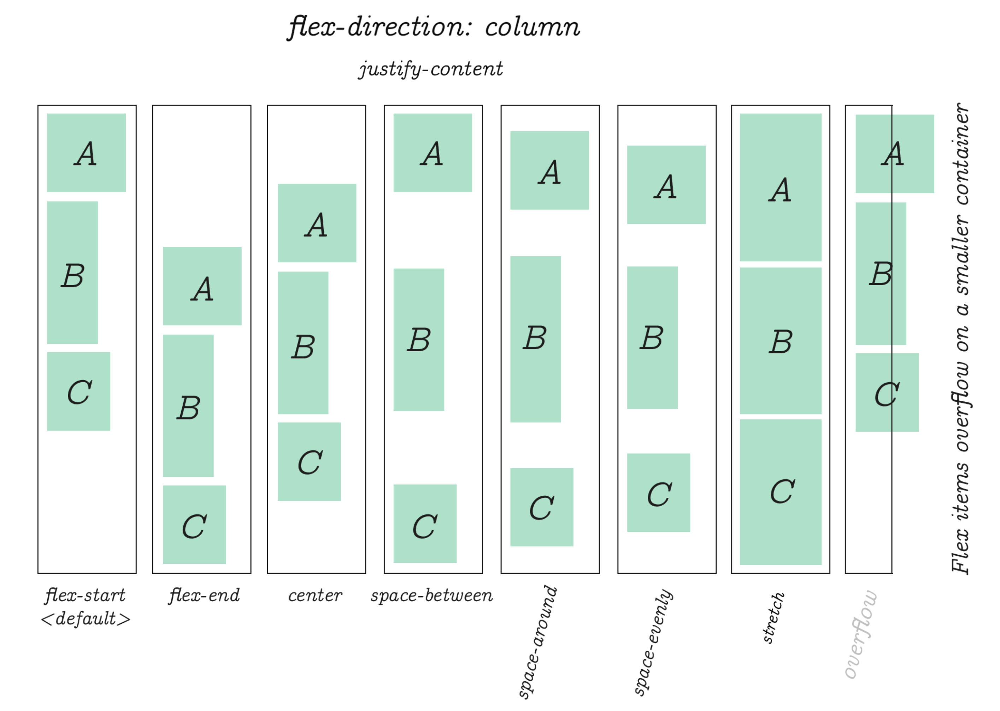
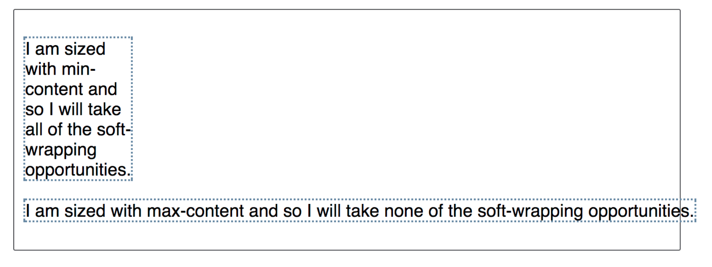

# Flex



`Flexible Box` 模型，通常被称为 `flexbox`，是一种一维的布局模型。它给 `flexbox` 的子元素之间提供了强大的空间分布和对齐能力。我们说 `flexbox` 是一种一维的布局，是因为一个 `flexbox` 一次只能处理一个维度上的元素布局，一行或者一列。

## 创建容器

为了创建 flex 容器， 我们把一个容器的 [`display`](https://developer.mozilla.org/zh-CN/docs/Web/CSS/display) 属性值改为 `flex` 或者 `inline-flex`。 完成这一步之后，容器中的直系子元素就会变为 **flex 元素**。所有CSS属性都会有一个初始值，所以 flex 容器中的所有 flex 元素都会有下列行为：

- 元素排列为一行 (`flex-direction` 属性的初始值是 `row`)。
- 元素从主轴的起始线开始。
- 元素不会在主维度方向拉伸，但是可以缩小。
- **元素被拉伸来填充交叉轴大小，元素会自动沾满整个交叉轴，非常非常重要！！！！！！**
- [`flex-basis`](https://developer.mozilla.org/zh-CN/docs/Web/CSS/flex-basis) 属性为 `auto`。
- `flex-grow`属性默认为 `0`，不会自适应填充父级。
- [`flex-wrap`](https://developer.mozilla.org/zh-CN/docs/Web/CSS/flex-wrap) 属性为 `nowrap`。

这会让你的元素呈线形排列，并且把自己的大小作为主轴上的大小。如果有太多元素超出容器，它们会溢出而不会换行。如果一些元素比其他元素高，那么元素会沿交叉轴被拉伸来填满它的大小。

#### display

`flex`布局有两种排列选项`flex`和`inline-flex`：

```css
a{
    display:flex;
}
/* 此时a标签的尺寸默认是100% */
a{
    display:inline-flex;
}
/* 此时a的尺寸是0，但是两者都可以被定义宽高。 */
```

2.根据这个我们来看看排版规则。

## 排版：

#### 轴

容器默认存在两根轴：水平的主轴（main axis）和垂直的交叉轴（cross axis）。主轴的开始位置（与边框的交叉点）叫做`main start`，结束位置叫做`main end`；交叉轴的开始位置叫做`cross start`，结束位置叫做`cross end`。

如果 `flex-direction` 是 `row` ，那么主轴的起始线是左边，终止线是右边。


> 主轴的方向永远都是和交叉轴垂直的。

#### flex-direction 属性

flex-direction属性决定主轴的方向（即项目的排列方向）。

```css
.box {
  flex-direction: row | row-reverse | column | column-reverse;
}
```


> - row（默认值）：主轴为水平方向，起点在左端。
> - row-reverse：主轴为水平方向，起点在右端。
> - column：主轴为垂直方向，起点在上沿。
> - column-reverse：主轴为垂直方向，起点在下沿。

#### flex-wrap 属性

默认情况下，项目都排在一条线（又称”轴线”）上。flex-wrap属性定义，如果一条轴线排不下，如何换行。

如果说`flex`容器的高度是固定，那么每一行的高度则是平均分的，在平均分的行内元素`flex-item`根据`align-item`的排列方式进行排列。


#### flex-flow属性

`flex-flow`属性是`flex-direction`属性和`flex-wrap`属性的简写形式，默认值为`row nowrap`。

```css
.container {
  flex-flow: row nowarp;
}
```

-------

接下来的两个属性决定元素在主轴或者交叉轴上的排列方式，注意这里的主轴/交叉轴都是有长度的。

#### justify-content 属性

`justify-content`属性定义了项目在主轴上的对齐方式。

```css
.box {
  justify-content: flex-start | flex-end | center | space-between | space-around;
}
```


> - flex-start（默认值）：左对齐
> - flex-end：右对齐
> - center： 居中
> - space-between：两端对齐，项目之间的间隔都相等。
> - space-around：每个项目两侧的间隔相等。所以，项目之间的间隔比项目与边框的间隔大一倍。

#### align-items 属性

`align-items`属性定义项目在交叉轴上如何对齐，当我们控制了`align-item`属性时，`flex-item`默认的拉伸会被取消。

```css
.box {
  align-items: flex-start | flex-end | center | baseline | stretch;
}
```


它可能取5个值。具体的对齐方式与交叉轴的方向有关，下面假设交叉轴从上到下。

> - flex-start：交叉轴的起点对齐。
> - flex-end：交叉轴的终点对齐。
> - center：交叉轴的中点对齐。
> - baseline: 项目的第一行文字的基线对齐。
> - stretch（默认值）：如果项目未设置高度或设为auto，将占满整个容器的高度。

#### align-self

`align-self`属性允许单个项目有与其他项目不一样的对齐方式，可覆盖`align-items`属性。默认值为`auto`，表示继承父元素的`align-items`属性，如果没有父元素，则等同于`stretch`。

```
 .item {
   align-self: auto | flex-start | flex-end | center | baseline | stretch;
 }
```

该属性可能取`6`个值，除了`auto`，其他都与`align-items`属性完全一致。


## 控制Flex子元素在主轴上的比例

为了计算出有多少可用空间能布局于`flex`子元素, 浏览器必须知道这个`item`有多大才能开始。对于已知尺寸的`item`那么`item`大小就是他的绝对宽高，而它是如何解决没有应用于绝对单位的宽度和高度的`flex`子元素?

在 `CSS` 中有一个概念叫： `min-content` 和`max-content`。

例如下面的例子， 我有两段包含一个文本字符串的段落，第一段设置了`min-content`的宽度，在支持这个关键字的浏览器你可以看见文本已尽可能抓住机会来自动换行, 变得尽可能小且没有溢出. 此之后就是那个字符串的 `min-content` 大小. 本质上讲, 字符串中最长的单词决定了大小。



第二段设置了 `max-content`值, 且它和 `min-content` 想反. 它会变得尽可能大, 没有自动换行的机会. 如果 `flex` 容器太窄，它就会溢出其自身的盒子.

而使用 `flex`  布局的子元素不会在拥有盒子特性，而是有类似 `inline-block` 的特性，也就是说宽度如果没有指定，则是根据内容大小设置的。

#### 正负自由空间

`Flex` 布局中有`flex`容器和`flex`子元素， `flex`子元素包含在`flex`容器中， 那么当`flex`子元素在主轴上的尺寸（大小）之和小于`flex`容器 的尺寸时， `flex`容器中就会有多余的空间没有被填充， 这些空间就被叫做 `positive free space`。当`flex`子元素在主轴上的尺寸之和大于`flex`容器的尺寸时， `flex`容器的空间就不够用，此时`flex`子元素的尺寸之和减去`flex`容器的尺寸（`flex` 子元素溢出的尺寸）就是`negative free space`, 这个`negative free space`加上`flex`容器的尺寸刚好可以容纳`flex`子元素.

去谈论这些属性之前我们需要理解`positive free space`和`negative free space`的概念. 当一个`flex` 容器有`positive free space`时, 它就有更多的空间用于在`flex`容器内显示`flex`子元素. 比如说, 如果我有`500px` 宽的`flex`容器, `flex-direction` 属性值为 `row`, 三个`100px` 宽的`flex`子元素, 而且我还有`200px` 的 `positive free space`, 那么如果我想让它们（`positive free space`）填充`flex`容器，它们就可以填充在`flex`子元素之间.


当`flex`子元素的自然尺寸加起来比`flex`容器内的可用空间大时，我们产生了`negative free space`. 如果我有一个像上面`500px` 宽的`flex`容器, 但是三个`flex`子元素每个都为`200px` 宽, 我就一共需要`600px` 宽, 因此我就有了`100px`的`negative free space`. 这可以从`flex`子元素中删除以使其能适应`flex`容器.


#### 空间抢占规则

首先看元素是否设置了 `flex-basis`，如果是 `auto`，则元素的空间占位为上面讲的 `max-content` 内容最大宽度，如果设置了宽度，那么就是宽度值，或者从元素上取到 `width`。之后如果元素设置了 `flex-grow` 就会在上面的正自由空间中抢占剩余的空间。

#### flex-basis

`flex-basis` 属性在任何空间分配发生之前初始化`flex`子元素的尺寸. 此属性的初始值为 `auto`. 如果 `flex-basis` 设置为 `auto` , 浏览器会先检查`flex`子元素的主尺寸是否设置了绝对值再计算出`flex`子元素的初始值. 比如说你已经给你的`flex`子元素设置了`200px` 的宽，则`200px` 就是这个`flex`子元素的 `flex-basis`.

```css
.item {
  flex-basis: <number>; /* default auto */
}
```

如果你的`flex`子元素 为自动调整大小， 则`auto` 会解析为其内容的大小. 此时你所熟知的`min-content`和`max-content`大小会变得有用, `flexbox` 会将`flex`子元素的 `max-content` 大小作为 `flex-basis`. 

除了关键字 `auto` 以外, 你还可以使用关键字 `content` 作为 `flex-basis`的值. 这会导致 `flex-basis` 根据内容大小设置即使`flex`子元素 设置了宽度. 这是一个新关键字而且获得浏览器支持的比较少, 但是你还是可以通过设置`flex-basis`: `auto`并确保你的`flex`子元素没有设置宽度来达到相同的效果, 以便它能自动调整大小.

空间分配时， 如果你想`flexbox` 完全忽略`flex`子元素的尺寸就设置`flex-basis` 为 `0`. 这基本上告诉`flexbox`所有空间都可以抢占，并按比例分享. 随着我们继续关注`flex-grow`，我们将看到这方面的例子。

#### flex-grow

`flex-grow`属性定义项目的放大比例，默认为`0`，即如果存在剩余空间，也不放大。

```css
.item {
  flex-grow: <number>; /* default 0 */
}
```


如果所有项目的`flex-grow`属性都为`1`，则它们将等分剩余空间（如果有的话）。如果一个项目的`flex-grow`属性为`2`，其他项目都为`1`，则前者占据的剩余空间将比其他项多一倍。

#### flex-shrink

`flex-shrink`属性定义了项目的缩小比例，默认为`1`，即如果空间不足，该项目将缩小。

```css
.item {
  flex-shrink: <number>; /* default 1 */
}
```


如果所有项目的`flex-shrink`属性都为`1`，当空间不足时，都将等比例缩小。如果一个项目的`flex-shrink`属性为`0`，其他项目都为`1`，则空间不足时，前者不缩小。

负值对该属性无效。

#### flex

`flex`属性是`flex-grow`, `flex-shrink` 和 `flex-basis`的简写，默认值为`0 1 auto`。后两个属性可选。

```css
.item {
  flex: none | [ <'flex-grow'> <'flex-shrink'>? || <'flex-basis'> ]
}
```

该属性有两个快捷值：`auto` (`1 1 auto`) 和 none (`0 0 auto`)。

建议优先使用这个属性，而不是单独写三个分离的属性，因为浏览器会推算相关值。

## flex 面试题

#### 自适应等分布局

`flex` 想要子元素自适应均分父盒子，首先`flex` 子元素被拉伸来填充交叉轴大小，元素会自动沾满整个交叉轴，所以高度本来就是自适应的，而[`flex-basis`](https://developer.mozilla.org/zh-CN/docs/Web/CSS/flex-basis) 属性默认为 `auto`，只需要设置 `flex-grow` 为 `1` 就可以做到自适应等分布局了。

```css
.container {
  display: flex;
  width: 300px;
  height: 200px;
}
.container div {
  flex: 1;
  background: brown;
}
```

