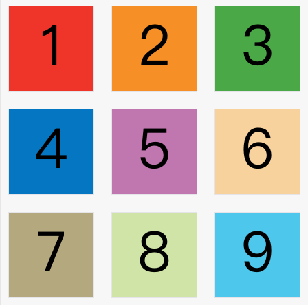

## Grid

-------

网格布局（`Grid`）是最强大的 `CSS` 布局方案。

它将网页划分成一个个网格，可以任意组合不同的网格，做出各种各样的布局。以前，只能通过复杂的 `CSS` 框架达到的效果，现在浏览器内置了。


上图这样的布局，就是 `Grid` 布局的拿手好戏。

`Grid` 布局与 `Flex` 布局有一定的相似性，都可以指定容器内部多个项目的位置。但是，它们也存在重大区别。

`Flex` 布局是轴线布局，只能指定"项目"针对轴线的位置，可以看作是一维布局。`Grid` 布局则是将容器划分成"行"和"列"，产生单元格，然后指定"项目所在"的单元格，可以看作是二维布局。`Grid` 布局远比 `Flex` 布局强大。

## 基本概念

-----

### 容器和项目

采用网格布局的区域，称为"容器"（`container`）。容器内部采用网格定位的子元素，称为"项目"（`item`）。

```html
<div>
  <div><p>1</p></div>
  <div><p>2</p></div>
  <div><p>3</p></div>
</div>
```

上面代码中，最外层的`<div>`元素就是容器，内层的三个`<div>`元素就是项目。

注意：项目只能是容器的顶层子元素，不包含项目的子元素，比如上面代码的`<p>`元素就不是项目。Grid 布局只对项目生效。

### 行和列

容器里面的水平区域称为"行"（`row`），垂直区域称为"列"（`column`）。


上图中，水平的深色区域就是"行"，垂直的深色区域就是"列"。

### 单元格

行和列的交叉区域，称为"单元格"（`cell`）。

正常情况下，`n`行和`m`列会产生`n x m`个单元格。比如，`3`行`3`列会产生`9`个单元格。

### 网格线

划分网格的线，称为"网格线"（`grid line`）。水平网格线划分出行，垂直网格线划分出列。

正常情况下，`n`行有`n + 1`根水平网格线，`m`列有`m + 1`根垂直网格线，比如三行就有四根水平网格线。


上图是一个 `4 x 4` 的网格，共有 `5` 根水平网格线和 `5` 根垂直网格线。

## 容器属性

-----

`Grid` 布局的属性分成两类。一类定义在容器上面，称为容器属性；另一类定义在项目上面，称为项目属性。这部分先介绍容器属性。

### display 属性

`display: grid`指定一个容器采用网格布局。

```css
div {
  display: grid;
}
```

上面代码指定`div`是一个行内元素，该元素内部采用网格布局。


上图是`display: inline-grid`的[效果](https://jsbin.com/qatitav/edit?html,css,output)。

> [注意:]()设为网格布局以后，容器子元素（项目）的`float`、`display: inline-block`、`display: table-cell`、`vertical-align`和`column-*`等设置都将失效。

### grid-template-columns 属性， grid-template-rows 属性

容器指定了网格布局以后，接着就要划分行和列。`grid-template-columns`属性定义每一列的列宽，`grid-template-rows`属性定义每一行的行高。

```css
.container {
  display: grid;
  grid-template-columns: 100px 100px 100px;
  grid-template-rows: 100px 100px 100px;
}
```

上面代码指定了一个三行三列的网格，列宽和行高都是 `100px`。


除了使用绝对单位，也可以使用百分比。

```css
.container {
  display: grid;
  grid-template-columns: 33.33% 33.33% 33.33%;
  grid-template-rows: 33.33% 33.33% 33.33%;
}
```

#### **repeat()**

有时候，重复写同样的值非常麻烦，尤其网格很多时。这时，可以使用`repeat()`函数，简化重复的值。上面的代码用`repeat()`改写如下。

```css
.container {
  display: grid;
  grid-template-columns: repeat(3, 33.33%);
  grid-template-rows: repeat(3, 33.33%);
}
```

`repeat()`接受两个参数，第一个参数是重复的次数（上例是3），第二个参数是所要重复的值。

`repeat()`重复某种模式也是可以的。

```css
grid-template-columns: repeat(2, 100px 20px 80px);
```

上面代码定义了6列，第一列和第四列的宽度为`100px`，第二列和第五列为`20px`，第三列和第六列为`80px`。


#### **auto-fill 关键字**

有时，单元格的大小是固定的，但是容器的大小不确定。如果希望每一行（或每一列）容纳尽可能多的单元格，这时可以使用`auto-fill`关键字表示自动填充。

```css
.container {
  display: grid;
  grid-template-columns: repeat(auto-fill, 100px);
}
```

上面代码表示每列宽度`100px`，然后自动填充，直到容器不能放置更多的列。


#### **fr 关键字**

为了方便表示比例关系，网格布局提供了`fr`关键字（fraction 的缩写，意为"片段"）。如果两列的宽度分别为`1fr`和`2fr`，就表示后者是前者的两倍。

```css

.container {
  display: grid;
  grid-template-columns: 1fr 1fr;
}
```

上面代码表示两个相同宽度的列。


`fr`可以与绝对长度的单位结合使用，这时会非常方便。

```css
.container {
  display: grid;
  grid-template-columns: 150px 1fr 2fr;
}
```

上面代码表示，第一列的宽度为150像素，第二列的宽度是第三列的一半。


#### **auto 关键字**

`auto`关键字表示由浏览器自己决定长度。

```css
grid-template-columns: 100px auto 100px;
```

上面代码中，第二列的宽度，基本上等于该列单元格的最大宽度，除非单元格内容设置了`min-width`，且这个值大于最大宽度。其实 `fr` 也能达到这个效果：

```css
grid-template-columns: 100px 1fr 100px;
```

#### **minmax()**

`minmax()`函数产生一个长度范围，表示长度就在这个范围之中。它接受两个参数，分别为最小值和最大值。

```css
grid-template-columns: 1fr 1fr minmax(100px, 1fr);
```

上面代码中，`minmax(100px, 1fr)`表示列宽不小于`100px`，不大于`1fr`。

#### **网格线的名称**

`grid-template-columns`属性和`grid-template-rows`属性里面，还可以使用方括号，指定每一根网格线的名字，方便以后的引用。

```css
.container {
  display: grid;
  grid-template-columns: [c1] 100px [c2] 100px [c3] auto [c4];
  grid-template-rows: [r1] 100px [r2] 100px [r3] auto [r4];
}
```

上面代码指定网格布局为3行 x 3列，因此有4根垂直网格线和4根水平网格线。方括号里面依次是这八根线的名字。

网格布局允许同一根线有多个名字，比如`[fifth-line row-5]`。

#### 例子🌰

`grid-template-columns`属性对于网页布局非常有用。两栏式布局只需要一行代码。

```css
.wrapper {
  display: grid;
  grid-template-columns: 70% 30%;
}
```

上面代码将左边栏设为`70%`，右边栏设为`30%`。传统的十二网格布局，写起来也很容易。

```css
grid-template-columns: repeat(12, 1fr);
```

### grid-row-gap 属性， grid-column-gap 属性， grid-gap 属性

`grid-row-gap`属性设置行与行的间隔（行间距），`grid-column-gap`属性设置列与列的间隔（列间距）。

```css
.container {
  grid-row-gap: 20px;
  grid-column-gap: 20px;
}
```

上面代码中，`grid-row-gap`用于设置行间距，`grid-column-gap`用于设置列间距。



`grid-gap`属性是`grid-column-gap`和`grid-row-gap`的合并简写形式，语法如下。

```css
grid-gap: <grid-row-gap> <grid-column-gap>;
```

如果`grid-gap`省略了第二个值，浏览器认为第二个值等于第一个值。

> 根据最新标准，上面三个属性名的`grid-`前缀已经删除，`grid-column-gap`和`grid-row-gap`写成`column-gap`和`row-gap`，`grid-gap`写成`gap`。

### grid-auto-flow 属性

划分网格以后，容器的子元素会按照顺序，自动放置在每一个网格。默认的放置顺序是"先行后列"，即先填满第一行，再开始放入第二行，即下图数字的顺序。


这个顺序由`grid-auto-flow`属性决定，默认值是`row`，即"先行后列"。也可以将它设成`column`，变成"先列后行"。

```css
grid-auto-flow: column;
```

上面代码设置了 `column` 以后，放置顺序就变成了下图。


