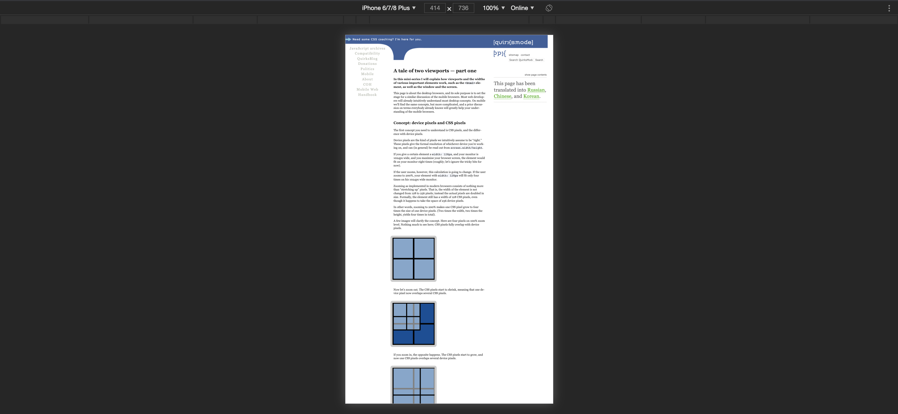
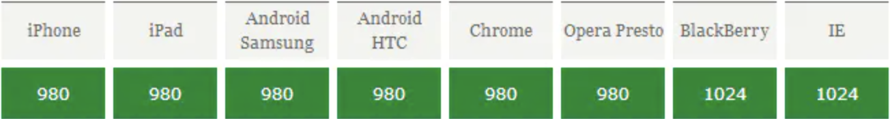
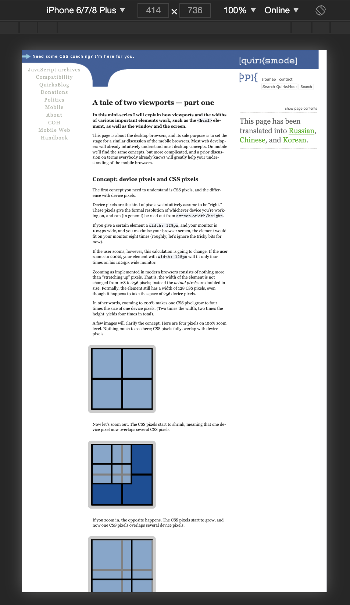

## viewport

视口的功能是约束`<html>`元素，代表当前可见的计算机图形区域。在 Web 浏览器术语中，通常与浏览器窗口相同，但不包括浏览器的 UI， 菜单栏等——即指你正在浏览的文档的那一部分。

文档，比如这篇文章，可能会非常长。你的 `viewport` 就是你现在所能见到的所有事物。值得注意的是“什么是视口区域”这个问题，页面中的一些导航菜单也包括在其中。`Viewport` 的大小取决于屏幕的大小，无论浏览器是否处于全屏模式，是否被用户缩放了。

+ 在尺寸较大的设备中，在这些设备上，应用显示区域不一定是全屏的，`viewport` 是浏览器窗口的大小。
+ 在大多数移动设备中，浏览器是全屏的，`viewport` 是整个屏幕的大小。
+ 在全屏模式下，`viewport` 是设备屏幕的范围，窗口是浏览器窗口，浏览器窗口大小小于或等于视口的大小，并且文档是这个网站，文档的大小可比 `viewport` 长或宽。

概括地说，`viewport` 基本上是当前文档的可见部分。

## web viewport

`Web` 浏览器包含两个 `viewport`，布局视口`(layout viewport)`和视觉视口`(visual viewport)`。`visual viewport` 指当前浏览器中可见的部分，并且可以变化。当使用触屏双指缩放，当动态键盘在手机上弹出的时候，或者之前隐藏的地址栏变得可见的时候，`visual viewport` 缩小了，但是 `layout viewport` 却保持不变。

`web` 浏览器的像素就是根据屏幕分辨率来定义的，所以我们不需要做任何兼容性设置。

## mobile viewport



当我们聚焦到移动浏览器的时候，问题出现了，最明显的区别是屏幕尺寸。我们可以将 `web` 浏览器和移动端浏览器进行对比，如上图我们可以看到 `web` 浏览器视口一般等同于屏幕宽度，我这里是 `1920px`，而如果移动浏览器选用其屏幕大小作为视口大小，则占 `web` 浏览器的 `1/4`。但是当它们显示同样的内容的时候，我们就需要对 `CSS像素` 进行缩小(见上节)。这样的显示效果往往是不尽如人意的，可以看到缩放之后的文字几乎不可见。

在移动浏览器上视口就是就是设备的屏幕上能用来显示我们的网页的那一块区域，在具体一点，就是浏览器上用来显示网页的那部分区域，但 `viewport` 又不局限于浏览器可视区域的大小，它可能比浏览器的可视区域要大，也可能比浏览器的可视区域要小。

视口太窄，无法用作 `CSS` 布局的基础。显而易见的解决方案是扩大视口。于是就衍生出了下面三种视口：布局视口、视觉视口、理想视口。

#### 布局视口

布局视口 `layout viewport`，我们可以将布局视口想象成一个不会改变大小或形状的大图像，其大小在不同设备上的大小一般是固定的，移动设备上的浏览器默认的 `layout viewport` 分辨率一般为`980px`或`1024px`，下图列出了一些设备上浏览器的默认`layout viewport`的宽度。



如果我们不设置 `mate` 标签那么，浏览器默认采用的就是布局视口进行兼容，用户可以通过缩放来调整显示内容的大小。这个大小一般足够显示网站上的全部内容，当然也可能不足需要滚动。



对于开发者而言，固定宽度的视口带来的问题就是，一旦书写元素的 `css`像素大于视口大小时，就会出现横向的滚动条，这很不性感，这个时候就需要使用 `@media` 做兼容性设置。

除了横向的滚动条之外还有更严重的问题，如果我们将外层容器的宽度设置为 `100%`，此时他的默认宽度就是 `980px`，这不会出现任何问题。但是一旦其内容超过 `980px` 就会出现下面的效果：


视口大小会被撑大到显示全部内容，造成的效果是内容的 `css` 像素和屏幕像素比会缩小，但是此时的视口大小仍然是 `980px`，为了避免这种情况，我们需要做的就是尽量不让内容大到撑爆和盒子。

#### 视觉视口

视觉视口 `visual viewport`，**视觉视口**是目前在屏幕上显示的页面的一部分，也可以说是用户可以看到的网站的区域。用户可以通过缩放来操作视觉视口，但是不会影响布局视口，布局视口宽度是不变的。还可以滚动以更改其看到的页面部分。

#### 理想视口

理想视口 `ideal viewport` 是为网站在移动端有最理想的浏览和阅读宽度而设定的，理想视口对于设备来说就是浏览器在设备上的可显示区域。对于理想视口，我们需要手动添加 `meta` 标签来通知浏览器操作。`meta` 标签的作用就是将布局视口的宽度设置与理想视口一致，简单的来说，设备有多宽，布局视口就有多宽。

理想视口主要解决了布局视口固定大小的问题，真正做到了多设备兼容的视口大小。

#### meta:`viewport`

在 `HTML5` 中，浏览器提供了对理想视口的实现，也就是 `viewport` 标签，

```html
 <meta name="viewport" content="width=device-width, initial-scale=1.0, maximum-scale=1.0, user-scalable=0">
```

这里 `width` 属性指的是视口宽度，现在视口的宽度被设置为了设备的屏幕宽度，即文档视口宽度大小与设备宽度大小 `100%` 对应（转换为 `CSS` 像素值相同）。除了 `width` 属性外，还有`initial-scale、``maximum-scale、minimum-scale`，以及 `user-scalable` 属性可供设置。这些属性分别设置了文档的初始缩放比例、最大缩放比例、最小缩放比例以及是否允许用户进行缩放操作。但这些属性的默认值已经很好了，开发时可以忽略掉这些属性。

|      属性       |                    描述                    |
| :-------------: | :----------------------------------------: |
|     `width`     |             设备虚拟视口的宽度             |
| `device-width`  |             设备屏幕的物理宽度             |
|    `height`     |             设备虚拟视口的高度             |
| `device-height` |             设备屏幕的物理高度             |
| `initial-scale` |     访问页面的初始缩放，1.0 表示无缩放     |
| `minimum-scale` | 访客可对页面的最小缩放级别，1.0 表示无缩放 |
| `maximum-scale` | 访客可对页面的最大缩放级别，1.0 表示无缩放 |
| `user-scalable` |     是否允许进行缩放，值为`yes`或`no`      |

#### 高清缩放原理

`initial-scale` 等的缩放是基于理想视口的，理想视口由设备各自提供，理想视口的宽度也是设备的独立像素 (所谓“独立”是说这个设备独立像素和像素密度无关，`Retina`屏增加了设备像素（物理像素），所以物理像素是有密度变化的)

```css
dpr = 物理像素/设备独立像素 = 设备像素个数(布局视口宽度)/设备理想视口宽度
```

`CSS`像素和物理像素有区别，当`1`个`CSS`像素跨越更多物理像素时，就模糊了，反之则清晰，`CSS`像素被用在布局视口上，缩放可以调整`CSS`像素和物理像素之间的比例关系。高清屏的缩放方案就是：如将布局视口扩大为理想视口的`2`倍，即理想视口缩放比例为`1/2`，那么`CSS`像素将比以前跨越更少的物理像素，从而保证清晰度。

+ 布局视口/理想视口 = `CSS`像素/设备独立像素 = `1`/缩放比例
+ 物理像素/设备独立像素 = `dpr`
+ 页面清晰要求 —— `CSS`像素/物理像素 = `1`
+ 故 —— 缩放比例 = `1`/`dpr`

设备独立像素可以被看做一个中间件：

+ 当 `dpr=1` 时，设 `initial-scale=1.0`，布局视口等于设备独立像素，设备独立像素等于物理像素，故布局视口等于物理像素，`1CSS`像素跨`1`物理像素
+ 当 `dpr=2` 时，设 `initial-scale=1.0`，布局视口等于理想视口，一个`CSS`像素一个方向容纳两个设备独立像素，设备独立像素是物理像素的一半，故布局视口是物理像素的一半，`1CSS`像素跨`4`物理像素
+ 当 `dpr=2` 时，设 `initial-scale=0.5`，布局视口是理想视口的两倍，一个`CSS`像素一个方向容纳一个设备独立像素，故布局视口等于设备像素，`1CSS`像素跨`1`物理像素。

再来研究高清屏，以下均设：设备独立像素是 `375px`，`dpr=2`，物理像素则是 `750px`，此时视口大小为 `375px`:

+ `initial-scale=1.0` 时，`1CSS`像素跨越`4`物理像素，故视口大小为 `375px`
+ `initial-scale=0.5` 时，`1CSS`像素跨越`1`物理像素，故视口大小为 `750px`

所以说 `initial-scale` 会改变视口的默认大小。

#### 如何处理变大的视口

高清缩放是高清缩放了，但是视口大小也变大了，如果我们的设计稿是 `375px`，难道我们要用媒体查询给两种视口一个写一种布局么，当然不是的，我们只需要使用 `rem` 进行等比划分，不管一个屏幕有多少像素点，我们都将整个屏幕视为 `100` 份，`1rem` 在不同的视口下代表不同的像素位。这样的等比缩放便是移动端兼容的精髓所在。

#### 一像素边框

上面已经说了缩放对视口以及设备独立像素的影响，接下来就可以解决一像素边框了，将通过缩小将视口扩大成设备独立像素和物理像素 `1:1`，边框自然就是真正的 `1` 像素。不过此时视口大小也改变了，所以我们需要使用 `javascript` 动态的改变根元素字体大小：

```dart
var viewport = document.querySelector("meta[name=viewport]")
if (window.devicePixelRatio == 1) {
    viewport.setAttribute('content', 'width=device-width, initial-scale=1, maximum-scale=1, minimum-scale=1, user-scalable=no')
} 
if (window.devicePixelRatio == 2) {
    viewport.setAttribute('content', 'width=device-width, initial-scale=0.5, maximum-scale=0.5, minimum-scale=0.5, user-scalable=no')
} 
if (window.devicePixelRatio == 3) {
    viewport.setAttribute('content', 'width=device-width, initial-scale=0.333333333, maximum-scale=0.333333333, minimum-scale=0.333333333, user-scalable=no')
} 

var docEl = document.documentElement;
var fontsize = docEl.clientWidth / 10 + 'px';
docEl.style.fontSize = fontsize;
```