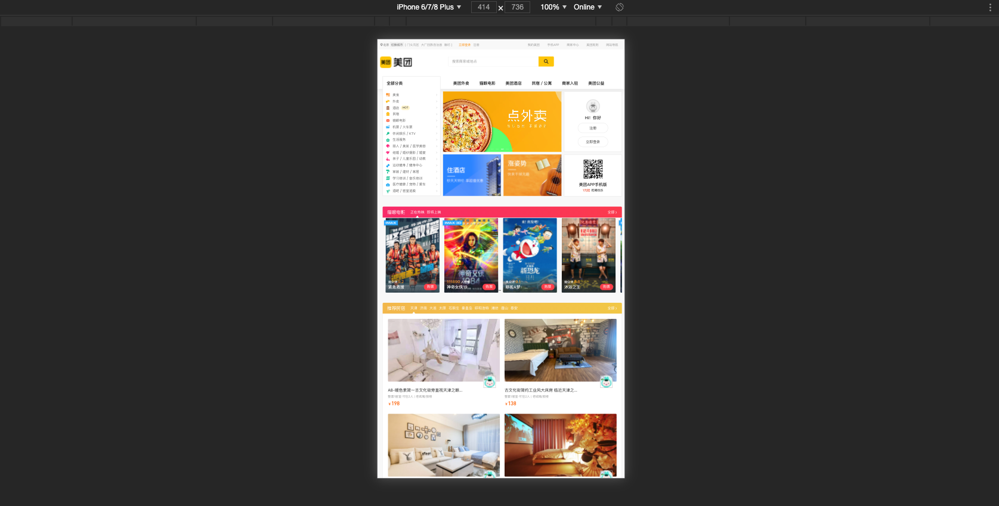

## 移动端适配方案

前面我们已经介绍了屏幕像素和 `CSS` 的关系，并且了解了视口的概念，并且掌握了 `rem` 以及媒体查询的基础知识，通过这些我们就可以实现几乎所有的主流适配方案。

#### 宽屏布局



宽屏布局指的就是 `web` 端布局，直接用 `px` 设置元素尺寸，这种布局方式下，在移动端我们使用默认视口，也就是布局视口(通常为 `980px`)作为规范，限制所有页面元素宽度不超过 `980px` 避免出现滚动条或者缩小整个页面。可是我们网站的内容通常会大于 `1180px`，想要在移动端展示不同尺寸的界面，解决方案就是加入媒体查询。

比如上面的美团，视口大小小于 `1200px` 的时候就会采用移动端布局的策略，将内容进行缩减以及调整，下面是其移动端适配代码(部分典型代码)：

```css
@media screen and (max-width: 1200px) {
  .header-bar .vh {
    width: 980px;
    margin: 0 auto;
    padding: 0 10px;
  }

  .banner-pic-4 {
    display: none;
  }
}
```

#### 百分比布局

不多做赘述。

#### `flex` 布局

`Flexible Box` 模型，通常被称为 `flexbox`，是一种一维的布局模型。它给 `flexbox` 的子元素之间提供了强大的空间分布和对齐能力，不多做赘述。

#### `rem`+ `sass` + 媒体查询

现在来思考一下上面两种布局方案的缺点，无论是百分比布局还是 `flex` 布局都无法做到的就是让字体大小随着视口尺寸的改变而改变，同时纯粹的 `flex` 不能精确的实现设计稿中的尺寸，百分比布局的计算较为麻烦。而移动端适配最重要的一点就是根据设计稿的尺寸比例来在不同视口大小的机型下面显示内容，也就是说元素的尺寸应该是随着屏幕尺寸自适应的。

而 `rem` + 媒体查询就可以很好的实现这一点，首先回顾一下 `rem` ，`rem` 代表的像素大小是根据 `<html>` 上定义的字体大小决定的，也就是说使用 `rem` 编写尺寸之后全局的尺寸大小都会根据 `<html>` 上的 `font-size` 改变而改变实现等比缩放。

现在我们知道了 `rem` 可以实现一个全局控制。假设我们将屏幕宽度平均分成`100`份，每一份的宽度用`x`表示，`x =屏幕宽度 / 100`，如果将`x`作为单位，`x`前面的数值就代表屏幕宽度的百分比：

```css
p {width: 50x} /* 屏幕宽度的50% */
```

如果想要页面元素随着屏幕宽度等比变化，我们需要上面的`x`单位，不幸的是`css`中并没有这样的单位，幸运的是在`css`中有`rem`，通过`rem`这个桥梁，可以实现神奇的`x`。

如果让`html`元素字体的大小，恒等于屏幕宽度的`1/100`，那`1rem`和`1x`就等价了

```css
html {font-size: width / 100}
p {width: 50rem} /* 50rem = 50x = 屏幕宽度的50% */
```

虽然 `css` 里不能出现计算，但是 `scss` 可以，首先以 `750` 的设计稿尺寸作为基准值，将屏幕分为 `15` 等份，可以得到：

```scss
// default rem base 50px
html {
  font-size: 50px;
}

$cols: 15;
```

之后根据常见的机型屏幕大小使用不同的视口大小作为基准：

```scss
// 375 iphone 678
@media screen and (min-width: 375px) {
  html {
    font-size: 375px / $cols;
  }
}
...
```

在实际书写样式的时候我们得到这个计算公式：

+ `实际尺寸` = (`设计稿宽度`/`设计稿1rem宽度`) * `实际适配1rem宽度` = (`设计稿宽度`/`设计稿1rem宽度`)`rem`

```scss
$baseCol: 50;
// banner
.jd-banner {
  width: 15rem;
  height: 368rem / $baseCol;
}
```

#### `rem`+`cssrem`+`flexible`

上面的解决方案缺陷同样也很明显，所有的手机尺寸都是我们手动实用媒体查询添加的，原因就是不能使用 `js` 动态计算视口大小，其实这个动态计算非常简单，只需要一行代码，一般需要在页面`dom ready`、`resize`和屏幕旋转中设置：

```js
document.documentElement.style.fontSize = document.documentElement.clientWidth / 10 + 'px';
```

所以通过 `flexible` 的方案应运而生，下面是 `flexible` 的代码原理：

```js
// 首先是一个立即执行函数，执行时传入的参数是window和document
(function flexible (window, document) {
  var docEl = document.documentElement // 返回文档的root元素
  var dpr = window.devicePixelRatio || 1 
  // 获取设备的dpr，即当前设置下物理像素与虚拟像素的比值

  // 调整body标签的fontSize，fontSize = (12 * dpr) + 'px'
  // 设置默认字体大小，默认的字体大小继承自body
  function setBodyFontSize () {
    if (document.body) {
      document.body.style.fontSize = (12 * dpr) + 'px'
    } else {
      document.addEventListener('DOMContentLoaded', setBodyFontSize)
    }
  }
  setBodyFontSize();

  // set 1rem = viewWidth / 10
  // 设置root元素的fontSize = 其clientWidth / 10 + ‘px’
  function setRemUnit () {
    var rem = docEl.clientWidth / 10
    docEl.style.fontSize = rem + 'px'
  }

  setRemUnit()


    // 当我们页面尺寸大小发生变化的时候，要重新设置下rem 的大小
  window.addEventListener('resize', setRemUnit)
  // pageshow 是我们重新加载页面触发的事件
  window.addEventListener('pageshow', function(e) {
    // e.persisted 返回的是true 就是说如果这个页面是从缓存取过来的页面，也需要从新计算一下rem 的大小
    if (e.persisted) {
      setRemUnit()
    }
  })

  // 检测0.5px的支持，支持则root元素的class中有hairlines
  if (dpr >= 2) {
    var fakeBody = document.createElement('body')
    var testElement = document.createElement('div')
    testElement.style.border = '.5px solid transparent'
    fakeBody.appendChild(testElement)
    docEl.appendChild(fakeBody)
    if (testElement.offsetHeight === 1) {
      docEl.classList.add('hairlines')
    }
    docEl.removeChild(fakeBody)
  }
}(window, document))
```

下面的这个`meta`标签页面不要设定， `Flexible`会自动设定每个屏幕宽度的根`font-size`、动态`viewport`、针对`Retina`屏做的`dpr`。

```html
<!-- 这个标签不要设定! -->
<!-- <meta name="viewport" content="width=device-width,initial-scale=1.0,minimum-scale=1.0,maximum-scale=1.0"> -->
```

其原理大概如下，注意这样设置完之后虽然屏幕的视口大小也会改变，`dpr` 会恢复为 `1`，这样可以解决 `1` 像素边框问题，只是我们在设置 `html` 的 `fontSize` 的时候需要根据改变了的视口：

```js
var viewport = document.querySelector("meta[name=viewport]")
if (window.devicePixelRatio == 1) {
    viewport.setAttribute('content', 'width=device-width, initial-scale=1, maximum-scale=1, minimum-scale=1, user-scalable=no')
} 
if (window.devicePixelRatio == 2) {
    viewport.setAttribute('content', 'width=device-width, initial-scale=0.5, maximum-scale=0.5, minimum-scale=0.5, user-scalable=no')
} 
if (window.devicePixelRatio == 3) {
    viewport.setAttribute('content', 'width=device-width, initial-scale=0.333333333, maximum-scale=0.333333333, minimum-scale=0.333333333, user-scalable=no')
} 

var docEl = document.documentElement;
var fontsize = 10 * (docEl.clientWidth / 320) + 'px';
docEl.style.fontSize = fontsize;
```

一般`UI`给我们的稿子大小是`750`的。就以这个为例子：在`flexible.js`中，把`750px`分为`10`份，`1rem` 为 `75px`。所以`font-size`的基准值为`75px`；

`css` 换算成 `rem` 公式为: `px值 / 75 = rem`, 例如：`100px=100/75=1.33rem`

但是这样一来计算起来就非常的复杂。那么我们在日常开发中怎么快速计算呢，这里我说下我常用的编译器 `VScode` 它里面有个插件叫 `cssrem`，用它就可以在我们输入 `px` 值后自动转换 `rem`。


这代表根字体大小，默认是`16px`，即`1rem = 16px`,我们这里把他改为`75`：

```json
{
	// cssrem
  "cssrem.rootFontSize": 75
}
```

#### `vm`+`vh`

上面提到想让页面元素随着页面宽度变化，需要一个新的单位`x`，`x`等于屏幕宽度的百分之一，`css3`带来了`rem`的同时，也带来了`vw`和`vh`

> `vw` —— 视口宽度的 `1/100`；`vh` —— 视口高度的 `1/100` —— `MDN`

聪明的你也许一经发现，这不就是单位`x`吗，没错根据定义可以发现`1vw=1x`，有了`vw`我们完全可以绕过`rem`这个中介了，下面两种方案是等价的，可以看到`vw`比`rem`更简单，毕竟`rem`是为了实现`vw`么

```css
/* vw方案 */
p {width: 15.625vw}
```

经过推敲我们可以得到 `vw` 的元素尺寸计算公式：在 `750px` 的设计尺寸下 `1vw=7.5px`，所以，`元素vw值` = `元素设计稿尺寸`/`7.5`。

```scss
$baseVW: 7.5;

.jd-search {
  width: 100vw;
  height: 88vw / $baseVW;
}
```

`vw`还可以和`rem`方案结合，这样计算`html`字体大小就不需要用`js`了

```css
html {font-size: 1vw} /* 1vw = width / 100 */
p {width: 15.625rem}
```

但是凡事都是有代价的，`vw` 本身的不可更改性决定了其在页面超过 `750` 时无法进行大小控制。