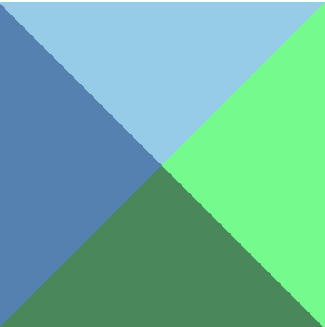
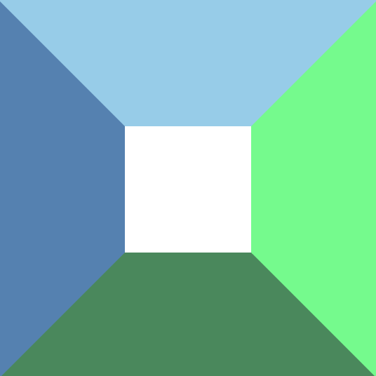
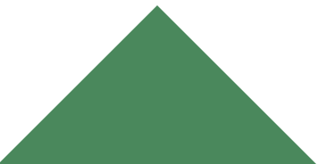
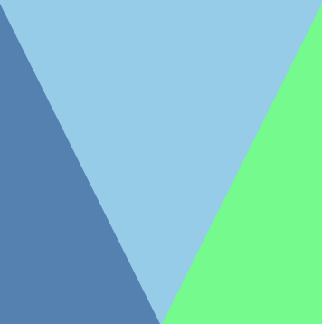

## 原理

`css` 画三角形的原理是什么呢，**其实border是一个三角形，把width：0px； height：0px，只剩下border属性，那么我们就可以得到三角形图形**：



平时我们看不出来是因为内容和 `border` 的比例比较大，而且 `border`都是同一种颜色；



我们可以快捷的设置 `border` 的颜色：

```css
border-width: 30px ;
border-style: solid;
border-color: blue yellow pink orange;(方向对应：上 右 下 左)（顺时针旋转）
```

## 三角形

每一个 `border` 都可以得到一个三角形，相邻的两个 `border` 还可以组合三角形。**我们知道transparent是设定为透明的意思，只要把对应的位置的border设定为transparent即可以得到任意组合三角形**:

我就举一个简单的例子：



```css
div {
  width: 0;
  border: 30px solid transparent;
  /* border-top: 30px solid skyblue; */
  /* border-left: 30px solid steelblue; */
  border-bottom: 30px solid seagreen;
  /* border-right: 30px solid springgreen; */
}
```

各种角度的三角形都可以实现：



```css
div {
  width: 0;
  border-top: 60px solid skyblue;
  border-left: 30px solid steelblue;
  border-right: 30px solid springgreen;
}
```

