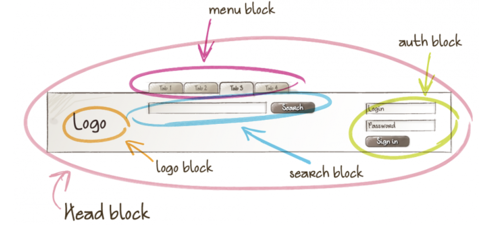
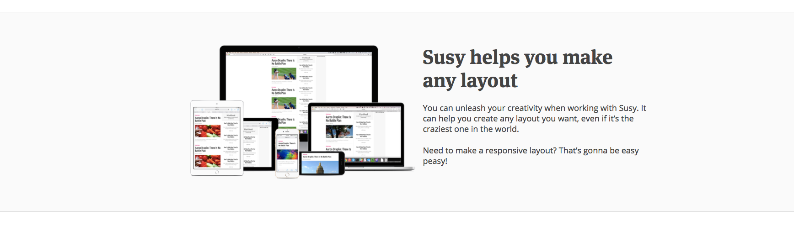

# BEM大型CSS项目规范

`Block`, `Element`,`Modifier`，其实是`块（block）`、`元素（element）`、`修饰符（modifier）`这三个部分使用`__`和`--`连接，了解BEM之前我们先来了解CSS书写的一些其他规范。

## CSS 规范

#### **CSS书写顺序**

1.位置属性`(position, top, right, z-index, display, float等)`

2.大小`(width, height, padding, margin)`

3.文字系列`(font, line-height, letter-spacing, color- text-align等)`

4.背景`(background, border等)`

5.其他`(animation, transition等)`

```css
display: flex;
justify-content: center;
width: 100px;
margin: 10px;
font: normal 700 16px/20px Arial;
color: #fff
background: black;
border: 1px solid black;
```

#### **CSS缩写**

1.CSS有些属性是可以缩写的，比如padding,margin,font等等，这样精简代码同时又能提高用户的阅读体验。

```css
/* bad */
font-weight: 700;
font-size: 16px;
line-height: 20px;
/* good */
font: normal 700 16px/20px weiruanyahei;
```

2.去掉小数点前的“0”

```css
/* bad */
font-size: 0.8em;
/* good */
font-size: .8em;
```

3.16进制颜色代码缩写

```css
/* bad */
color: #aabbcc;
/* good */
color: #abc
```


## 什么是BEM？

#### Block (组件)

`Block`是一个逻辑上和功能上独立的页面组件（等同于网页中的组件）。`Block` 封装了行为`(js)`、模板、样式`(CSS)`和其他实现技术。独立状态的 Block 可供复用，并且促进项目开发和维护。

- 模块不应该影响它所在的环境，这意味着你不应该为模块设置会影响到外部的形状（影响大小的 padding 或边框）和定位。
- 模块与模块之间可以彼此嵌套，Block 可以被嵌套到任何其他 block 里面去。例如，一个头部 block 可以包含一个 logo、一个搜索表单和一个登录 block。



只要元素规模足够被称为一个模块，那他就可以享受一个单独的`element`名称。比如下面的结构层次，`logo`不被命名为`header-logo`。

```html
<!-- 'head' 模块 -->
<header class="header">
    <!-- 嵌套 'logo' 模块 -->
    <div class="logo"></div>

    <!-- 嵌套 'search-form' 模块 -->
    <form class="search-form"></form>

	<!-- 嵌套 'nav' 模块 -->
    <div class="nav"></form>
</header>
```
> 通常指模块，组件。

#### Element (元素)
**元素`Element`是一个模块`block`的组成部分，且不能脱离模块单独地被使用。**例如，一个菜单项`a menu item`不会在一个菜单块`a menu block`范围之外使用，因此它是一个元素`element`。
完整的元素名的结构是 block-name__element-name。元素的名字与模块的名字使用双下划线分隔（__）

- 元素之间可以彼此嵌套
- 一个元素总是一个模块的一部分，而不是另一个元素的一部分，这意味着元素的名称不能被定义为 block__elem1__elem2 这样的层次结构。


```html
<form class="search-form">
    <div class="search-form__content">
        <input class="search-form__input"/>
        <button class="search-form__button"><[表情]tton>
    </div>
    <div class="search-form__hot">
        <a class="search-form__hot-word"></a>
        <a class="search-form__hot-word"></a>
    </div>
</form>
```
#### Modifier (修饰符)
Modifier 是一个 BEM 实体，它定义了一个 block 或 element 的外观和行为，Modifier 可用也可不用（即不一定要用到 modifier）。Modifier 本质上与 HTML 的属性很相似。同一个 block 会因为 modifier 的使用而 看起来与之前有所不同。例如，菜单块（the menu block ）的外观可能会因为在它身上用了一个 modifier 而改变。

- 修饰符的名称：描述了它的外观（`"多大？"`或者`“它的主题是什么？"`—— `size-s` 或者 `theme-islands`），它的状态（`“它与其他有什么不同？”` —— `disabled，focused，等等`）。
- 修饰符的名字与模块或者元素的名字使用双连字符（--）

```html
<form class="search-form search-form--focused">
    <input class="search-form__input"/>

    <!-- 'button' 元素有一个 'disabled' 的布尔类型修饰符 -->
    <button class="search-form__button search-form__button--disabled">Search<[表情]tton>
</form>
```
#### Container (容器)

有时（实际上经常），我会遇到这样的情况，我必须在确定其它元素都对齐的同时扩散一个区域的背景色，就像这样：



浅灰色的背景扩散到了对齐的区域的外面，如果你熟悉构建布局，会使用以下方式构建 HTML，因为这个容器是没有快含义的

```html
<section> 
    <div class="block-container"> 
        <div class="block"> 
            <!-- ... --> 
        </div> 
    </div> 
</section>
```

问题是，你应该怎么命名块容器？ 或者在这种情况下，怎么命名  容器元素。我习惯的方法是命名为 `block-container` 。我只在这种情况下使用`block-container`，所以我觉得它仍然可以接受。你有更好的主意吗？

## 命名技巧

#### 链接孙元素到块

虽然 BEM 建议你将 BEM 元素写作 `.block__element` ，但它不会规定你的 HTML 应如何。所以，只要有意义的话，你可以把你的孙元素连在一起。

```html
<article class="article"> 
    <header class="article__header"> 
        <h1 class="article__title"></h1> 
    </header> 
</article>
```

虽然这样有效，你也会遇到无意义的链接孙元素的情况。举个例子：

```html
<section class="comments"> 
    <h2 class="comments__title"></h2> 
    <article class="comments__comment"> 
        <h3 class="comments__comment-title"></h3> 
    </article> 
    <article class="comments__comment"> 
        <h3 class="comments__comment-title"></h3> 
    </article> 
    <!-- ... --> 
</section>
```

#### 创建新的块来保存孙元素

虽然可以连接孙元素到块，但是`css`实际推荐的是创建新的元素，因为块是可以嵌套的。在上述情况下，你可以轻松地将 `.comments__comment` 拆为 `.comments` 和 `.comment` ：

```html
<section class="comments"> 
    <h2 class="comments__title"></h2> 
    <article class="comment"> 
        <h3 class="comment-title"></h3> 
    </article> 
    <article class="comment"> 
        <h3 class="comment-title"></h3> 
    </article> 
    <!-- ... --> 
</section>
```

这更有意义，不是吗？如果你这样做，请确保将 `.comments` 和 `.comment`块放在同一个文件中，以方便参考。

## 为什么要使用BEM？

#### 1.性能

CSS引擎查找样式表，对每条规则都按从右到左的顺序去匹配，以下这段代码看起来很快，实际上很慢。通常我们会认为浏览器是这样工作的：找到唯一ID元素ul-id —> 把样式应用到li元素上。事实上: 从右到左进行匹配，遍历页面上每个li元素并确定其父元素
```csss
ul-id li {}
```
所以不要让你的css超过三层
#### 2.语义化
看以下例子是否一目了然。
```css
.person{} /*人*/
.person__hand{} /*人的手*/
.person--female{} /*女人*/
.person--female__hand{} /*女人的手*/
.person__hand--left{} /*人的左手*/
```
如果写成以下这样，你将不知道这是hand指的是手还是指针，female是女性还是雌性，female-hand是女性还是雌性的手？left-hand什么的左手，还是指针的左边？
```scss
.person{}
.hand{}
.female{}
.female-hand{}
.left-hand{}    
```
## 在SCSS使用

在`scss`中使用`@at-root`内联选择器模式，编译出来的`CSS`无任何嵌套（这是关键）
```scss
/*使用的scss*/
.person {
  @at-root #{&}__hand {
    color: red;
    @at-root #{&}--left {
     color: yellow;
    }
  }
  @at-root #{&}--female {
    color: blue;
    @at-root #{&}__hand {
      color: green;
    }
  }
}
/*生成的css*/
.person__hand {
   color: red;
}
.person__hand--left {
   color: yellow; 
}
.person--female{
  color: blue;
}
.person--female__hand {
  color: green;
}
```

