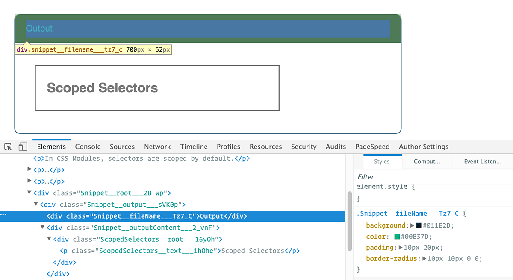

# CSS Modules

学过网页开发就会知道，`CSS` 不能算编程语言，因为首先它不是图灵机，同时它没有模块的概念，只是网页样式的一种描述方法。为了让 `CSS` 也能适用软件工程方法，程序员想了各种办法，让它变得像一门编程语言。从最早的`Less`、`SASS`，到后来的 `PostCSS`再到最近的 `CSS in JS`，都是为了解决这个问题。

本文介绍的 [CSS Modules](https://github.com/css-modules/css-modules) 有所不同。它不是将 `CSS` 改造成编程语言，而是功能很单纯，只加入了局部作用域和模块依赖，这恰恰是网页组件最急需的功能。

因此，`CSS Modules` 很容易学，因为它的规则少，同时又非常有用，可以保证某个组件的样式，不会影响到其他组件。

## What is CSS Modules?

根据 `CSS Modules` 在 `Gihub` 上的[项目](https://link.zhihu.com/?target=https%3A//github.com/css-modules/css-modules)，它被解释为：

> 所有的类名和动画名称默认都有**各自的作用域**的 `CSS` 文件。

所以 `CSS Modules` 既不是官方标准，也不是浏览器的特性，而是在构建步骤（例如使用 `Webpack` 或 `Browserify` ）中对 `CSS` 类名和选择器限定作用域的一种方式（类似于命名空间）。

我们还是先看一个具体的例子来解释清楚它到底是什么，以及为什么要使用 `CSS Modules` 吧。我们通常给 `HTML` 加一个 `CSS` 的类名来控制它的样式：

```html
<h1 class="title">An example heading</h1>
```

`CSS` 样式像下面这样：

```css
.title {
  background-color: red;
}
```

只要把` CSS` 文件加载到 `HTML` 文件中，这里的<h1>标签背景就会被设置成红色。我们不需要对 `HTML` 或 `CSS` 做什么特殊的处理，浏览器本来就支持这种最基本的文件类型。

而 `CSS Modules` 的使用方式就不一样了，我们需要把所有的标签写到 `JS` 文件里。下面是一个简单的示例：

```ts
import styles from "./styles.css";

element.innerHTML = 
  `<h1 class="${styles.title}">
     An example heading
   </h1>`;
```

在 `JS` 中你可以通过类似 `styles.title` 的方式访问 `CSS` 文件中的 `.title` 类。然后在构建过程中，我们的构建工具会搜索我们用 `import` 语句载入的名为 `styles.css` 的文件，之后把源文件解析成新的 `HTML` 和 `CSS` 文件，类名会被特定的格式替换：

**HTML**

```html
<h1 class="_styles__title_309571057">
  An example heading
</h1>
```

**CSS**

```css
._styles__title_309571057 {
  background-color: red;
}
```



类属型的 `.title` 完全被新生成的命名替换掉了，`CSS` 的源文件也不会被载入。

## Why is CSS Modules?

通过 `CSS Modules` ，我们可以保证单个组件的所有样式：

1. 集中在同一个地方
2. 只应用于该组件

另外，

```js
import buttons from "./buttons.css";
import padding from "./padding.css";

element.innerHTML = `<div class="${buttons.red} ${padding.large}">`;
```

通过这样的方式可以解决 `CSS` 全局作用域的问题。

你一定经历过着急着赶工想要尽快写完 `CSS` ，而根本没有考虑过你的代码会造成什么不良影响吧。

你也一定干过在某个样式文件的结尾加上随意命名的乱七八糟的样式之类吧。

### NO BEM

在编写`CSS`模块时我们不再需要遵守[BEM](https://link.zhihu.com/?target=https%3A//css-tricks.com/bem-101/)规范，有这么两个原因：

1. **简化语法——**在 `CSS Modules` 中通过类似 `type.display` 的表达已经能够很好地被理解了。比起某些 `BEM` 中例如`.font-size__serif--large`这样的命名要更清晰。
2. **作用域——**比如我们的一个 `CSS` 中的 `.big` 是用来描述文字大小的，另一个 `CSS` 中的 `.big` 是用来增加间距的。通过使用 `CSS Modules` ，我们在能够随意使用相同命名类的同时，更不用担心它们之间起冲突。即使是在同一个文件中引入这两个 `CSS`，最后生成的结果也会把两个样式区别开来。

## In Webpack

CSS Modules 提供各种[插件](https://github.com/css-modules/css-modules/blob/master/docs/get-started.md)，支持不同的构建工具。本文使用的是 Webpack 的[`css-loader`](https://github.com/webpack/css-loader#css-modules)插件，因为它对 CSS Modules 的支持最好，而且很容易使用

下面是这个示例的[`webpack.config.js`](https://github.com/ruanyf/css-modules-demos/blob/master/demo01/webpack.config.js)。

```ts
module.exports = {
  entry: __dirname + '/index.js',
  output: {
    publicPath: '/',
    filename: './bundle.js'
  },
  module: {
    loaders: [
      {
        test: /\.jsx?$/,
        exclude: /node_modules/,
        loader: 'babel',
        query: {
          presets: ['es2015', 'stage-0', 'react']
        }
      },
      {
        test: /\.css$/,
        loader: "style-loader!css-loader?modules"
      },
    ]
  }
};
```

上面代码中，关键的一行是`style-loader!css-loader?modules`，它在`css-loader`后面加了一个查询参数`modules`，表示打开 CSS Modules 功能。

### self defined hash

`css-loader`默认的哈希算法是`[hash:base64]`，这会将`.title`编译成`._3zyde4l1yATCOkgn-DBWEL`这样的字符串。

[`webpack.config.js`](https://github.com/ruanyf/css-modules-demos/blob/master/demo03/webpack.config.js)里面可以定制哈希字符串的格式。

```js
module: {
  loaders: [
    // ...
    {
      test: /\.css$/,
      loader: "style-loader!css-loader?modules&localIdentName=[path][name]---[local]---[hash:base64:5]"
    },
  ]
}
```

## Local scope

`CSS` 的规则都是全局的，任何一个组件的样式规则，都对整个页面有效。产生局部作用域的唯一方法，就是使用一个独一无二的`class`的名字，不会与其他选择器重名。这就是 `CSS Modules` 的做法。

下面是一个React组件[`App.js`](https://github.com/ruanyf/css-modules-demos/blob/master/demo01/components/App.js)。

```tsx
import React from 'react';
import style from './App.css';

export default () => {
  return (
    <h1 className={style.title}>
      Hello World
    </h1>
  );
};
```

上面代码中，我们将样式文件[`App.css`](https://github.com/ruanyf/css-modules-demos/blob/master/demo01/components/App.css)输入到`style`对象，然后引用`style.title`代表一个`class`。

```css
.title {
  color: red;
}
```

构建工具会将类名`style.title`编译成一个哈希字符串。

```tsx
<h1 class="_3zyde4l1yATCOkgn-DBWEL">
  Hello World
</h1>
```

`App.css`也会同时被编译。

```css
._3zyde4l1yATCOkgn-DBWEL {
  color: red;
}
```

这样一来，这个类名就变成独一无二了，只对`App`组件有效。

## Global scope

CSS Modules 允许使用`:global(.className)`的语法，声明一个全局规则。凡是这样声明的`class`，都不会被编译成哈希字符串。

[`App.css`](https://github.com/ruanyf/css-modules-demos/blob/master/demo02/components/App.css)加入一个全局`class`。

```css
.title {
  color: red;
}

:global(.title) {
  color: green;
}
```

[`App.js`](https://github.com/ruanyf/css-modules-demos/blob/master/demo02/components/App.css)使用普通的`class`的写法，就会引用全局`class`。

```jsx
import React from 'react';
import styles from './App.css';

export default () => {
  return (
    <h1 className="title">
      Hello World
    </h1>
  );
};
```

## Class compose

在 CSS Modules 中，一个选择器可以继承另一个选择器的规则，这称为"组合"（["composition"](https://github.com/css-modules/css-modules#composition)）。

在[`App.css`](https://github.com/ruanyf/css-modules-demos/blob/master/demo04/components/App.css)中，让`.title`继承`.className` 。

```css
.className {
  background-color: blue;
}

.title {
  composes: className;
  color: red;
}
```

[`App.js`](https://github.com/ruanyf/css-modules-demos/blob/master/demo04/components/App.js)不用修改。

```jsx
import React from 'react';
import style from './App.css';

export default () => {
  return (
    <h1 className={style.title}>
      Hello World
    </h1>
  );
};
```

`App.css`编译成下面的代码。

```css
._2DHwuiHWMnKTOYG45T0x34 {
  color: red;
}

._10B-buq6_BEOTOl9urIjf8 {
  background-color: blue;
}
```

相应地， `h1`的`class`也会编译成`<h1 class="_2DHwuiHWMnKTOYG45T0x34 _10B-buq6_BEOTOl9urIjf8">`。

## Class compose from other module

选择器也可以继承其他CSS文件里面的规则。

[`another.css`](https://github.com/ruanyf/css-modules-demos/blob/master/demo05/components/another.css)

```css
.className {
  background-color: blue;
}
```

[`App.css`](https://github.com/ruanyf/css-modules-demos/blob/master/demo05/components/App.css)可以继承`another.css`里面的规则。

```css
.title {
  composes: className from './another.css';
  color: red;
}
```

## Var

CSS Modules 支持使用变量，不过需要安装 PostCSS 和 [postcss-modules-values](https://github.com/css-modules/postcss-modules-values)。

```bash
$ npm install --save postcss-loader postcss-modules-values
```

把`postcss-loader`加入[`webpack.config.js`](https://github.com/ruanyf/css-modules-demos/blob/master/demo06/webpack.config.js)。

```ts
var values = require('postcss-modules-values');

module.exports = {
  entry: __dirname + '/index.js',
  output: {
    publicPath: '/',
    filename: './bundle.js'
  },
  module: {
    loaders: [
      {
        test: /\.jsx?$/,
        exclude: /node_modules/,
        loader: 'babel',
        query: {
          presets: ['es2015', 'stage-0', 'react']
        }
      },
      {
        test: /\.css$/,
        loader: "style-loader!css-loader?modules!postcss-loader"
      },
    ]
  },
  postcss: [
    values
  ]
};
```

接着，在[`colors.css`](https://github.com/ruanyf/css-modules-demos/blob/master/demo06/components/colors.css)里面定义变量。

```css
@value blue: #0c77f8;
@value red: #ff0000;
@value green: #aaf200;
```

[`App.css`](https://github.com/ruanyf/css-modules-demos/tree/master/demo06/components)可以引用这些变量。

```css
@value colors: "./colors.css";
@value blue, red, green from colors;

.title {
  color: red;
  background-color: blue;
}
```

