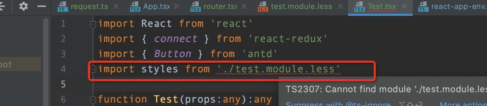

# css_module + Less + ts

## 

## Config

1.先安装 `less`、`less-loader`

```bash
$ yarn add less less-loader
```

2.在项目中 `config` 目录中的 `webpack.config.js` 文件中修改以下内容

```js

const lessRegex = /\.less$/;
const lessModuleRegex = /\.module\.less$/;
```

```js
{
	{
    test: lessRegex,
    exclude: lessModuleRegex,
    use: getStyleLoaders(
        {
          importLoaders: 3,
          sourceMap: isEnvProduction && shouldUseSourceMap,
        },
        'less-loader'
    ),
    sideEffects: true,
  },
  {
    test: lessModuleRegex,
    use: getStyleLoaders(
        {
          importLoaders: 3,
          sourceMap: isEnvProduction && shouldUseSourceMap,
          modules: {
            getLocalIdent: getCSSModuleLocalIdent,
          },
        },
        'less-loader'
    ),
  },
}
```

## Usage

1.我们在组件中创建 `Hello.js` 组件，就像下面这样：

```jsx
import React from 'react'
import hello from './hello.module.less'

/*使用typescript开发react时候引入 *.module.less有所不同*/
// const hello = require('./hello.module.less')

const Hello = () => {
    return (
        <div className={hello.parent}>
            <div>第一层视图</div>
            <div className={hello.son}>第二层视图</div>
             {/*多个类名*/}
            <div className={`${hello.basestyle} ${hello.three}`}>第三层视图</div>
        </div>
    )
}

export default Hello
```

2.在同级目录创建 `hello.module.less`：

```less
.parent {
  background-color: #ccc;
  .son {
    color: skyblue;
  }
  .three {
    margin: 20px;
    color: red;
  }

}
.basestyle {
  font-size: 100px;
}
```

## with typescript

如果在 `react` 项目中使用TS开发，但是又使用 `*.module.less/css/scss/sass` 这种方式写样式，按照上述配置会出现报错情况，如下:



在 `ts` 中使用需要添加类型支持 `.d.ts`：

```ts
// 项目中 *.d.ts 文件中加上如下配置
declare module '*.module.css' {
  const classes: { readonly [key: string]: string };
  export default classes;
}

declare module '*.module.sass' {
  const classes: { readonly [key: string]: string };
  export default classes;
}

declare module '*.module.scss' {
  const classes: { readonly [key: string]: string };
  export default classes;
}

declare module '*.module.less' {
  const classes: { readonly [key: string]: string };
  export default classes;
}
```

