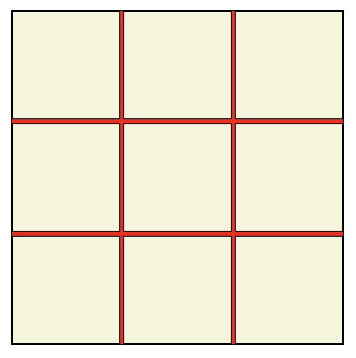

## 自适应九宫格布局

------

首先要注意的是九宫格容器是宽高相等的正方形，并且是自适应的，这里关键是实现宽高相等，有些人想到了相对视口宽度 **vw**，但是它是相对于屏幕可见宽度来设置的，并且会忽略滚动条的宽度，所以这是不可行的。



这个时候我们就想到了一个绝妙的注意，首先盒子的宽度是根据父容器宽度设置的 `width: 100%`，而子元素 `padding-top|padding-bottom` 值为 `100%` 刚好就是相对于父元素的：

```css
.square{
  width: 100%;
  padding-bottom: 100%; /* padding百分比是相对父元素宽度计算的 */
}
```

这样做到了自适应高度的正方形，但是内部的内容大小也被压扁了，所以我们要在内部重新构造一个正方形作为真正的容器：

```css
.square{
  position: relative;
  width: 100%;
  padding-bottom: 100%; /* padding百分比是相对父元素宽度计算的 */
}

.square-inner{
  position: absolute;
  top: 0;
  left: 0;
  width: 100%;
  height: 100%; /* 铺满父元素容器，这时候宽高就始终相等了 */
}
```

#### flex

```html
<div class="square">
  <ul class="square-inner flex">
    <li>1</li>
    <li>2</li>
    <li>3</li>
    <li>4</li>
    <li>5</li>
    <li>6</li>
    <li>7</li>
    <li>8</li>
    <li>9</li>
  </ul>
</div>
```

抽取公共样式：

```css
.square{
  position: relative;
  width: 100%;
  height: 0;
  padding-bottom: 100%; /* padding百分比是相对父元素宽度计算的 */
  margin-bottom: 30px;
}
.square-inner{
  position: absolute;
  top: 0;
  left: 0;
  width: 100%;
  height: 100%; /* 铺满父元素容器，这时候宽高就始终相等了 */
}
.square-inner>li{
  width: calc(98% / 3);  /* calc里面的运算符两边要空格 */
  height: calc(98% / 3);
  margin-right: 1%;
  margin-bottom: 1%;
  overflow: hidden;
}
```

使用 `Flex` 的一个好处是不用再担心高度塌陷的问题，而且还可以轻松实现子元素横向竖向甚至按比例伸缩扩展的布局。

```css
.flex{
  display: flex;
  flex-wrap: wrap;
}
.flex>li{
  flex-grow: 1; /* 子元素按1/n的比例进行拉伸 */
  background-color: #4d839c;
  text-align: center;
  color: #fff;
  font-size: 50px;
  line-height: 2;
}
.flex>li:nth-of-type(3n){ /* 选择个数是3的倍数的元素 */
  margin-right: 0;
}
.flex>li:nth-of-type(n+7){  /* 选择倒数的三个元素，n可以取0 */
  margin-bottom: 0;
}
```

#### Float

浮动实现九宫格就不多说了，原理同上。

```css
.float::after{
  content: "";
  display: block;
  clear: both;
  visibility: hidden;
}
.float>li{
  float: left;
  background-color: #42a59f;
  text-align: center;
  color: #fff;
  font-size: 50px;
  line-height: 2;
}
.float>li:nth-of-type(3n){
  margin-right: 0;
}
.float>li:nth-of-type(n+7){
  margin-bottom: 0;
}
```