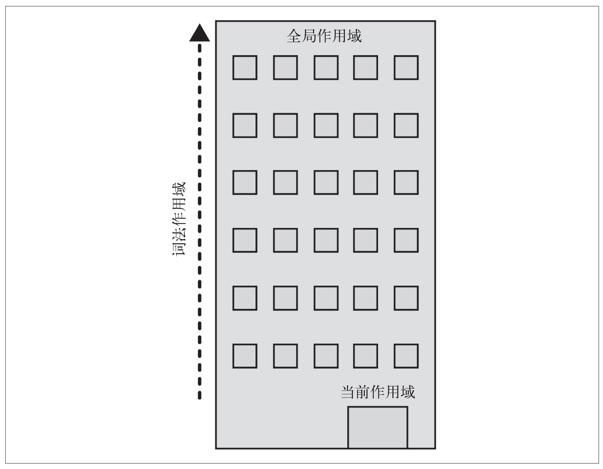

## 1.作用域？

几乎所有编程语言最基本的功能之一，就是能够储存变量当中的值，并且能在之后对这个值进行访问或修改。事实上，正是这种储存和访问变量的值的能力将`状态`带给了程序。

但是将变量引入程序会引起几个很有意思的问题：这些变量储存在哪里？程序需要时如何找到它们？这些问题说明需要一套设计良好的规则来存储变量，并且之后可以方便地找到这些变量，而这套规则被称为作用域。 

### 1.1 编译原理

尽管通常将 JavaScript 归类为“动态”或“解释执行”语言，但事实上它是一门编译语言。但与传统的编译语言不同，它不是提前编译的，编译结果也不能在分布式系统中进行移植。

尽管如此，JavaScript 引擎进行编译的步骤和传统的编译语言非常相似，在某些环节可能比预想的要复杂。 在传统编译语言的流程中，程序中的一段源代码在执行之前会经历三个步骤，统称为“编译”。 

1. **分词/词法分析（Tokenizing/Lexing）:**

   这个过程会将由字符组成的字符串分解成（对语言来说）有意义的代码块，这些代码块被称为词法单元`(token)`。例如，考虑程序 `var a = 2;`，这段程序通常会被分解成为下面这些词法单元`var、a、=、2 、;`。空格是否会被当作词法单元，取决于空格在这门语言中是否具有意义。

   > **了解：**`分词（tokenizing）和词法分析（Lexing）`之间的区别是非常微妙、晦涩的，主要差异在于词法单元的识别是通过有状态还是无状态的方式进行的。简单来说，如果词法单元生成器在判断 a 是一个独立的词法单元还是其他词法 单元的一部分时，调用的是有状态的解析规则，那么这个过程就被称为词法分析。

2. **解析/语法分析（Parsing）:** 

   这个过程是将词法单元流(数组)转换成一个由元素逐级嵌套所组成的代表了程序语法结构的树。这个树被称为抽象语法树`（Abstract Syntax Tree，AST）`。 `var a = 2; `的抽象语法树中可能会有一个叫作` VariableDeclaration` 的顶级节点，接下来是一个叫作` Identifier（它的值是 a）`的子节点，以及一个叫作 `AssignmentExpression `的子节点。该节点有一个叫作 `NumericLiteral（它的值是 2）`的子节点。 

3. **代码生成：** 

   将 AST 转换为可执行代码的过程称被称为代码生成。这个过程与语言、目标平台等息息相关。抛开具体细节，简单来说就是有某种方法可以将·`var a = 2;` 的` AST` 转化为一组`机器指令`，用来创建一个叫作 `a 的变量（包括分配内存等）`，并将一个值储存在 a 中。

比起那些编译过程只有三个步骤的语言的编译器，JavaScript 引擎要复杂得多。例如，在语法分析和代码生成阶段有特定的步骤来对运行性能进行优化，包括对冗余元素进行优化等。

同时，JavaScript 引擎不会有大量的`(像其他语言编译器那么多的)`时间用来进行优化，因为与其他语言不同，JavaScript 的编译过程不是发生在构建之前的。 

对于 JavaScript 来说，大部分情况下编译发生在代码执行前的几微秒（甚至更短！）的时间内。在我们所要讨论的作用域背后，JavaScript 引擎用尽了各种办法（比如 JIT，可以延迟编译甚至实施重编译）来保证性能最佳。 

简单地说，任何 JavaScript 代码片段在执行前都要进行编译（通常就在执行前）。因此，JavaScript 编译器首先会对 var a = 2; 这段程序进行编译，然后做好执行它的准备，并且通常马上就会执行它。 

### 1.2 理解作用域 

我们学习作用域的方式是将这个过程模拟成几个人物之间的对话。那么，由谁进行这场对话呢？

#### 1.2.1 演员表

首先介绍将要参与到对程序 var a = 2; 进行处理的过程中的演员们，这样才能理解接下来将要听到的对话。 

>1. **引擎：**从头到尾负责整个 JavaScript 程序的编译及执行过程。 
>
>2. **编译器：**引擎的手下之一，负责语法分析及代码生成等脏活累活（详见前一节的内容）。 
>
>3. **作用域：**引擎的另一位手下，负责收集并维护由所有声明的标识符（变量）组成的一系列查询，并实施一套非常严格的规则，确定当前执行的代码对这些标识符的访问权限。 

#### 1.2.2 对话

当你看见 var a = 2; 这段程序时，很可能认为这是一句声明。事实上，引擎认为这里有两个完全不同的声明，一个由编译器在编译时处理，另一个则由引擎在运行时处理。 

下面我们将 var a = 2; 分解，看看引擎和它的手下们是如何协同工作的：

编译器首先会将这段程序分解成词法单元，然后将词法单元解析成一个树结构。但是当编译器开始进行代码生成时，它对这段程序的处理方式会和预期的有所不同。可以合理地假设编译器所产生的代码能够用下面的伪代码进行概括：“为一个变量分配内存，将其命名为 a，然后将值 2 保存进这个变量。”然而，这并不完全正确，事实上编译器会进行如下处理：

1. 遇到 var a，编译器会询问作用域是否已经有一个该名称的变量存在于同一个作用域的集合中。如果是，编译器会忽略该声明，继续进行编译；否则它会要求作用域在当前作用域的集合中声明一个新的变量，并命名为 a。 

2. 接下来编译器会为引擎生成运行时所需的代码，这些代码被用来处理 a = 2 这个赋值操作。引擎运行时会首先询问作用域，在当前的作用域集合中是否存在一个叫作 a 的变量。如果是，引擎就会使用这个变量；如果否，引擎会继续查找该变量。如果引擎最终找到了 a 变量，就会将 2 赋值给它。否则引擎就会举手示意并抛出一个异常！

> **总结：**变量的赋值操作会执行两个动作，首先编译器会在当前作用域中声明一个变量（如果之前没有声明过），然后在运行时引擎会在作用域中查找该变量，如果能够找到就会对它赋值。

#### 1.2.3 编译器有话说 

为了进一步理解，我们需要多介绍一点编译器的术语。编译器在编译过程的第二步中生成了代码，引擎执行它时，会通过查找变量 a 来判断它是否已声明过。查找的过程由作用域进行协助，但是引擎执行怎样的查找，会影响最终的查找结果。 

引擎对变量的查询有两种：`LHS 查询`和`RHS查询`。`“L”和“R”`分别代表一个赋值操作的左侧和右侧。讲得更准确一点，RHS 查询与简单地查找某个变量的值别无二致，而 LHS 查询则是试图找到变量的容器本身(内存地址)，你可以将 RHS 理解成` retrieve his source value（取到它的源值）`。

```js
console.log( a );
```

其中对 a 的引用是一个 RHS 引用，因为这里 a 并没有赋予任何值。相应地，需要查找并取得 a 的值，这样才能将值传递给 console.log(..)。 

```js
a = 2; 
```

这里对 a 的引用则是 LHS 引用，因为我们不关心当前的值是什么，只是想要为 = 2 这个赋值操作找到一个目标。

> **解释：**赋值操作还有其他几种形式，因此在概念上最好将其理解为赋值操作的目标是谁?`(LHS)`以及谁是赋值操作的源头?`(RHS)`。 

考虑下面的程序，其中既有 LHS 也有 RHS 引用：

```js
function foo(a) { 
  console.log( a ); // 2 
}
foo( 2 );
```

最后一行 foo(..) 函数的调用需要对 foo 进行 RHS 引用。同时，代码中隐式的 a＝2 操作很容易被忽略掉。这个操作发生在 2 被当作参数传递给foo(..) 函数时，2 会被分配给参数 a。为了给参数 a(隐式地)分配值，需要进行一次 LHS 查询。 

### 1.3 作用域嵌套

当一个块或函数嵌套在另一个块或函数中时，就发生了作用域的嵌套。因此，在当前作用域中无法找到某个变量时，引擎就会在外层嵌套的作用域中继续查找，直到找到该变量，或抵达最外层的作用域（也就是全局作用域）为止。 

```js
function foo(a) { 
  console.log( a + b ); 
}
var b = 2; 
foo( 2 ); 
// 对 b 进行的 RHS 引用无法在函数 foo 内部完成，但可以在上一级作用域中完成。
```

遍历嵌套作用域链的规则很简单：引擎从当前的执行作用域开始查找变量，如果找不到，就向上一级继续查找。当抵达最外层的全局作用域时，无论找到还是没找到，查找过程都会停止。 

**把作用域链比喻成一个建筑** 

为了将作用域处理的过程可视化，这个建筑代表程序中的嵌套作用域链。第一层楼代表当前的执行作用域，也就是你所处的位置。建筑的顶层代表全局作用域。 



LHS 和 RHS 引用都会在当前楼层进行查找，如果没有找到，就会坐电梯前往上一层楼，如果还是没有找到就继续向上，以此类推。一旦抵达顶层（全局作用域），可能找到了你所需的变量，也可能没找到，但无论如何查找过程都将停止。

### 1.4 异常

为什么区分 LHS 和 RHS 是一件重要的事情？因为在变量还没有声明（在任何作用域中都无法找到该变量）的情况下，这两种查询的行为是不一样的，考虑如下代码：

```js
function foo(a) { 
	console.log( a + b ); 
	b = a; 
}
foo( 2 ); 
```

第一次对 b 进行 RHS 查询时是无法找到该变量的。也就是说，这是一个“未声明”的变量，因为在任何相关的作用域中都无法找到它。如果 RHS 查询在所有嵌套的作用域中遍寻不到所需的变量，引擎就会抛出 `ReferenceError `异常。

相较之下，当引擎执行 `LHS` 查询时，如果在顶层（全局作用域）中也无法找到目标变量，全局作用域中就会创建一个具有该名称的变量，并将其返还给引擎，前提是程序运行在非“严格模式”下。 

`ES5` 中引入了“严格模式”。同正常模式，或者说宽松 / 懒惰模式相比，严格模式在行为上有很多不同。其中一个不同的行为是严格模式禁止自动或隐式地创建全局变量。因此，在严格模式中 `LHS` 查询失败时，并不会创建并返回一个全局变量，引擎会抛出同 `RHS` 查询失败时类似的 `ReferenceError` 异常。 

接下来，如果 `RHS` 查询找到了一个变量，但是你尝试对这个变量的值进行不合理的操作，比如试图对一个非函数类型的值进行函数调用，或着引用 `null` 或 `undefined` 类型的值中的属性，那么引擎会抛出另外一种类型的异常，叫作 `TypeError`代表作用域判别成功了，但是对结果的操作是非法或不合理的。 

### 1.5 小结 

作用域是一套规则，不知是否正确的理解为引擎可以在作用域拿到变量的内存地址，用于确定在何处以及如何查找变量（标识符）。如果查找的目的是对变量进行赋值，那么就会使用 `LHS` 查询；如果目的是获取变量的值，就会使用 `RHS` 查询。赋值操作符会导致 `LHS` 查询。＝操作符或调用函数时传入参数的操作都会导致关联作用域的赋值操作。 

JavaScript 引擎首先会在代码执行前对其进行编译，在这个过程中，像 var a = 2 这样的声明会被分解成两个的步骤： 

1. 首先，var a 在其作用域中声明新变量/已有跳过。这会在最开始的阶段，也就是代码执行前进行。 

2. 接下来，a = 2 会查询（LHS 查询）变量 a (通过作用域找到内存地址)  并对其进行赋值。 

`LHS` 和 `RHS` 查询都会在当前执行作用域中开始，如果有需要（也就是说它们没有找到所需的标识符），就会向上级作用域继续查找目标标识符，这样每次上升一级作用域（一层楼），最后抵达全局作用域（顶层），无论找到或没找到都将停止。不成功的 `RHS` 引用会导致抛出 `ReferenceError` 异常。不成功的 `LHS` 引用会导致自动隐式地创建一个全局变量（非严格模式下），该变量使用 `LHS` 引用的目标作为标识符，或者抛出 `ReferenceError` 异常（严格模式下）。 

