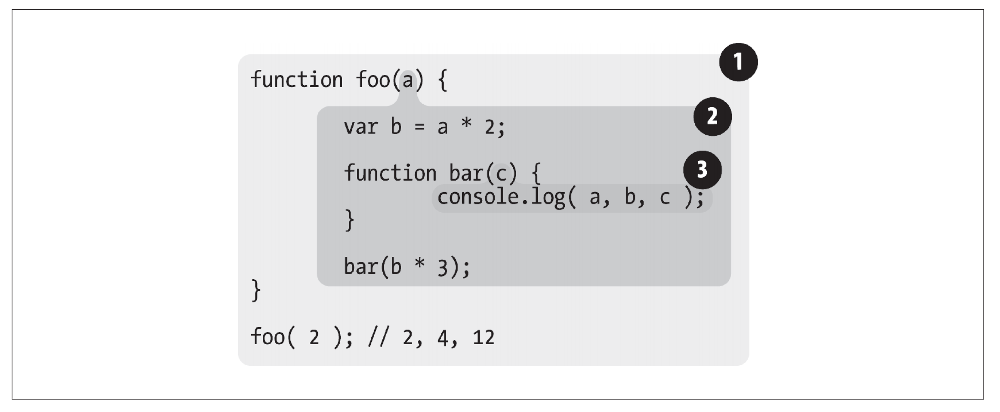

## 2.词法作用域

作用域共有两种主要的工作模型。第一种是最为普遍的，被大多数编程语言所采用的词法作用域，我们会对这种作用域进行深入讨论。另外一种叫作动态作用域，仍有一些编程语言在使用（比如 Bash 脚本、Perl 中的一些模式等）。 

所谓的词法作用域就是**在你写代码时将变量和块作用域写在哪里来决定，也就是词法作用域是静态的作用域，在你书写代码时就确定了**。对于函数作用域和块作用域，词法作用域对他们可以看做是一个包含关系。

## 2.1 词法阶段

第 1 章介绍过，大部分标准语言编译器的第一个工作阶段叫作词法分析（也叫单词化）。回忆一下，词法化的过程会对源代码中的字符进行检查，如果是有状态的解析过程，还会赋予单词语义。 

这个概念是理解词法作用域及其名称来历的基础。 

简单地说，词法作用域就是定义在词法阶段的作用域。换句话说，词法作用域是由你在写代码时将变量和块作用域写在哪里来决定的，因此当词法分析器处理代码时会保持作用域不变（大部分情况下是这样的）。

> 后面会介绍一些欺骗词法作用域的方法，这些方法在词法分析器处理过后依然可以修改作用域，但是这种机制可能有点难以理解。事实上，让词法作用域根据词法关系保持书写时的自然关系不变，是一个非常好的最佳实践。

考虑以下代码，在这个例子中有三个逐级嵌套的作用域:



bar 的气泡被完全包含在 foo 所创建的气泡中，唯一的原因是那里就是我们希望定义函数 bar 的位置。 

### 查找

作用域气泡的结构和互相之间的位置关系给引擎提供了足够的位置信息，引擎用这些信息来查找**标识符**的位置。

作用域查找会在找到第一个匹配的标识符时停止。在多层的嵌套作用域中可以定义同名的标识符，这叫作“遮蔽效应”（内部的标识符“遮蔽”了外部的标识符）。抛开遮蔽效应，作用域查找始终从运行时所处的最内部作用域开始，逐级向外或者说向上进行，直到遇见第一个匹配的标识符为止。 

> 全局变量会自动成为全局对象（比如浏览器中的 window 对象）的属性，因此可以不直接通过全局对象的词法名称，而是间接地通过对全局对象属性的引用来对其进行访问。 
>
> ```js
> var a = 1; console.log(window.a)
> ```
>
> 通过这种技术可以访问那些被同名变量所遮蔽的全局变量。但非全局的变量如果被遮蔽了，无论如何都无法被访问到。 

**无论函数在哪里被调用，也无论它如何被调用，它的词法作用域都只由函数被声明时所处的位置决定。**

```js
function foo() { 
  console.log( a ); // 2
}
function bar() {
	var a = 3; foo(); 
}
var a = 2; 
bar();
```

词法作用域查找只会查找一级标识符，比如 `a`、`b` 和 `c`。如果代码中引用了 `foo.bar.baz`，词法作用域查找只会试图查找 `foo` 标识符，找到这个变量后，对象属性访问规则会分别接管对 `bar` 和 `baz` 属性的访问。

## 2.2 欺骗词法 

JavaScript 中有两种机制来实现这个目的。不过，欺骗词法作用域会导致性能下降。 

### 2.2.1 eval 

`JavaScript` 中的 `eval(..)` 函数可以接受一个字符串为参数，并将其中的内容视为好像在书写时就存在于程序中这个位置的代码。换句话说，可以在你写的代码中用程序生成代码并运行，就好像代码是写在那个位置的一样。根据这个原理来理解 `eval(..)`，它是如何通过代码欺骗和假装成书写时（也就是词法期）代码就在那，来实现修改词法作用域环境的，这个原理就变得清晰易懂了。

在执行 `eval(..)` 之后的代码时，引擎并不“知道”或“在意”前面的代码是以动态形式插入进来，并对词法作用域的环境进行修改的。引擎只会如往常地进行词法作用域查找。 

考虑以下代码：

```js
function foo(str, a) { 
	eval( str ); // 欺骗！ 
	console.log( a, b ); 
}

var b = 2; 

foo( "var b = 3;", 1 ); // 1, 3
```

`eval(..)` 调用中的 "`var b = 3`;" 这段代码会被当作本来就在那里一样来处理。由于那段代码声明了一个新的变量 `b`，因此它对已经存在的 `foo(..)` 的词法作用域进行了修改。事实上，和前面提到的原理一样，这段代码实际上在 `foo(..)` 内部创建了一个变量 `b`，并遮蔽了外部作用域中的同名变量。当 `console.log(..)` 被执行时，会在 `foo(..)` 的内部同时找到 `a` 和 `b`，但是永远也无法找到外部的 `b`。因此会输出“`1, 3`”而不是正常情况下会输出的“`1, 2`”。

> 在这个例子中，为了展示的方便和简洁，我们传递进去的“代码”字符串是固定不变的。而在实际情况中，可以非常容易地根据程序逻辑动态地将字符拼接在一起之后再传递进去。eval(..) 通常被用来执行动态创建的代码，因为像例子中这样动态地执行一段固定字符所组成的代码，并没有比直接将代码写在那里更有好处。 

默认情况下，如果 `eval(..)` 中所执行的代码包含有一个或多个声明（无论是变量还是函数），就会对 `eval(..)` 所处的词法作用域进行修改。技术上，通过一些技巧（已经超出我们的讨论范围）可以间接调用 `eval(..)` 来使其运行在全局作用域中，并对全局作用域进行修改。但无论何种情况，`eval(..)` 都可以在运行期修改书写期的词法作用域。

> 在严格模式的程序中，eval(..) 在运行时有其自己的词法作用域，意味着 中的声明无法修改所在的作用域。
>
> ```js
> function foo(str) { 
>   "use strict"; eval( str ); console.log( a ); // ReferenceError: a is not defined
> }
> foo( "var a = 2" );
> ```

`JavaScript` 中 还 有 其 他 一 些 功 能 效 果 和 `eval(..)` 很 相 似。`setTimeout(..)` 和 `setInterval(..)` 的第一个参数可以是字符串，字符串的内容可以被解释为一段动态生成的函数代码。这些功能已经过时且并不被提倡。不要使用它们！`new Function(..)` 函数的行为也很类似，最后一个参数可以接受代码字符串，并将其转化为动态生成的函数（前面的参数是这个新生成的函数的形参）。这种构建函数的语法比`eval(..)` 略微安全一些，但也要尽量避免使用。 

### 2.2.2 WITH

## 2.3 小结 

词法作用域意味着作用域是由书写代码时函数声明的位置来决定的。编译的词法分析阶段基本能够知道全部标识符在哪里以及是如何声明的，从而能够预测在执行过程中如何对它们进行查找。`JavaScript` 中有两个机制可以“欺骗”词法作用域：`eval(..)` 和 `with`。前者可以对一段包含一个或多个声明的“代码”字符串进行演算，并借此来修改已经存在的词法作用域（在运行时）。后者本质上是通过将一个对象的引用当作作用域来处理，将对象的属性当作作用域中的标识符来处理，从而创建了一个新的词法作用域（同样是在运行时）。这两个机制的副作用是引擎无法在编译时对作用域查找进行优化，因为引擎只能谨慎地认为这样的优化是无效的。使用这其中任何一个机制都将导致代码运行变慢。不要使用它们。