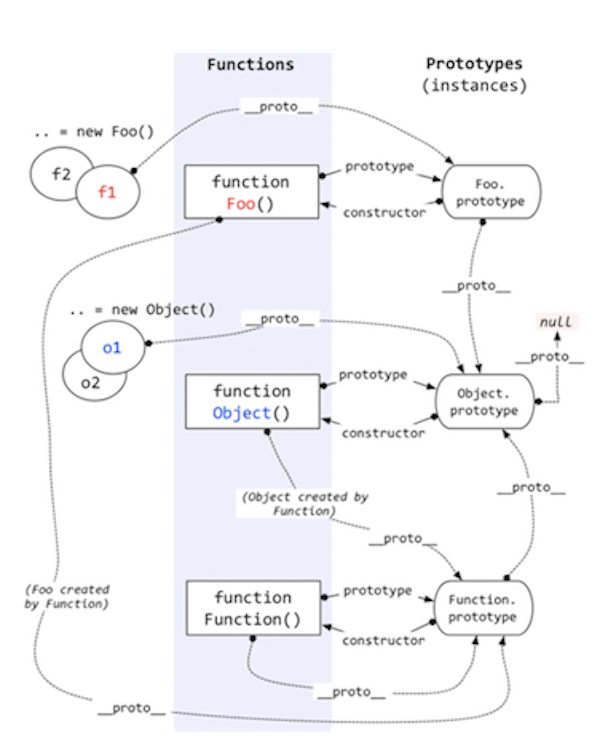

## 5.0 概述

`JavaScript` 是一种基于原型而不是基于类的基于对象`(object-based)`语言。

基于类的面向对象语言，比如 Java 和 C++，是构建在两个不同实体之上的：类和实例。

- 一个*类(class)*定义了某一对象集合所具有的特征性属性（可以将 Java 中的方法和域以及 C++ 中的成员都视作属性）。类是抽象的，而不是其所描述的对象集合中的任何特定的个体。例如 `Employee` 类可以用来表示所有雇员的集合。
- 另一方面，一个*实例(instance)*是一个*类*的实例化。例如， `Victoria` 可以是 `Employee` 类的一个实例，表示一个特定的雇员个体。实例具有和其父类完全一致的属性，不多也不少。

基于原型的语言并不存在这种区别：它只有对象。基于原型的语言具有所谓**原型对象(prototypical object)**的概念。原型对象可以作为一个模板，新对象可以从中获得原始的属性。任何对象都可以指定其自身的属性，既可以是创建时也可以在运行时创建。而且，任何对象都可以作为另一个对象的**原型(prototype)**，从而允许后者共享前者的属性。

## 5.1 `[[Prototype]] (__proto__)`

`JavaScript` 中的对象有一个特殊的 `[[Prototype]] `内置属性，就是对于其他对象的引用。几乎所有的对象在创建时` [[Prototype]] `属性都会被赋予一个非空的值。

> 遵循`ECMAScript`标准，`someObject.[[Prototype]]` 符号是用于指向 `someObject` 的原型。从 `ES6` 开始，`[[Prototype]]` 可以通过 [`Object.getPrototypeOf()`](https://developer.mozilla.org/zh-CN/docs/Web/JavaScript/Reference/Global_Objects/Object/getPrototypeOf) 和 [`Object.setPrototypeOf()`](https://developer.mozilla.org/zh-CN/docs/Web/JavaScript/Reference/Global_Objects/Object/setPrototypeOf) 访问器来访问。这个等同于 `JavaScript` 的非标准但许多浏览器实现的属性 `__proto__`。

#### 5.1.1 `[[Prototype]]` 引用的作用

当你试图引用对象的属性时会触发`[[Get]]` 操作，比如` myObject.a`。对于默认的 `[[Get]] `操作来说，第一步是检查对象本身是否有这个属性，如果有的话就使用它。如果无法在对象本身找到需要的属性，就会继续访问对象的 `[[Prototype]]` 链：

```js
var anotherObject = { a:2 };// 创建一个关联到 anotherObject 的对象
var myObject = Object.create( anotherObject ); 
myObject.a; // 2
```

使用 `for..in` 遍历对象时原理和查找 `[[Prototype]]` 链类似，任何可以通过原型链访问到并且是 `enumerable`，的属性都会被枚举。使用 `in` 操作符来检查属性在对象中是否存在时，同样会查找对象的整条原型链（无论属性是否可枚举）：

```js
(a in myObject) //true
```

如果你只想要本层对象的属性，需要屏蔽上层链条通常使用 `object.hasOwnProperty`来进行过滤：

```ts
for (let k in obj) {
  if (obj.hasOwnProperty(k)) 
    console.log(k, obj[k])
}
```

#### 5.1.2 `Object.prototype`

`Object.prototype`  是 `[[Prototype]]` 的“尽头”，所有普通的` [[Prototype]] `链最终都会指向内置的 Object.prototype。由于所有的内置对象都“源于”这个 Object.prototype 对象，所以它包含 JavaScript 中许多通用的功能 (`.toString()` 和` .valueOf()`)。 

通过字面量的形式构建对象的时候会默认和 `Object.prototype` 做连接：

```ts
let obj = {};
// {
// 		__proto__: Object,
// }
```

#### 5.1.3 属性设置和屏蔽

给一个对象设置属性并不仅仅是添加一个新属性或者修改已有的属性值。 

```js
myObject.foo = "bar";
```

如果 `myObject` 对象中包含名为 `foo` 的普通数据访问属性，这条赋值语句只会修改已有的属性值。 

如果 `foo` 不是直接存在于 `myObject` 中，[[`Prototype`]] 链就会被遍历，类似 [[`Get`]] 操作。如果原型链上找不到 `foo`，`foo` 就会被直接添加到 `myObject` 上。

如果属性名 `foo` 既出现在 `myObject` 中也出现在 `myObject` 的[[`Prototype`]] 链上层，那么就会发生屏蔽。`myObject` 中包含的 `foo` 属性会屏蔽原型链上层的所有 `foo` 属性，因为`myObject.foo` 总是会选择原型链中最底层的 `foo` 属性。不过这里还分为三种情况：

1. 如果在` [[Prototype]] `链上层存在名为 foo 的普通数据访问属性并且没有被标记为只读（writable:false），那就会直接在 myObject 中添加一个名为 foo 的新属性，它是屏蔽属性。 

2. 如果在` [[Prototype]] `链上层存在 foo，但是它被标记为只读（writable:false），那么无法修改已有属性或者在 myObject 上创建屏蔽属性。如果运行在严格模式下，代码会抛出一个错误。否则，这条赋值语句会被忽略。总之，不会发生屏蔽。

   > **注意：**这样做主要是为了模拟类属性的继承。你可以把原型链上层的 foo 看作是父类中的属性，它会被 myObject 继承，这样一来 myObject 中的 foo 属性也是只读，所以无法创建。

3. 如果在 [[`Prototype`]] 链上层存在 `foo` 并且它是一个 `setter`，那就一定会调用这个 `setter`。`foo` 不会被添加到（或者说屏蔽于）`myObject`，也不会重新定义 `foo` 这个 `setter`。 

   ```js
   var foo = {
     _a: 2,
     get a() {
       return this._a;
     },
     set a(val) {
       this._a = val * 2;
     },
   };
   
   var bar = Object.create(foo);
   
   bar.a = 4;
   console.log(bar.a); // 8
   console.log(foo.a); // 4
   ```

   > **注意：**如果你希望在第二种和第三种情况下也屏蔽 foo，那就不能使用 = 操作符来赋值，而是使用` Object.defineProperty(..)`来向 myObject 添加 foo。 

**隐式屏蔽：**

尽管 `myObject.a`++ 看起来应该（通过委托）查找并增加 `anotherObject.a` 属性，但是别忘了 ++ 操作相当于 `myObject.a = myObject.a` + `1`。因此 ++ 操作首先会通过[[`Prototype`]]查找属性 `a` 并从 `anotherObject.a` 获取当前属性值 `2`，然后给这个值加 `1`，接着用 [[`Put`]]将值 `3` 赋给 `myObject` 中新建的屏蔽属性 `a`。

```js
var anotherObject = { a:2 };
var myObject = Object.create( anotherObject ); 

anotherObject.a; // 2 
myObject.a; // 2

anotherObject.hasOwnProperty( "a" ); // true 
myObject.hasOwnProperty( "a" ); // false 

myObject.a++; // 隐式屏蔽！ 

anotherObject.a; // 2 
myObject.a; // 3 
myObject.hasOwnProperty( "a" ); // true

/**
{ 
  a: 3
	__proto__: {
	 	a: 2
		__proto__: Object   
  }
}
*/
```

## 5.2 类

实际上，JavaScript 才是真正应该被称为“面向对象”的语言，因为它是少有的可以不通过类，直接创建对象的语言。

#### 5.2.1 "类"的本质

JavaScript 中有一种奇怪的行为一直在被无耻地滥用，那就是模仿类。这种奇怪的“类似类”的行为利用了函数的一种特殊特性：所有的函数默认都会**拥有一个名为` prototype `的公有并且不可枚举的属性，它会指向另一个对象：**

```js
function Foo() {
  // ... 
}
Foo.prototype; // { }
```

调用 `new Foo()` 时会创建 `a`，其中的一步就是给 `a`  一个内部的` [[Prototype]] `链接，关联到 `Foo.prototype` 指向的那个对象。 

之后这个新对象会绑定到函数调用的 `this`，然后调用`Foo`给 `this(a)` 添加属性，如果函数没有返回其他对象，那么 `new` 表达式中的函数调用会自动返回这个新对象。

```js
function Foo() { 
  // ... 
}
var a = new Foo(); 
Object.getPrototypeOf( a ) === Foo.prototype; // true
```

在面向类的语言中，类可以被复制（或者说实例化）多次，就像用模具制作东西一样。但是在 JavaScript 中，并没有类似的复制机制。你不能创建一个类的多个实例，只能创建多个对象，它们 `[[Prototype]]` 关联的是同一个对象。

**差异继承：**

JS 中，我们并不会将一个对象（“类”）复制到另一个对象（“实例”），只是将它们关联起来。从视觉角度来说，`[[Prototype]]` 机制如下图所示，箭头从右到左，从下到上： 


这个机制通常被称为原型继承，它常常被视为动态语言版本的类继承，不过更好的叫法不如差异继承`(原型链接)`，继承意味着复制操作，JS默认并不会复制对象属性。相反，JavaScript 会在两个对象之间创建一个关联，这样一个对象就可以通过委托访问另一个对象的属性和函数。委托这个术语可以更加准确地描述 JavaScript 中对象的关联机制。

#### 5.2.1 函数的构造调用：

`Foo.prototype` 默认（在代码中第一行声明时）有一个公有并且不可枚举的属性 .`constructor`，这个属性引用的是对象关联的函数（本例中是 `Foo`）。通过“构造函数”调用 `new Foo()` 创建的对象也有一个 .`constructor` 属性，指向“创建这个对象的函数”。 

```js
function Foo() { 
  // ... 
}
Foo.prototype.constructor === Foo; // true 
var a = new Foo(); 
a.constructor === Foo; // true
```

按照 `JavaScript` 世界的惯例，“类”名首字母要大写，但是实际上，大写的构造函数和你程序中的其他函数没有任何区别。函数本身并不是构造函数，然而，当你在普通的函数调用前面加上 `new` 关键字之后，就会把这个函数调用变成一个“构造函数调用”。实际上，`new` 会劫持所有普通函数并用构造对象的形式来调用它。

```js
function NothingSpecial() { 
  console.log( "Don't mind me!" ); 
}
var a = new NothingSpecial(); // "Don't mind me!" 
a; // {}
```

#### 5.2.3 "类"方法

```js
function Foo(name) {
	this.name = name; 
}
Foo.prototype.myName = function() {
	return this.name; 
};

var a = new Foo( "a" );
a.myName(); // "a" 
```

在`javascript`我们通过一系列的特性模仿一个类本该有的功能：

1. `this.name = name `给每个对象都添加了 .name 属性，有点像类实例封装的数据值。 
2. `Foo.prototype.myName = ...  `会给 `Foo.prototype` 对象添加一个属性（函数）。现在，`a.myName()` 可以正常工作，这利用了`[[GET]]`操作时对于原型链的的查找，在 a 中无法找到 myName 时，它会通过委托在 Foo.prototype 上找到。

#### 5.2.4 constructor

 `.constructor `属性常被理解成指向` Foo` 看作是 a 对象由 `Foo`“构造”。然而，`Foo.prototype` 的 `.constructor` 属性只是 Foo 函数在声明时的默认属性。指向Foo本身，**所以constructor的本义应该是指向原型指向其构造函数的属性**，但它是可更改的、不可枚举(不安全)。

如果你创建了一个新对象并替换了函数默认的` .prototype `对象引用，那么新对象并不会自动获得 `.constructor `属性。 

```js
function Foo() { /* .. */ } 
Foo.prototype = { /* .. */ }; // 创建一个新原型对象
var a1 = new Foo(); 
a1.constructor === Foo; // false! 
a1.constructor === Object; // true!
```

所以说被创建的对象并没有 .constructor 属性，所以它会委托` [[Prototype]]` 链上的 Foo.prototype。这无疑触发了`[[GET]]`算法，所以对于` a 对象由 Foo“构造”`只不过是一个巧合。

## 5.3 继承

#### 5.3.1 属性继承：

属性继承我们只需要在新的构造函数中通过一个显示绑定就可以轻松实现：

```js
function Foo(name) {
	this.name = name; 
}

Foo.prototype.myName = function() {
	return this.name; 
};

function Bar(name,label) { 
  Foo.call( this, name );
	this.label = label; 
}
```

#### 5.3.2 原型继承

对于原型继承，我们做的实际上是创建一个新的 Bar 原型，并且关联(赋值)到 Foo 上去：

```js
// 我们创建了一个新的 Bar.prototype 对象并关联到 Foo.prototype 
Bar.prototype = Object.create( Foo.prototype ); 
// 注意！现在没有 Bar.prototype.constructor 了 
// 如果你需要这个属性的话可能需要手动修复一下它 
Bar.prototype.myLabel = function() {
	return this.label; 
};
// bar.prototype = {
// 		myLabel: function() {}
// 		__proto__: Foo.prototype;  
// }
var a = new Bar( "a", "obj a" ); 
a.myName(); 	// "a" 
a.myLabel(); 	// "obj a"
```

注意，下面这两种方式是常见的错误做法，实际上它们都存在一些问题： 

```js
// 和你想要的机制不一样！ 
Bar.prototype = Foo.prototype; 

// 基本上满足你的需求，但是可能会产生一些副作用 :( 
Bar.prototype = new Foo(); 
```

1. `Bar.prototype = Foo.prototype` 并不会创建一个关联到 `Bar.prototype` 的新对象，它只是让 `Bar.prototype` 直接引用 `Foo.prototype` 对象。因此当你执行类似 `Bar.prototype.myLabel =` ... 的赋值语句时会直接修改 `Foo.prototype` 对象本身。

2. `Bar.prototype = new Foo()` 的确会创建一个关联到 `Bar.prototype` 的新对象。但是它使用了 `Foo(..)` 的“构造函数调用”，如果函数 `Foo` 有一些副作用（比如写日志、修改状态、注册到其他对象、给 `this` 添加数据属性...）的话，就会影响到 `Bar()` 的“后代”。

`ES6` 添加了辅助函数 `Object.setPrototypeOf(..)`，可以用标准并且可靠的方法来修改关联：

```js
// ES6 开始可以直接修改现有的 Bar.prototype 
Object.setPrototypeOf( Bar.prototype, Foo.prototype );
```

总之最后达到的效果就是这个样子：

```js
Bar.prototype = {
  __ptoto__: Foo.prototype		// 和 Foo.prototype 引用同一个对象。
}
```

#### 5.3.3 检查对象和原型的关系

假设有对象 a，如何寻找对象 a 委托的对象呢？

**instanceof**

在传统的面向类环境中，检查一个实例（对象）的继承祖先（委托关联）通常被称为内省（或者反射）。

```js
a instanceof Foo; // true
```

`instanceof` 操作符的左操作数是一个普通的对象，右操作数是一个函数。`instanceof` 回答的问题是：在 `a` 的整条 [[`Prototype`]] 链中是否有指向 `Foo.prototype` 的对象？下面是一段伪代码：

```js
function new_instance_of(leftVaule, rightVaule) { 
    let rightProto = rightVaule.prototype; // 取右表达式的 prototype 值
    leftVaule = leftVaule.__proto__; // 取左表达式的__proto__值
    while (true) {
    	if (leftVaule === null) {
            return false;	
        }
        if (leftVaule === rightProto) {
            return true;	
        } 
        leftVaule = leftVaule.__proto__ 
    }
}
```

**isPrototypeOf**

可惜，这个方法只能处理对象（a）和函数（带 .prototype 引用的 Foo）之间的关系。如果你想判断两个对象（比如 a 和 b）之间是否通过 `[[Prototype]]` 链关联，只用 instanceof无法实现。 下面是第二种判断` [[Prototype]] `反射的方法，它更加简洁： 

```js
Foo.prototype.isPrototypeOf( a ); // true
```

isPrototypeOf(..) 回答的问题是：在 a 的整条 [[Prototype]] 链中是否出现过 Foo.prototype ？ 

同样的问题，同样的答案，但是在第二种方法中并不需要间接引用函数（Foo），它的 .prototype 属性会被自动访问。我们只需要两个对象就可以判断它们之间的关系。举例来说： 

```js
// 非常简单：b 是否出现在 c 的 [[Prototype]] 链中？ 
b.isPrototypeOf( c );
```

**获取 `[[prototype]]`**

我们也可以直接获取一个对象的 [[Prototype]] 链。在 ES5 中，标准的方法是： 

```js
Object.getPrototypeOf( a ) === Foo.prototype; // true
```

浏览器也支持一种非标准的方法来访问内部 [[Prototype]] 属性： 

```js
a.__proto__ === Foo.prototype; // true
```

这个奇怪的 .\_\_proto\_\_（在 ES6 之前并不是标准！）属性“神奇地”引用了内部的[[Prototype]] 对象， .\_\_proto\_\_看起来很像一个属性，但是实际上它更像一个 getter/setter，它的实现大致上是这样的： 

```js
Object.defineProperty( Object.prototype, "__proto__", { 
  get: function() {
		return Object.getPrototypeOf( this ); 
  },
  set: function(o) { // ES6 中的 setPrototypeOf(..) 
    Object.setPrototypeOf( this, o );
		return o; 
  } 
});
```

## 5.4 对象关联

[[Prototype]] 机制的意义是什么呢？为什么 JavaScript 开发者费这么大的力气（模拟类）在代码中创建这些关联呢？

```js
var foo = { 
  something: function() { 
    console.log( "Tell me something good..." ); 
  } 
};
var bar = Object.create( foo ); 
bar.something(); // Tell me something good...
```

`Object.create(..)` 会创建一个新对象（`bar`）并把它关联到我们指定的对象（`foo`），这样我们就可以充分发挥 [[`Prototype`]] 机制的威力（委托）并且避免不必要的麻烦（比如使用 `new` 的构造函数调用会生成 .`prototype` 和 .`constructor` 引用）。 

> `Object.create(null)` 会 创 建 一 个 拥 有 空（或 者 说 `null`）[[`Prototype`]] 链接的对象，这个对象无法进行委托。由于这个对象没有原型链，所以`instanceof` 操作符（之前解释过）无法进行判断，因此总是会返回 `false`。这些特殊的空 [[`Prototype`]] 对象通常被称作“字典”，它们完全不会受到原型链的干扰，因此非常适合用来存储数据。 

我们并不需要类来创建两个对象之间的关系，只需要通过委托来关联对象就足够了。而Object.create(..) 不包含任何“类的诡计”，所以它可以完美地创建我们想要的关联关系。

## 5.5 总结




当我们创建一个对象的时候，如果进行特定的原型链接，这个对象默认会产生一个`[[prototype]] (在浏览器里是__proto__)`属性指向`Object.prototype`。

如果是通过函数`Foo`的构造调用`(new)`创建，因为每个函数都有一个`prototype`属性，所以这个对象的`__proto__`会和构造函数的`Foo.prototype`进行链接，而这个这个构造函数的原型`(Foo.prototype)`生成时也会和`Object.prototype`进行连接。而Foo这个构造函数本身也有`__proto__`属性指向内置对象`Function(function)`的原型`Function.prototype`。

最后说一说两个内置对象`Object`和`Function`， `Object.prototype`本身是内置对象`Object(function)`的原型，所有对象的原型链的终端一般都是`Object.prototype`，它的`constructor(Object)`的`__proto__`指向`Function.prototype`，这是因为所有的方法对象(非继承)的`__proto__`都是`Function.prototype`，甚至包括`Function`它自己。

#### 总结规律：

**obj：**

- `__proto__`：`Object.prototype` |` function.prototype`

- `prototype`：`undifined`

**function：**

- `__proto__`：`Function.prototype` | `another function(es6 class extends)`

  > 这里第二个比较特殊，这是因为es6中的class继承的时候会执行这样的操作`Object.setPrototypeOf(classA, classB)`。

- `prototype`：`function.prototype`

**function.prototype：**

- `__proto__`：`Object.prototype` |  `another function.prototype(inherbit)` 
- `prototype`：`undifined`

