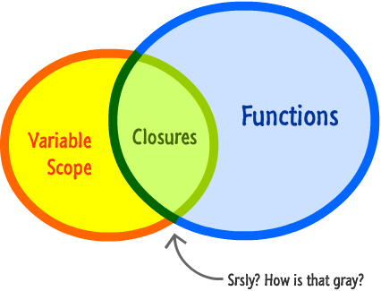

## 闭包 Closure

闭包在 `javascript` 可以说是一个老生常谈的概念了，下面是我觉得对闭包最贴切的描述：**闭包是一个函数与它周围状态(词法环境)的引用捆绑在一起的封闭组合。**



换句话说，闭包使您可以从内部函数访问外部函数/全局的作用域。在 `JavaScript` 中，**每次创建函数时**都会在创建函数时创建闭包(无论这个函数是在另一个函数内部还是在全局)。

要使用闭包，我们需要在一个函数中定义另一个函数并**暴露这个内部函数**。要暴露一个函数，我们可以**返回它或将它传递给另一个函数**。

在外部函数返回之后，内部函数也可以访问外部函数作用域中的变量。

**外部作用域？**

这个外部作用域都包含什么呢？答案是参数、函数内声明的变量以及 `this`：

```ts
function OuterFunc(this: Caller, var1: {foo: string}) {
  let innerVar = 1;
  return () => {
    console.log(this, innerVar);
    var1.foo = 'zcc'
  }
}
let outerObj = {foo: 'bar'}
caller.OuterFunc(outerObj)();	// caller, 1
console.log(outerObj)					// {foo: 'zcc'}
```

### 闭包的实现

#### 返回闭包

先来举一个通过返回值构造闭包的例子：

```js
function OuterFunction() {

    var outerVariable = 100;

    function InnerFunction() {
        alert(outerVariable);
    }

    return InnerFunction;
}
var innerFunc = OuterFunction();

innerFunc(); // 100
```

在上面的例子中，`return InnerFunction;`当你调用 OuterFunction() 时，从 OuterFunction 返回 InnerFunction。变量`innerFunc `仅引用 InnerFunction()，而不引用 OuterFunction()。所以现在，当你调用innerFunc() 时，它仍然可以访问`outerVariable`在OuterFunction() 中声明的那个。这称为闭包。

#### 传递闭包

再来举一个通过传递函数的方式构建闭包，比如我们需要实现一个 `useLazyEffect` 函数，功能是构建一个第一次渲染不词法的 `useEffect`，如何实现呢？很简单我们只需要使用 `useState` 构建一个标志位，然后通过一个匿名函数形成闭包，并且以参数传递的方式将这个函数暴露出去：

```ts
function useLazyEffect(fn: (...args: never[]) => any, limit: any[]) {
    let [hasRendered, setHasRendered] = useState(false);

    useEffect(() => {
        if (!hasRendered) {
            setHasRendered(true);
            return;
        }
        fn();
    }, [limit]);
}

```

闭包在多个级别的内部函数中都是有效的。

```ts
function Counter() {
    
    var counter = 0;

    setTimeout( function () {
        var innerCounter = 0;
        counter += 1;
        alert("counter = " + counter);

        setTimeout( function () {
            counter += 1;
            innerCounter += 1;
            alert("counter = " + counter + ", innerCounter = " + innerCounter)
        }, 500);

    }, 1000);
};

Counter();
```

### 闭包特性

#### 值的引用

闭包的一个重要特性是外部变量可以在多次调用之间保持它们的状态。请记住，内部函数不会保留外部变量的单独副本，而是引用外部变量，这意味着如果您使用内部函数更改外部变量的值，它将更改它。

```ts
function Counter() {
    var counter = 0;

    function IncreaseCounter() {
        return counter += 1;
    };

    return IncreaseCounter;
}

var counter = Counter();
alert(counter()); // 1
alert(counter()); // 2
```

#### this

`this` 被我们看作是函数内一个隐式的存在，那么通过闭包内部函数能不能拿到外部函数的 `this` 呢？答案是不能。不过原因不是因为没有 `this` 的引用而是因为内部函数的 `this` 覆盖了外部函数的 `this`。

具体分析下面这段代码：

```ts
var name = "The Window";

var object = {
  name : "My Object",

  getNameFunc : function(){
    return function() {
      return this.name;
    };
  }
};

alert(object.getNameFunc()()); // The Windows
```

`getNameFunc` 的内部函数引用了 `this`，但是由于每个函数都有 `this` 所以可以理解成内部函数的 `this`(undefined)覆盖了外部的 `this`。而调用 `object.getNameFunc()()` 就想于是：

```js
let fn = object.getNameFunc();
fn(); // window.fn();
------
window.(object.getNameFunc())()
```

**胖箭头**

使用胖箭头可以解决这个问题，胖箭头式的匿名函数声明作用域内没有 `this` 不会产生覆盖，而是会通过闭包缓存外部的 `this`：

```js
var name = "The Window";

var object = {
  name : "My Object",

  getNameFunc : function(){
    return () => {
      return this.name;
    };
  }
};


alert(object.getNameFunc()());
```

**that**

用 `that` 缓存一个 `this` 也行：

```js
var name = "The Window";

var object = {
  name : "My Object",

  getNameFunc : function(){
    var that = this;
    return function(){
      return that.name;
    };
  }
};

alert(object.getNameFunc()());
```

## 闭包的原理

### 词法环境

词法环境定义了变量或函数有权访问的其他数据，决定了它们各自的行为。每个词法环境都有一个与之关联的变量对象。环境中定义的所有变量和函数都保存在这个对象中（虽然代码中无法访问，但在处理数据时解析器会使用到）。

具体说来，怎么描述每个词法环境呢？

+ 环境记录：用来记录环境里面定义的形参、函数声明、变量等；
+ 对外部词法环境的引用(`outer`)；

对应于全局词法环境和函数词法环境：

+ 全局词法环境：最外围的一个词法环境。根据`ECMAScript`实现所在的宿主环境不同，表示词法环境的对象也不一样。在`web`浏览器中，全局词法环境被认为是`window`对象，因此所有全局变量和函数都是作为`window`对象的属性和方法创建的。
+ 函数词法环境：每个函数都有自己的词法环境。当**词法**流进入一个函数时，函数的环境就会被推入一个环境栈中，而在函数词法之后，栈将其环境弹出，把控制权返回给之前的词法环境。ECMAScript程序中的词法流正由这个方便的机制控制着。

**某个词法环境中的所有代码执行完毕后，该环境被销毁，保存在其中的所有变量和函数定义也随之销毁，**

### 变量对象和作用域链

#### 变量对象

环境记录用变量对象来描述。在函数执行环境中用“活动对象”来代替，不过不需要理解“变量对象”和“活动对象”本质上有什么区别，其实作用都差不多。

变量对象/活动对象包含着当前执行环境的环境记录，例如变量定义、函数声明、形参等，函数的“变量对象”会包含一个特殊的 `arguments` 对象。

全局环境的变量对象始终存在，函数环境的变量对象只有函数执行的过程中存在。

> 一般，闭包下因为保存对其的引用会存在至闭包被解除引用时才会随着闭包环境的销毁而销毁

#### 作用域链

除了环境记录外，还需要保存对外部词法环境的引用。这里使用一个指向变量对象的指针列表——作用域链来记录。

作用域链本质上是一个列表对象，线性、有次序的保存着变量对象的引用。

作用域链的作用是保证对执行环境有权访问的所有变量和函数的有序访问。

作用域链的前端，始终都是当前执行的代码所在环境的变量对象。如果这个环境是函数，则将其“活动对象”作为变量对象（活动对象最开始包含一个对象，即`arguments`）。作用域链的下一个变量对象来自包含（外部）环境，层层延续到全局执行环境，全局执行环境的变量对象始终都是作用域链中的最后一个对象。

标识符解析是沿着作用域链一级一级地搜索标识符的过程，始终从作用域链的前端开始，然后逐级往后回溯，直到找到为止，如果找不到，通常会报错。

另外，在`js`中， 内部环境可以通过作用域链访问所有的外部环境，但外部环境不能访问内部环境中的任何变量和函数。因此，作用域链的线性和有序也体现在此，每个环境都可以向上搜索作用域链以查找变量和函数名，但不能往下。

### 词法环境、变量对象和作用域链的关系

我们理解词法环境和变量对象、作用域链之间的大致关系，但是内部的实现原理是怎样的呢？

首先，变量对象和作用域链我们能理解：作用域链是一个有次序保存相应词法环境的变量对象的引用的列表。

而变量对象和词法环境也是一对一的，一个词法环境对应着一个变量对象（活动对象）。

那作用域链和执行环境呢？

> 理解这个很重要，因为我们知道执行环境是通过栈来管理的，在某一段代码执行完成后，顶部的环境就被出栈了，那既然外部环境执行完后都出栈了，但为什么闭包里又会提到说引用了该环境的作用域呢？

其实，在调用函数时，会为函数创建一个执行环境压入栈顶，同时会创建一个预先包含全局变量对象的作用域链，这个作用域链被保存在内部的 `[[Scope]]` 属性 中。再执行时，会通过 复制函数的`[[Scope]]`属性中的对象构建起执行环境的作用域链，此后，又有一个活动对象被创建并被推入这个执行环境作用域链的顶端 。无论什么时候在函数中访问一个变量时，都会从作用域链中搜索具有相应名字的变量。

我们来看一段代码来说明这三者之间的关系：

```js
function compare(value1, value2){
    if(value1 < value2){
        return -1;
    }else if(value1 > value2){
        return 1;
    }else{
        return 0;
    }
}
var res = compare(5, 10);
```

以上代码先定义了`fn`函数，然后又在全局作用域链中调用了它。当调用`compare`函数时，会创建一个包含`arguments`、`value1`、`value2`的活动对象。

如下图所示，执行环境、作用域链、变量对象（活动对象）的关系：


### 闭包

一般来讲，当函数执行完毕后，局部活动对象就会被销毁，内存中仅保存全局作用域（全局执行环境的变量对象）。**但是闭包的情况有所不同：**

**在另一个函数内部定义的函数会将包含函数（即外部函数）的活动对象添加到它的作用域链中。**

```js
function createComparisonFunction(propertyName) {
    return function(object1, object2){
        var value1 = object1[propertyName];
        var value2 = object2[propertyName];
        if (value1 < value2){
            return -1;
        } else if (value1 > value2){
            return 1;
        } else {
            return 0;
        }
    };
}
// 创建函数
var compareNames = createComparisonFuncion('name');
// 调用函数
var result = compareNames({name: 'zs'},{name: 'ls'});
// 解除对匿名函数的引用（以便释放内存）
compareNames = null;
```

在 `createComparsionFunction` 函数内部定义的匿名函数的作用域链中，实际上将会包含外部函数 `createComparsionFunction` 的活动对象。在匿名函数从 `createComparsionFunction` 中被返回后，它的作用域链被初始化为包含 `createComparsionFunction` 函数的活动对象和全局变量对象。

这样，匿名函数就可以访问在 `createComparsionFunction` 中定义的所有变量。更为重要的是，`createComparsionFunction` 函数在执行完毕后，其活动对象也不会被销毁，因为匿名函数的作用域链仍然在引用这个活动对象。换句话说，当 `createComparsionFunction` 函数返回后，其执行环境的作用域链会被销毁，但它的活动对象仍然会留在内存中；直至匿名函数被销毁后， `createComparsionFunction` 函数的活动对象才会被销毁。

创建的比较函数被保存在变量`compareNames`中。而通过将`compareNames`设置为等于`null`解除该函数的引用，就等于通知垃圾回收例程将其清除。随着匿名函数的作用域链被销毁（当初引用的包含外部函数的活动对象的引用被解除了），其他作用域（除了全局作用域）也都可以安全的销毁了。

下图展示了调用 `compareNames` 函数的过程中产生的作用域链之间的关系：


