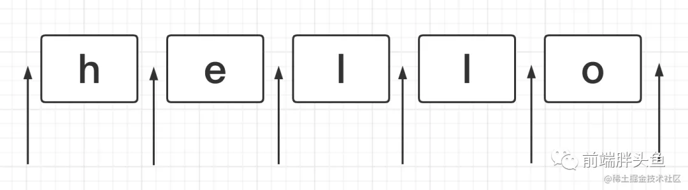
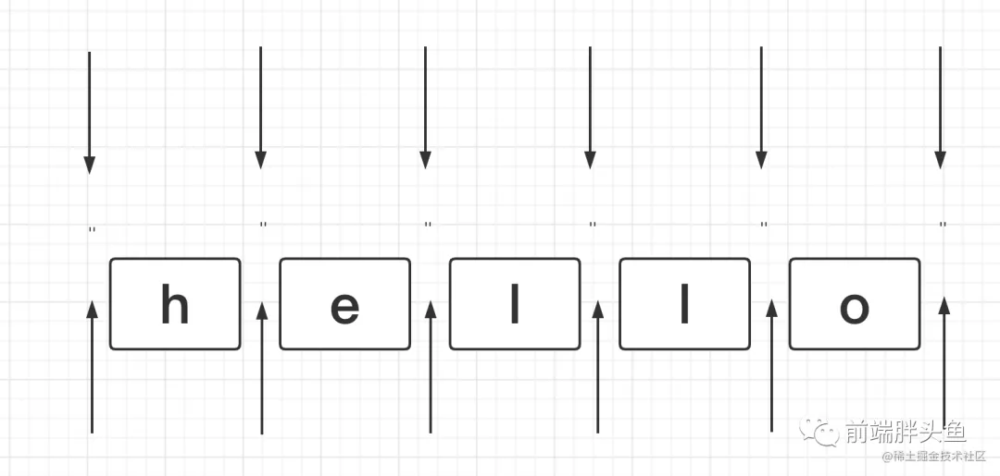
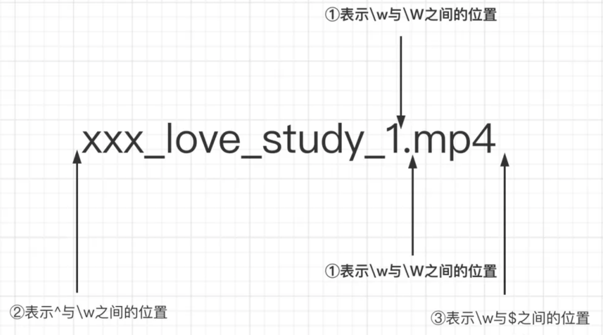
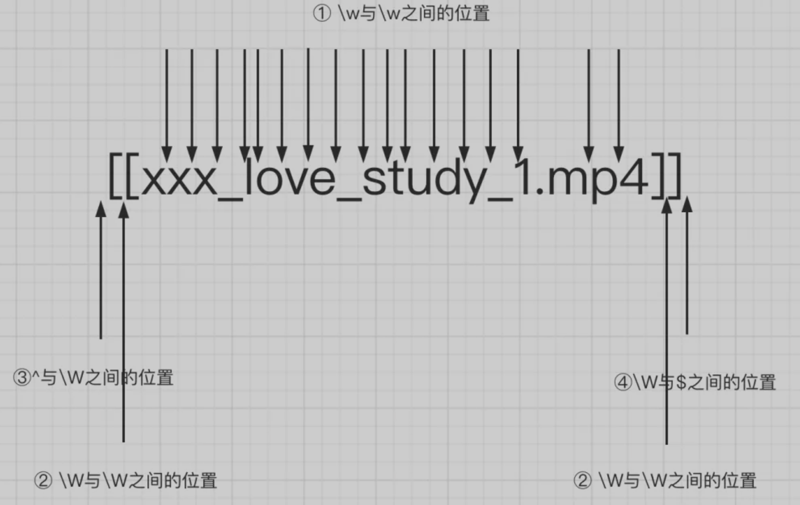
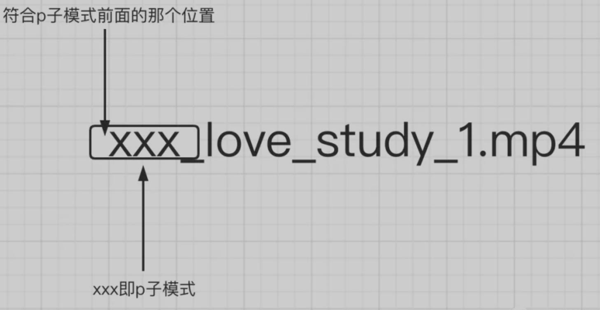
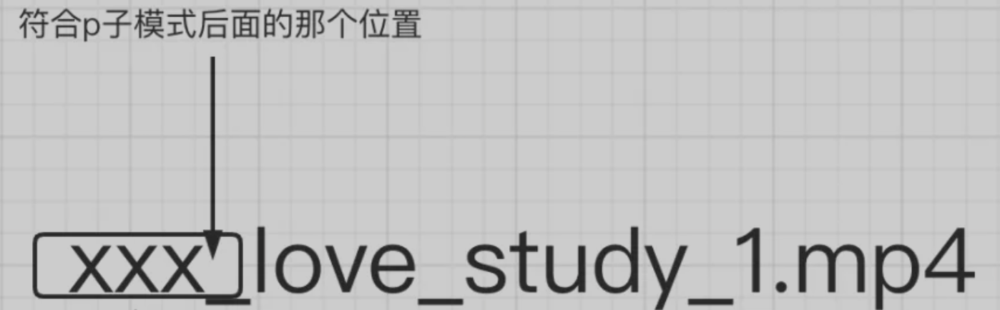

# RegExp

正则表达式是`匹配模式`，要么`匹配字符`，要么`匹配位置`，要么匹配特定位置上的字符。

## 创建正则

你可以使用以下两种方法构建一个正则表达式：

使用一个正则表达式字面量，其由包含在斜杠之间的模式组成，如下所示：

```js
var re = /ab+c/;
```

脚本加载后，正则表达式字面量就会被编译。当正则表达式保持不变时，使用此方法可获得更好的性能。

或者调用`RegExp`对象的构造函数，如下所示：

```js
var re = new RegExp("ab+c");
```

### [`String.prototype.replace()`]()

**`replace()`** 方法返回一个由替换值（`replacement`）替换部分或所有的模式（`pattern`）匹配项后的新字符串。

#### 语法

```js
str.replace(pattern, replacement)
str.replace(regexp|substr, newSubStr|function)
```

**参数：**

- `regexp `(pattern):

  一个 `RegExp` 对象或者其字面量。该正则所匹配的内容会被第二个参数的返回值替换掉。

- `substr `(pattern):

  一个将被 `newSubStr` 替换的 [`字符串`](https://developer.mozilla.org/zh-CN/docs/Web/JavaScript/Reference/Global_Objects/String)。其被视为一整个字符串，而不是一个正则表达式。仅第一个匹配项会被替换。

- `newSubStr` (replacement):

  用于替换掉第一个参数在原字符串中的匹配部分的[`字符串`](https://developer.mozilla.org/zh-CN/docs/Web/JavaScript/Reference/Global_Objects/String)。该字符串中可以内插一些特殊的变量名。

- `function` (replacement):

  一个用来创建新子字符串的函数，该函数的返回值将替换掉第一个参数匹配到的结果。

**返回值：**

一个部分或全部匹配由替代模式所取代的新的字符串。

#### 使用字符串作为 `replacement` 参数

替换字符串可以插入下面的特殊变量名：

| 变量名    | 代表的值                                                     |
| --------- | ------------------------------------------------------------ |
| `$$`      | 插入一个 "$"。                                               |
| `$&`      | 插入匹配的子串。                                             |
| [$\`]()   | 插入当前匹配的子串左边的内容。                               |
| `$'`      | 插入当前匹配的子串右边的内容。                               |
| `$n`      | 假如第一个参数 `pattern` 是 [`RegExp`](https://developer.mozilla.org/zh-CN/docs/Web/JavaScript/Reference/Global_Objects/RegExp)对象，并且 `n` 是个小于 `100` 的非负整数，那么插入第 `n` 个括号匹配的字符串。<br>提示：索引是从 `1` 开始。如果不存在第 `n` 个分组，那么将会把匹配到到内容替换为字面量。<br>比如不存在第 `3` 个分组，就会用 `“$3”` 替换匹配到的内容。所以我们通常用 `$0` 表示匹配的内容。 |
| `$<Name>` | 这里*`Name`* 是一个分组名称。如果在正则表达式中并不存在分组（或者没有匹配），这个变量将被处理为空字符串。只有在**支持命名分组捕获的浏览器中才能使用。** |

下面的例子演示了如何交换一个字符串中两个单词的位置，这个脚本使用$1 和 $2 代替替换文本。

```ts
var re = /(\w+)\s(\w+)/;
var str = "John Smith";
var newstr = str.replace(re, "$2, $1");
// Smith, John
console.log(newstr);
```

#### 指定一个函数作为 `replacement` 参数

你可以指定一个函数作为第二个参数。在这种情况下，当匹配执行后，该函数就会执行。 函数的返回值作为替换字符串。另外要注意的是，如果第一个参数是正则表达式，并且其为全局匹配模式，那么这个方法将被多次调用，每次匹配都会被调用。

下面是该函数的参数：

| 变量名            | 代表的值                                                     |
| ----------------- | ------------------------------------------------------------ |
| `match`           | 匹配的子串。（对应于上述的$&。）                             |
| `p1,p2, ...`      | 假如 `replace()` 方法的第一个参数是一个[`RegExp`](https://developer.mozilla.org/zh-CN/docs/Web/JavaScript/Reference/Global_Objects/RegExp) 对象，则代表第 `n` 个括号匹配的字符串。 |
| `offset`          | 匹配到的子字符串在原字符串中的偏移量。（比如，如果原字符串是 `'abcd'`，匹配到的子字符串是 `'bc'`，那么这个参数将会是 1） |
| `string`          | 被匹配的原字符串。                                           |
| NamedCaptureGroup | 命名捕获组匹配的对象                                         |

下面的例子将会使 `newString` 变成 `'abc - 12345 - #$*%'`：

```ts
function replacer(match, p1, p2, p3, offset, string) {
  // p1 is nondigits, p2 digits, and p3 non-alphanumerics
  return [p1, p2, p3].join(' - ');
}
var newString = 'abc12345#$*%'.replace(/([^\d]*)(\d*)([^\w]*)/, replacer);
console.log(newString);  // abc - 12345 - #$*%
```

### [String.prototype.search()]()

**`search()`** 方法执行正则表达式和 [`String`](https://developer.mozilla.org/zh-CN/docs/Web/JavaScript/Reference/Global_Objects/String) 对象之间的一个搜索匹配。

#### 语法

如果匹配成功，则 `search()` 返回正则表达式在字符串中首次匹配项的索引;否则，返回 `-1`。

```js
str.search(regexp)
```

### [RegExp.prototype.test()]()

`test()` 方法执行一个检索，用来查看正则表达式与指定的字符串是否匹配。返回 `true` 或 `false`。

#### 语法

```js
regexObj.test(str)
```

### [String.prototype.match()]()

 **`match()`** 方法检索返回一个字符串匹配正则表达式的结果。

#### 语法

```js
str.match(regexp)
```

对于作为参数的正则表达式：

- 如果使用g标志，则将返回与完整正则表达式匹配的所有结果，但不会返回捕获组。
- 如果未使用g标志，则仅返回第一个完整匹配及其相关的捕获组（`Array`）。 在这种情况下，返回的项目将具有如下所述的其他属性。

如上所述，匹配的结果包含如下所述的附加特性。

- `groups`: 一个捕获组数组 或 [`undefined`](https://developer.mozilla.org/zh-CN/docs/Web/JavaScript/Reference/Global_Objects/undefined)（如果没有定义命名捕获组）。
- `index`: 匹配的结果的开始位置
- `input`: 搜索的字符串.

#### Example

举个提取 `domId` 的例子，从 `dom` 元素字符串里提取 `id`：

```html
<div id="container" class="main"></div>
```

匹配结果如下，首先返回的是一个数组结构，包括第一个完整匹配以及相关的匹配组(括号生成)。同时这个数组有几个附加的特殊属性：

```ts
let regexp = /id="(.*?)"/
'<div id="container" class="main"></div>'.match(regexp)

['id="container"', 'container', index: 5, input: '<div id="container" class="main"></div>', groups: undefined]
{
  0: "id=\"container\"",
  1: "container",
  groups: undefined,
  index: 5,
  input: "<div id=\"container\" class=\"main\"></div>",
  length: 2,
}
```

## 简单模式

简单模式是由你想直接找到的字符构成。比如，`/abc/` 这个模式就能且仅能匹配 `"abc"` 字符按照顺序同时出现的情况。

例如在 "Hi, do you know your abc's?" 但是在 "Grab crab" 中会匹配失败，因为它虽然包含子字符串 "ab c"，但并不是准确的 "abc"。

当你需要匹配一个不确定的字符串时，比如寻找一个或多个 "b"，或者寻找空格，可以在模式中使用特殊字符。

比如，你可以使用 `/ab*c/` 去匹配一个单独的 "a" 后面跟了零个或者多个 "b"，同时后面跟着 "c" 的字符串：`*`的意思是前一项出现零次或者多次。

下面是几乎所有的特殊字符

+ [断言（Assertions）](https://developer.mozilla.org/zh-CN/docs/Web/JavaScript/Guide/Regular_Expressions/Assertions): 表示一个匹配在某些条件下发生。断言包含先行断言、后行断言和条件表达式。
+ [字符类（Character Classes）](https://developer.mozilla.org/zh-CN/docs/Web/JavaScript/Guide/Regular_Expressions/Character_Classes): 区分不同类型的字符，例如区分字母和数字。
+ [组和范围（Groups and Ranges）](https://developer.mozilla.org/zh-CN/docs/Web/JavaScript/Guide/Regular_Expressions/Groups_and_Ranges): 表示表达式字符的分组和范围。
+ [量词（Quantifiers）](https://developer.mozilla.org/zh-CN/docs/Web/JavaScript/Guide/Regular_Expressions/Quantifiers): 表示匹配的字符或表达式的数量。
+ [Unicode 属性转义（Unicode Property Escapes）](https://developer.mozilla.org/zh-CN/docs/Web/JavaScript/Guide/Regular_Expressions/Unicode_Property_Escapes): 基于 unicode 字符属性区分字符。例如大写和小写字母、数学符号和标点。

## 字符类

字符类可以区分各种字符，例如区分字母和数字：

| Characters | Meaning                                                      |
| :--------- | :----------------------------------------------------------- |
| `.`        | 有下列含义之一:<br> + 匹配除行终止符之外的任何单个字符. <br> + 在字符集内，点失去了它的特殊意义，并与文字点匹配。 |
| `\d`       | 匹配任何数字(阿拉伯数字)。 相当于 `[0-9]`.                   |
| `\D`       | 匹配任何非数字(阿拉伯数字)的字符。相当于`[^0-9]`.            |
| `\w`       | 匹配基本拉丁字母中的任何字母数字字符，包括下划线。相当于 `[A-Za-z0-9_]`. |
| `\W`       | 匹配任何不是来自基本拉丁字母的单词字符。相当于 `[^A-Za-z0-9_]`. |
| `\s`       | 匹配单个空白字符，包括空格、制表符、换行符、换行符和其他Unicode空格。 |
| `\S`       | 匹配空格以外的单个字符。                                     |
| `\t`       | 匹配一个 `tab`。                                             |
| `\r`       | 匹配一个回车符。                                             |
| `\n`       | 匹配一个换行。                                               |

## 字符组

虽然我们称下面的表达式为字符组，但是其实只是代表**一个字符**的可能性，字符组和字符类的区别就是字符类是预先定义的，而字符组则是自定义的：

| 字符集         | 含义                                                         |
| :------------- | :----------------------------------------------------------- |
| `x|y`          | 匹配 `"x"` 或 `"y"` 任意一个字符。<br>例如， `/green|red/` 在 `"green apple"` 里匹配 `"green"`，且在 `"red apple"` 里匹配 `"red" `。 |
| `[xyz][a-c]`   | 字符集。 匹配任何一个包含的字符。<br>您可以使用连字符来指定字符范围，但如果连字符显示为方括号中的第一个或最后一个字符，则它将被视为作为**普通字符包含在字符集中的文字连字符**。<br> + 例如, `[abcd]` 是与`[a-d]`.一样的，它们会 在"brisket" 中匹配 "b",在 "chop" 中匹配 "c" .<br> + 例如, `[abcd-]` 和`[-abcd]` 将会在 "brisket" 匹配 "b" , 在 "chop" 匹配 "c" , 并且匹配 "non-profit" 中的 "-" (连字符). |
| `[^xyz][^a-c]` | 一个否定的或被补充的字符集。也就是说，它匹配任何没有包含在括号中的字符。<br>可以通过使用连字符来指定字符范围，但是如果连字符作为方括号中的第一个或最后一个字符出现，那么它将被视为作为普通字符包含在字符集中。 |
| `(x)`          | **捕获组:** 匹配 `x` 并记住匹配项。<br>例如，`/(foo)/` 匹配并记住 `“foo bar”` 中的 `“foo”` 正则表达式可以有多个捕获组。<br>结果，匹配通常在数组中捕获的组，该数组的成员与捕获组中左括号的顺序相同。这通常只是捕获组本身的顺序。当捕获组被嵌套时，这一点非常重要。 |

### [(x)]()

括号的作用是提供了分组(括号内的正则是一个整体，即提供子表达式)，每一个 `()` 都会创建一个捕获组来供 `replace` 和 `match` 这类 `api` 消费。

#### 分组

如何让量词作用于一个整体？

```ts
let reg = /(ab)+/g
let string = 'ababa abbb ababab'

console.log(string.match(reg)) // ["abab", "ab", "ababab"]f
```

#### 分支结构

分支结构有点像编程里面或的概念`||`：

```ts
/*
匹配 
I love JavaScript
I love Regular Expression
*/

let reg = /I love (JavaScript|Regular Expression)/

console.log(reg.test('I love JavaScript')) // true
console.log(reg.test('I love Regular Expression')) // true
```

#### 提取数据

`(x)` 用于创建分组，匹配其中 `x` 的内容，并且记住匹配项。因为其记住了匹配项

------

| 字符集       | 含义                                                         |
| :----------- | :----------------------------------------------------------- |
| `\n`         | 其中 `n` 是一个正整数。<br>对正则表达式中与 `n` 括号匹配的最后一个子字符串的反向引用(计算左括号)。 |
| `(?<Name>x)` | **具名捕获组:** 匹配 `"x"` 并将其存储在返回的匹配项的 `groups` 属性中，该属性位于`<Name>`指定的名称下。<br>尖括号(`<` 和 `>`) 用于组名。<br>例如，使用正则 `/-(?<customName>\w)/` 匹配 “web-doc” 中的 “d”<br>`'web-doc'.match(/-(?<customName>\w)/).groups  //{customName: "d"} ` |
| `(?:x)`      | **非捕获组:** 匹配 `“x”`，但不记得匹配。<br>不能从结果数组的元素中收回匹配的子字符串(`[1], ..., [n]`) or from the predefined `RegExp` object's properties (`$1, ..., $9`). |

### [\n]() 反向引用

除了通过 `js` 引用捕获组的内容，在同一个正则内也可以通过正则来引用捕获组内容。

`\n`(0<n)，序列从 `1` 开始，对应模式内的第 `n` 个匹配组。这个反向引用符号有两个规则：

+ 引用不存在的分组会怎样？

  + 即匹配的就是`\1` `\2`本身

+ 分组后面有量词会怎样？

  + 分组后面如果有量词，分组最终(注意是分组，不是说整体)捕获的数据是最后一次的匹配

    ```ts
    '12345'.match(/(\d)+/) // ["12345", "5", index: 0, input: "12345", groups: undefined]
    
    /(\d)+ \1/.test('12345 1') // false
    /(\d)+ \1/.test('12345 5') // true
    ```

### [(?:p)]() 非捕获性括号

上面使用的括号都会匹配他们匹配到的数据，以便后续引用，所以也可以称为捕获型分组和捕获型分支。

如果想要括号最原始的功能，但不会引用它，也就是既不会出现在API引用里，也不会出现在正则引用里，可以使用

非捕获性括号（?:p）

```js
// 非捕获型引用
let reg = /(?:ab)+/g
console.log('ababa abbb ababab'.match(reg)) // ["abab", "ab", "ababab"]
// 注意这里，因为是非捕获型分组，所以使用match方法时，不会出现在数组的1位置了
let reg = /(?:ab)+/
console.log('ababa abbb ababab'.match(reg)) // ["abab", index: 0, input: "ababa abbb ababab", groups: undefined]
let reg = /(ab)+/
console.log('ababa abbb ababab'.match(reg)) // ["abab", "ab", index: 0, input: "ababa abbb ababab", groups: undefined]
```

## 量词

| Characters                                              | Meaning                                                      |
| :------------------------------------------------------ | :----------------------------------------------------------- |
| `x*`                                                    | 将前面的项 `x` 匹配 `0` 次或更多次。<br>例如，`/bo*/` 匹配 “A ghost booooed” 中的 “boooo” 和 “A bird warbled” 中的 “b”。 |
| `x+`                                                    | 将前一项 `“x”` 匹配 `1` 次或更多次。等价于 `{1,}`。<br>例如，`/a+/` 匹配 `“candy”` 中的 `“a”` 和 `“caaaaaaandy”` 中的 `“a”`。 |
| `x?`                                                    | 将前面的项 `“x”` 匹配 `0` 或  `1` 次。<br>例如, `/e?le?/` 匹配 `angel` 中的 `el` 和 `angle` 中的 `le`。<br>如果立即在任何量词 `*`、`+`、`?` 或 `{}` 之后使用，则使量词是非贪婪的(匹配最小次数)，而不是默认的贪婪的(匹配最大次数)。 |
| `x{n}`                                                  | 其中 `“n”` 是一个正整数，与前一项 `“x”` 的 `n` 次匹配。<br>例如，`/a{2}/  `不匹配 `“candy”` 中的 `“a”`，但它匹配 `“caandy”` 中的所有 `“a”`，以及 `“caaandy”` 中的前两个 `“a”`。 |
| `x{n, }`                                                | 其中，`“n”`是一个正整数，与前一项 `“x”`至少匹配 `“n”` 次。<br>例如，`/a{2，}/`不匹配 `“candy”` 中的 `“a”`，但匹配 `“caandy”` 和 `“caaaaaaandy”` 中的所有 `a`。 |
| `x{n, m}`                                               | 其中，`“n”` 是 `0` 或一个正整数，`“m”` 是一个正整数，而 `m > n` 至少与前一项 `“x”` 匹配，最多与 `“m”` 匹配。<br>例如，`/a{1,3}/` 匹配`“candy”` 中的 `“a”`，`“caandy”` 中的两个 `“a”`，以及 `“caaaaaaandy”` 中的前三个 `“a”`。 |
| `x*?`<br> `x+?`<br>`x??` <br>`x{n}?` `x{n,}?` `x{n,m}?` | 默认情况下，像 `* ` 和 `+ ` 这样的量词是“贪婪的”，这意味着它们试图匹配尽可能多的字符串。<br>`?` 量词后面的字符使量词“非贪婪”：意思是它一旦找到匹配就会停止。<br>例如，给定一个字符串 `“some <foo> <bar> new </bar> </foo> thing”`:<br>+ `/<.*>/` will match "<foo> <bar> new </bar> </foo>"<br>+ `/<.*?>/` will match "<foo>" |

### 贪婪匹配 VS 惰性匹配

正则本身是贪婪的，会尽可能的多匹配符合模式的字符:

```ts
let regex = /\d{2,5}/g
let string = '123 1234 12345 123456'
// 贪婪匹配
// string.match(regex) // [ 123, 1234, 12345, 12345 ]

// 惰性匹配
let regex2 = /\d{2,5}?/g
// string.match(regex) // [ 12, 12, 34, 12, 34, 12, 34, 56  ]
```

量词后面加一个`？`，即变成了惰性匹配。

## 模糊匹配

正则如果只有精确匹配，那么便完全没有了意义，有了前面讲的范围和量词之后我们就可以很轻松的实现模糊匹配：

### 横向

一个正则可匹配的字符串的长度不是固定的，可以是多种情况，通过量词 `+` 、`*` 、`?` 、`{m,n}`，可实现横向匹配：

```ts
let reg = /ab{2,5}c/
let str = 'abc abbc abbbc abbbbc abbbbbc abbbbbbc'

str.match(reg) // [ 'abbc', 'abbbc', 'abbbbc', 'abbbbbc' ]
```

### 纵向

一个正则匹配的字符串，具体到某一位字符时，可以不是某个确定的字符串，可以有多种可能，实现方式是字符组( 其实多选分支|也可以实现 )

```ts
let reg = /a[123]c/
let str = 'a0b a1b a2b a3b a4b'

str.match(reg) // [ 'a1b', 'a2b', 'a3b' ]

```

## 位置匹配

正则表达式是匹配模式，要么匹配字符，要么匹配位置。那什么是**位置**呢？如下图箭头所指，位置可以理解为**相邻字符之间的位置**。



咱们可以和**空字符串**进行类比, 字符的首尾、间隙都可以用空字符串进行连接。



如果在匹配位置的断言符中添加了字符实体，那就表示匹配某个位置的字符实体。

### 边界断言

| 字符 | 含义                                                         |
| :--- | :----------------------------------------------------------- |
| `^`  | 匹配输入的开头。`^` 出现在集合或范围开头时的含义与此不同。   |
| `$`  | 匹配输入的结束。                                             |
| `\b` | 匹配一个**单词**的边界，这是一个字的字符前后没有另一个字的字符位置, 例如在字母和空格之间。需要注意的是匹配的单词边界不包括在匹配中。<br>一些例子:<br> + `/\bm/` 在 "moon" 中匹配到 "m"<br> + `/oo\b/` 在 "moon" 中不会匹配到 "oo", 因为 "oo" 后面跟着 "n" 这个单词字符.<br> + `/oon\b/` 在 "moon" 中匹配 "oon"， 因为 "oon" 是这个字符串的结尾, 因此后面没有单词字符.<br> + `/\w\b\w/` 将永远不会匹配任何东西，因为一个单词字符后面永远不会有非单词字符和单词字符。 |
| `\B` | 匹配非**单词边界**。这是上一个字符和下一个字符属于同一类型的位置：要么两者都必须是单词，要么两者都必须是非单词，例如在两个字母之间或两个空格之间。<br>字符串的开头和结尾被视为非单词。与匹配的词边界相同，匹配的非词边界也不包含在匹配中。<br>一些例子:<br> + `/\Bon/` 在 “at noon” 中匹配 “on” ，<br> + `/ye\B/` 在 "possibly yesterday"中匹配"ye" 。 |

#### [^]() 脱字符，匹配行的开头

例如要在 `hello` 的开头塞一个笑脸(😄)怎么搞？

```ts
let string = 'hello'

console.log(string.replace(/^/, '😄')) // 😄hello
```

#### [$]() 美元符号，匹配行的结尾

同理想在 `hello` 的结尾塞一个笑脸(😄)呢？

```ts
let string = 'hello'

console.log(string.replace(/$/, '😄')) // hello😄
```

#### [\b]() 单词的边界

| [`\w`](https://developer.mozilla.org/zh-CN/docs/Web/JavaScript/Guide/Regular_Expressions#special-word) | 匹配一个单字字符（字母、数字或者下划线）。等价于 `[A-Za-z0-9_]`。例如, `/\w/` 匹配 "apple," 中的 'a'，"$5.28,"中的 '5' 和 "3D." 中的 '3'。 |
| ------------------------------------------------------------ | ------------------------------------------------------------ |
| [`\W`](https://developer.mozilla.org/zh-CN/docs/Web/JavaScript/Guide/Regular_Expressions#special-non-word) | 匹配一个非单字字符。等价于 `[^A-Za-z0-9_]`。例如, `/\W/` 或者 `/[^A-Za-z0-9_]/` 匹配 "50%." 中的 '%'。 |

`\b` 具体来讲有三种规则：

1. `\w` 和 `\W` 之间的位置;
2. `^` 与 `\w` 之间的位置;
3. `\w` 与 `$` 之间的位置;

比如藏在你们电脑上`学习教程`文件夹中的某一集种子长这样**xxx_love_study_1.mp4**，想要把他变成`❤️xxx_love_study_1❤️.❤️mp4❤️`怎么搞呢？

```ts
'xxx_love_study_1.mp4'.replace(/\b/g, '❤️') // ❤️xxx_love_study_1❤️.❤️mp4❤️
```

> 注意 `g` 在这里表示全局模式。

画图理解就是：



#### [\B]() 非单词的边界

`\B` 也就是 `\b` 反着来的意思，它的规则如下：

1. `\w` 与 `\w` 之间的位置
2. `\W` 与 `\W` 之间的位置
3. `^` 与 `\W` 之间的位置
4. `\W` 与 `$` 之间的位置

同样还是用`学习教程`文件夹中的种子，稍稍改造一下，当执行这行代码之后，会输出啥？

```ts
'[[xxx_love_study_1.mp4]]'.replace(/\B/g, '❤️')  // ❤️[❤️[x❤️x❤️x❤️_❤️l❤️o❤️v❤️e❤️_❤️s❤️t❤️u❤️d❤️y❤️_❤️1.m❤️p❤️4]❤️]❤️
```

画图解释如下：



### 其他断言

| `字符`    | `含义`                                                       |
| :-------- | :----------------------------------------------------------- |
| `x(?=y)`  | **向前断言:** `x` 被 `y` 跟随时匹配 `x`。例如：<br> + `/Jack(?=Sprat)/`，“Jack”在跟有“Sprat”的情况下才会得到匹配．<br> + `/Jack(?=Sprat|Frost)/` “Jack”后跟有“Sprat”或“Frost”的情况下才会得到匹配。不过，匹配结果不包括“Sprat”或“Frost”。 |
| `x(?!y)`  | **向前否定断言:** `x` 没有被 `y` 紧随时匹配 `x`。例如：<br>对于`/\d+(?!\.)/`，数字后没有跟随小数点的情况下才会得到匹配。<br>对于`/\d+(?!\.)/.exec(3.141)`，匹配‘141’而不是‘3’。 |
| `(?<=y)x` | **向后断言:** `x` 跟随 `y` 的情况下匹配 x。例如：<br>对于`/(?<=Jack)Sprat/`，“Sprat”紧随“Jack”时才会得到匹配。<br>对于`/(?<=Jack|Tom)Sprat`，“Sprat”在紧随“Jack”或“Tom”的情况下才会得到匹配。不过，匹配结果中不包括“Jack”或“Tom”。 |
| `(?<!y)x` | **向后否定断言:** x 不跟随 y 时匹配 x。例如：<br>对于`/(?<!-)\d+/`，数字不紧随-符号的情况下才会得到匹配。<br>对于`/(?<!-)\d+/.exec(3)` ，“3”得到匹配。 <br>而`/(?<!-)\d+/.exec(-3)`的结果无匹配，这是由于数字之前有-符号。 |

#### [(?=p)]() 前向位置断言

符合 `p` 子模式前面的那个位置。换句话说是，有一个位置，紧跟其后需要满足 `p` 子模式。也有一个学名叫正向先行断言。

还是这个例子`xxx_love_study_1.mp4`，要在xxx(xxx可以指代任何你喜欢的那个TA)前面塞一个❤️,怎么写呢？

```ts
'xxx_love_study_1.mp4'.replace(/(?=xxx)/g, '❤️') // ❤️xxx_love_study_1.mp4
```

再举个例子：

```ts
"iyou".replace(/(?=you)/, ' love ') // 'i love you'
```

画图理解：



#### [(?!p)]() 

`(?=p)` 反过来的意思，可以理解为 `(?=p)` 匹配到的位置之外的位置都是属于 `(?!p)` 的，它也有一个学名叫负向先行断言。

回到刚刚的例子里面，除了 `(?=xxx)` 匹配到最前面那个位置，其他位置都是 `(?!xxx)` 匹配到的。

```ts
'xxx_love_study_1.mp4'.replace(/(?!xxx)/g, '❤️') 

// (?=xxx)的输出
// ❤️xxx_love_study_1.mp4
// (?!xxx)的输出
// x❤️x❤️x❤️_❤️l❤️o❤️v❤️e❤️_❤️s❤️t❤️u❤️d❤️y❤️_❤️1❤️.❤️m❤️p❤️4❤️
```

实际开发中我们经常将 `(?!p)` 和 `(?=p)` 做配合，首先用 `(?!p)` 排除掉一些位置，然后用 `(?=p)` 在剩余位置中作搜索。

#### [(?<=p)]()

符合 `p` 子模式后面(`(?=p)` 表示的是前面)的那个位置。换句话说是，有一个位置，其前面的部分需要满足 `p` 子模式。

依然是这个例子：我们要在 `xxx` (`xxx` 可以指代任何你喜欢的那个 `TA`)的后面塞一个❤️,怎么写呢？

```ts
'xxx_love_study_1.mp4'.replace(/(?<=xxx)/g, '❤️') //xxx❤️_love_study_1.mp4
```

画图解释:



#### [(?<!p)]()

`(?<=p)` 反过来的意思，可以理解为 `(?<=p)` 匹配到的位置之外的位置都是属于 `(?<!p)` 的，

```ts
'xxx_love_study_1.mp4'.replace(/(?<!xxx)/g, '❤️') 

// (?<=xxx)的输出
// xxx❤️_love_study_1.mp4
// (?<!xxx)的输出
// ❤️x❤️x❤️x_❤️l❤️o❤️v❤️e❤️_❤️s❤️t❤️u❤️d❤️y❤️_❤️1❤️.❤️m❤️p❤️4❤️
```

仔细对比一下，是不是除了 `(?<=xxx)` 匹配到后面那个位置，其他位置都是 `(?<!xxx)` 匹配到的啦。

## 标志

正则表达式有六个可选参数 (`flags`) 允许全局和不分大小写搜索等。这些参数既可以单独使用也能以任意顺序一起使用, 并且被包含在正则表达式实例中。

| 标志 | 描述                                                      |
| :--- | :-------------------------------------------------------- |
| `g`  | 全局搜索。                                                |
| `i`  | 不区分大小写搜索。                                        |
| `m`  | 多行搜索。                                                |
| `s`  | 允许 `.` 匹配换行符。                                     |
| `u`  | 使用unicode码的模式进行匹配。                             |
| `y`  | 执行“粘性(`sticky`)”搜索,匹配从目标字符串的当前位置开始。 |

为了在正则表达式中包含标志，请使用以下语法：

```ts
var re = /pattern/flags;
```

或者

```js
var re = new RegExp("pattern", "flags");
```

## 题目

### 题目1：数字的千分位分割法

将 `123456789` 转化为 `123,456,789`：

观察题目的规律就是从后往前，每三个数字前加一个逗号，`（需要注意的是开头不需要加逗号，）`。是不是很符合 `(?=p)` 的规律呢？`p` 可以表示每三个数字，要添加的逗号所处的位置正好是 `(?=p)` 匹配出来的位置。

**第一步，尝试先把后面第一个逗号弄出来：**

```ts
let price = '123456789'
let priceReg = /(?=\d{3}$)/

console.log(price.replace(priceReg, ',')) // 123456,789
```

**第二步，把所有的逗号都弄出来**

要把所有的逗号都弄出来，主要要解决的问题是怎么表示`三个数字一组`,也就是3的倍数。我们知道正则中括号可以把一个p模式变成一个小整体，所以利用括号的性质，可以这样写

```ts
let price = '123456789'
let priceReg = /(?=(\d{3})+$)/g

console.log(price.replace(priceReg, ',')) // ,123,456,789
```

**第三步，去掉首位的逗号，**

上面已经基本上实现需求了，但是还不够，首位会出现,那怎么把首位的逗号去除呢？想想前面是不是有一个知识正好满足这个场景？没错(?!p)，就是他了，两者结合就是从后往前每三个数字的位置前添加逗号，但是这个位置不能是^首位。

```ts
let price = '123456789'
let priceReg = /(?!^)(?=(\d{3})+$)/g

console.log(price.replace(priceReg, ',')) // 123,456,789
```

### 题目2：手机号3-4-4分割

将手机号 `18379836654` 转化为 `183-7983-6654`?

有了上面数字的千分位分割法，做这个题相信会简单很多，也就是从后往前找到这样的位置：

每四个数字前的位置，并把这个位置替换为-

```ts
let mobile = '18379836654'let mobileReg = /(?=(\d{4})+$)/gconsole.log(mobile.replace(mobileReg, '-')) // 183-7983-6654
```

### 题目3：手机号3-4-4分割扩展

> 将手机号11位以内的数字转化为3-4-4格式

回想一下这样的场景，有一个表单需要收集用户的手机号，用户是一个个数字输入的，我们需要在用户输入11位手机号的过程中把其转化为3-3-4格式。即

```ts
123 => 123
1234 => 123-4
12345 => 123-45
123456 => 123-456
1234567 => 123-4567
12345678 => 123-4567-8
123456789 => 123-4567-89
12345678911 => 123-4567-8911
```

这样用(?=p)就不太合适了，例如1234就会变成-1234。想想前面的知识点有适合处理这种场景的吗？是的(?<=p)

**第一步, 将第一个-弄出来**

```ts
const formatMobile = (mobile) => {
  return String(mobile).replace(/(?<=\d{3})\d+/, '-')      
}

console.log(formatMobile(123)) // 123
console.log(formatMobile(1234)) // 123-4
```

**将第二个-弄出来**

将第一个-弄出来之后，字符的长度多了一位，原本1234567(这个位置插入-)8，要变成往后移一位，`($0) => '-' + $0` 表示在匹配位置后追加而不是替换。

```ts
const formatMobile = (mobile) => {
  return String(mobile).slice(0,11)
      .replace(/(?<=\d{3})\d+/, ($0) => '-' + $0)
      .replace(/(?<=[\d-]{8})\d{1,4}/, ($0) => '-' + $0)
}

console.log(formatMobile(123)) // 123
console.log(formatMobile(1234)) // 123-4
console.log(formatMobile(12345)) // 123-45
console.log(formatMobile(123456)) // 123-456
console.log(formatMobile(1234567)) // 123-4567
console.log(formatMobile(12345678)) // 123-4567-8
console.log(formatMobile(123456789)) // 123-4567-89
console.log(formatMobile(12345678911)) // 123-4567-8911
```

### 题目4：dom 元素匹配 id

实现一个 `document.getElementIdFromDomString()` 从 `dom` 元素字符串里提取 `id`：

```html
<div id="container" class="main"></div>
```

```ts
// 1
let regex = /id=".*?"/ // 想想为什么要加? 不加的话 连后面的class都会匹配到
let string = '<div id="container" class="main"></div>';
console.log(string.match(regex)[0]);
// 2
let regex = /id="[^"]*"/ 
let string = '<div id="container" class="main"></div>'; 
console.log(string.match(regex)[0]); 
```

### 题目5：匹配16进制的颜色值

要求匹配如下颜色：

```ts
/*
	#ffbbad
	#Fc01DF
	#FFF
	#ffE
*/
```

```ts
let regex = /#([a-fA-F\d]{6}|[a-fA-F\d]{3})/g
let string = "#ffbbad #Fc01DF #FFF #ffE";

console.log(string.match(regex))
//  ["#ffbbad", "#Fc01DF", "#FFF", "#ffE"]
```

### 题目6：匹配24小时时间

按照下面的要求匹配时间信息：

```ts
/*
  23:59
  02:07
*/
// 解析：
// 第一位：可以是0、1、2
// 第二位：当第一位位0或者1的时候，可以是0到9、第一位是2的时候，只可以是0到3
// 第三位：固定是冒号：
// 第四位：可以是0到5
// 第五位：0到9
```

```ts
let regex = /^([01]\d|2[0-3]):[0-5]\d$/

console.log(regex.test('23:59')) // true
console.log(regex.test('02:07'))// true

// 衍生题，可以是非0
let regex = /^(0?\d|1\d|2[0-3]):(0?|[1-5])\d/

console.log( regex.test("23:59") ) // true
console.log( regex.test("02:07") ) // true
console.log( regex.test("7:09") ) // true
```

### 题目7：匹配日期

按照下面的要求匹配日期格式：

```ts
/*
  yyyy-mm-dd格式的日期
  注意月份、和日的匹配
*/
```

```ts
let regex = /\d{4}-(0\d|1[0-2])-(0[1-9]|[12]\d|3[01])/

console.log( regex.test("2017-06-10") ) // true
console.log( regex.test("2017-11-10") ) // true
```

### 题目8：提取日期

题目描述：

```ts
/*
  提取年月日
  2021-08-14
*/
```

```ts
// 第一种解法
let reg = /(\d{4})-(\d{2})-(\d{2})/
console.log('2021-08-14'.match(reg))
//  ["2021-08-14", "2021", "08", "14", index: 0, input: "2021-08-14", groups: undefined]
```

```ts
// 第二种解法,通过全局的$1...$9读取 引用的括号数据
let reg = /(\d{4})-(\d{2})-(\d{2})/
let string = '2021-08-14'

reg.test(string)

console.log(RegExp.$1) // 2021
console.log(RegExp.$2) // 08
console.log(RegExp.$3) // 14
```

### 题目9：数据替换

使用匹配组实现数据替换，太牛逼了：

```ts
/*
将以下格式替换为mm/dd/yyy
2021-08-14
*/
// 第一种解法
let reg = /(\d{4})-(\d{2})-(\d{2})/
let string = '2021-08-14'
// 第一种写法
let result1 = string.replace(reg, '$2/$3/$1')
console.log(result1) // 08/14/2021
// 第二种写法
let result2 = string.replace(reg, () => {
    return RegExp.$2 + '/' + RegExp.$3 + '/' + RegExp.$1
})
console.log(result2) // 08/14/2021
// 第三种写法
let result3 = string.replace(reg, ($0, $1, $2, $3) => {
    return $2 + '/' + $3 + '/' + $1
})
console.log(result3) // 08/14/2021
```

### 题目10.驼峰化

```
// -moz-transform => MozTransform
const camelize = (str) => {
    return str.replace(/[-_\s]+(\w)/g, (_, $1) => $1.toUpperCase())     
}

console.log(camelize('-moz-transform')) // MozTransform
```