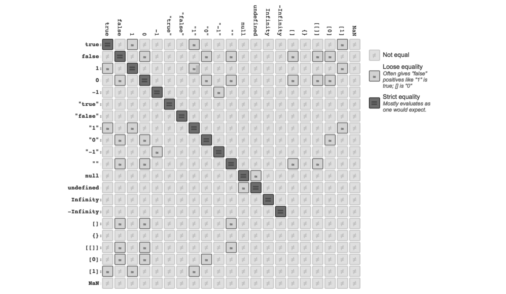

## 4.1　值类型转换

值从一种类型转换为另一种类型通常称为类型转换（`type casting`），是显式的情况；隐式的情况称为强制类型转换（`coercion`）。

> **注意：**`JavaScript` 中的强制类型转换总是返回标量基本类型值，如字符串、数字和布尔值，不会返回对象和函数。不过对基本类型进行“装箱”就是为标量基本类型值封装一个相应类型的对象，但这并非严格意义上的强制类型转换。

也可以这样来区分：类型转换发生在静态类型语言的编译阶段，而强制类型转换则发生在动态类型语言的运行时（`runtime`）。然而在 `JavaScript` 中通常将它们统称为强制类型转换。为了区分二者于，我们用“隐式强制类型转换”（`implicit coercion`）和“显式强制类型转换”（`explicit coercion`）来分别表示。

```js
var a = 42;
var b = a + ""; // 隐式强制类型转换
var c = String( a ); // 显式强制类型转换
```

## 4.2　抽象值操作

介绍显式和隐式强制类型转换之前，我们需要掌握字符串、数字和布尔值之间类型转换的基本规则。ES5 规范第 9 节中定义了一些“抽象操作”（即“**仅供内部使用的操作**”）和转换规则。这里我们着重介绍` ToString、ToNumber 和 ToBoolean`，附带讲一讲 `ToPrimitive`。

#### ToPrimitive

抽象操作 `ToPrimitive `用于将值转换为相应的基本类型值，首先通过内部操作 `DefaultValue`检查该值是否有 `valueOf()` 方法。**如果有并且返回基本类型值**，就使用该值进行强制类型转换。如果没有就使用 `toString()`的返回值（如果存在）来进行强制类型转换，如果` valueOf() 和 toString() `均不返回基本类型值，会产生` TypeError `错误。

#### ToString

抽象操作 `ToString`，它负责处理非字符串到字符串的强制类型转换。

基本类型值的字符串化规则为：`null` 转换为 `"null"`，`undefined` 转换为` "undefined"`，`true`转换为 `"true"`。数字的字符串化则遵循通用规则，不过极小和极大的数字使用指数形式：

```js
// 1.07 连续乘以七个 1000
var a = 1.07 * 1000 * 1000 * 1000 * 1000 * 1000 * 1000 * 1000;
// 七个1000一共21位数字
a.toString(); // "1.07e21"
```

对普通对象来说，除非自定义，否则·`toString()（Object.prototype.toString()）`返回内部属性` [[Class]] `的值，如`[object Object]`，如果对象有自己的` toString() `方法，字符串化时就会调用该方法并使用其返回值。

> 将对象强制类型转换为 string 是通过 ToPrimitive 抽象操作来完成的

数组的默认 `toString() `方法经过了重新定义，将所有单元字符串化以后再用 "," 连接起来：

```js
var a = [1,2,3];
a.toString(); // "1,2,3"
```

#### ToNumber

有时我们需要将非数字值当作数字来使用，比如数学运算。为此 ES5 规范在 9.3 节定义了抽象操作 `ToNumber`。

其中 `true `转换为` 1`，`false `转换为` 0`，`undefined` 转换为 `NaN`，`null` 转换为` 0`。

`ToNumber` 对字符串的处理基本遵循数字常量的相关规则 / 语法。处理失败时返回` NaN`（处理数字常量失败时会产生语法错误）。不同之处是 `ToNumber` 对以 0 开头的十六进制数并不按十六进制处理，而是按十进制。

`对象（包括数组）`会首先被转换为相应的基本类型值，如果返回的是非数字的基本类型值，则再遵循以上规则将其强制转换为数字。为了将值转换为相应的基本类型值，抽象操作` ToPrimitive `会首先检查该值是否有` valueOf() `方法。如果**有并且返回基本类型值**，就使用该值进行强制类型转换。如果没有就使用` toString()`的返回值（如果存在）来进行强制类型转换。

> 值得注意的是空数组会装换成 `0`，只有一位的数组会转换成对应的数字，而多位的数组会转换成NaN，这是因为`valueOf`返回的是`[1, 2]`不是基本类型值，所以会调用`toString`，而`toString`返回的是`1,2`通过`Number`转换之后是`NaN`。

如果 `valueOf() 和 toString()` 均不返回基本类型值，会产生` TypeError `错误。`ES5` 的` Object.create(null) `创建的对象` [[Prototype]] `属性为` null`，并且没有 `valueOf() 和 toString() `方法，因此无法进行强制类型转换。

```js
var a = {
 valueOf: function(){
 return "42";
 }
};
var b = {
 toString: function(){
 return "42";
 }
};

Number( a ); 	// 42
Number( b ); 	// 42
Number( "" ); // 0
Number( [] ); // 0
Number({});		// NaN
Number( [ "abc" ] ); // NaN
```

#### ToBoolean

首先也是最重要的一点是，`JavaScript `中有两个关键词` true `和` false`，分别代表布尔类型中的真和假。我们常误以为数值 1 和 0 分别等同于` true `和 `false`。在有些语言中可能是这样，但在 `JavaScript `中布尔值和数字是不一样的。

**1. 假值（falsy value）**

`JavaScript `规范具体定义了一小撮可以被强制类型转换为` false` 的值，以下这些是假值：

- undefined
- null
- false
- +0、-0、NaN 和 ""

从逻辑上说，假值列表以外的都应该是真值`（truthy）`，我们可以理解为假值列表以外的值都是真值。

**2. 假值对象（falsy object）**

这个标题似乎有点自相矛盾。前面讲过规范规定所有的对象都是真值，怎么还会有假值对象呢？

> 这只是规范开的一个小玩笑。

虽然` JavaScript `代码中会出现假值对象，但它实际上并不属于 `JavaScript `语言的范畴。浏览器在某些特定情况下，在常规 `JavaScript` 语法基础上自己创建了一些`外来（exotic）`值，这些就是“假值对象”。

假值对象看起来和普通对象并无二致，但将它们强制类型转换为布尔值时结果为 false，最常见的例子是 `document.all`，它是一个类数组对象，包含了页面上的所有元素，由`DOM（而不是 JavaScript 引擎）`提供给 `JavaScript` 程序使用。它以前曾是一个真正意义上的对象，布尔强制类型转换结果为` true`，不过现在它是一个假值对象。

那为什么它要是假值呢？因为我们经常通过将` document.all `强制类型转换为布尔值（比如在 if 语句中）来判断浏览器是否是老版本的 IE。IE 自诞生之日起就始终遵循浏览器标准，较其他浏览器更为有力地推动了 Web 的发展。

```js
if(document.all) { /* it’s IE */ } 
```

**3. 真值（truthy value）**

真值就是假值列表之外的值。

```js
var a = "false";
var b = "0";
var c = "''";
var e = []; // 空数组——是真值还是假值？
var f = {}; // 空对象——是真值还是假值？
var g = function(){}; // 空函数——是真值还是假值？
var k = Boolean( a && b && c && e && g && f );
k; //true
```

## 4.3　显式强制类型转换

显式强制类型转换是那些显而易见的类型转换，很多类型转换都属于此列。

#### 1. 字符串和数字之间的显式转换

字符串和数字之间的转换是通过 `String(..) `和 `Number(..) `这两个内建函数来实现的，它们前面没有 new 关键字，并不创建封装对象。

```js
var a = 42;
var b = String( a );
var c = "3.14";
var d = Number( c );
b; // "42"
d; // 3.14
```

> String(..) 遵循前面讲过的 ToString 规则，将值转换为字符串基本类型。Number(..) 遵循前面讲过的 ToNumber 规则，将值转换为数字基本类型。

除了` String(..) `和` Number(..) `以外，还有其他方法可以实现字符串和数字之间的显式转换：

```js
var a = 42;
var b = a.toString();
var c = "3.14";
var d = +c;
b; // "42"
d; // 3.14
```

**日期显式转换为数字**

一元运算符 + 的另一个常见用途是将日期（Date）对象强制类型转换为数字，返回结果为Unix 时间戳，以微秒为单位（从 1970 年 1 月 1 日 00:00:00 UTC 到当前时间），这也是获取当前时间戳的很方便的方法：

```js
var d = new Date( "Mon, 18 Aug 2014 08:53:06 CDT" );
+d; // 1408369986000

var timestamp = +new Date();
```

将日期对象转换为时间戳并非只有强制类型转换这一种方法，或许使用更显式的方法会更好一些：

```js
var timestamp = new Date().getTime();

var timestamp = Date.now();	// ES5
```

**Number 和 parseInt**

解析字符串中的数字和将字符串强制类型转换为数字的返回结果都是数字。但解析和转换两者之间还是有明显的差别。

```js
var a = "42";
var b = "42px";

Number( a ); // 42
parseInt( a ); // 42
Number( b ); // NaN
parseInt( b ); // 42
```

解析允许字符串中含有非数字字符，解析按从左到右的顺序，如果遇到非数字字符就停止。而转换不允许出现非数字字符，否则会失败并返回 NaN。从 ES5 开始 parseInt(..) 默认转换为十进制数，除非另外指定。如果你的代码需要在 ES5 之前的环境运行，请记得将第二个参数设置为 10。

parseInt(..) 针对的是字符串值。向 parseInt(..) 传递数字和其他类型的参数是没有用的，比如 true、function(){...} 和 [1,2,3]。

#### 2. 显式转换为布尔值

`Boolean(..)（不带 new）`是显式的 `ToBoolean `强制类型转换，虽然` Boolean(..) `是显式的，但并不常用。

一元运算符 ! 显式地将值强制类型转换为布尔值。但是它同时还将真值反转为假值（或者将假值反转为真值）。所以显式强制类型转换为布尔值最常用的方法是 !!，因为第二个 ! 会将结果反转回原值：

```js
function foo() {}
console.log(!!foo)
```

三元运算符 ? : 判断 a 是否为真，如果是则将变量 b 赋值为 true，否则赋值为 false。表面上这是一个显式的 ToBoolean 强制类型转换，然而这里涉及隐式强制类型转换，因为 a 要首先被强制类型转换为布尔值才能进行条件判断。这种情况称为“显式的隐式”，有百害而无一益，虽然结果是一样的，但是我们应彻底杜绝。

```js
var b = a ? true : false;		// bad way
var b = !!a ? true : false;	// good way
```

显式 ToBoolean 的另外一个用处，是在 JSON 序列化过程中将值强制类型转换为 true 或 false：

```js
var a = [ 
 1,
 function(){ /*..*/ },
 2,
 function(){ /*..*/ }
];
JSON.stringify( a ); // "[1,null,2,null]"
JSON.stringify( a, function(key,val){
 if (typeof val == "function") {
 // 函数的ToBoolean强制类型转换
 return !!val;
 }
 else {
 return val;
 }
} );
// "[1,true,2,true]"
```

## 4.4　隐式强制类型转换

隐式强制类型转换指的是那些隐蔽的强制类型转换，副作用也不是很明显。换句话说，你自己觉得不够明显的强制类型转换都可以算作隐式强制类型转换。

#### **1.一元加 `+`**

```js
var a = [1,2];
var b = [3,4];
a + b; // "1,23,4"
```

如果所有操作数都属于`数字、NaN、undefined、true/false`，就转换成`Number类型（抽象操作ToNumber）`，之后进行计算：

```js
true + 1
// 2
true + true
// 2
null + null
// 0
null + undefined
// NaN
```

而如果任何一个操作数是字符串或者能够通过以下步骤转换为字符串的话，+ 将进行拼接操作：

- 如果其中一个操作数是对象`（数组）`，则首先对其调用`ToPrimitive`，该抽象操作再调用 `[[DefaultValue]]`，以数字作为上下文，具体的过程就是先调用`valueOf`，返回的不是基础值再调用`toString`。

#### **2.一元减`-`**

\- 是数字减法运算符，因此 a - 0 会将 a 强制类型转换为数字。对象的 - 操作与 + 类似：

```js
var a = [3];
var b = [1];
a - b; // 2
```

为了执行减法运算，a 和 b 都需要被转换为数字，它们首先被转换为字符串（通过`toString()`），然后再转换为数字。

#### 3.布尔值

下面的情况会发生布尔值隐式强制类型转换：

1. `if (..) ` 语句中的条件判断表达式。
2.  `for ( .. ; .. ; .. )` 语句中的条件判断表达式（第二个）。
3.  `while (..)` 和 `do..while(..)` 循环中的条件判断表达式。
4. ` ? : ` 中的条件判断表达式。
5.  逻辑运算符` ||`（逻辑或）和` &&`（逻辑与）左边的操作数（作为条件判断表达式）。

以上情况中，非布尔值会被隐式强制类型转换为布尔值，遵循前面介绍过的 ToBoolean 抽象操作规则。

```js
var a = 42;
var b = "abc";
var c;
var d = null;
if (a) {
 console.log( "yep" ); // yep
}
while (c) {
 console.log( "nope, never runs" );
}
c = d ? a : b; 
c; // "abc"
if ((a && d) || c) {
 console.log( "yep" ); // yep
}
```

注意，上面说了ToBoolean的规则，所以其值不是[`undefined`](https://developer.mozilla.org/zh-CN/docs/Web/JavaScript/Reference/Global_Objects/undefined)或[`null`](https://developer.mozilla.org/zh-CN/docs/Web/JavaScript/Reference/Global_Objects/null)的任何对象（包括其值为`false`的布尔对象）在传递给条件语句时都将计算为`true`。 例如下面的例子是一个典型的错误：

```js
var x = new Boolean(false);
if (x) {
  // 这里的代码会被执行
}
```

#### 4. || 和 &&

|| 和 && 在javascript中被称为操作数选择器，因为它不像其他语言一样返回一个bool值，而是两个操作数其中一个的值。

```js
var a = 42;
var b = "abc";
var c = null;
a || b; // 42 
a && b; // "abc"
```

|| 和 && 首先会对第一个操作数（a 和 c）执行条件判断，如果其不是布尔值（如上例）就先进行 ToBoolean 强制类型转换，然后再执行条件判断。

- 对于 || 来说，如果条件判断结果为 true 就返回第一个操作数（a 和 c）的值，如果为false 就返回第二个操作数（b）的值。
- && 则相反，如果条件判断结果为 true 就返回第二个操作数（b）的值，如果为 false 就返回第一个操作数（a 和 c）的值。

`|| `曾经常被用于参数的默认值：

```js
function foo(a,b) {
 a = a || "hello";
 b = b || "world";
 console.log( a + " " + b );
}
foo();
```

`&&`一般用于防御性编程：

```js
function foo() {
 console.log( a );
}
var a = 42;
a && foo(); // 42
```

## 4.5　宽松相等和严格相等

宽松相等（loose equals）== 和严格相等（strict equals）=== 都用来判断两个值是否“相等”，但是它们之间有一个很重要的区别，特别是在判断条件上。

常见的误区是“== 检查值是否相等，\=== 检查值和类型是否相等”。听起来蛮有道理，然而还不够准确。很多 JavaScript 的书籍和博客也是这样来解释的，但是很遗憾他们都错了，**正确的解释是：“== 允许在相等比较中进行强制类型转换，而 === 不允许。”**

如果进行比较的两个值类型相同，则 == 和 === 使用相同的算法，所以除了 JavaScript 引擎实现上的细微差别之外，它们之间并没有什么不同。

#### 抽象相等

ES5 规范 11.9.3 节的“抽象相等比较算法”定义了 == 运算符的行为。该算法简单而又全面，涵盖了所有可能出现的类型组合，以及它们进行强制类型转换的方式。

首先规定两个值的类型相同，就仅比较它们是否相等。例如，42 等于 42，"abc" 等于 "abc"，不过有几个非常规的情况需要注意：

- NaN 不等于 NaN。

- +0 等于 -0。

之后定义了如果是对象（包括函数和数组）的宽松相等 ==。两个对象指向同一个值时即视为相等，不发生强制类型转换。

最后，== 在比较两个不同类型的值时会发生隐式强制类型转换，会将其中之一或两者都转换为相同的类型后再进行比较。

> 宽松不相等（loose not-equality）!= 就是 == 的相反值，!== 同理。

**1. 字符串和数字之间的相等比较**

```js
var a = 42;
var b = "42";
a === b; // false
a == b; // true
```

a == b 是宽松相等，即如果两个值的类型不同，则对其中之一或两者都进行强制类型转换，具体怎么转换？是 a 从 42 转换为字符串，还是 b 从 "42" 转换为数字？

ES5 规范这样定义：

1. 如果 Type(x) 是数字，Type(y) 是字符串，则返回 x == ToNumber(y) 的结果。
2. 如果 Type(x) 是字符串，Type(y) 是数字，则返回 ToNumber(x) == y 的结果。

换句话说，只要是数字和字符串比较都是字符串转换成数字，用的就是ToNumber 抽象操作。

**2. 其他类型和布尔类型之间的相等比较**

== 最容易出错的一个地方是 true 和 false 与其他类型之间的相等比较。

```js
var a = "42";
var b = true;
a == b; // false
```

规范 11.9.3.6-7 是这样说的：

1. 如果 Type(x) 是布尔类型，则返回 ToNumber(x) == y 的结果；
2. 如果 Type(y) 是布尔类型，则返回 x == ToNumber(y) 的结果。

Type(x) 是布尔值，所以 ToNumber(x) 将 true 强制类型转换为 1，变成 1 == "42"，二者的类型仍然不同，"42" 根据规则被强制类型转换为 42，最后变成 1 == 42，结果为 false。

**3. null 和 undefined 之间的相等比较**

null 和 undefined 之间的 == 也涉及隐式强制类型转换。ES5 规范 11.9.3.2-3 规定：

1. 如果 x 为 null，y 为 undefined，则结果为 true。
2. 如果 x 为 undefined，y 为 null，则结果为 true。

在 == 中 null 和 undefined 相等（它们也与其自身相等），除此之外其他值都不存在这种情况。

```js
var a = null;
var b;
a == b; // true
a == null; // true
b == null; // true
a == false; // false
b == false; // false
a == ""; // false
b == ""; // false
a == 0; // false
b == 0; // false
```

除 null 和 undefined 以外的其他值均无法得到 true 结果，条件判断 a == null 仅在 doSomething() 返回非 null 和 undefined 时才成立，除此之外其他值都不成立，包括 0、false 和 "" 这样的假值。

**4. 对象和非对象之间的相等比较**

关于对象（对象 / 函数 / 数组）和标量基本类型（字符串 / 数字 / 布尔值）之间的相等比较，ES5 规范 11.9.3.8-9 做如下规定：

1. 如果 Type(x) 是字符串或数字，Type(y) 是对象，则返回 x == ToPrimitive(y) 的结果；
2. 如果 Type(x) 是对象，Type(y) 是字符串或数字，则返回 ToPromitive(x) == y 的结果。

> 这里只提到了字符串和数字，没有布尔值。原因是我们之前介绍过 11.9.3.6-7中规定了布尔值会先被强制类型转换为数字。

**4. 对象和对象之间的相等比较**

除非指向相同，否则永远不相同。

**5.假值的相等比较**

== 中的隐式强制类型转换最为人诟病的地方是假值的相等比较。

```js
"0" == null; // false
"0" == undefined; // false
"0" == false; // true -- 晕！
"0" == NaN; // false
"0" == 0; // true
"0" == ""; // false
false == null; // false
false == undefined; // false
false == NaN; // false
false == 0; // true -- 晕！
false == ""; // true -- 晕！
false == []; // true -- 晕！
false == {}; // false
"" == null; // false
"" == undefined; // false
"" == NaN; // false
"" == 0; // true -- 晕！
"" == []; // true -- 晕！
"" == {}; // false
0 == null; // false
0 == undefined; // false
0 == NaN; // false
0 == []; // true -- 晕！
0 == {}; // false
```

有 7 种我们注释了“晕！”，因为它们属于假阳（false positive）的情况，里面坑很多。"" 和 0 明显是两个不同的值，它们之间的强制类型转换很容易搞错。请注意这里不存在假阴（false negative）的情况。

**5. 极端情况**

还有更极端的例子:

```js
[] == ![] // true
```

#### 总结

如果两边的值中有 true 或者 false，千万不要使用 ==，如果两边的值中有 []、"" 或者 0，尽量不要使用 ==。

这时最好用 === 来避免不经意的强制类型转换。这两个原则可以让我们避开几乎所有强制类型转换的坑。最后这里有一个图来表示所有的可能性：

