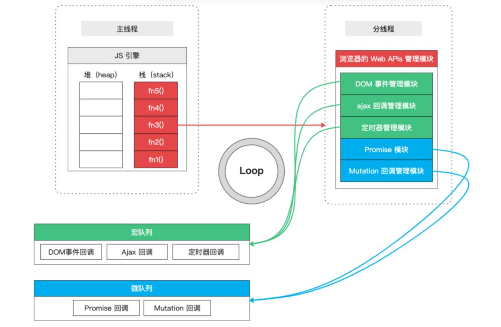

# 异步

所谓"异步"，简单说就是一个任务不是连续完成的，可以理解成该任务被人为分成两段，先执行第一段，然后转而执行其他任务，等做好了准备，再回过头执行第二段。

比如，有一个任务是读取文件进行处理，任务的第一段是向操作系统发出请求，要求读取文件。然后，程序执行其他任务，等到操作系统返回文件，再接着执行任务的第二段（处理文件）。这种不连续的执行，就叫做异步。

相应地，连续的执行就叫做同步。由于是连续执行，不能插入其他任务，所以操作系统从硬盘读取文件的这段时间，程序只能干等着。

## 回调函数

JavaScript 语言对异步编程的实现，就是回调函数。所谓回调函数，就是把任务的第二段单独写在一个函数里面，等到重新执行这个任务的时候，就直接调用这个函数。回调函数的英语名字`callback`，直译过来就是"重新调用"。

读取文件进行处理，是这样写的。

```javascript
fs.readFile('/etc/passwd', 'utf-8', function (err, data) {
  if (err) throw err;
  console.log(data);
});
```

上面代码中，`readFile`函数的第三个参数，就是回调函数，也就是任务的第二段。等到操作系统返回了`/etc/passwd`这个文件以后，回调函数才会执行。

一个有趣的问题是，为什么 Node 约定，回调函数的第一个参数，必须是错误对象`err`（如果没有错误，该参数就是`null`）？

原因是执行分成两段，第一段执行完以后，任务所在的上下文环境就已经结束了。在这以后抛出的错误，原来的上下文环境已经无法捕捉，只能当作参数，传入第二段。

## Promise

回调函数本身并没有问题，它的问题出现在多个回调函数嵌套。假定读取`A`文件之后，再读取`B`文件，代码如下。

```javascript
fs.readFile(fileA, 'utf-8', function (err, data) {
  fs.readFile(fileB, 'utf-8', function (err, data) {
    // ...
  });
});
```

不难想象，如果依次读取两个以上的文件，就会出现多重嵌套。代码不是纵向发展，而是横向发展，很快就会乱成一团，无法管理。因为多个异步操作形成了强耦合，只要有一个操作需要修改，它的上层回调函数和下层回调函数，可能都要跟着修改。这种情况就称为"回调函数地狱"（`callback hell`）。

`Promise` 对象就是为了解决这个问题而提出的。它不是新的语法功能，而是一种新的写法，允许将回调函数的嵌套，改成链式调用。采用 `Promise`，连续读取多个文件，写法如下。

```javascript
var readFile = require('fs-readfile-promise');

readFile(fileA)
.then(function (data) {
  console.log(data.toString());
})
.then(function () {
  return readFile(fileB);
})
.then(function (data) {
  console.log(data.toString());
})
.catch(function (err) {
  console.log(err);
});
```

上面代码中，我使用了`fs-readfile-promise`模块，它的作用就是返回一个 Promise 版本的`readFile`函数。Promise 提供`then`方法加载回调函数，`catch`方法捕捉执行过程中抛出的错误。

可以看到，Promise 的写法只是回调函数的改进，使用`then`方法以后，异步任务的两段执行看得更清楚了，除此以外，并无新意。

Promise 的最大问题是代码冗余，原来的任务被 Promise 包装了一下，不管什么操作，一眼看去都是一堆`then`，原来的语义变得很不清楚。

那么，有没有更好的写法呢？

## 过去的异步

程序中现在运行的部分和将来运行的部分之间的关系就是异步编程的核心。

### 异步回调函数

可以把 `JavaScript` 程序写在单个 .`js` 文件中，但是这个程序几乎一定是由多个块构成的。这些块中只有一个是现在执行，其余的则会在将来执行。最常见的块单位是函数。

只要把一段代码包装成一个函数，并指定它在响应某个事件（定时器、鼠标点击、`Ajax` 响应等）时执行，你就是在代码中创建了一个将来执行的块，也由此在这个程序中引入了异步机制。

最简单的实现方法（但绝对不是唯一的，甚至也不是最好的！）是使用一个通常称为回调函数的函数：

```js
// ajax(..)是某个库中提供的某个Ajax函数
ajax( "http://some.url.1", function myCallbackFunction(data){
 console.log( data ); // 耶！这里得到了一些数据！
} );
```

> 我们确实可以发送同步 Ajax 请求。尽管技术上说是这样，但是，在任何情况下都不应该使用这种方式，因为它会锁定浏览器 UI（按钮、菜单、滚动条等），并阻塞所有的用户交互。这是一个可怕的想法，一定要避免。

### 异步控制台

并没有什么规范或一组需求指定 console.* 方法族如何工作——它们并不是 JavaScript 正式的一部分，而是由宿主环境（请参考本书的“类型和语法”部分）添加到 JavaScript 中的。在某些条件下，某些浏览器的 console.log(..) 并不会把传入的内容立即输出。出现这种情况的主要原因是，在许多程序（不只是 JavaScript）中，I/O 是非常低速的阻塞部分。所以，（从页面 /UI 的角度来说）浏览器在后台异步处理控制台 I/O 能够提高性能，这时用户甚至可能根本意识不到其发生。

```js
var a = {
 index: 1
};
// 然后
console.log( a ); // ??
// 再然后
a.index++;
```

多数情况下，前述代码在开发者工具的控制台中输出的对象表示与期望是一致的。但这段代码运行的时候，浏览器可能会认为需要把控制台 I/O 延迟到后台，在这种情况下，等到浏览器控制台输出对象内容时，a.index++ 可能已经执行，因此显示 { index: 2 }。

> **注意：**最好的选择是在 JavaScript 调试器中使用断点，而不要依赖控制台输出。次优的方案是把对象序列化到一个字符串中，以强制执行一次“快照”，比如通过 JSON.stringify(..)。

## 事件循环

到最近，`ES6` 真正内建了异步概念，几乎所有宿主环境都提供了一种机制来处理程序中多个块的执行，且执行每块时调用引擎，这种机制被称为事件循环。

### 运行时概念

接下来的内容解释了这个理论模型。现代`JavaScript`引擎实现并着重优化了以下描述的这些语义。

**可视化描述：**


`堆`：

对象被分配在堆中，堆是一个用来表示一大块（通常是非结构化的）内存区域的计算机术语。

`栈`：

函数调用形成了一个由若干帧组成的栈。

```js
function foo(b) {
  let a = 10;
  return a + b + 11;	// 3. 当 foo 执行完毕然后返回时，第二个帧就被弹出栈（剩下 bar 函数的调用帧 ）。
}

function bar(x) {
  let y = 3;
  return foo(x * y);	// 2. 调用 foo 时，第二个帧被创建并被压入栈中，放在第一个帧之上，帧中包含 foo 的参数和局部变量。
  										// 4. 当 bar 也执行完毕然后返回时，第一个帧也被弹出，栈就被清空了。
}

console.log(bar(7)); 	// 1. 用 bar 时，第一个帧包含了 bar 的参数和局部变量。
```

`队列`：

`JavaScript` 运行时包含了一个待处理消息的消息队列。每一个消息都关联着一个用以处理这个消息的回调函数。

在 [事件循环](https://developer.mozilla.org/zh-CN/docs/Web/JavaScript/EventLoop#事件循环) 期间的某个时刻，运行时会从最先进入队列的消息开始处理队列中的消息。被处理的消息会被移出队列，并作为输入参数来调用与之关联的函数。正如前面所提到的，调用一个函数总是会为其创造一个新的栈帧。

> **注意：**函数的处理会一直进行到执行栈再次为空为止；然后事件循环将会处理队列中的下一个消息（如果还有的话）。

### 事件循环

`JavaScript` 引擎本身并没有时间的概念，只是一个按需执行 `JavaScript` 任意代码片段的环境。“事件”（`JavaScript` 代码执行）调度总是由包含它的环境进行，比如 `Ajax` 请求取回数据之后，就会把回调函数插入到事件循环，以此实现对这个回调的调度执行。

什么是事件循环？先通过一段伪代码了解一下这个概念 :

```js
// eventLoop是一个用作队列的数组
// （先进，先出）
var eventLoop = [ ];
var event;
// “永远”执行
while (true) {
 // 一次tick
 if (eventLoop.length > 0) {
 	// 拿到队列中的下一个事件
 	event = eventLoop.shift();
 	// 现在，执行下一个事件
 	try {
 		event();
 	}
 	catch (err) {
 		reportError(err);
  }
 }
}
```

**执行至完成：**

每一个消息完整地执行后，其它消息才会被执行。这为程序的分析提供了一些优秀的特性，包括：当一个函数执行时，它不会被抢占，只有在它运行完毕之后才会去运行任何其他的代码，才能修改这个函数操作的数据。

**添加消息：**

在浏览器里，每当一个事件发生并且有一个事件监听器绑定在该事件上时，一个消息就会被添加进消息队列。如果没有事件监听器，这个事件将会丢失。所以当一个带有点击事件处理器的元素被点击时，就会像其他事件一样产生一个类似的消息。

函数 `setTimeout` 接受两个参数：待加入队列的消息和一个时间值（可选，默认为 0）。这个时间值代表了消息被实际加入到队列的最小延迟时间。如果队列中没有其它消息并且栈为空，在这段延迟时间过去之后，消息会被马上处理。但是，如果有其它消息，`setTimeout` 消息必须等待其它消息处理完。因此第二个参数仅仅表示最少延迟时间，而非确切的等待时间。

```js
const s = new Date().getSeconds();

setTimeout(function() {
  // 输出 "2"，表示回调函数并没有在 500 毫秒之后立即执行
  console.log("Ran after " + (new Date().getSeconds() - s) + " seconds");
}, 500);

while(true) {
  if(new Date().getSeconds() - s >= 2) {
    console.log("Good, looped for 2 seconds");
    break;
  }
}
```

用 while 循环实现的持续运行的循环，循环的每一轮称为一个 tick。对每个 tick 而言，如果在队列中有等待事件，那么就会从队列中摘下一个事件并执行。这些事件就是你的回调函数。

一定要清楚，setTimeout(..) 并没有把你的回调函数挂在事件循环队列中。它所做的是设定一个定时器。当定时器到时后，环境会把你的回调函数放在事件循环中，这样，在未来某个时刻的 tick 会摘下并执行这个回调。

**多个运行时互相通信：**

一个 web worker 或者一个跨域的 `iframe` 都有自己的栈、堆和消息队列。两个不同的运行时只能通过 [`postMessage`](https://developer.mozilla.org/zh-CN/docs/Web/API/Window/postMessage) 方法进行通信。如果另一个运行时侦听 `message` 事件，则此方法会向该运行时添加消息。

> ES6 从本质上改变了在哪里管理事件循环。本来它几乎已经是一种正式的技术模型了，但现在 ES6 精确指定了事件循环的工作细节，这意味着在技术上将其纳入了 JavaScript 引擎的势力范围，而不是只由宿主环境来管理

## 宏队列和微队列



JS 中包含 2 个存储待执行回调函数的列队，每个队列的任务源可以分为`微任务（microtask）` 和`宏任务（macrotask）`，`ES6 `规范中，`microtask` 称为` jobs` ，`macrotask`称为 `task` 。

- **宏列队**：用来保存待执行的宏任务（回调），比如：定时器回调、`DOM `事件回调、`ajax` 回调。
- **微列队**：用来保存待执行的微任务（回调），比如：`promise`的回调、`MutationObserver `的回调。

JS 执行时会区别这 2 个队列，JS 引擎首先必须先执行所有的初始化同步任务代码`（就是执行栈内的所有函数）`，每次准备取出第一个宏任务执行前，都要将所有的微任务一个一个取出来执行，也就是优先级比宏任务高，且与微任务所处的代码位置无关。

```js
setTimeout(() => { //立即放入宏队列
  console.log('timeout callback1（）')
  Promise.resolve(3).then(
    value => { //立即放入微队列
      console.log('Promise onResolved3()', value)
    }
  )
}, 0)

setTimeout(() => { //立即放入宏队列
  console.log('timeout callback2（）')
}, 0)

Promise.resolve(1).then(
  value => { //立即放入微队列
    console.log('Promise onResolved1()', value)
    setTimeout(() => {
      console.log('timeout callback3（）', value)
    }, 0)
  }
)

Promise.resolve(2).then(
  value => { //立即放入微队列
    console.log('Promise onResolved2()', value)
  }
)

// Promise onResolved1() 1
// Promise onResolved2() 2
// timeout callback1（）
// Promise onResolved3() 3
// timeout callback2（）
// timeout callback3（）
```

## 永不阻塞

JavaScript的事件循环模型与许多其他语言不同的一个非常有趣的特性是，它永不阻塞。 处理 I/O 通常通过事件和回调来执行，所以当一个应用正等待一个 [IndexedDB](https://developer.mozilla.org/zh-CN/docs/Web/API/IndexedDB_API) 查询返回或者一个 [XHR](https://developer.mozilla.org/zh-CN/docs/Web/API/XMLHttpRequest) 请求返回时，它仍然可以处理其它事情，比如用户输入。

## 并行线程

异步是关于现在和将来的时间间隙，而并行是关于能够同时发生的事情。

并行计算最常见的工具就是进程和线程。进程和线程独立运行，并可能同时运行在不同的处理器，甚至不同的计算机上，多个线程能够共享单个进程的内存。

事件循环把自身的工作分成一个个任务并顺序执行，不允许对共享内存的并行访问和修改。通过分立线程中彼此合作的事件循环，并行和顺序执行可以共存。

在单线程环境中，线程队列中的这些项目是底层运算确实是无所谓的，因为线程本身不会被中断。但如果是在并行系统中，同一个程序中可能有两个不同的线程在运转，这时很可能就会得到不确定的结果。

多线程编程是非常复杂的。因为如果不通过特殊的步骤来防止这种中断和交错运行的话，可能会得到出乎意料的、不确定的行为，通常这很让人头疼。还好JavaScript 从不跨线程共享数据，这意味着不需要考虑这一层次的不确定性。

## 并发

我们来设想一个场景，随着用户向下滚动列表而逐渐加载更多内容。要正确地实现这一特性，需要两个独立的进程同时运行（同一段时间内，并不需要在同一时刻），第一个“进程”在用户向下滚动页面触发 onscroll 事件时响应这些事件。第二个接收 Ajax 响应。

两个或多个“进程”同时执行就出现了并发，不管组成它们的单个运算是否并行执行（在独立的处理器或处理器核心上同时运行）。可以把并发看作“进程”级（或者任务级）的并行，与运算级的并行（不同处理器上的线程）相对。

> 这里的“进程”之所以打上引号，是因为这并不是计算机科学意义上的真正操作系统级进程。这是虚拟进程，或者任务，表示一个逻辑上相关的运算序列。

前面介绍过事件循环的概念，JavaScript 一次只能处理一个事件，所以要么是onscroll请求 2 先发生，要么是响应 1 先发生，但是不会严格地同时发生，“进程”1 和“进程”2 并发运行（任务级并行），但是它们的各个事件是在事件循环队列中依次运行的。

```js
onscroll, 请求1 
onscroll, 请求2 响应1 
onscroll, 请求3 响应2 
响应3 
onscroll, 请求4 
onscroll, 请求5 
onscroll, 请求6 响应4 
onscroll, 请求7 
响应6 
响应5 
响应7
```