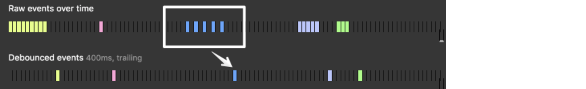
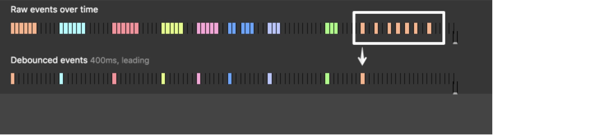
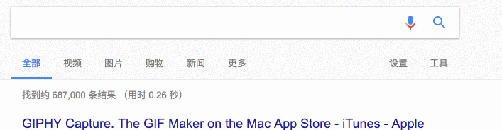
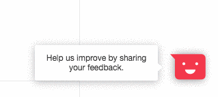

## 函数防抖 debounce

自动补全很多地方都有，基本无一例外都是通过发出异步请求将当前内容作为参数传给服务器，然后服务器回传备选项。

```js
//模拟一段ajax请求
function ajax(content) {
  console.log('ajax request ' + content)
}

let inputa = document.getElementById('unDebounce')

inputa.addEventListener('keyup', function (e) {
    ajax(e.target.value)
})
```

那么问题来了，如果我每输入一个字符都要发出个异步请求，那么异步请求的个数会不会太多了呢？因为实际上用户可能**只需要输入完后给出的备选项**。


### 概念

**防抖**(debounce)就是把多个顺序的调用合并到一起(只执行一次)。在事件被触发n秒后再执行回调，如果在这n秒内又被触发，则重新计时。



### 简单实现

使用下面的代码我们就可以在调用`debounce`函数的同时获得正确的作用域，并且可以为防抖函数传递参数。

```js
function debounce(fn, delay) {
  var timer; // 维护一个 timer
  return function () {
    var _this = this; // 取debounce执行作用域的this
    var args = arguments;
    if (timer) {
      clearTimeout(timer);
    }
    timer = setTimeout(function () {
      fn.apply(_this, args); // 用apply指向调用debounce的对象，相当于_this.fn(args);
    }, delay);
  };
}

function debounceES6(fn, delay) {
  var timer; // 维护一个 timer
  return function (...args) {
    if (timer) {
      clearTimeout(timer);
    }
    timer = setTimeout(() => {
      fn.apply(this, args);
    }, delay);
  };
}
```

我们写一个简单的函数模拟`ajax`请求并且测试`this`是否隐式丢失，最后可以看到连续的两次调用只执行了一次。

```js
function ajax(content) {
  console.log(this);
  console.log('ajax:' + content);
}

var debouncedAjax = debounceES6(ajax, 1000);

let obj = {
  ajax: debouncedAjax,
};

obj.ajax('list');
obj.ajax('list');

// ajax[function]
// ajax: list
```

### lodash `_.debounce(func, [wait=0], [options={}])`

创建一个 debounced（防抖动）函数，该函数会从上一次被调用后，延迟 `wait` 毫秒后调用 `func` 方法。 debounced（防抖动）函数提供一个 `cancel` 方法取消延迟的函数调用以及 `flush` 方法立即调用。 



可以提供一个 options（选项） 对象决定如何调用 `func` 方法，`options.leading` 与|或 `options.trailing` 决定延迟前后如何触发（注：是 先调用后等待 还是 先等待后调用）。 `func` 调用时会传入最后一次提供给 debounced（防抖动）函数 的参数。 后续调用的 debounced（防抖动）函数返回是最后一次 `func` 调用的结果。


> **注意:** 如果 `leading` 和 `trailing` 选项为 `true`, 则 `func` 允许 trailing 方式调用的条件为: 在 `wait` 期间多次调用防抖方法。

如果 `wait` 为 `0` 并且 `leading` 为 `false`, `func`调用将被推迟到下一个点，类似`setTimeout`为`0`的超时。

#### 参数

1. `func` *(Function)*: 要防抖动的函数。
2. `[wait=0]` *(number)*: 需要延迟的毫秒数。
3. `[options={}]` *(Object)*: 选项对象。
4. `[options.leading=false]` *(boolean)*: 指定在延迟开始前调用。
5. `[options.maxWait]` *(number)*: 设置 `func` 允许被延迟的最大值。
6. `[options.trailing=true]` *(boolean)*: 指定在延迟结束后调用。

#### 返回

*(Function)*: 返回新的 debounced（防抖动）函数。

#### 例子

```js
// 避免窗口在变动时出现昂贵的计算开销。
jQuery(window).on('resize', _.debounce(calculateLayout, 150));
 
// 当点击时 `sendMail` 随后就被调用。
jQuery(element).on('click', _.debounce(sendMail, 300, {
  'leading': true,
  'trailing': false
}));
 
// 确保 `batchLog` 调用1次之后，1秒内会被触发。
var debounced = _.debounce(batchLog, 250, { 'maxWait': 1000 });
var source = new EventSource('/stream');
jQuery(source).on('message', debounced);
 
// 取消一个 trailing 的防抖动调用
jQuery(window).on('popstate', debounced.cancel);
```

### 应用

#### 1. 自动补全(autocomplete)性能优化

自动补全很多地方都有，基本无一例外都是通过发出异步请求将当前内容作为参数传给服务器，然后服务器回传备选项。




那么问题来了，如果我每输入一个字符都要发出个异步请求，那么异步请求的个数会不会太多了呢？因为实际上用户可能**只需要输入完后给出的备选项**。

这时候就可以使用防抖，比如当输入框input事件触发隔了1000ms的时候我再发起异步请求。

#### 2. 原生事件性能优化

想象一下，我有个使用js进行自适应的元素，那么很自然，我需要考虑我浏览器窗口发生`resize`事件的时候我要去重新计算它的位置。现在问题来了，我们看看resize一次触发多少次。



至少在我电脑上，稍微改变一下就会触发几次resize事件，而用js去自适应的话会有较多的DOM操作，我们都知道DOM操作很浪费时间，所以对于resize事件我们是不是可以用debounce让它最后再计算位置？当然如果你觉得最后才去计算位置或者一些属性会不太即时，你可以继续往下看看函数*节流*(throttle)

```js
window.addEventListener('resize', function() {
  console.log('resize')
})
```


