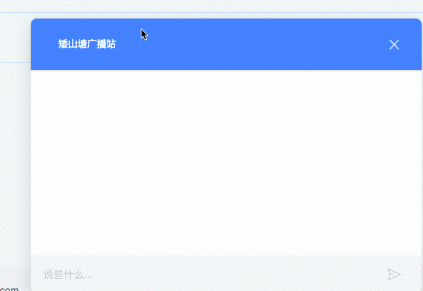
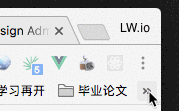

## 函数节流 throttle

规定在一个单位时间内，只能触发一次函数。如果这个单位时间内触发多次函数，只有一次生效。

使用`throttle`时，只允许一个函数在 `X` 毫秒内执行一次，比如你设置了`400ms`，那么即使你在这`400ms`里面调用了`100`次，也只有一次执行。跟 `debounce` 主要的不同在于，`throttle` 保证 `X` 毫秒内至少执行一次。

#### 例子

`throttle`并用定时器去做检测，而是通过一个闭包存放上一次执行函数的时间点，判断这一次是否应该执行，其中的定时器是为了保证最后一次函数触发能够延时执行。

```js
function throttle(fn, delay) {
    let isFinished = true;
    return function (...args) {
        if (!isFinished) {
            return;
        }
        isFinished = false;
        setTimeout(() => {
            fn.call(this, ...args);
            isFinished = true;
        }, delay);
    };
}
```

#### 应用

#### 图片懒加载

**图片懒加载**(lazyload)可能很多人都知道，如果我们浏览一个图片很多的网站的话，我们不希望所有的图片在一开始就加载了，一是浪费流量，可能用户不关心下面的图片呢。二是性能，那么多图片一起下载，性能爆炸。


那么一般我们都会让图片懒加载，让一个图片一开始在页面中的标签为

```js

```

当我屏幕滚动到能显示这个img标签的位置时，我用`data-src`去替换src的内容，变为

```js

```

大家都知道如果直接改变src的话浏览器也会直接发出一个请求，在红宝书(JS高程)里面的跨域部分还提了一下用img标签的src做跨域。这时候图片才会显示出来。

关于怎么判断一个元素出现在屏幕中的，大家可以去看看这个函数`getBoundingClientRect()`，这里就不扩展的讲了

好的，那么问题来了，我既然要检测元素是否在浏览器内，那我肯定得在`scroll`事件上绑定检测函数吧。`scroll`函数和`resize`函数一样，滑动一下事件触发几十上百次，读者可以自己试一下。

```js
document.addEventListener('scroll', function() {
  console.log('scroll')
})
```

好的，你的检测元素是否在浏览器内的函数每次要检查所有的img标签(至少是所有没有替换src的)，而且滑一次要执行几十次，你懂我的意思。

throttle正是你的救星，你可以让检测函数每300ms运行一次。

#### 拖动和拉伸

你以为你只需要防备`resize`和`scroll`么，太天真了，看下面几个例子。



或者想做类似原生窗口调整大小的效果。



那么你一定会需要`mousedown`、`mouseup`、`mousemove`事件，前两个用于拖动的开始和结束时的状态变化(比如你要加个标识标识开始拖动了)。`mousemove`则是用来调整元素的位置或者宽高。那么同样的我们来看看`mousemove`事件触发频率。

```js
document.addEventListener('mousemove', function() {
  console.log('mousemove')
})
```

我相信你现在已经知道它比scroll还恐怖而且可以让性能瞬间爆炸。那么这时候我们就可以用函数**节流**让它300ms触发一次。