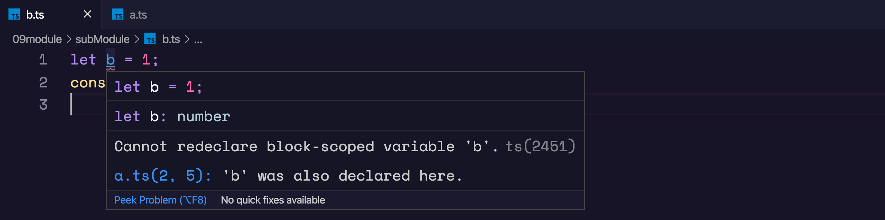

模块在其自身的作用域里执行，而不是在全局作用域里；这意味着定义在一个模块里的变量，函数，类等等在模块外部是不可见的，除非你明确地使用[`export`形式](https://www.tslang.cn/docs/handbook/modules.html#export)之一导出它们。 相反，如果想使用其它模块导出的变量，函数，类，接口等的时候，你必须要导入它们，可以使用 [`import`形式](https://www.tslang.cn/docs/handbook/modules.html#import)之一。


模块是自声明的；两个模块之间的关系是通过在文件级别上使用 `imports`和 `exports`建立的。

## DOM typings

`typescript`使用`DOM typings`作为全局执行上下文。全局环境下就极有可能随时出现命名问题。比如我们在`a.ts`和`b.ts`中同时声明`a`就会产生命名冲突，所以会提示这样的错误。



这个问题有两种解决方法：

- 使当前文件被视为模块文件，如果没有中确实不需要`import`或者`export`任何内容。可以直接声明一个`export{}`；
- 在`tsconfig.json`文件中添加如下内容，这样设置使得编译器不包含`DOM typings`。（目前不是很清楚这里的原因和理由，这样设置会不会带来其他问题呢？）

```json
{
    "compilerOptions": {
        "lib": [
            "es2015"
        ]
    }
}
```

##  文件模块

文件模块也被称为外部模块。如果在你的 TypeScript 文件的根级别位置含有 `import` 或者 `export`，那么它会在这个文件中创建一个本地的作用域。因此，我们需要把上文 `foo.ts` 改成如下方式（注意 `export` 用法）：

```ts
export const foo = 123;
```

在全局命名空间里，我们不再有 `foo`，这可以通过创建一个新文件 `bar.ts` 来证明：

```ts
const bar = foo; // ERROR: "cannot find name 'foo'"
```

如果你想在 `bar.ts` 里使用来自 `foo.ts` 的内容，你必须显式地导入它，更新后的 `bar.ts` 如下所示。

```ts
import { foo } from './foo';
const bar = foo; // allow
```

在 `bar.ts` 文件里使用 `import` 时，它不仅允许你使用从其他文件导入的内容，还会将此文件 `bar.ts` 标记为一个模块，文件内定义的声明也不会“污染”全局命名空间

## 导出

### 导出声明

**任何声明（比如变量，函数，类，类型别名或接口）**都能够通过添加`export`关键字来导出，相反引用导出是不被允许的。

```ts
export const numberRegexp = /^[0-9]+$/;

export class ZipCodeValidator implements StringValidator {
    isAcceptable(s: string) {
        return s.length === 5 && numberRegexp.test(s);
    }
}
```

因为我们可能需要对导出的部分重命名，所以上面的例子可以这样改写：

```ts
class ZipCodeValidator implements StringValidator {
    isAcceptable(s: string) {
        return s.length === 5 && numberRegexp.test(s);
    }
}
export { ZipCodeValidator };
export { ZipCodeValidator as mainValidator };
```

### 重新导出

我们经常会去扩展其它模块，并且只导出那个模块的部分内容。 重新导出功能并不会在当前模块导入那个模块或定义一个新的局部变量。

```ts
export class ParseIntBasedZipCodeValidator {
    isAcceptable(s: string) {
        return s.length === 5 && parseInt(s).toString() === s;
    }
}

// 导出原先的验证器但做了重命名
export {ZipCodeValidator as RegExpBasedZipCodeValidator} from "./ZipCodeValidator";
```

或者一个模块可以包裹多个模块，并把他们导出的内容联合在一起通过语法：`export * from "module"`。

```ts
export * from "./StringValidator"; // exports interface StringValidator
export * from "./LettersOnlyValidator"; // exports class LettersOnlyValidator
export * from "./ZipCodeValidator";  // exports class ZipCodeValidator
```

## 导入

模块的导入操作与导出一样简单。 可以使用以下 `import`形式之一来导入其它模块中的导出内容。

```ts
import { ZipCodeValidator } from "./ZipCodeValidator";

let myValidator = new ZipCodeValidator();
```

可以对导入内容重命名

```ts
import { ZipCodeValidator as ZCV } from "./ZipCodeValidator";
let myValidator = new ZCV();
```

将整个模块导入到一个变量，并通过它来访问模块的导出部分

```ts
import * as validator from "./ZipCodeValidator";
let myValidator = new validator.ZipCodeValidator();
```

一些模块会设置一些全局状态供其它模块使用。 这些模块可能没有任何的导出。 使用下面的方法来导入这类模块：

```ts
import "./my-module.js";
```

## 默认导出

每个模块都可以有一个`default`导出。 默认导出使用 `default`关键字标记；并且一个模块只能够有一个`default`导出。 

```ts
export default $;
```

导入 `default`导出时，我们可以自行命名模块内容。

```ts
import JQuery from "JQuery";
```

类和函数声明可以直接被标记为默认导出。 标记为默认导出的类和函数的名字是可以省略的。

```ts
export default class ZipCodeValidator {
    static numberRegexp = /^[0-9]+$/;
    isAcceptable(s: string) {
        return s.length === 5 && ZipCodeValidator.numberRegexp.test(s);
    }
}
```

`default`导出也可以是一个值，或者是值得引用，相反`default`不能导出声明。

```ts
export default "123";
---
let num = 123
export default num
```

#### 重新默认导出

默认导出也可以被重新导出：

```ts
export {default as Button} from './component/Button';
```

## 模块导出规范

#### 在顶层导出

用户应该更容易地使用你模块导出的内容。 嵌套层次过多会变得难以处理，从你的模块中导出一个命名空间就是一个增加嵌套的例子。 虽然命名空间有时候有它们的用处，在使用模块的时它们额外地增加了一层。 对用户来说是很不便的并且通常是多余的。

**如果仅导出单个 `class` 或 `function`，使用 `export default`。**

```ts
export default class SomeType {
  constructor() { ... }
}
```

#### 导出大量内容

使用命名空间导入模式当你要导出大量内容的时候

MyLargeModule.ts：

```ts
export class Dog { ... }
export class Cat { ... }
export class Tree { ... }
export class Flower { ... }
```

Consumer.ts：

```ts
import * as myLargeModule from "./MyLargeModule.ts";
let x = new myLargeModule.Dog();
```

#### 危险信号

以下均为模块结构上的危险信号。重新检查以确保你没有在对模块使用命名空间：

- 文件的顶层声明是`export namespace Foo { ... }` （删除`Foo`并把所有内容向上层移动一层）
- 文件只有一个`export class`或`export function` （考虑使用`export default`）
- 多个文件的顶层具有同样的`export namespace Foo {` （不要以为这些会合并到一个`Foo`中！）

## Diff between ES Module and CommonJS Modeule

讨论 `Node.js` 加载 `ES6` 模块之前，必须了解 `ES6` 模块与 `CommonJS` 模块完全不同。

它们有三个重大差异。

- `CommonJS` 模块输出的是一个值的拷贝，ES6 模块输出的是值的引用。
- `CommonJS` 模块是运行时加载，`ES6` 模块是编译时输出接口。
- `CommonJS` 模块的`require()`是同步加载模块，`ES6` 模块的`import`命令是异步加载，有一个独立的模块依赖的解析阶段。

第二个差异是因为 `CommonJS` 加载的是一个对象（即`module.exports`属性），该对象只有在脚本运行完才会生成。而 ES6 模块不是对象，它的对外接口只是一种静态定义，在代码静态解析阶段就会生成。

下面重点解释第一个差异。

`CommonJS` 模块输出的是值的拷贝，也就是说，一旦输出一个值，模块内部的变化就影响不到这个值。请看下面这个模块文件`lib.js`的例子。

```javascript
// lib.js
var counter = 3;
function incCounter() {
  counter++;
}
module.exports = {
  counter: counter,
  incCounter: incCounter,
};
```

上面代码输出内部变量`counter`和改写这个变量的内部方法`incCounter`。然后，在`main.js`里面加载这个模块。

```javascript
// main.js
var mod = require('./lib');

console.log(mod.counter);  // 3
mod.incCounter();
console.log(mod.counter); // 3
```

上面代码说明，`lib.js`模块加载以后，它的内部变化就影响不到输出的`mod.counter`了。这是因为`mod.counter`是一个原始类型的值，会被缓存。除非写成一个函数，才能得到内部变动后的值。

```javascript
// lib.js
var counter = 3;
function incCounter() {
  counter++;
}
module.exports = {
  get counter() {
    return counter
  },
  incCounter: incCounter,
};
```

上面代码中，输出的`counter`属性实际上是一个取值器函数。现在再执行`main.js`，就可以正确读取内部变量`counter`的变动了。

```bash
$ node main.js
3
4
```

ES6 模块的运行机制与 CommonJS 不一样。JS 引擎对脚本静态分析的时候，遇到模块加载命令`import`，就会生成一个只读引用。等到脚本真正执行时，再根据这个只读引用，到被加载的那个模块里面去取值。换句话说，ES6 的`import`有点像 Unix 系统的“符号连接”，原始值变了，`import`加载的值也会跟着变。因此，ES6 模块是动态引用，并且不会缓存值，模块里面的变量绑定其所在的模块。

还是举上面的例子。

```javascript
// lib.js
export let counter = 3;
export function incCounter() {
  counter++;
}

// main.js
import { counter, incCounter } from './lib';
console.log(counter); // 3
incCounter();
console.log(counter); // 4
```

上面代码说明，ES6 模块输入的变量`counter`是活的，完全反应其所在模块`lib.js`内部的变化。

最后，`export`通过接口，输出的是同一个值。不同的脚本加载这个接口，得到的都是同样的实例。

```javascript
// mod.js
function C() {
  this.sum = 0;
  this.add = function () {
    this.sum += 1;
  };
  this.show = function () {
    console.log(this.sum);
  };
}

export let c = new C();
```

上面的脚本`mod.js`，输出的是一个`C`的实例。不同的脚本加载这个模块，得到的都是同一个实例。

```javascript
// x.js
import {c} from './mod';
c.add();

// y.js
import {c} from './mod';
c.show();

// main.js
import './x';
import './y';
```

现在执行`main.js`，输出的是`1`。

```bash
$ babel-node main.js
1
```

这就证明了`x.js`和`y.js`加载的都是`C`的同一个实例。

## ES Module Circule Load

ES6 处理“循环加载”与 CommonJS 有本质的不同。ES6 模块是动态引用，如果使用`import`从一个模块加载变量（即`import foo from 'foo'`），那些变量不会被缓存，而是成为一个指向被加载模块的引用，需要开发者自己保证，真正取值的时候能够取到值。

请看下面这个例子：

[a.mjs]()

```ts
import {bar} from './b';
console.log('a.mjs');
console.log(bar);
export let foo = 'foo';
```

[b.mjs]()

```javascript
import {foo} from './a';
console.log('b.mjs');
console.log(foo);
export let bar = 'bar';
```

上面代码中，`a.mjs`加载`b.mjs`，`b.mjs`又加载`a.mjs`，构成循环加载。执行`a.mjs`，结果如下。

```bash
$ node --experimental-modules a.mjs
# b.mjs
# ReferenceError: foo is not defined
```

上面代码中，执行`a.mjs`以后会报错，`foo`变量未定义，这是为什么？

让我们一行行来看，ES6 循环加载是怎么处理的。首先，执行`a.mjs`以后，引擎发现它加载了`b.mjs`，因此会优先执行`b.mjs`，然后再回来执行`a.mjs`。

接着，执行`b.mjs`的时候，已知它从`a.mjs`输入了`foo`接口，这时不会去执行`a.mjs`，而是认为这个接口已经存在了，继续往下执行。执行到第三行`console.log(foo)`的时候，才发现这个接口根本没定义，因此报错。

解决这个问题的方法，就是让`b.mjs`运行的时候，`foo`已经有定义了。这可以通过将`foo`写成函数来解决。

[a.mjs]()

```ts
import {bar} from './b';
console.log('a.mjs');
console.log(bar());
function foo() { return 'foo' }
export {foo};
```

[b.mjs]()

```javascript
import {foo} from './a';
console.log('b.mjs');
console.log(foo());
function bar() { return 'bar' }
export {bar};
```

这时再执行`a.mjs`就可以得到预期结果。

```bash
$ node --experimental-modules a.mjs
b.mjs
foo
a.mjs
bar
```

这是因为函数具有提升作用，在执行`import {bar} from './b'`时，函数`foo`就已经有定义了，所以`b.mjs`加载的时候不会报错。这也意味着，如果把函数`foo`改写成函数表达式，也会报错。

```javascript
// a.mjs
import {bar} from './b';
console.log('a.mjs');
console.log(bar());
const foo = () => 'foo';
export {foo};
```

## `Import()`

前面介绍过，`import`命令会被 JavaScript 引擎静态分析，先于模块内的其他语句执行（`import`命令叫做“连接” binding 其实更合适）。所以，下面的代码会报错。

```javascript
// 报错
if (x === 2) {
  import MyModual from './myModual';
}
```

上面代码中，引擎处理`import`语句是在编译时，这时不会去分析或执行`if`语句，所以`import`语句放在`if`代码块之中毫无意义，因此会报句法错误，而不是执行时错误。也就是说，`import`和`export`命令只能在模块的顶层，不能在代码块之中（比如，在`if`代码块之中，或在函数之中）。

这样的设计，固然有利于编译器提高效率，但也导致无法在运行时加载模块。在语法上，条件加载就不可能实现。如果`import`命令要取代 Node 的`require`方法，这就形成了一个障碍。因为`require`是运行时加载模块，`import`命令无法取代`require`的动态加载功能。

```javascript
const path = './' + fileName;
const myModual = require(path);
```

上面的语句就是动态加载，`require`到底加载哪一个模块，只有运行时才知道。`import`命令做不到这一点。

[ES2020提案](https://github.com/tc39/proposal-dynamic-import) 引入`import()`函数，支持动态加载模块。

```javascript
import(specifier)
```

上面代码中，`import`函数的参数`specifier`，指定所要加载的模块的位置。`import`命令能够接受什么参数，`import()`函数就能接受什么参数，两者区别主要是后者为动态加载。

`import()`返回一个 Promise 对象。下面是一个例子。

```javascript
const main = document.querySelector('main');

import(`./section-modules/${someVariable}.js`)
  .then(module => {
    module.loadPageInto(main);
  })
  .catch(err => {
    main.textContent = err.message;
  });
```

`import()`函数可以用在任何地方，不仅仅是模块，非模块的脚本也可以使用。它是运行时执行，也就是说，什么时候运行到这一句，就会加载指定的模块。另外，`import()`函数与所加载的模块没有静态连接关系，这点也是与`import`语句不相同。`import()`类似于 Node 的`require`方法，区别主要是前者是异步加载，后者是同步加载。

### 注意点 [§](https://es6.ruanyifeng.com/#docs/module#注意点) [⇧](https://es6.ruanyifeng.com/#docs/module)

`import()`加载模块成功以后，这个模块会作为一个对象，当作`then`方法的参数。因此，可以使用对象解构赋值的语法，获取输出接口。

```javascript
import('./myModule.js')
.then(({export1, export2}) => {
  // ...·
});
```

上面代码中，`export1`和`export2`都是`myModule.js`的输出接口，可以解构获得。

如果模块有`default`输出接口，可以用参数直接获得。

```javascript
import('./myModule.js')
.then(myModule => {
  console.log(myModule.default);
});
```

上面的代码也可以使用具名输入的形式。

```javascript
import('./myModule.js')
.then(({default: theDefault}) => {
  console.log(theDefault);
});
```

如果想同时加载多个模块，可以采用下面的写法。

```javascript
Promise.all([
  import('./module1.js'),
  import('./module2.js'),
  import('./module3.js'),
])
.then(([module1, module2, module3]) => {
   ···
});
```

`import()`也可以用在 async 函数之中。

```javascript
async function main() {
  const myModule = await import('./myModule.js');
  const {export1, export2} = await import('./myModule.js');
  const [module1, module2, module3] =
    await Promise.all([
      import('./module1.js'),
      import('./module2.js'),
      import('./module3.js'),
    ]);
}
```