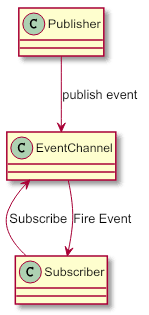
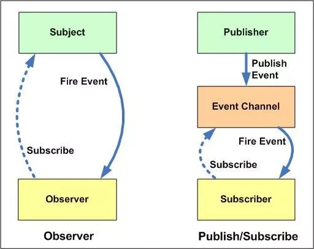

## 发布-订阅模式

发布订阅模式其实是一种对象间一对多的依赖关系，当一个对象的状态改变时，所有依赖于它的对象都将得到状态改变的通知。



订阅者`Subscriber`把自己想订阅的事件注册`Subscribe`到调度中心`Event Channel`，当发布者`Publisher`发布该事件`Publish Event`到调度中心，也就是该事件触发时，调度中心统一调度（Fire Event）订阅者注册到调度中心的处理代码。

## 实例

比如我们很喜欢看某个公众号号的文章，但是我们不知道什么时候发布新文章，要不定时的去翻阅；这时候，我们可以关注该公众号，当有文章推送时，会有消息及时通知我们文章更新了。

上面一个看似简单的操作，其实是一个典型的发布订阅模式，公众号属于发布者，用户属于订阅者；用户将订阅公众号的事件注册到调度中心，公众号作为发布者，当有新文章发布时，公众号发布该事件到调度中心，调度中心会及时发消息告知用户。

## 实现思路

1. 首先我们创建一个对象，在该对象上创建一个缓存列表（调度中心）。

2. `on` 方法用来把函数 fn 都加到缓存列表中（订阅者注册事件到调度中心）

3. `emit` 方法取到 `args` 里第一个当做 `event`，根据 event 值去执行对应缓存列表中的函数（发布者发布事件到调度中心，调度中心处理代码）。

4. `off` 方法可以根据 `event` 值取消订阅（取消订阅）。

5. `once` 方法只监听一次，调用完毕后删除缓存函数（订阅一次）。

####  Dispatcher Demo

我们先来实现一个简单的单事件发布订阅模式，只支持上面的emit和on方法。

```js
class Dispatcher {
    constructor() {
        this.handlers = [];
    }
    listen(handler) {
        this.handlers.push(handler);
    }
    emit(...args) {
        this.handlers.forEach((handler) => {
            handler(...args);
        });
    }
}
```

#### EventEmitter Demo

接下来实现一个完整版：

```js
class EventEmitter {
    constructor() {
        // 缓存列表
        this.list = {};
    }
    // 订阅
    on(event, handler) {
        // 如果对象中没有对应的 event 值，也就是说明没有订阅过，就给 event 创建个缓存列表
        // 如有对象中有相应的 event 值，把 fn 添加到对应 event 的缓存列表里
        (this.list[event] || (this.list[event] = [])).push(handler);
    }
    // 发布
    emit(...args) {
        // 第一个参数为 event，先取出
        let event = args.shift();
        // 提取订阅事件的执行回调
        let fns = [...this.list[event]];
        if (!fns || fns.length === 0) {
            return false;
        }
        fns.forEach((fn) => {
            // 将剩余参数传入回调
            fn(...args);
        });
    }
    // 监听一次
    once(event, fn) {
        // 封装成一个调用后删除自己的事件
        let onceHandler = (...args) => {
            this.off(event, on);
            fn(...args);
        };
        onceHandler.fn = fn;
        // 绑定封装的事件
        this.on(event, onceHandler);
    }
    // 取消订阅
    off(event, fn) {
        let fns = this.list[event];
        // 如果缓存列表中没有相应的 fn，返回false
        if (!fns) {
            return false;
        }
        if (!fn) {
            fns.length = 0;
        } else {
            // 若有 fn，遍历缓存列表，看看传入的 fn 与哪个函数相同，如果相同就直接从缓存列表中删掉即可
            for (let i = 0, ob = fns[i], obLen = fns.length; i < obLen; i++) {
                if (ob === fn || ob.fn === fn) {
                    // 后半部分判断是为了 once 方法
                    fns.splice(i, 1);
                    break;
                }
            }
        }
    }
}
```

## 发布-订阅模式与观察者模式的区别

很多地方都说发布-订阅模式是观察者模式的别名，但是他们真的一样吗？是不一样的。直接上图：



**`观察者模式`**：观察者（Observer）直接订阅（Subscribe）主题（Subject），而当主题被激活的时候，会触发（Fire Event）观察者里的事件。

**`发布订阅模式`**：订阅者（Subscriber）把自己想订阅的事件注册（Subscribe）到调度中心（Event Channel），当发布者（Publisher）发布该事件（Publish Event）到调度中心，也就是该事件触发时，由调度中心统一调度（Fire Event）订阅者注册到调度中心的处理代码。

#### 差异：

- 在观察者模式中，观察者是知道 Subject 的，Subject 一直保持对观察者进行记录。然而，在发布订阅模式中，发布者和订阅者不知道对方的存在。它们只有通过消息代理进行通信。
- 在发布订阅模式中，组件是松散耦合的，正好和观察者模式相反。
- 观察者模式大多数时候是同步的，比如当事件触发，Subject 就会去调用观察者的方法。而发布-订阅模式大多数时候是异步的（使用消息队列）。
- 观察者模式需要在单个应用程序地址空间中实现，而发布-订阅更像交叉应用模式。

