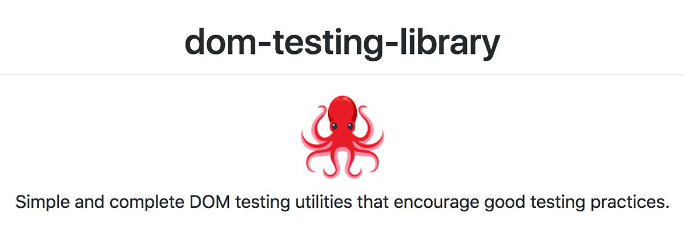

## Variants

`getBy *`

查询返回查询的第一个匹配节点，如果没有元素匹配或找到多个匹配项，则抛出错误。

`getAllBy *`

查询返回查询的所有匹配节点的数组，如果没有元素匹配，则引发错误。

`queryBy *`

查询返回查询的第一个匹配节点，如果没有元素匹配，则返回null。 这对于断言不存在的元素很有用。 如果找到多个匹配项，则抛出该异常。

`queryAllBy *`

查询返回一个查询的所有匹配节点的数组，如果没有元素匹配，则返回一个空数组（[]）。

`findBy *`

查询返回一个`promise`，该`promise`在找到与给定查询匹配的元素时解析。 如果未找到任何元素，或者在默认的1000ms超时后找到一个以上的元素，则`promise`触发`reject`回调。

## TextMatcher

一些`api`接受`TextMatch`，它可以是字符串、`regex`或函数，如果匹配就返回`true`，如果不匹配就返回`false`。

#### Precision

一些api接受一个对象作为最后的参数，它可以包含影响字符串匹配精度的选项:

- `exact`：默认为`true`，匹配完整字符串，区分大小写。当为false时，匹配子字符串并且不区分大小写。
  - 精确对正则表达式或函数参数没有影响。
  - 在大多数情况下，使用正则表达式而不是字符串可以更好地控制模糊匹配，应该比`{exact: false}`更好。

## Queries

这些查询是基本查询，需要传递一个容器作为第一个参数。大多数测试库的框架实现在使用组件呈现时都提供了这些查询的预绑定版本，这意味着不必提供容器。

#### `ByPlaceholderText`

这将搜索所有具有`placeholder`属性的元素，并找到与给定`TextMatcher`匹配的元素。

```ts
getByPlaceholderText(
  container: HTMLElement, // if you're using `screen`, then skip this argument
  text: TextMatch,
  options?: {
    exact?: boolean = true,
    normalizer?: NormalizerFn,
  }): HTMLElement
```

匹配元素：

```html
<input placeholder="Username" />
```

#### `ByText`

这将搜索具有具有与给定文本内容匹配的文本节点的所有元素(包括标签以及标签中的属性)。

```jsx
getByText(
  container: HTMLElement, // if you're using `screen`, then skip this argument
  text: TextMatch,
  options?: {
    selector?: string = '*',
    exact?: boolean = true,
    ignore?: string|boolean = 'script, style',
    normalizer?: NormalizerFn,
  }): HTMLElement
```

匹配元素：

```jsx
<a href="/about">About ℹ️</a>
```

#### `ByAltText`

```ts
getByAltText(
  container: HTMLElement, // if you're using `screen`, then skip this argument
  text: TextMatch,
  options?: {
    exact?: boolean = true,
    normalizer?: NormalizerFn,
  }): HTMLElement
```

返回具有给定alt文本的元素(通常为)。注意，它只支持接受alt属性的元素:、<input>和<area>

```html

```

## fireEvent

```typescript
fireEvent(node: HTMLElement, event: Event)
```

触发DOM事件

```javascript
// <button>Submit</button>
fireEvent(
  getByText(container, 'Submit'),
  new MouseEvent('click', {
    bubbles: true,
    cancelable: true,
  })
)
```

## fireEvent[eventName]

```typescript
fireEvent[eventName](node: HTMLElement, eventProperties: Object)
```

触发DOM事件的便利方法

```javascript
// <button>Submit</button>
const rightClick = { button: 2 }
fireEvent.click(getByText('Submit'), rightClick)
// default `button` property for click events is set to `0` which is a left click.
```

**target**:当有事件派发到一个元素上的时候，事件对象会有一个子属性`target`指向元素本身，当然我们可以通过设置`target`属性来自定义。

```javascript
fireEvent.change(getByLabelText(/username/i), { target: { value: 'a' } })

// note: attempting to manually set the files property of an HTMLInputElement
// results in an error as the files property is read-only.
// this feature works around that by using Object.defineProperty.
fireEvent.change(getByLabelText(/picture/i), {
  target: {
    files: [new File(['(⌐□_□)'], 'chucknorris.png', { type: 'image/png' })],
  },
})

Copy
```

**dataTransfer**:拖动事件有一个dataTransfer属性，该属性包含在操作期间传输的数据。为了方便起见，如果在eventProperties(第二个参数)中提供了dataTransfer属性，那么这些属性将被添加到事件中。

```javascript
fireEvent.drop(getByLabelText(/drop files here/i), {
  dataTransfer: {
    files: [new File(['(⌐□_□)'], 'chucknorris.png', { type: 'image/png' })],
  },
})

Copy
```

**Keyboard events**: 一共有有三种与键盘输入相关的事件类型—keyPress, keyDown和keyUp。在触发它们时，需要引用DOM中的元素和要触发的键。

```javascript
fireEvent.keyDown(domNode, { key: 'Enter', code: 'Enter' })

fireEvent.keyDown(domNode, { key: 'A', code: 'KeyA' })
```