# Event Loop

下文在讲解浏览器时，里面多次提到了事件循环，而 `nodejs` 中也有事件循环，只不过浏览器的 `event loop` 和它有点差异，`事件`指的是其所处理的对象就是事件本身，每一个浏览器都至少有一个事件循环，一个事件循环至少有一个任务队列。`循环`指的是其永远处于一个“无限循环”中。不断将注册的回调函数推入到执行栈。

那么事件循环究竟是用来做什么的？浏览器的事件循环和 `NodeJS` 的事件循环有什么不同？让我们从零开始，一步一步探究背后的原因。

## 浏览器工作机制

------

#### 单线程？

`JS`是单线程的，或者说只有一个主线程，也就是它一次只能执行一段代码。`JS`中其实是没有线程概念的，所谓的单线程也只是相对于多线程而言。`JS`的设计初衷就没有考虑这些，针对`JS`这种不具备并行任务处理的特性，我们称之为“单线程”。

虽然`JS`运行在浏览器中是单线程的，但是浏览器是事件驱动的（`Event driven`），浏览器中很多行为是异步（`Asynchronized`）的，会创建事件并放入执行队列中。浏览器中很多异步行为都是由浏览器新开一个线程去完成，一个浏览器至少实现三个常驻线程：

+ `JS` 引擎线程
+ `GUI` 渲染线程
+ 事件触发线程

#### JS引擎

`JavaScript`引擎是一个专门处理`JavaScript`脚本的虚拟机，一般会附带在网页浏览器之中，比如最出名的就是`Chrome`浏览器的`V8`引擎，如下图所示，`JS`引擎主要有两个组件构成：

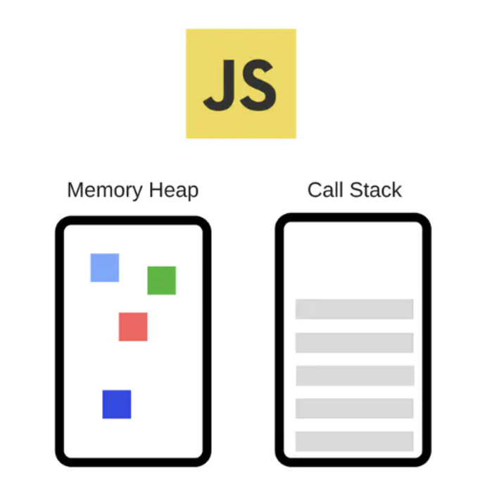 (1) 堆-内存分配发生的地方

 (2) 栈-函数调用时会形一个个栈帧（`frame`）


**执行栈**

每一个函数执行的时候，都会生成新的`execution context`（执行上下文），执行上下文会包含一些当前函数的参数、局部变量之类的信息，它会被推入栈中， `running execution context`（正在执行的上下文）始终处于栈的顶部。当函数执行完后，它的执行上下文会从栈弹出。

```js
function bar() {
	console.log('bar');
}

function foo() {
	console.log('foo');
	bar();
}

foo();
```

对应的运行时栈图：


#### DOM、WEB API、V8

现在我们有了可以执行`JS`的引擎，但是我们的目标是 构建`GUI`可视化界面，而传统的 `GUI` 界面是基于 `DOM` 构建的，因此我们需要引入 `DOM`。`DOM` 是文档对象模型，其提供了一系列 `JS` 可以直接调用的接口，理论上其可以提供其他语言的接口，而不仅仅是 `JS`。 

除了`DOM`接口可以给`JS`调用，浏览器还提供了一些`WEB API`。`WEB API`本身在浏览器中可能由 `c` 语言实现，比如 `fetch`、`File API`、`Audio API` 等等。总之不论是 `DOM` 还是 `WEB API` 都是基于其他内容的实现，但是给 `JS` 暴露了接口。

`JS`对应的`ECMA`规范，`V8`用来实现`ECMA`规范，其他的它不管。 这也是`JS`引擎和`JS`执行环境的区别，`V8`是`JS`引擎，用来执行`JS`代码，浏览器和`Node`是`JS`执行环境，其提供一些`JS`可以调用的`API`即`JS bindings`。

由于浏览器的存在，现在`JS`可以操作`DOM`和`WEB API`了，看起来是可以构建用户界面啦。 有一点需要提前讲清楚，`V8`只有栈和堆，其他诸如事件循环，`DOM`，`WEB API`它一概不知。原因前面其实已经讲过了，因为`V8`只负责`JS`代码的编译执行，你给`V8`一段`JS`代码，它就从头到尾一口气执行下去，中间不会停止。

#### GUI渲染线程

`JS`执行栈和渲染线程是相互阻塞的。为什么呢？ 本质上因为`JS`太灵活了，它可以去获取`DOM`中的诸如坐标等信息。 如果两者同时执行，就有可能发生冲突，比如我先获取了某一个`DOM`节点的`x`坐标，下一时刻坐标变了。 `JS`又用这个“旧的”坐标进行计算然后赋值给`DOM`，冲突便发生了。 解决冲突的方式有两种：

1. 限制 `JS` 的能力，你只能在某些时候使用某些 `API`。 这种做法极其复杂，还会带来很多使用不便。
2. `JS` 和渲染线程不同时执行就好了，一种方法就是现在广泛采用的`相互阻塞`。 实际上这也是目前浏览器广泛采用的方式。

## 事件循环

-----

如果我们的操作非常缓慢，例如图像处理或网络请求，该怎么办？由于 `JS` 一次只能做一件事，因此这种缓慢的操作将阻止所有其他操作，直到完成为止。在此期间，用户将无法与页面互动；浏览器只会冻结。这不是理想的，这不是实际发生的情况。

`JavaScript`并发模型与其他语言（如`C`和`Java`）不同，它基于“事件循环”。在此模型中，我们运行一个操作，并为其提供一个回调函数，该函数将在第一个操作完成时稍后执行。这样，调用堆栈不会被阻塞，并且可以向其添加其他操作。

简单说，就是在程序中设置两个线程：一个负责程序本身的运行，称为"主线程"；另一个负责主线程与其他进程（主要是各种`I/O`操作）的通信，被称为"`Event Loop`线程"（可译为"消息线程"）。

事件循环可以简单描述为：

1. 函数入栈，当`Stack`中执行到异步任务的时候，就将他丢给`WebAPIs`,接着执行同步任务,直到`Stack`为空;
2. 在此期间`WebAPIs`完成这个事件，把回调函数放入`CallbackQueue`中等待;
3. 当执行栈为空时，`Event Loop`把`Callback Queue`中的一个任务放入`Stack`中,回到第`1`步。

(1) `Event Loop`是由`javascript`宿主环境（像浏览器）来实现的;

(2) `WebAPIs`是由 `C++` 实现的浏览器创建的线程，处理诸如`DOM`事件、`http`请求、定时器等异步事件，可能分为多个线程比如 `IO` 有单独的 `IO` 线程，`UI` 有专门的 `UI` 线程。

(3) `JavaScript` 的并发模型基于"事件循环";

(4) `Callback Queue(Event Queue` 或者 `Message Queue)` 任务队列,存放异步任务的回调函数


这是浏览页面时看到的形式化信息。`JavaScript` 引擎大部分时间不执行任何操作，仅在脚本/处理程序/事件激活时运行。

任务示例：

+ `<script src="...">`加载外部脚本时，任务是执行它。
+ 用户移动鼠标时，任务是调度`mousemove`事件并执行处理程序。
+ 当计划好的时间到了时`setTimeout`，任务是运行其回调。

另外两个细节：

1. 引擎执行任务时永远不会进行渲染。任务是否花费很长时间都没关系。仅在任务完成后才绘制对DOM的更改。
2. 如果一项任务花费的时间太长，浏览器将无法执行其他任务，例如处理用户事件。因此，过了一会儿，它会发出“页面无响应”之类的警报，建议终止整个页面的任务。当存在大量复杂的计算或导致无限循环的编程错误时，就会发生这种情况。

#### 定时器的例子

我们用 `setIimeOut` 作为演示，以便我们可以看到浏览器如何处理这些异步回调：

*(1)* 该`setTimeout`是一个异步功能，我们使用来模拟一个缓慢的操作。首先，解释器通过调用开始`foobar`。

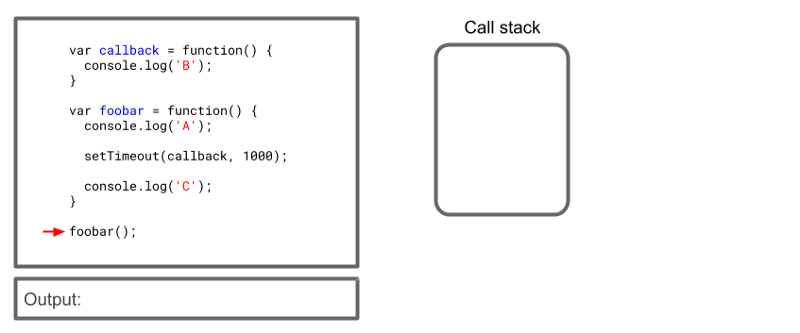

*(2)* 第二步：`foobar`添加到调用堆栈中，解释器进入，添加`console.log(‘A’)`到堆栈中，打印字母“ A”，然后从堆栈中删除调用。然后，解释器到达`setTimeout`函数并将其添加到调用堆栈。

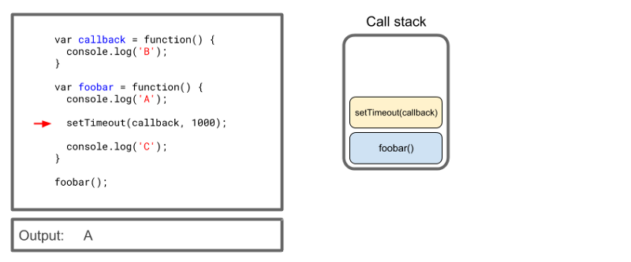

*(3)* 正如我们在本文开头`setTimeout`所述，Web API是为我们提供的。因此，它`setTimeout`在回调旁边接收到呼叫并开始处理它。 

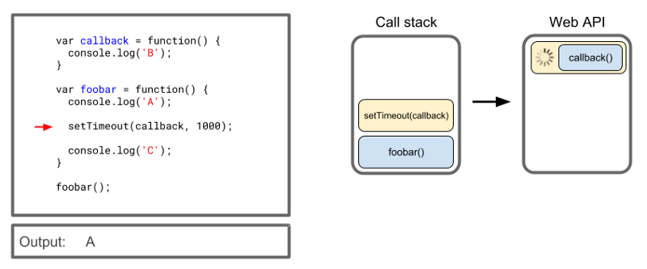

*(4)* 现在，对`setTimeout`自身的调用已完成，因此可以将其从堆栈中删除。Web API继续进行处理，但是调用堆栈不再被阻塞，因此解释器可以移至下一个命令。 

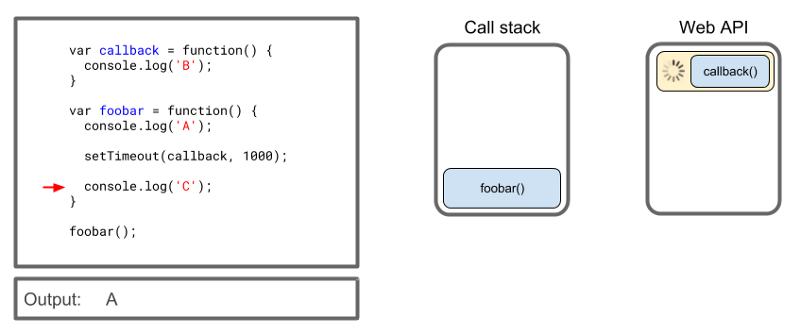

*(5)* 正常执行此下一步，并将字母'C'打印到控制台。

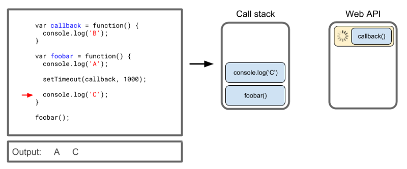

*(6)* `console.log(‘C’)`从调用堆栈中删除，这也是`foobar`因为解释器已到达函数的末尾。调用堆栈再次为空。

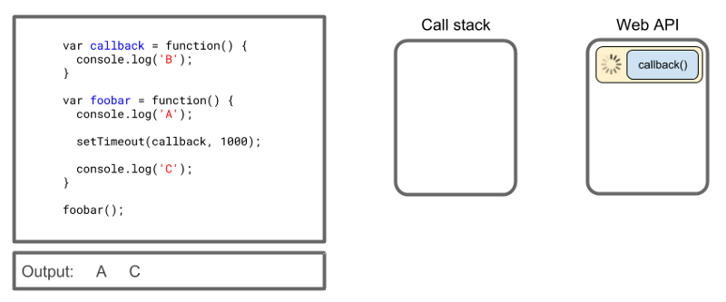

*(7)* 好的……我们快到了，但是字母“ B”呢？回调如何发送到调用堆栈，以便可以执行？异步调用完成后，回调函数将被推送到任务队列。 

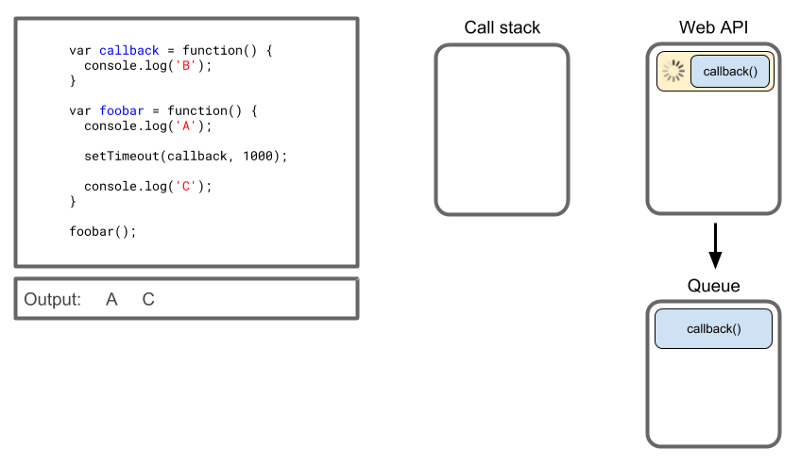

*(8)* 这是难题的最后一部分，即事件循环。事件循环有一个简单的工作：它查看调用堆栈和任务队列，如果堆栈为空，它将获取队列中的第一项并将其发送回调用堆栈。 

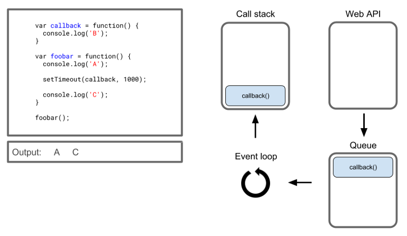

*(9)* 最后，执行回调，在控制台中打印字母“ B”，然后从调用堆栈中删除该回调。

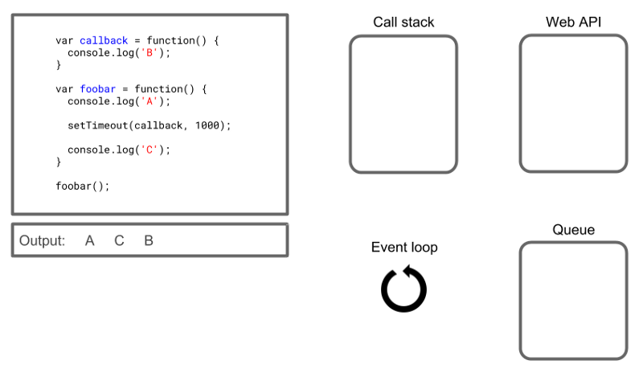

## 宏任务 `Macrotasks` 和微任务 `Microtasks`

-----

其实我们上面所说的都是宏任务`(Macrotasks)`，但是`js`中还有一种队列微任务`(Microtasks)`。

`macro-task(Task)`:一个`event loop`有一个或者多个`task`队列。`task`任务源非常宽泛，比如`ajax`的`onload`，`click`事件，基本上我们经常绑定的各种事件都是`task`任务源，还有数据库操作（`IndexedDB` ），需要注意的是`setTimeout`、`setInterval`、`setImmediate`也是`task`任务源。总结来说`task`任务源：

+ setTimeout
+ setInterval
+ setImmediate
+ I/O
+ UI rendering

`micro-task(Job)`:`microtask` 队列和`task` 队列有些相似，都是先进先出的队列，由指定的任务源去提供任务，不同的是一个 `event loop`里只有一个`microtask` 队列。另外`microtask`执行时机和`Macrotasks`也有所差异

+ process.nextTick (nodejs)
+ promises
+ Object.observe
+ MutationObserver

#### 执行优先级

宏任务和微任务的主要差别就集中在执行优先级上，我们直接使用一段代码感受一下：

```js
console.log(1)

setTimeout(() => {
  console.log(2)
}, 0)

Promise.resolve().then(() => {
	return console.log(3)
}).then(() => {
	console.log(4)
})

console.log(5)
// 1 5 3 4 2
```

浏览器对于宏任务和微任务，大概会有以下的调度规则：

+ 浏览器首先执行宏任务，也就是我们 `script`（仅仅执行一次）
+ 完成之后检查是否存在微任务，然后不停执行，直到清空队列
+ 执行宏任务

#### 事件循环算法

掌握了上面的知识之后我们就可以来了解详细的事件循环算法了，首先更丰富的事件循环图片如下所示（顺序是从上到下，即：首先是脚本，然后是微任务，渲染，等等）：

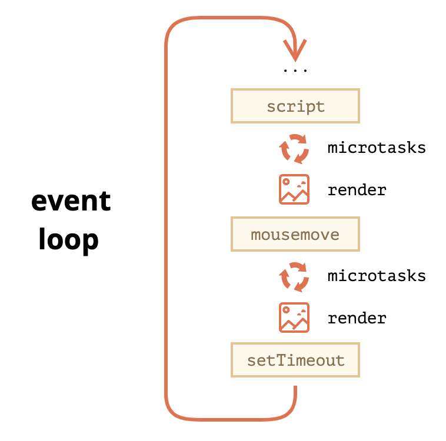

更详细的事件循环算法，比较重要的一点就是微任务和宏任务队列清空之后都会执行渲染(如果有必要的话)：

1. 从 *宏任务* 队列中出队并运行最早的任务（例如 <script> ）。
2. 执行所有微任务
   + 当微任务队列不为空时：
   + 出队并运行最旧的微任务。
3. 渲染更改（如果有）。
4. 如果宏任务队列为空，请等待直到出现宏任务。
5. 转到步骤1。

