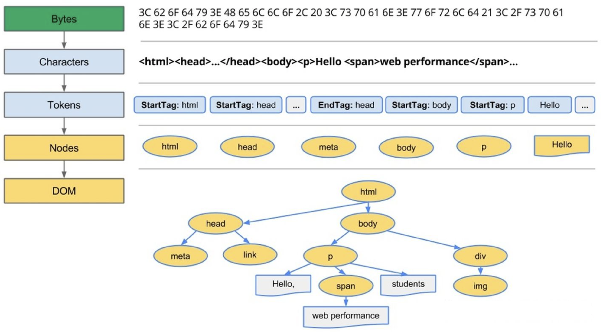
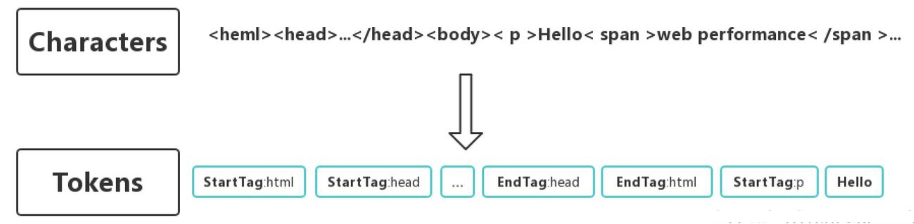
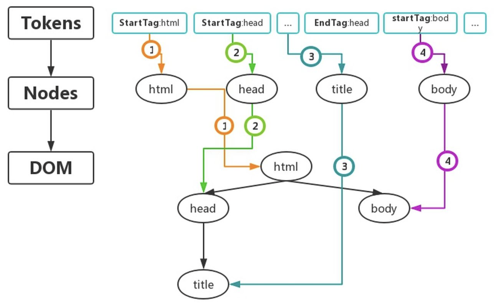
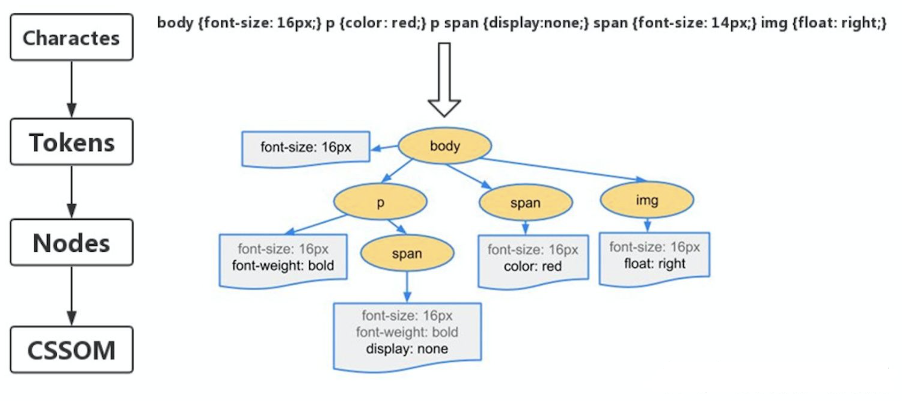
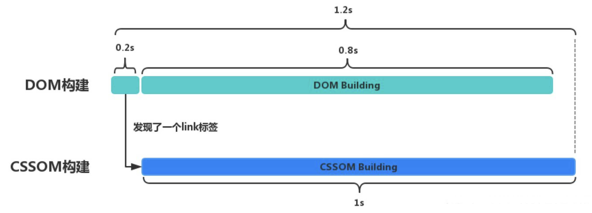
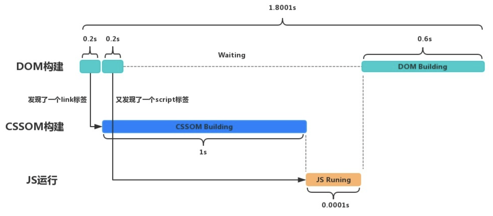
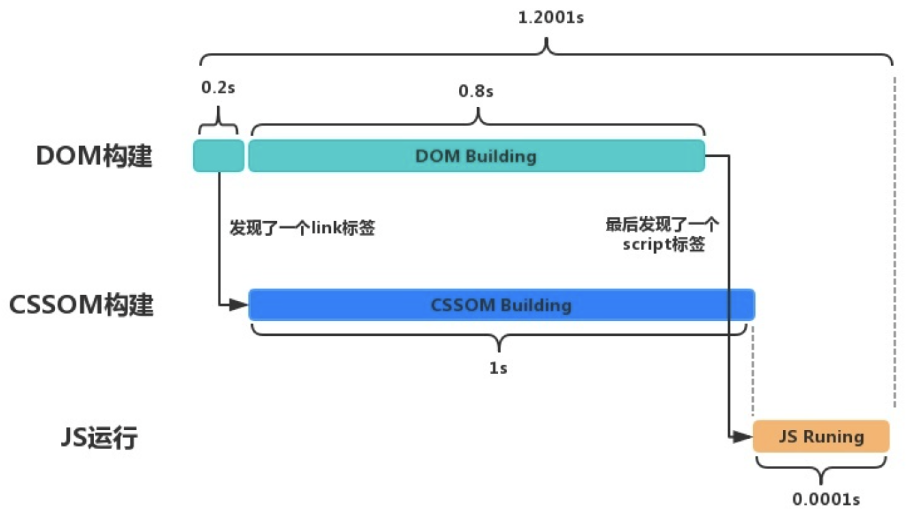
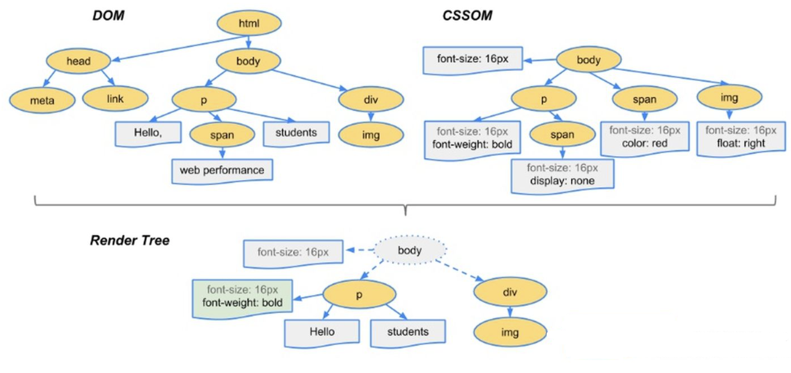
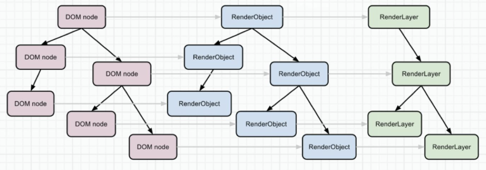
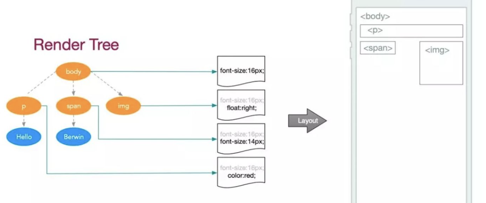

## 浏览器渲染进程

------

先来回顾一下*线程*的概念，线程是包含在每个进程内,线程是 `CPU` 调度的最小单位 (线程是建立在进程的基础上的一次程序运行单位，一个进程中可以有多个线程)。下面我们来看一下浏览器在渲染过程中主要涉及哪几个线程。

+ `GUI` 渲染线程
+ `JavaScript` 引擎线程
+ 定时触发器线程(宏任务(异步任务))
+ 事件触发线程(宏任务(异步任务))
+ 异步 `http` 请求线程(宏任务(异步任务))

## 渲染流程

-----

#### 渲染引擎——webkit和Gecko

`Firefox`使用`Geoko`——`Mozilla`自主研发的渲染引擎。

`Safari`和`Chrome`都使用`webkit`。`Webkit`是一款开源渲染引擎，它本来是为`linux`平台研发的，后来由`Apple`移植到`Mac`及`Windows`上。


本文我主要以`webkit`渲染引擎来讲解，尽管`webkit`和`Gecko`使用的术语稍有不同，他们的主要流程基本相同。浏览器将`HTML`，`CSS`，`JavaScript`代码转换成屏幕上所能呈现的实际像素，这期间所经历的一系列步骤，叫做关键渲染路径（`Critical Rendering Path`）。其中包含：

+ 构建对象模型 (`DOM`，`CSSOM`)
+ 构建渲染树 (`RenderTree`)
+ 合并
+ 布局
+ 渲染

#### 构建 DOMTree

浏览器的渲染从解析`HTML`文档开始，宏观上，可以分为下面几个步骤：



第一步（解析）：从网络或者磁盘下读取的`HTML`原始字节码，通过设置的`charset`编码，转换成相应字符：


第二步（`token`化）：通过词法分析器，将字符串解析成`Token`，`Token`中会标注出当前的`Token`是开始标签，还是结束标签，或者文本标签等。



第三步（生成Nodes并构建DOM树）：浏览器会根据Tokens里记录的`开始标签`，`结束标签`，将Tokens之间相互串联起来*（带有结束标签的Token不会生成Node）*。

`Node`包含了这个节点的所有属性。例如``标签最终生成出的节点对象中会保存图片地址等信息。

事实上，在构建`DOM`树时，不是要等所有的`Tokens`都转换成`Nodes`后才开始，而是一边生成`Token`一边采取深度遍历算法消耗`Token`来生成`Node`，如下图所示：

图中有颜色的小数字代表构建的具体步骤，可以看出，首先生成出`html Token`,并消耗`Token`创建出`html` 节点对象，接着生成`head Token`并消耗`Token`创建出`head`节点对象......，当所有的`Tokens`都消耗完了，紧接着`DOM`树也就构建完了。



> *小贴士* 
>
> 这里抛出个小问题，为什么有时在`js`中访问`DOM`时浏览器会报错呢？
>
> 因为在上述的解析的过程中，如果碰到了`script`或者`link`标签，就会根据`src`对应的地址去加载资源，在`script`标签没有设置`async/defer`属性时，这个加载过程是下载并执行完全部的代码，此时，`DOM`树还没有完全创建完毕，这个时候如果`js`企图访问`script`标签后面的`DOM`元素，浏览器就会抛出找不到该`DOM`元素的错误。

值得注意的是：从`bytes`到`Tokens`的这个过程，浏览器都可以交给其他单独的线程去处理，不会堵塞浏览器的渲染线程。但是后面的部分就都在渲染线程下进行了，而且 `v8` 的 `JS` 线程是不能和 `GUI` 线程同时执行的，所以也就是我们常说的`js`单线程环境。

#### 构建 CSSOMTree

假设浏览器收到了下面这样一段`css`:

```css
body {font-size: 16px;}
p {font-weight: bold;}
p span {display:none;}
span {color: red;}
img {float: right;}
```

最终会生成如下的`CSSOMTree`:



从图中可以看出，最开始`body`有一个样式规则是`font-size`:`16px`，之后，在`body`这个样式基础上每个子节点还会添加自己单独的样式规则，比如`span`又添加了一个样式规则`color`:`red`。正是因为样式这种类似于继承的特性，浏览器设定了一条规则：`CSSOMTree`需要等到完全构建后才可以被使用，因为后面的属性可能会覆盖掉前面的设置。比如在上面的`css`代码基础上再添加一行代码`p {font-size`:`12px}`，那么之前设置的`16px`将会被覆盖成`12px`。

#### 阻塞问题

未构建完的`CSSOMTree`是不准确的，浏览器必须等到`CSSOMTree`构建完毕后才能进入下一阶段。所以，`CSS`的加载速度与构建`CSSOMTree`的速度将直接影响首屏渲染速度，因此在默认情况下`CSS`被视为阻塞渲染的资源，需要将它尽早、尽快地下载到客户端，以便缩短首次渲染的时间。

那么回到上面生成`DOM`时提到的`JS`问题：在标签没有设置`async/defer`属性时，`js`会阻塞`DOM`的生成。原因是`js`会改变`DOMTree`的内容，如果不阻塞，会出现一边生成`DOM`内容，一边修改`DOM`内容的情况，无法确保最终生成的`DOMTree`是确定唯一的。

同理，`JS`也可以修改`CSS`样式，影响`CSSOMTree`最终的结果。而我们前面提到，不完整的`CSSOMTree`是不可以被使用的，如果`JS`试图在浏览器还未完成`CSSOMTree`的下载和构建时去操作`CSS`样式，浏览器会暂停脚本的运行和`DOM`的构建，直至浏览器完成了`CSSOM`的下载和构建。也就是说，`JS`脚本的出现会让`CSSOM`的构建阻塞`DOM`的构建。

#### 页面性能优化问题

平时谈及页面性能优化，经常会强调`css`文件应该放在`html`文档中的前面引入，`js`文件应该放在后面引入，这么做的原因是什么呢？

举个例子：本来，`DOM`构建和`CSSOM`构建是两个过程，井水不犯河水。假设`DOM`构建完成需要`1s`，`CSSOM`构建也需要`1s`，在`DOM`构建了`0.2s`时发现了一个`link`标签，此时完成这个操作需要的时间大概是`1.2s`，如下图所示：



而此时我们在`HTML`文档的中间插中入了一段`JS`代码，在`DOM`构建中间的过程中发现了这个`script`标签，假设这段`JS`代码只需要执行`0.0001s`，那么完成这个操作需要的时间就会变成：



那如果我们把`css`放到前面，`js`放到最后引入时，构建时间会变成：



由此可见，虽然只是插入了小小的一段只运行`0.0001s`的`js`代码，不同的引入时机也会严重影响`DOMTree`的构建速度。

简而言之，如果在`DOM`，`CSSOM`和`JavaScript`执行之间引入大量的依赖关系，可能会导致浏览器在处理渲染资源时出现大幅度延迟：

+ 当浏览器遇到一个`script`标签时，`DOMTree`的构建将被暂停，直至脚本执行完毕

+ `JavaScript`可以查询和修改`DOMTree`与`CSSOMTree`

+ 直至`CSSOM`构建完毕，`JavaScript`才会执行
+ 脚本在文档中的位置很重要

#### 构建渲染树

现在，我们已经拥有了完整的`DOM`树和`CSSOM`树。`DOM` 树上每一个节点对应着网页里每一个元素，`CSSOM`树上每个节点对应着网页里每个元素的样式，并且此时浏览器也可以通过 `JavaScript` 操作`DOM/CSSOM`树，动态改变它的结构。但是`DOM/CSSOM`树本身并不能直接用于排版和渲染，浏览器还会生成另外一棵树：`Render`树



接下来我们来谈几条概念

+ `Render` 树上的每一个节点被称为：`RenderObject`。

+ `RenderObject` 跟 `DOM` 节点几乎是一一对应的，当一个`可见的 DOM 节点`被添加到 DOM 树上时，内核就会为它生成对应的 RenderOject 添加到 Render 树上。

+ 其中，会被渲染成 `RenderObject` 的 `DOM` 节点不包括：

+ + 一些不会体现在渲染输出中的节点（`<html><script><link>….`），会直接被忽略掉。
  + 通过 `CSS` 隐藏的节点。例如上图中的`span`节点，因为有一个CSS显式规则在该节点上设置了`display:none`属性，那么它在生成RenderObject时会被直接忽略掉。

+ Render 树是衔接浏览器排版引擎和渲染引擎之间的**桥梁**，它是**排版引擎的输出，渲染引擎的输入**。

#### *RenderObject and RenderLayer*

浏览器渲染引擎并不是直接使用`Render`树进行绘制，为了方便处理`Positioning,Clipping,Overflow-scroll,CSS Transfrom/Opacrity/Animation/Filter,Mask or Reflection,Z-indexing`等属性，浏览器需要生成另外一棵树：`Layer`树，`Layer` 树上节点的层级是根据层叠上下文来决定的。



浏览器会为一些特定的`RenderObject`生成对应的`RenderLayer`，其中的规则是：

+ 是否是页面的根节点 `It`’`s the root object for the page`
+ 是否有`css`的一些布局属性（`relative absolute or a transform)` `It has explicit CSS position properties (relative, absolute or a transform)`
+ 是否透明 `It is transparent`
+ 是否有溢出 `Has overflow, an alpha mask or reflection`
+ 是否有`css`滤镜 `Has a CSS filter`
+ 是否包含一个`canvas`元素使得节点拥有视图上下文 `Corresponds to canvas element that has a 3D (WebGL) context or an accelerated 2D context`
+ 是否包含一个`video`元素 `Corresponds to a video element`

当满足上面其中一个条件时，这个`RrenderObject`就会被浏览器选中生成对应的`RenderLayer`。至于那些没有被命运选中的`RrenderObject`，会从属与父节点的`RenderLayer`。最终，每个`RrenderObject`都会直接或者间接的属于一个`RenderLayer`。

浏览器渲染引擎在布局和渲染时会遍历整个`Layer`树，访问每一个`RenderLayer`，再遍历从属于这个`RenderLayer`的 `RrenderObject`，将每一个 `RenderObject` 绘制出来。可以理解为：`Layer` 树决定了网页绘制的层次顺序，而从属于`RenderLayer` 的 `RrenderObject`决定了这个 `Layer` 的内容，所有的 `RenderLayer` 和 `RrenderObject` 一起就决定了网页在屏幕上最终呈现出来的内容。

#### 布局

到目前为止，浏览器计算出了哪些节点是可见的以及它的信息和样式，接下来就需要计算这些节点在设备视口内的确切位置和大小，这个过程我们称之为“布局”。布局最后的输出是一个“盒模型”：将所有相对测量值都转换成屏幕上的绝对像素。



#### 渲染

最后，既然我们知道了哪些节点可见、它们的计算样式以及几何信息，我们终于可以将这些信息传递给最后一个阶段：将渲染树中的每个节点转换成屏幕上的实际像素：浏览器通过发出“`Paint Setup`”和“`Paint`”事件，将渲染树转换成屏幕上的像素。


## 改变阻塞模式：defer 与 async

-----

上面我说了 `js` 的执行会引起 `dom`的阻塞，而在 `script` 标签上加上 `defer` 与 `async` 方式可以改变之前的那些阻塞情形。

首先，注意 `async` 与 `defer` 属性对于 `inline-script` 都是无效的，所以下面这个示例中三个 `script` 标签的代码会从上到下依次执行。

```html
<!-- 按照从上到下的顺序输出 1 2 3 -->
<script async>
  console.log("1");
</script>
<script defer>
  console.log("2");
</script>
<script>
  console.log("3");
</script>
```

#### defer

`defer` 属性表示延迟执行引入的 `JavaScript`，即这段 `JavaScript` 加载时 `HTML` 并未停止解析，这两个过程是并行的。整个 `document` 解析完毕且 `defer-script` 也加载完成之后（这两件事情的顺序无关），会执行所有由 `defer-script` 加载的 `JavaScript` 代码，然后触发 `DOMContentLoaded` 事件。

```html
<script src="app1.js" defer></script>
<script src="app2.js" defer></script>
<script src="app3.js" defer></script>
```

`defer` 不会改变 `script` 中代码的执行顺序，示例代码会按照 `1`、`2`、`3` 的顺序执行。所以，`defer` 与相比普通 `script`，有两点区别：载入 `JavaScript` 文件时不阻塞 `HTML` 的解析，执行阶段被放到 `HTML` 标签解析完成之后。

#### async

`async` 属性表示异步执行引入的 `JavaScript`，与 `defer` 的区别在于，如果已经加载好，就会开始执行——无论此刻是 `HTML` 解析阶段还是 `DOMContentLoaded` 触发之后。

```html
<script src="app.js" async></script>
<script src="ad.js" async></script>
<script src="statistics.js" async></script>
```

从上一段也能推出，多个 `async-script` 的执行顺序是不确定的。值得注意的是，向 `document` 动态添加 `script` 标签时，`async` 属性默认是 `true`，这个在 `jsonp` 中比较常见。