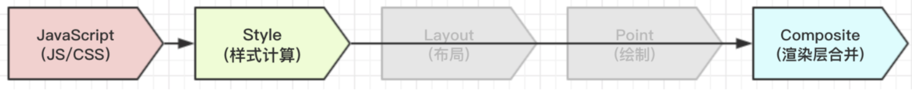

## 浏览器的渲染过程

-----

想要对浏览器的渲染过程进行优化，就需要详细理解浏览器渲染中的一个关键环节：**Composite（渲染层合并）**，它所做的事情和带来的效果。先来看一些概念：

+ `DOM Tree`：浏览器将`HTML`解析成树形的数据结构。

+ `Style Rules`：浏览器将`CSS`解析成树形的数据结构，对应我们的`CSSOM`。

+ `Render Tree`：`DOM`和`CSSOM`合并后生成`Render Tree`。

+ `layout`： 布局。有了`Render Tree`，浏览器已经能知道网页中有哪些节点、各个节点的`CSS`定义以及他们的从 属关系，从而去计算出每个节点在屏幕中的位置。

+ `painting`： 渲染。按照算出来的规则，通过显卡，把内容画到屏幕上。

+ `reflow`（回流/重排）：当浏览器发现某个部分发生了点变化影响了布局，需要倒回去重新渲染，这个回退的过程叫 `reflow`。

  > *Dirty 位系统*
  >
  > 为了避免所有细小的更改都要从根节点进行整体布局，浏览器采用了一种“`dirty` 位”系统。如果某个`RenderTree`上的`Node`发生了更改，便将自身标注为“`dirty`”，表示需要进行布局。有两种标记：“`dirty`”和“`children are dirty`”。“`children are dirty`”表示尽管呈现器自身没有变化，但它至少有一个子代需要布局`reflow`时，浏览器会对`Render Tree`进行遍历，而仅仅只对标注了“`dirty` “的`Node`进行布局。

+ `repaint`（重绘）：改变某个元素的背景色、文字颜色、边框颜色等等不影响它周围或内部布局的属性时，屏幕的一部分要重画，但是元素的几何尺寸没有变。

上面的过程可以合并成：

实际场景下，渲染流程可以分为三种，`layout`和`point`这个过程是可以避免的：

显而易见，第三种渲染流程浏览器的处理是最快的，那什么情况下的渲染是第三种情况呢，这里就不得不提到**Compsite**了

#### Compsite

上一节我们提到，浏览器渲染时，对渲染树有着一个 `RenderObject -> RenderLayout` 的转换过程：

实际上，`Chrome`拥有两套不同的渲染路径：硬件加速路径(也就是所说的 `GPU` 加速)和旧软件路径。

硬件加速路径会将一些图层的合成交给`GPU`处理，比`CPU`处理更快，而我们的`RenderLayout`（有些地方又称作`PaintLayers`）并不能作为`GPU`的输入，这里会将`RenderLayout`再转换成`GraphicsLayers`：

> 某些特殊的`RenderLayout`会被认为是合成层（`Compositing Layers`），合成层拥有单独的 `GraphicsLayer`，而其他不是合成层的渲染层，则和其第一个拥有 `GraphicsLayer` 父层公用一个。
>
> 而每个`GraphicsLayer`（合成层单独拥有的图层） 都有一个 `GraphicsContext`，`GraphicsContext` 会负责输出该层的位图，位图是存储在共享内存中，作为纹理上传到 `GPU` 中，最后由 `GPU` 将多个位图进行合成，然后显示到屏幕上。

很绕口对不对`= =`，人性话来说，与`RenderObject`转换成`RenderLayer`一样，浏览器也是根据“某些规则”，选中一些特殊的`RenderLayout`节点（天选之子），这些节点将被称为`Compositing Layers`，`Compositing Layers`与其他的普通节点不一样的是他们拥有自己的`GraphicsLayer`，而那些没有被选中的节点，会和父层公用一个`GraphicsLayer`。

每个`GraphicsLayer`都拥有`GraphicsContext`，`GraphicsContext`输出的位图会作为纹理上传到`GPU`中。

`Chrome` 使用纹理来从 `GPU`上获得大块的页面内容。通过将纹理应用到一个非常简单的矩形网格就能很容易匹配不同的位置`(position)`和变形`(transformation)`。这也就是`3DCSS` 的工作原理，它对于快速滚动也十分有效。

#### RenderLayer -> GraphicsLayer，合成层的创建标准

什么情况下能使元素获得自己的层？虽然 `Chrome`的启发式方法`(heuristic)`随着时间在不断发展进步，但是从目前来说，满足以下任意情况便会创建层：

+ `3D` 或隐式变换`(perspective transform) CSS` 属性
+ 使用加速视频解码的 元素 拥有 `3D`
+ ``(WebGL)` 上下文或加速的 `2D` 上下文的 元素
+ 混合插件(如 `Flash)`
+ 对自己的 `opacity` 做 `CSS`动画或使用一个动画变换的元素
+ 拥有加速 `CSS` 过滤器的元素
+ 元素有一个包含复合层的后代节点(换句话说，就是一个元素拥有一个子元素，该子元素在自己的层里)
+ 元素有一个`z-index`较低且包含一个复合层的兄弟元素(换句话说就是该元素在复合层上面渲染)

#### 合成层的性能优化：

对于提升为合成层有以下几个好处：

+ 合成层的位图，会交由 `GPU` 合成，比 `CPU` 处理要快
+ 当需要 `repaint` 时，只需要 `repaint` 本身，不会影响到其他的层
+ 对于 `transform` 和 `opacity` 效果，不会触发 `layout` 和 `paint` （当当当，这里就是第三种渲染模式的场景）

同时要注意：

+ 提升到合成层后合成层的位图会交`GPU`处理，但请注意，仅仅只是合成的处理（把绘图上下文的位图输出进行组合）需要用到`GPU`，生成合成层的位图处理（绘图上下文的工作）是需要`CPU`。
+ 当需要`repaint`的时候可以只`repaint`本身，不影响其他层，但是`paint`之前还有`style`， `layout`，就意味着即使合成层只是`repaint`了自己，但`style`和`layout`本身很占用时间。
+ 仅仅是`transform`和`opacity`不会引发`layout` 和`paint`，那么其他的属性不确定。

总结来说，一般一个元素开启硬件加速后会变成合成层，可以独立于普通文档流中，改动后可以避免整个页面重绘，提升性能。

那么针对上面这些特点，可以做的性能优化有：

**提升动画效果的元素**

合成层的好处是不会影响到其他元素的绘制，因此，为了减少动画元素对其他元素的影响，从而减少`paint`，我们需要把动画效果中的元素提升为合成层。

提升合成层的最好方式是使用 `CSS` 的`will-change`属性。从上一节合成层产生原因中，可以知道 `will-change` 设置为`opacity`、`transform`、`top`、`left`、`bottom`、`right` 可以将元素提升为合成层。对于不支持`will-change`的浏览器版本，可以加上`transform`属性，比如：`transform`: `translateZ(0)`

**使用 transform 或者 opacity 来实现动画效果**

上文提到`transform`和`opaciry`属性不会引发`layout`和`paint`，值得注意的是，只有元素提升到合成层后才不会引发，普通元素修改`transform`和`opacity`还是会引发的。

**减少绘制区域**

对于不需要重新绘制的区域应尽量避免绘制。

比如一个 `fix` 在页面顶部的固定不变的导航`header`，当页面内容某个区域 `repaint` 时，在没有提升为合成层时，整个屏幕包括 `fix` 的 `header` 也会被重绘。而对于固定不变的区域，我们期望其并不会被重绘，因此可以通过之前的方法，将其提升为独立的合成层。