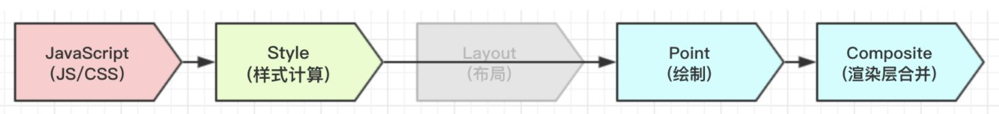
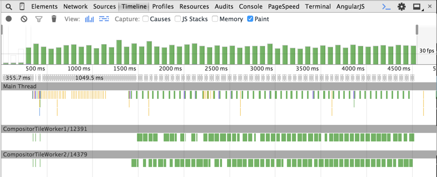
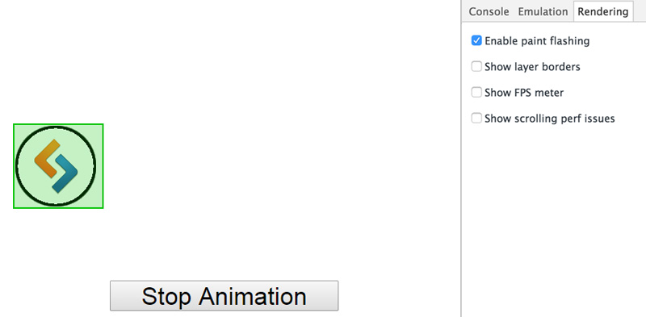
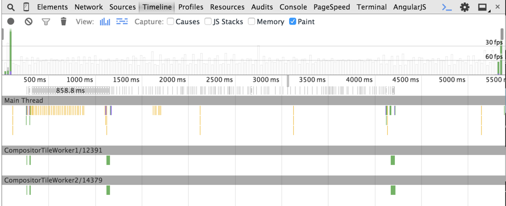
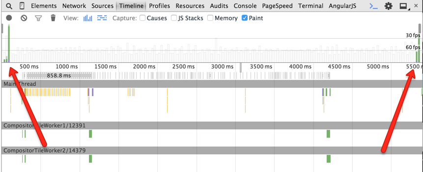
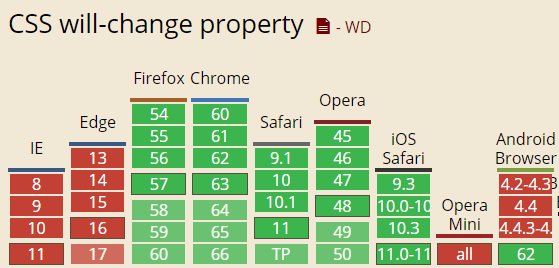

## 动画原理以及性能优化

-----

上一文中我们介绍了渲染层合并，再上一集中我们还提到过一个 *RenderObject and RenderLayer* 也就是 *RenderTree* 转换为 *LayerTree* 的过程。而动画的一个基本原理就是我们实现动画的层一般都是一个独立的层，不会引起重排:



那么什么时候会产生一个新的层呢？这就涉及到了层叠上下文(参见`css3`的笔记)，大概有如下的几种情况：

- 包含有`position:absolute|relative`的定位元素，**当其`z-index`值不是`auto`的时候**，会创建层叠上下文。
- `position` 值为 `fixed|sticky`，会创建层叠上下文。

- `z-index`值不为`auto`的`flex-item`。(父元素`display:flex|inline-flex`)。
- 元素的`opacity`值不是`1`
- 元素的`transform`值不是`none`
- 元素的`mix-blend-mode`值不是`normal`
- 元素的`filter`值不是`none`
- 元素的`isolation`值是`isolate`
- 元素的`will-change`指定的属性值为上面任意一个
- 元素的`-webkit-overflow-scrolling`设为`touch`

可以看到我们经常使用的绝对定位动画和 `transform` 动画，都会创建一个独立的层，所以只会引起重绘不会引起重排。

#### 利用绝对定位+`top/left`实现动画

下图 `timeline` 数据中的绿色条纹表示的就是使用 `top` 和 `left` 实现动画时浏览器发生的 repaint 操作，从中可以看出动画帧数远低于`60` 帧。



从 `chrome` 的开发者工具按 `ESC` 之后选择 “`rendering`” 面板，我们可以通过选中“`Enable piant flashing`”来进一步监测 `repaint` 操作。开启该选项后，页面中的 `repaint` 区域就会被绿色蒙版高亮显示出来。重新使用 `top` 和 `left` 的示例演示的话，你会发现包裹球的那块区域会一直闪烁绿色的蒙版。



按照常理来说，改变元素位置会产生重排，为什么上面图中显示的全是重绘呢？原因是绝对定位会建立一个新的图层，而此图层上只有当前一个元素，多以只会重绘，而不会重排。这也告诉我们，在同一层中，元素数量少的情况下，重排性能对更好，速度会更快。

#### `transform2D`实现动画

下图是使用CSS transform 检测到的数据：



如你所见，动画演示期间并没有过多的 `repaint` 操作。那么，为什么 `transform` 没有触发 `repaint` 呢？简而言之，`transform` 动画由 `GPU` 控制，支持硬件加速，并不需要软件方面的渲染。

#### 硬件加速原理

上一节我们提到了硬件加速原理，这一节我们来重温一下，浏览器接收到页面文档后，会将文档中的标记语言解析为DOM树。DOM树和CSS结合后形成浏览器构建页面的渲染树。渲染树中包含了大量的渲染元素，每一个渲染元素会被分到一个图层中，每个图层又会被加载到GPU形成渲染纹理，而图层在GPU中`transform` 是不会触发 repaint 的，最终这些使用 `transform` 的图层都会由独立的合成器进程进行处理。

在我们的示例中，CSS `transform` 创建了一个新的复合图层，可以被GPU直接用来执行 `transform` 操作。在chrome开发者工具中开启 `show layer borders` 选项后，每个复合图层就会显示一条黄色的边界：

同时上一篇文章中我们还提到了，会创建复合图层的几种情况：

+ `3D` 或隐式变换`(perspective transform) CSS` 属性
+ `<video>` 和 `<canvas>` 标签
+ `CSS filters`
+ `opcaity: 0-1`

可是上面为什么我们要把 `3D transform` 从 `css transform` 属性中单独拿出来呢？



在`timeline`中我们可以看到：动画开始和结束的时候发生了两次 `repaint` 操作。

这是因为**3D 和 2D transform 的区别**就在于，浏览器在页面渲染前为`3D`动画创建独立的复合图层，而在运行期间为`2D`动画创建。动画开始时，生成新的复合图层并加载为`GPU`的纹理用于初始化 `repaint`。然后由`GPU`的复合器操纵整个动画的执行。最后当动画结束时，再次执行 `repaint` 操作删除复合图层。

#### 强制GPU渲染

并不是所有的`CSS`属性都能触发`GPU`的硬件加速（图层在`GPU`中属性改变不会触发 `repaint` ），实际上只有少数属性可以，比如下面的这些：

为了避免 `2D transform` 动画在开始和结束时发生的 `repaint` 操作，我们可以硬编码一些样式来解决这个问题：

```css
.example1 {
  transform: translateZ(0);
}

.example2 {
  transform: rotateZ(360deg);
}
```

这段代码的作用就是让浏览器执行 `3D transform`。浏览器通过该样式创建了一个独立图层，图层中的动画则有`GPU`进行预处理并且触发了硬件加速。

如果某一个元素的背后是一个复杂元素，那么该元素的 `repaint` 操作就会耗费大量的资源，此时也可以使用上面的技巧来减少性能开销。

#### GPU渲染的问题

使用硬件加速并不是十全十美的事情，比如：

+ 内存。如果 `GPU` 加载了大量的纹理，那么很容易就会发生内容问题，这一点在移动端浏览器上尤为明显，所以，一定要牢记不要让页面的每个元素都使用硬件加速。
+ 使用 `GPU` 渲染会影响字体的抗锯齿效果。这是因为 `GPU` 和 `CPU` 具有不同的渲染机制。即使最终硬件加速停止了，文本还是会在动画期间显示得很模糊。

#### will-change

CSS3 `will-change`属于web标准属性，虽然目前还是草案阶段，但出现已经有些时日了，[兼容性](http://caniuse.com/will-change/embed)这块Chrome/FireFox/Opera都是支持的。



我们可能听听说过，`3D transform`会启用`GPU`加速，例如`translate3D`, `scaleZ`之类，但是呢，这些属性业界往往称之为`hack`加速法。我们实际上不需要`z`轴的变化，但是还是假模假样地声明了，欺骗浏览器，这其实是一种不人道的做法。

当我们通过某些行为（点击、移动或滚动）触发页面进行大面积绘制的时候，浏览器往往是没有准备的，只能被动使用`CPU`去计算与重绘，由于没有事先准备，应付渲染够呛，于是掉帧，于是卡顿。而`will-change`则是真正的行为触发之前告诉浏览器：“浏览器同学，我待会儿就要变形了，你心理和生理上都准备准备”。于是乎，浏览器同学把`GPU`给拉上了，从容应对即将到来的变形。

MDN上显示该属性语法如下：

```css
/* 关键字值 */
will-change: auto;
will-change: scroll-position;
will-change: contents;
will-change: transform;        /* <custom-ident>示例 */
will-change: opacity;          /* <custom-ident>示例 */
will-change: left, top;        /* 两个<animateable-feature>示例 */

/* 全局值 */
will-change: inherit;
will-change: initial;
will-change: unset;
```

其中：
**auto** 就跟`width:auto`一样，实际上没什么卵用，昨天嘛，估计就是用来重置其他比较屌的值。

**scroll-position** 告诉浏览器，我要开始翻滚了。

**contents** 告诉浏览器，内容要动画或变化了。

**<custom-ident>** 非规范称呼，应该是MDN自己的称呼，以后可能会明确写入规范。比方说`animation`的名称，计数器`counter-reset`, `counter-increment`定义的名称等等。

上面展示了2个例子，一个是`transform`一个是`opacity`，都是CSS3动画常用属性。如果给定的属性是缩写，则所有缩写相关属性变化都会触发。同时不能是以下这些关键字值：`unset`, `initial`, `inherit`, `will-change`, `auto`, `scroll-position`, 或 `contents`.

**<animateable-feature>** 可动画的一些特征值。比方说`left`, `top`, `margin`之类。移动端，非`transform`, `opacity`属性的动画性能都是低下的，所以都是建议避免使用`left`/`top`/`margin`之流进行唯一等。但是，如果你觉得自己是`margin`属性奶大的，非要使用之，试试加个`will-change:margin`说不定也会很流畅（移动端目前支持还不是很好）。

就目前而言，使用的基本上都是：

```css
.example {
  will-change: transform;
}
```

`will-change`虽然可以加速，但是，一定一定要适度使用。那种全局都开启`will-change`等待模式的做法，无疑是死路一条。尼玛，用脚趾头想想也知道，你让浏览器各个元素都随时GPU渲染加速待命，还是妥妥搞死！

不要这样直接写在默认状态中，因为`will-change`会一直挂着：

```css
.will-change {
  will-change: transform;
  transition: transform 0.3s;
}
.will-change:hover {
  transform: scale(1.5);
}
```

可以让父元素hover的时候，声明`will-change`，这样，移出的时候就会自动`remove`，触发的范围基本上是有效元素范围。

```css
.will-change-parent:hover .will-change {
  will-change: transform;
}
.will-change {
  transition: transform 0.3s;
}
.will-change:hover {
  transform: scale(1.5);
}
```