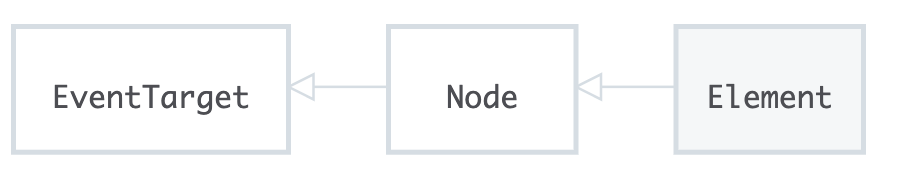
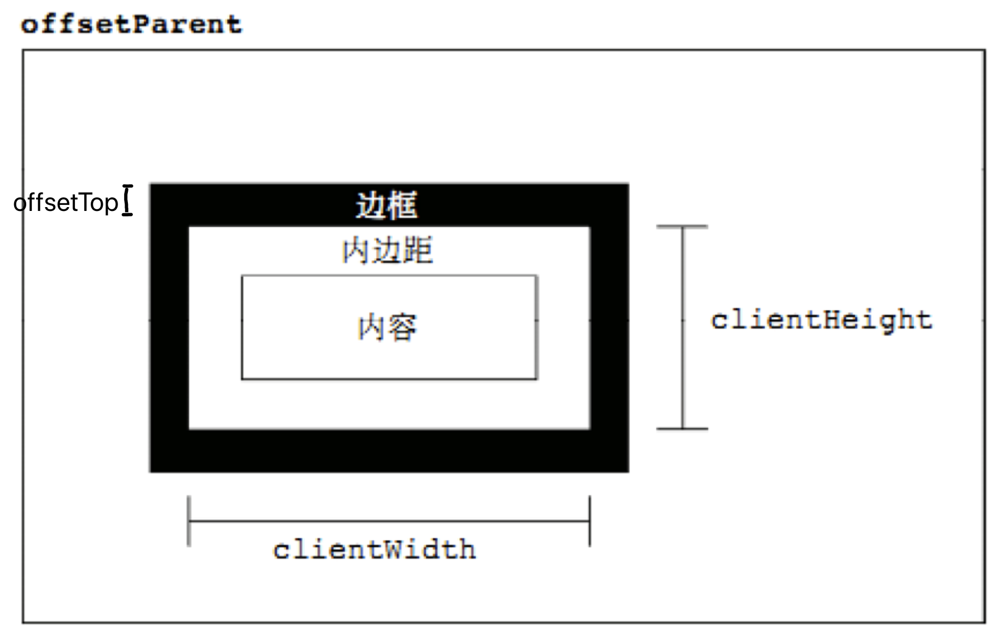

## DOMTokenList

-------

`DOMTokenList` 接口表示一组空格分隔的标记（`tokens`）。如由 `Element.classList`、`HTMLLinkElement.relList`返回的一组值。它和 `JavaScript Array` 对象一样，索引从 `0` 开始。

#### 属性

**DOMTokenList.length**

一个整数，表示存储在该对象里值的个数。

**DOMTokenList.value**

该属性以 `DOMString` 的形式返回 `DOMTokenList` 列表的值。

#### 方法

**DOMTokenList.item(index)**

根据传入的索引值返回一个值，如果索引值大于等于符号列表的长度（`length`），则返回 `undefined` 或 `null`，在 `Gecko 7.0` 之前的版本中返回 `null`。

**DOMTokenList.contains(token)**

如果 `DOMTokenList` 列表中包括相应的字符串 `token`，则返回 `true`，否则返回 `false`。

**DOMTokenList.add(token1[, token2[, ...tokenN]])**

添加一个或多个标记（`token`）到 `DOMTokenList` 列表中。

**DOMTokenList.remove(token1[, token2[, ...tokenN]])**

从 `DOMTokenList` 列表中移除一个或多个标记（`token`）。

**DOMTokenList.replace(oldToken, newToken)**

使用 `newToken` 替换 `token` 。

**DOMTokenList.values()**

返回一个迭代器（`iterator`）以遍历这个对象中所有键值对的值。

## Element

------

`Element` 是一个通用性非常强的基类，所有 `Document` 对象下的对象都继承自它。这个接口描述了所有相同种类的元素所普遍具有的方法和属性。一些接口继承自 `Element` 并且增加了一些额外功能的接口描述了具体的行为。例如， `HTMLElement` 接口是所有 `HTML` 元素的基本接口，而 `SVGElement` 接口是所有 `SVG` 元素的基础。



> *注意⚠️：* 除了 `Node`， `Element` 还继承于 `ParentNode` 和 `ChildNode`。

#### 属性

**Element.attributes**

``Element.attributes`` 属性返回该元素所有属性节点的一个实时集合。该集合是一个 ``NamedNodeMap`` 对象，不是一个数组，所以它没有 数组 的方法，其包含的 属性 节点的索引顺序随浏览器不同而不同。每一个索引对应着一个 `Attr` 类型。

```js
if (ele.hasAttributes()) {
  var attrs = ele.attributes;
  for(var i=attrs.length-1; i>=0; i--) {
		console.log(attrs[i].name + "->" + attrs[i].value);
  }
}
```

**Element.classList**

返回该元素包含的 `class` 属性，是一个 `DOMTokenList`。

**Element.className**

一个 `DOMString` (`String`)，表示这个元素的 `class`。

**Element.id**

是一个`DOMString` 表示这个元素的`id`。

**Element.innerHTML**

是一个`DOMString` 表示这个元素的内容文本。

------

**Element.clientHeight**

这个属性是只读属性，对于没有定义`CSS`或者内联布局盒子的元素为`0`，否则，它是元素内部的高度(单位像素)，包含内边距，但不包括水平滚动条、边框和外边距。

`clientHeight` 可以通过 CSS `height` + CSS `padding` - 水平滚动条高度 (如果存在)来计算.

**Element.clientWidth**

和 `clientHeight` 行为一致。

**Element.clientTop**

一个元素顶部边框的宽度（以像素表示）。不包括顶部外边距或内边距。`clientTop` 是只读的。

**Element.clientLeft**

表示一个元素的左边框的宽度，以像素表示。如果元素的文本方向是从右向左（RTL, right-to-left），并且由于内容溢出导致左边出现了一个垂直滚动条，则该属性包括滚动条的宽度。`clientLeft` 不包括左外边距和左内边距。



------

**Element.scrollWidth**

**`Element.scrollWidth`** 这个只读属性是元素内容宽度的一种度量，包括由于overflow溢出而在屏幕上不可见的内容。

`scrollWidth`值等于元素在不使用水平滚动条的情况下适合视口中的所有内容所需的最小宽度。 宽度的测量方式与`clientWidth`相同：它包含元素的内边距，但不包括边框，外边距或垂直滚动条（如果存在）。 它还可以包括伪元素的宽度，例如::`before`或::`after`。 

**Element.scrollHeight**

`Element.scrollHeight` 这个只读属性是一个元素内容高度的度量，包括由于溢出导致的视图中不可见内容。包括元素的`padding`，但不包括元素的`border`和`margin`。`scrollHeight`也包括 ::`before` 和 ::`after`这样的伪元素。

**Element.scrollLeft**

`Element.scrollLeft` 属性可以读取或设置元素滚动条到元素左边的距离。最开始这个值为 `0`，当你不断向右拖动滚动条的时候，这个值会不断的增大。

**Element.scrollTop**

`Element.scrollTop` 属性可以获取或设置一个元素的内容垂直滚动的像素数。

一个元素的 `scrollTop` 值是这个元素的内容顶部(不包括内边距)（卷起来的）到它的视口可见内容 (不包括边框)（的顶部）的距离的度量。当一个元素的内容没有产生垂直方向的滚动条，那么它的 `scrollTop` 值为`0`。


#### 方法

**Element.animate()**

在元素上创建和运行动画的快捷方式。返回创建的 `Animation` 对象实例。

**Element.getAnimations()**

返回当前在元素上活动的 `Animation` 对象的数组。

---------

**Element.getBoundingClientRect()**

`Element.getBoundingClientRect()**` 方法返回元素的大小及其相对于视口的位置。

如果是标准盒子模型，元素的尺寸等于`width/height` + `padding` + `border-width`的总和。如果`box-sizing: border-box`，元素的的尺寸等于 `width/height`。

```js
let rectObject = element.getBoundingClientRect();
```

返回值是一个 `DOMRect` 对象，就是该元素的 `CSS` 边框大小。返回的结果是包含完整元素的最小矩形，并且拥有`left, top, right, bottom, x, y, width`, 和 `height`这几个以像素为单位的只读属性用于描述整个边框。除了`width` 和 `height` 以外的属性是相对于视图窗口的左上角来计算的。


当计算边界矩形时，会考虑视口区域（或其他可滚动元素）内的滚动操作，也就是说，当滚动位置发生了改变，`top`和`left`属性值就会随之立即发生变化（它们的值是相对于视口，不是绝对的）。

如果你需要获得相对于整个网页左上角定位的属性值，那么只要给top、left属性值加上当前的滚动位置（通过 `window.scrollX` 和 `window.scrollY`），可以获取与当前的滚动位置无关的值。

------

**Element.scrollTo()**

滚动到给定元素内的一组特定坐标，其行为和 `scroll` 完全一致，可以使用 `x` 和 `y` 的坐标(不带 `px`)作为参数：

```js
element.scrollTo(x-coord, y-coord)
```

也接收一个 `ScrollToOption` 作为参数：

+ `ScrollToOptions.top`: 指定 `window` 或元素 `Y` 轴方向滚动的像素数。
+ `ScrollToOptions.left`: 指定 `window` 或元素 `X` 轴方向滚动的像素数。
+ `ScrollToOptions.behavior`: 指定滚动是否应该平滑进行 `smooth`，还是立即跳到指定位置 `auto`。

```js
element.scrollTo({
  	left: leftInput.value,
    top: topInput.value,
    behavior: scrollInput.checked ? 'smooth' : 'auto'
})
```

**Element.scrollBy()**

按给定数量滚动元素，和上面的 `scrollTo` 行为完全一致。

-------

**Element.getAttribute()**

返回元素上一个指定的属性值。如果指定的属性不存在，则返回  `null` 或 `""` （空字符串）。

**Element.getAttributeNode()**

返回指定元素的指定属性节点：

```js
var attrNode = element.getAttributeNode(attrName);
```

**Element.getAttributeNames()**

返回当前元素的属性名称数组。

**Element.hasAttribute()**

返回一个 `Boolean` 指示元素是否具有指定属性的指示。

**Element.removeAttribute()**

从当前节点删除命名属性。

**Element.removeAttributeNode()**

从当前节点中删除命名属性的节点表示形式。

**Element.setAttribute()**

设置当前节点的命名属性的值:

```js
element.setAttribute(name, value);
```

**Element.toggleAttribute()**

在指定的元素上切换布尔属性，如果存在，则将其删除；如果不存在，则将其添加。

```js
Element.toggleAttribute(name [, force]);
```

+ `name`: 一个DOMString被触发的属性指定名称。toggleAttribute()在HTML文档中的HTML元素上调用属性名称时，属性名称将自动转换为所有小写字母。
+ `force`: 一个布尔值，用于确定是否应添加或删除该属性，而不管此刻是否存在该属性。

------

**Element.getElementsByClassName()**

参数中指定类的列表，返回一个动态的`HTMLCollection`，包含了所有持有这些类的后代元素。

```js]
var elements = element.getElementsByClassName(names);
```

+ `names` 是一个字符串，表示要匹配的类名（`class names`）列表；类名被空白符分隔。

**Element.getElementsByTagName()**

从当前元素返回一个 `HTMLCollection` 包含所有具有特定标签名称的后代元素的实时对象。

```js
elements = element.getElementsByTagName(tagName)
```

+ `tagName` 要查找的限定名。 字符 `"*"` 代表所有元素。 考虑到兼容XHTML，应该使用小写。

**Element.querySelector()**

返回与指定的 `css` 选择器组匹配的元素的后代的第一个元素。

```js
element = baseElement.querySelector(selectors);
```

+ `selectors`: 一组用来匹配 `Element baseElement` 后代元素的选择器 `selectors`；必须是合法的 `css` 选择器，否则会引起语法错误。返回匹配指定选择器的第一个元素。

**Element.querySelectorAll()**

返回 `NodeList` 相对于元素与指定选择器字符串匹配的节点的。

**Element.matches()**

返回一个，`Boolea` n指示是否通过指定的选择器字符串选择该元素。