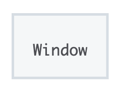

## Window

----

`window` 对象表示一个包含`DOM`文档的窗口，其 `document` 属性指向窗口中载入的 `DOM`文档 。使用 `document.defaultView` 属性可以获取指定文档所在窗口。

`window`作为全局变量，代表了脚本正在运行的窗口，暴露给 `Javascript` 代码。

在有标签页功能的浏览器中，每个标签都拥有自己的 `window` 对象；也就是说，同一个窗口的标签页之间不会共享一个 `window` 对象。有一些方法，如 `window.resizeTo` 和 `window.resizeBy` 之类的方法会作用于整个窗口而不是 `window` 对象所属的那个标签。一般而言，如果一样东西无法恰当地作用于标签，那么它就会作用于窗口。



#### 属性

**Window.closed** 只读

这个属性指示当前窗口是否关闭。

**Window.devicePixelRatio** 只读

返回当前显示器的物理像素和设备独立像素的比例。

**Window.document** 只读

返回对当前窗口所包含文档的引用。

**Window.history** 只读

返回一个对 history 对象的引用。

**Window.name**

获取/设置窗口的名称。

------

**Window.innerHeight** 只读

获得浏览器窗口的内容区域的高度，包含水平滚动条(如果有的话)。

**Window.innerWidth** 只读

获得浏览器窗口的内容区域的宽度，包含垂直滚动条(如果有的话)。

**Window.outerHeight** 只读

返回浏览器窗口的外部高度。

**Window.outerWidth** 只读

返回浏览器窗口的外部宽度。

**Window.scrollX** 只读

返回文档在水平方向已滚动的像素值。

**Window.scrollY** 只读

返回文档在垂直方向已滚动的像素值。

#### 方法

**Window.close()**

Closes the current window.

**Window.focus()**

Sets focus on the current window.

**Window.resizeBy()**

将当前窗口调整到一定的大小。

**Window.resizeTo()**

动态调整窗口。

**Window.scroll()**

滚动窗口到文档中的特定位置，其行为和 `element` 上的一致。

**Window.scrollBy()**

按给定的数量在窗口中滚动文档。

**Window.scrollTo()**

滚动到文档中的特定坐标集。

**Window.getComputedStyle()**

`Window.getComputedStyle()`方法返回一个对象，该对象在应用活动样式表并解析这些值可能包含的任何基本计算后报告元素的所有CSS属性的值。 私有的CSS属性值可以通过对象提供的API或通过简单地使用CSS属性名称进行索引来访问。

```js
let style = window.getComputedStyle(element, [pseudoElt]);
```

+ `pseudoElt`: 指定一个要匹配的伪元素的字符串。必须对普通元素省略（或`null`）。

#### 事件

**onresize**

Called continuously as you are resizing the window.

**onscroll**

Called when the scroll bar is moved via ANY means. If the resource fully fits in the window, then this event cannot be invoked

