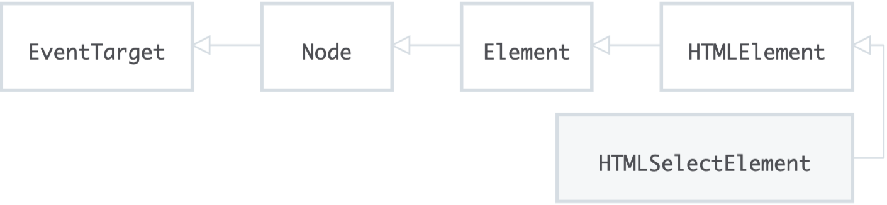
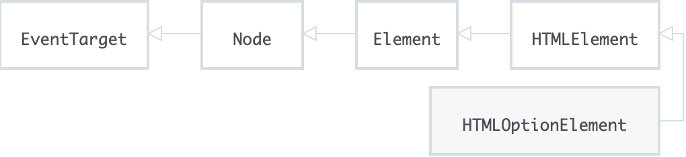

## HTMLSelectElement

-------

**`HTMLSelectElement`** 接口表示一个 <select> HTML 元素。这个元素也通过 [`HTMLElement`] 接口从其他 HTML 元素共享所有属性和方法。



#### Properties

**HTMLSelectElement.type**

表示表单控件类型的DOMString。当multiple为true时，它返回"select-multiple";否则，它返回“select-one”。

**HTMLSelectElement.autofocus** 

设置此 `HTMLElement` 是否自动聚焦：<select autofocus />

**HTMLSelectElement.disabled**

设置此 `HTMLElement` 是否禁用：<select disable />

**HTMLSelectElement.require**

设置此 `HTMLElement` 是否必选：<select require />

**HTMLSelectElement.multiple**

设置此 `HTMLElement` 是否多选：<select multiple />

------

**HTMLSelectElement.form** *only*

An HTMLFormElement referencing the form that this element is associated with. If the element is not associated with of a <form> element, then it returns null.

**HTMLSelectElement.labels** *only*

A NodeList of <label> elements associated with the element.

-------

**HTMLSelectElement.length**

这个 `select` 中 <option> 的长度。

**HTMLSelectElement.options** *only*

返回这个元素包含的 `HTMLOptionElement` 集合。

**HTMLSelectElement.selectedIndex**

返回 `Select` 的第一个选中 `option` 的 `idx`。

**HTMLSelectElement.selectedOptions** *only*

返回选中的 `Option` 集合(包含多选选项)

**HTMLSelectElement.value**

返回 `Select` 的==第一个==选中值。

-----

**HTMLSelectElement.validityRead** *only*

A ValidityState reflecting the validity state that this control is in.

#### Methods

**HTMLSelectElement.add()**

添加一个 `option` 到当前 `select`:

```ts
var opt1 = document.createElement("option");
var opt2 = document.createElement("option");

opt1.value = "1";
opt1.text = "Option: Value 1";

opt2.value = "2";
opt2.text = "Option: Value 2";

sel.add(opt1, null);
sel.add(opt2, null);
```

**HTMLSelectElement.remove()**

删除选中 `idx` 的 `option`：

```ts
collection.remove(index);
```

#### Events

**input event**

Fires when the value of an <input>, <select>, or <textarea> element has been changed.

#### Example

```jsx
/* assuming we have the following HTML
<select id='s' multiple>
    <option>First</option>
    <option selected>Second</option>
    <option selected>Third</option>
</select>
*/

var select = document.getElementById('s');

// return the index of the selected option
console.log(select.selectedIndex); // 1

// return the value of the selected option
console.log(select.options[select.selectedIndex].value) // Second

console.log(select.selectOptions.value) // <option>Second<option>, <option>Third<option>
```

## HTMLOptGroupElement

-------

```ts
<label for="dino-select">Choose a dinosaur:</label>
<select id="dino-select">
    <optgroup label="Theropods">
        <option>Tyrannosaurus</option>
        <option>Velociraptor</option>
        <option>Deinonychus</option>
    </optgroup>
    <optgroup label="Sauropods">
        <option>Diplodocus</option>
        <option>Saltasaurus</option>
        <option>Apatosaurus</option>
    </optgroup>
</select>

```

#### Properties

**HTMLOptGroupElement.disabled**

Is a boolean representing whether or not the whole list of children <option> is disabled (true) or not (false).

**HTMLOptGroupElement.label**

Is a DOMString representing the label for the group.

## HTMLOptionElement

------

HTMLOptionElement 接口表示了 <option> 元素并继承HTMLElement接口所有的类和方法。



#### Properties

| 名称          | 类型            | 描述                                                         |
| :------------ | :-------------- | :----------------------------------------------------------- |
| `selected`    | `Boolean`       | 包含了selected HTML 特性的初始值， 指示默认情况下是否选择该选项。 |
| `disabled`    | `Boolean`       | 反映了disabled HTML 特性 的值 , 这意味着选项（option）是不可选的。如果一个选项是关闭的<option>元素的子元素，那么它也可被关闭。 |
| `form`*只读*  | HTMLFormElement | 如果该选项是<select> 元素的后代，则该属性与相应HTMLSelectElement 对象的form属性具有相同的值; 否则为null。 |
| `index`*只读* | `long`          | 该选项在其所属的选项列表中的位置，以树形顺序排列。 如果该选项不是选项列表的一部分，例如为 <datalist> 元素的一部分时，该值为0。 |
| `label`       | DOMString       | 反映label HTML特性的值，该属性为选项提供了一个标签。 如果没有特别设置此属性，读取它返回元素的文本内容。 |
| `selected`    | `Boolean`       | 表示当前该option是否被选择。                                 |
| `text`        | DOMString       | 包含元素的文本内容。                                         |
| `value`       | DOMString       | 反映value HTML特性的值（如果存在）；否则反映Node.textContent 特性的值。 |

