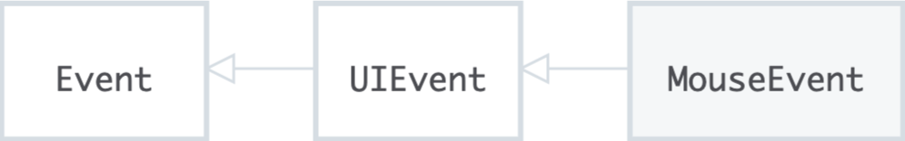
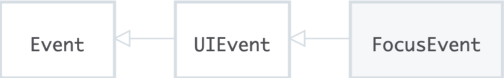

## MouseEvent

-----

`MouseEvent` 接口指用户与指针设备(如鼠标)交互时发生的事件。使用此接口的常见事件包括：`click`，`dblclick`，`mouseup`，`mousedown`，这些事件被触发的时候被传入的就是`MouseEvent`。

一些具体的事件都派生自 `MouseEvent`：`WheelEvent` 和 `DragEvent`。

### Attrs

#### position

+ [`MouseEvent.clientX`] *只读*
  - 鼠标指针在点击元素（DOM）中的X坐标。
+ [`MouseEvent.clientY`] *只读*

  - 鼠标指针在点击元素（DOM）中的Y坐标。
+ [`MouseEvent.offsetX`] *只读*

  - 鼠标指针相对于目标节点**内边位置**的X坐标。
+ [`MouseEvent.offsetY`] *只读*
- 鼠标指针相对于目标节点**内边位置**的Y坐标。
+ [`MouseEvent.pageX`] *只读*
  - 鼠标指针相对于整个文档的X坐标；
+ [`MouseEvent.pageY`] *只读*
  - 鼠标指针相对于整个文档的Y坐标；
+ [`MouseEvent.screenX`] *只读*
  - 鼠标指针相对于全局（屏幕）的X坐标；
+ [`MouseEvent.screenY`] *只读*
  - 鼠标指针相对于全局（屏幕）的Y坐标；

#### extra key action

+ [`MouseEvent.ctrlKey`] *只读*
  - 当鼠标事件触发时，如果 control 键被按下，则返回 true；

+ [`MouseEvent.metaKey`] *只读*
  - 当鼠标事件触发时，如果 meta键被按下，则返回 true；

+ [`MouseEvent.shiftKey`] *只读*
  - 当鼠标事件触发时，如果 shift 键被按下，则返回 true；

+ [`MouseEvent.altKey`] *只读*
  - 当鼠标事件触发的时，如果alt 键被按下，返回true;

+ [`MouseEvent.button`] *只读*
  - 当鼠标事件触发的时，如果鼠标按钮被按下（如果有的话），将会返回一个数值。

+ [`MouseEvent.buttons`] *只读*
  - 当鼠标事件触发的时，如果多个鼠标按钮被按下（如果有的话），将会返回一个或者多个代表鼠标按钮的数字。

## FouceEvent

------

**`FocusEvent`** 接口表示和焦点相关的事件比如 `focus`, `blur`, `focusin`, 和 `focusout`。

### Attr

no Self defined Attr