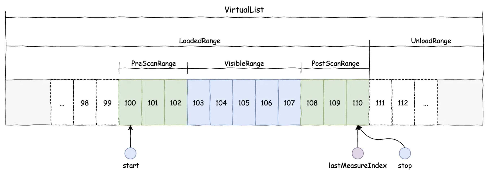
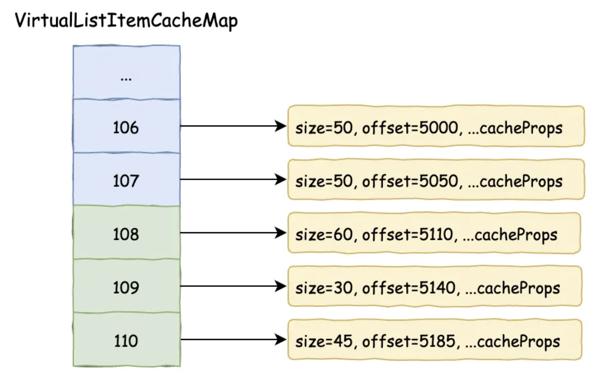
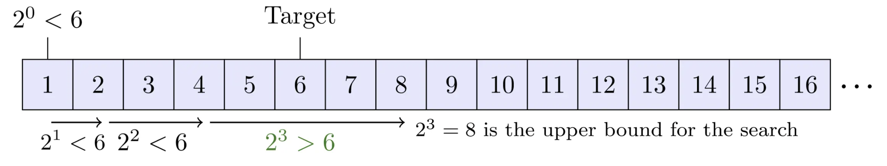
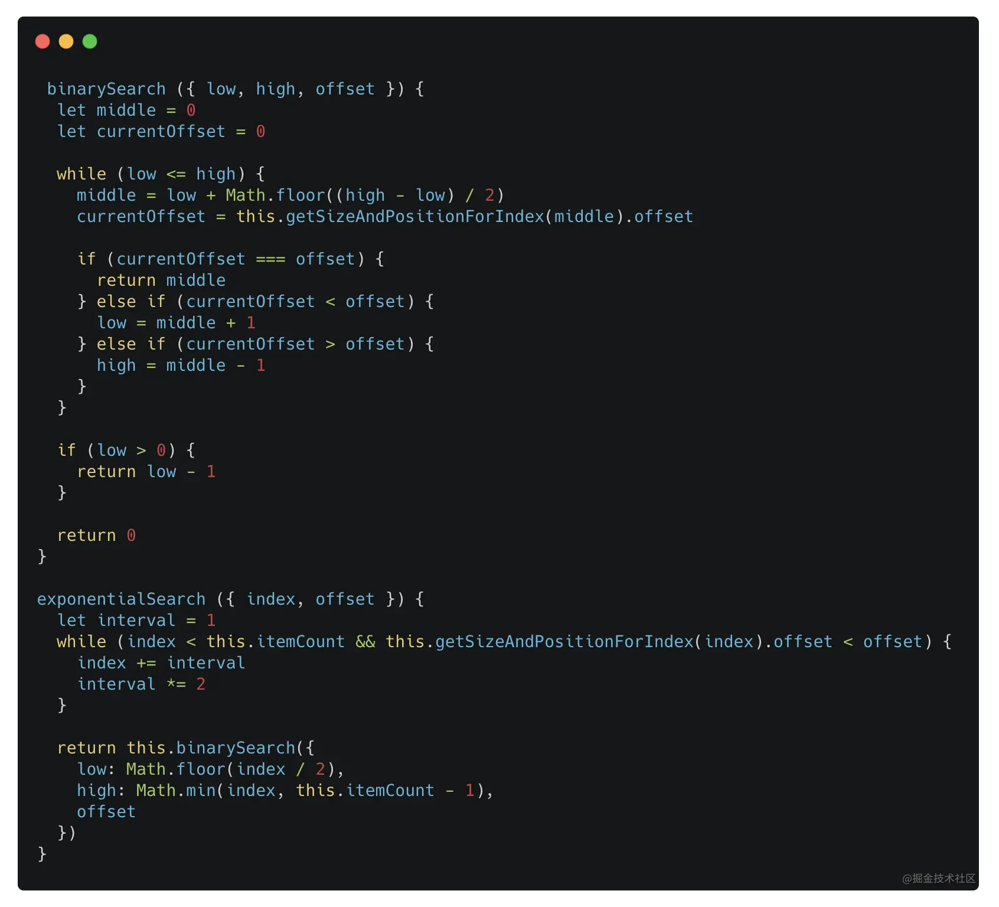

# 浅谈虚拟列表实现与原理分析

虚拟列表可以说是一个很常见的需求场景了。

什么是虚拟列表？在我们日常生活中，刷不到底的新闻 `Feed` 流，无尽图片瀑布流、超级超级长的排行榜等等。对于这种场景，我们不可能一次性加载完所有数据，因为不仅用户手机的视窗大小决定了这种做法很浪费，同时请求如此多的数据，从网络带宽、服务端压力上都很不经济，同时宿主环境从大量数据中渲染如此多的元素，对应用的性能也有不小负担。

因此，对于一般都要从**用户体验和应用性能**两方面去权衡考虑，从而优化这种场景。那么，常见的解决思路有哪些呢？基本有三种如下：

+ 分页加载。实现简单直接，但是在请求下一页时，可能也会打断用户心流，体验不是最佳。
+ 懒加载。实现难度不大，可以解决首屏的压力，但是长时间加载数据，也同样会产生大量元素节点，从而影响应用性能（因为也没有处理过期节点的销毁问题）。
+ 虚拟列表。实现难度较大，通过计算滚动视窗，每次只渲染部分元素，既减少了首屏压力，长时间加载也不会有更多的性能负担，可以满足上述大部分场景。


因此。虚拟列表作为一种对用户体验和应用性能都有裨益的方案，是现代应用开发中一种流行方案。前端里也有 `react-virtualized`、`react-window` 等成熟解决方案。开发一个讲究体验的信息流应用，少不了要应用到虚拟列表。

当然懂得流行虚拟列表库的 `API` 怎么运用是实践的第一步。但是，只有掌握原理才可以深入优化列表性能，以及针对性做扩展。

## 原理分析

### 虚拟长列表模型

长列表分为几个区域：

1. `VirtualList`：完整的列表区域
2. `VisibleRange`：视窗区域
3. `RenderRange(PreScanRange + VisibleRange + PostScanRange)`：实际渲染区域
4. `LoadedRange`：已加载区域
5. `UnloadRange`：未加载区域

如下图：



计算公式如下：

```ts
RenderRange = PreScanRange + VisibleRange + PostScanRange = stop - start
LoadedRange = lastMeasureIndex - 0
UnloadRange = size(VirtualList) - lastMeasureIndex
```

实际滚动过程中需要不断更新 `start`、`stop`、`lastMeasureIndex`，从而得出渲染区域和视窗区域。

### 位置缓存

缓存的意义，一般在于提高性能。因此对 `LoadedRange` 中的元素已经得到计算的尺寸、偏移缓存在哈希表中，用以减少重复计算，提高性能。



### 查找指定元素

基于有序元素偏移列表：

+ 在 `LoadedRange` 中使用二分查找算法，时间复杂度可降低到 `O(lgN)`；
+ 在 `UnloadRange` 中使用指数查找算法，时间复杂度同样为 `O(lgN)`，但是可以将 `N` 值缩小，进一步提高搜索性能。

指数搜索如下：



核心思想：先用指数搜索定位范围 `low - high`，内嵌二分查找 `target`。算法实现如下：



### 滚动偏移计算

`VirtualList` 总长度计算公式如下：
$$
TotalSize = lastMeasuredSizeAndPosition.offset + lastMeasuredSizeAndPosition.size + (itemCount - lastMeasuredIndex - 1) * estimatedItemSize
$$
