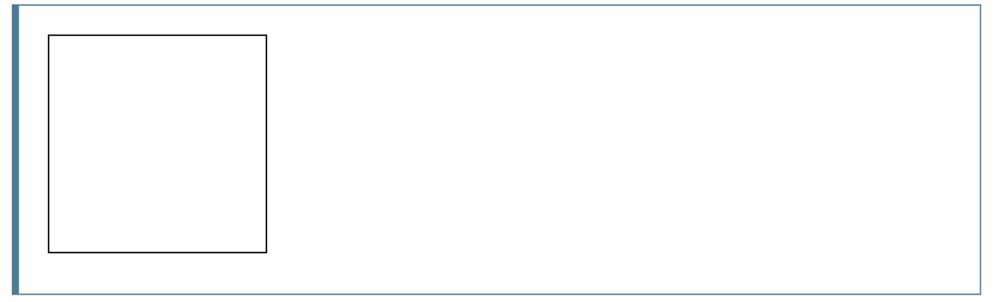

##  `<canvas>` 元素

```html
<canvas id="tutorial" width="150" height="150"></canvas>
```

`<canvas>`和``元素很相像，唯一的不同就是它并没有 `src` 和 `alt` 属性。实际上，`<canvas>` 标签只有两个属性**——** `width`和`height`。这些都是可选的，并且同样利用 [DOM](https://developer.mozilla.org/en-US/docs/Glossary/DOM) [properties](https://developer.mozilla.org/zh-CN/docs/Web/API/HTMLCanvasElement) 来设置。

当没有设置宽度和高度的时候，`canvas`会初始化宽度为`300`像素和高度为`150`像素。该元素可以使用[CSS](https://developer.mozilla.org/en-US/docs/Glossary/CSS)来定义大小，但在绘制时图像会伸缩以适应它的框架尺寸：如果`CSS`的尺寸与初始画布的比例不一致，它会出现扭曲。

### 替换内容

`<canvas>`元素很容易定义一些替代内容。由于某些较老的浏览器（尤其是IE9之前的IE浏览器）或者文本浏览器不支持`HTML`元素`"canvas"`，在这些浏览器上你应该总是能展示替代内容。

```html
<canvas id="stockGraph" width="150" height="150">
	none canvas support
</canvas>
```

## The rendering context  渲染上下文

`<canvas>`元素创造了一个固定大小的画布，它公开了一个或多个**渲染上下文**，其可以用来绘制和处理要展示的内容。下面代码的第一行通过使用 [`document.getElementById()`](https://developer.mozilla.org/zh-CN/docs/Web/API/Document/getElementById) 方法来为`<canvas>` 元素得到DOM对象。一旦有了元素对象，你可以通过使用它的`getContext() `方法来访问绘画上下文。

```js
var canvas = document.getElementById('tutorial');
var ctx = canvas.getContext('2d');
```

## Example示例

上面的脚本中包含一个叫做`draw()`的函数，当页面加载结束的时候就会执行这个函数。通过使用在文档上加载事件来完成。



```html
<html>
  <head>
    <title>Canvas tutorial</title>
    <script type="text/javascript">
      function draw(){
        var canvas = document.getElementById('tutorial');
        if (canvas.getContext){
          var ctx = canvas.getContext('2d');
        }
      }
    </script>
    <style type="text/css">
      canvas { border: 1px solid black; }
    </style>
  </head>
  <body onload="draw();">
    <canvas id="tutorial" width="150" height="150"></canvas>
  </body>
</html>
```

