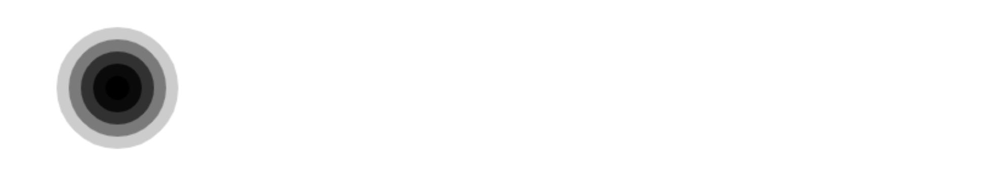

## 色彩 Colors

到目前为止，我们只看到过绘制内容的方法。如果我们想要给图形上色，有两个重要的属性可以做到：`fillStyle` 和 `strokeStyle。`

- [`fillStyle = color`](https://developer.mozilla.org/zh-CN/docs/Web/API/CanvasRenderingContext2D/fillStyle)

  设置图形的填充颜色。

- [`strokeStyle = color`](https://developer.mozilla.org/zh-CN/docs/Web/API/CanvasRenderingContext2D/strokeStyle)

  设置图形轮廓的颜色。

`color` 可以是表示 CSS 颜色值的字符串，渐变对象或者图案对象。我们迟些再回头探讨渐变和图案对象。默认情况下，线条和填充颜色都是黑色（CSS 颜色值 `#000000`）。

```js
// 这些 fillStyle 的值均为 '橙色'
ctx.fillStyle = "orange";
ctx.fillStyle = "#FFA500";
ctx.fillStyle = "rgb(255,165,0)";
```

## 透明度 Transparency

除了可以绘制实色图形，我们还可以用 canvas 来绘制半透明的图形。通过设置 `globalAlpha` 属性或者使用一个半透明颜色作为轮廓或填充的样式。

- [`globalAlpha = transparencyValue`](https://developer.mozilla.org/zh-CN/docs/Web/API/CanvasRenderingContext2D/globalAlpha)

  这个属性影响到 canvas 里所有图形的透明度，有效的值范围是 0.0 （完全透明）到 1.0（完全不透明），默认是 1.0。

`globalAlpha` 属性在需要绘制大量拥有相同透明度的图形时候相当高效。不过，我认为下面的方法可操作性更强一点。

因为 `strokeStyle` 和 `fillStyle` 属性接受符合 CSS 3 规范的颜色值，那我们可以用下面的写法来设置具有透明度的颜色。

```js
function draw() {
  const context = document.getElementById("cvs").getContext("2d");
  for (let i = 4; i >= 0; i--) {
    context.beginPath();
    context.arc(
      100,
      100,
      (i + 1) * 10,
      (Math.PI / 180) * 0,
      (Math.PI / 180) * 360,
      false
    );
    context.lineTo(100, 100);
    context.closePath();
    context.globalAlpha = 0.2 * (4 - i + 1);
    console.log(context.globalAlpha);
    context.fill();
  }
}
```



## 线型 Line styles

可以通过一系列属性来设置线的样式。

- [`lineWidth = value`](https://developer.mozilla.org/zh-CN/docs/Web/API/CanvasRenderingContext2D/lineWidth)

  设置线条宽度。

- [`lineCap = type`](https://developer.mozilla.org/zh-CN/docs/Web/API/CanvasRenderingContext2D/lineCap)

  设置线条末端样式。

- [`lineJoin = type`](https://developer.mozilla.org/zh-CN/docs/Web/API/CanvasRenderingContext2D/lineJoin)

  设定线条与线条间接合处的样式。

### `lineWidth` 属性的例子

这个属性设置当前绘线的粗细。属性值必须为正数。默认值是1.0。线宽是指给定路径的中心到两边的粗细。换句话说就是在路径的两边各绘制线宽的一半。

```js
function draw() {
  var ctx = document.getElementById('canvas').getContext('2d');
  for (var i = 0; i < 10; i++){
    ctx.lineWidth = 1+i;
    ctx.beginPath();
    ctx.moveTo(5+i*14,5);
    ctx.lineTo(5+i*14,140);
    ctx.stroke();
  }
}
```

|                          Screenshot                          |                         Live sample                          |
| :----------------------------------------------------------: | :----------------------------------------------------------: |
|  | ![img](data:image/png;base64,iVBORw0KGgoAAAANSUhEUgAAAJYAAACWCAYAAAA8AXHiAAAFLUlEQVR4Xu3d0Y7TMBCF4eyTA08Oaht3Q2r7jJF8xccNEvHGy9HvmfEZu/06/KHABgW+NrzTKylwAAsEWxQA1hZZvRRYGNiiQA+sn+dM7e/qxL/PgSuwPub4cf7cr+M4qnO2udrvVpnzOlf7ucqc97kqc/bmqsw5mms252yu2Zxprsr/c8gGsDLMwKqGlss4YAErYVPJBh/vABawgHVRQI31LYYaq7M0FO9/i5IK6lGGaRugUfTpbVLSXIr34ygZvXaFaxADC1hvy0bEunhlfKxvHFJ6kgrTVgNYXYWA1ZGF817bqc3cfmABa7ph0NIZWACPf6727dorRCwR660A5z0vIL3CYsF8HQYsYCVs9AqDQgxSBmlaRIdeYa2ea6O0dCJSrwHAAtYUFU3otfTEeS9GHmABK6LCx6qlJ857RKm/2la2pyKWiBUxE7FELM77qYDrXzFelA5RfryF8855T2itlDYiloj14QWOAAOWls5QAc57isvnc857baOgpXMcR6WQbkIBC1haOjcFGKTFtHSPIivFHoOUQRoxY5DW0pOIFVHS0hlJ5DJFRxkfvFZLT7OUDyxgxdtILlMspq7HcC0dLZ2EzcpmTEtHS0dLp7eiGKS1HSjnnfP+ZMBnN3TCCB+rFkX4WKmquz0HFrAU74r3mHYbJHaFIcK6Yl8zfu8yAgtYQwUc9CvWdeyGWj3HbmA3sBtGQcWusBZF2A3FtNSGAQtY7AZ2A7tBr/BbAR9jVEyjzryveUvAAtbw+20U70U4FO+fQjma3IHHmfdaenLmfRJ5HE12NDklJr1CvUK9wqaAXWEt7bZRdoUpvp7PgQWsiIqWjpaOlo6WjpaOlo6WzlOBle2pGkuNpca6KcAgZZA+FXCZYi06ziyOGGU475z3BMlKaWNXaFdoV2hXaFdoV9jpKNwXhvNYKfnennPeOe9qLDWWGkuNpcZSY6mxXgrwsfhYqZTmYwWFOO+c97SIPgrPyqoCFrCANVDA0eSIxmuAYzNrUQRYwHIT+s6AC6u1KOI81iR6sBvYDSm5VDZGH+8AFrCAdVHAh9vWGt5tlE9NTsvnfA4sYE1RYTfUNgptFLuhGHmABayIioN+tfTkBGlEqb/aVranIpaIFTETsUSstwJ8LD5WihgrGQhYpwKzeqeJNPo6XS0dLZ2nAs5jrdVzM4sjRTlHk0/gZkKJWBGjzwFqLDVWwkaNFRSSCqXCtIiceb8oNPsWjDZMEzoi9RqgCV3zzIDlq3u7C+a+zjShi5FHS2et7gEWsFymuDPgMkUtinDeOe+c944RPDJ+K3VdTEgMUgZpgoRByiAdKsDHSsvnfM7H4mNNUWE31DYKbRS7oRh5gAWsiIqjybX05DJFRKm/2lZ2ESKWiBUxE7FErLcCfCw+VooYKxkIWKcCLlMkrNa+2BRYwPLNFL01xSCt1XNtFOc9R+bnCGABi/N+U4CPVYwebRi7oRZFgAWsbtqd9e3as9nNGWABC1iDL/KKaDBIGaQJEgZpUMhN6LW+ZCXlDyUXsUQsEeuiAB+rtgNlkLoJPd0ozNKSz27oxFznsdbqHkeTU+I+nwMLWBEVznut7mGQRpT6q23F9xCxRKyImYglYr0V4GPxsVLEWMlAwDoVcDQ5YeVoclRIS2etntPSKXbggQWsGH20dGobBS0dLR0tnVE4YTfUosh/a5DGPGQABZIC/+RRpJd6TgFgYWCLAsDaIquXAgsDWxQA1hZZvRRYGNiiALC2yOqlwMLAFgWAtUVWL/0DAnFjAKGq4NkAAAAASUVORK5CYII=) |

### `lineCap` 属性的例子

属性 `lineCap` 的值决定了线段端点显示的样子。它可以为下面的三种的其中之一：`butt`，`round` 和 `square`。默认是 `butt。`

在这个例子里面，我绘制了三条直线，分别赋予不同的 `lineCap` 值。还有两条辅助线，为了可以看得更清楚它们之间的区别，三条线的起点终点都落在辅助线上。

最左边的线用了默认的 `butt` 。可以注意到它是与辅助线齐平的。中间的是 `round` 的效果，端点处加上了半径为一半线宽的半圆。右边的是 `square` 的效果，端点处加上了等宽且高度为一半线宽的方块。

