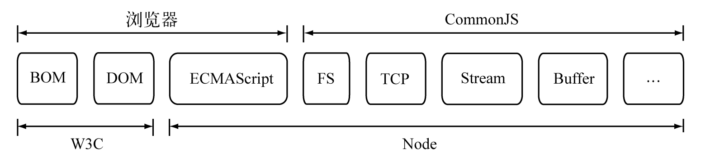
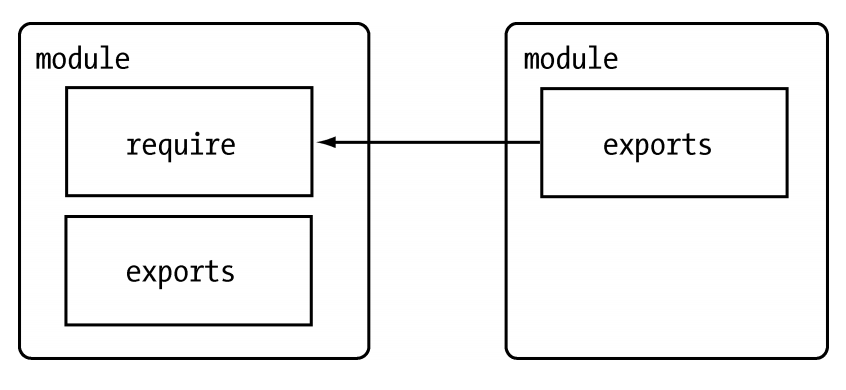
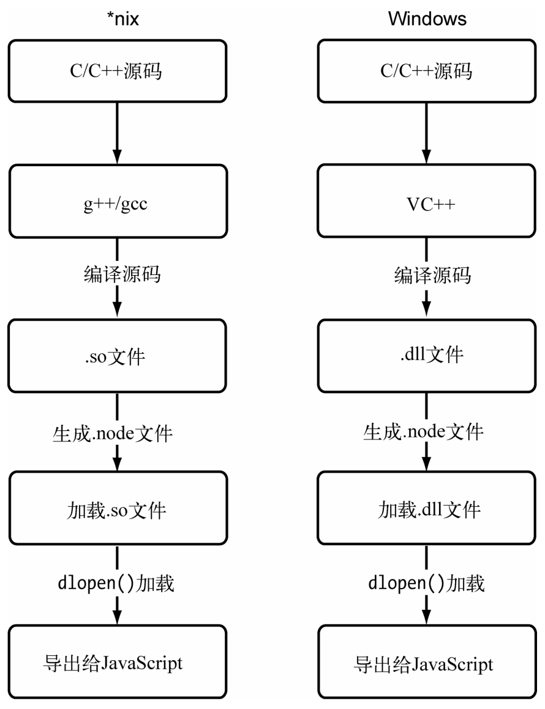

## CommonJS规范

-----

`CommonJS` 不仅仅是一个模块化的机制，`CommonJS`规范为`JavaScript`制定了一个美好的愿景——希望`JavaScript`能够在任何地方运行。

#### CommonJS 目的

随着`Web 2.0`的推进，`HTML5`崭露头角，它将`Web`网页带进`Web`应用的时代，在浏览器中出现了更多、更强大的`API`供`JavaScript`调用。但是，`Web`在发展，浏览器中出现了更多的标准`API`，这些过程发生在前端，后端`JavaScript`的规范却远远落后。对于`JavaScript`自身而言，它的规范依然是薄弱的，还有以下缺陷。

+ 没有模块系统。 

+ 标准库较少。`ECMAScript`仅定义了部分核心库，对于文件系统，`I/O`流等常见需求却没有标准的`API`。
+ 没有标准接口。在`JavaScript`中，几乎没有定义过如`Web`服务器或者数据库之类的标准统一接口。
+ 缺乏包管理系统。这导致`JavaScript`应用中基本没有自动加载和安装依赖的能力。

`CommonJS`规范的提出，主要是为了弥补当前`JavaScript`没有标准的缺陷，以达到像`Python`、`Ruby`和`Java`具备开发大型应用的基础能力，而不是停留在小脚本程序的阶段。他们期望那些用`CommonJS API`写出的应用可以具备跨宿主环境执行的能力，这样不仅可以利用`JavaScript`开发富客户端应用，而且还可以编写以下应用。

+ 服务器端JavaScript应用程序。
+ 命令行工具。
+ 桌面图形界面应用程序。
+ 混合应用（Titanium和Adobe AIR等形式的应用）。

如今，`CommonJS`中的大部分规范虽然依旧是草案，但是已经初显成效，为`JavaScript`开发大型应用程序指明了一条非常棒的道路。目前，它依旧在成长中，这些规范涵盖了模块、二进制、`Buffer`、字符集编码、`I/O`流、进程环境、文件系统、套接字、单元测试、`Web`服务器网关接口、包管理等。



而 `Node` 借鉴 `CommonJS` 的 `Modules` 规范实现了一套非常易用的模块系统，`NPM` 对 `Packages` 规范的完好支持使得`Node`应用在开发过程中事半功倍。

#### CommonJS的模块规范

`CommonJS`对模块的定义十分简单，主要分为模块引用、模块定义和模块标识`3`个部分。

**1. 模块引用**

模块引用的示例代码如下：

```js
var math = require('math');
```

在`CommonJS`规范中，存在`require()`方法，这个方法接受模块标识，以此引入一个模块的`API`到当前上下文中。

**2. 模块定义**

对应引入的功能，上下文提供了`exports`对象用于导出当前模块的方法或者变量，并且它是唯一导出的出口。在模块中，还存在一个`module`对象，它代表模块自身，而`exports`是`module`的属性。在`Node`中，一个文件就是一个模块，将方法挂载在`exports`对象上作为属性即可定义导出的方式：

```js
// math.js 
exports.add = function () { 
  var sum = 0, i = 0, args = arguments, l = args.length; 
  while (i < l) { 
    sum += args[i++]; 
  }
  return sum; 
};
```

在另一个文件中，我们通过require()方法引入模块后，就能调用定义的属性或方法了：

```js
// program.js 
var math = require('math'); 
exports.increment = function (val) { 
	return math.add(val, 1); 
};
```

**3. 模块标识**

模块标识其实就是传递给require()方法的参数，它必须是符合小驼峰命名的字符串，或者以.、.. 开头的相对路径，或者绝对路径。它可以没有文件名后缀.js。模块的定义十分简单，接口也十分简洁。它的意义在于将类聚的方法和变量等限定在私有的作用域中，同时支持引入和导出功能以顺畅地连接上下游依赖。如图所示，每个模块具有独立的空间，它们互不干扰，在引用时也显得干净利落。



## Node的模块实现

-------

`Node`在实现中并非完全按照规范实现，而是对模块规范进行了一定的取舍，同时也增加了少许自身需要的特性。尽管规范中`exports`、`require`和`module`听起来十分简单，但是`Node`在实现它们的过程中究竟经历了什么，这个过程需要知晓。

在`Node`中引入模块，需要经历如下`3`个步骤。

1. 路径分析
2. 文件定位
3. 编译执行

在`Node`中，模块分为两类：一类是`Node`提供的模块，称为核心模块；另一类是用户编写的模块，称为文件模块:

+ 核心模块部分在Node源代码的编译过程中，编译进了二进制执行文件。在Node进程启动时，部分核心模块就被直接加载进内存中，所以这部分核心模块引入时，文件定位和编译执行这两个步骤可以省略掉，并且在路径分析中优先判断，所以它的加载速度是最快的。
+ 文件模块则是在运行时动态加载，需要完整的路径分析、文件定位、编译执行过程，速度比核心模块慢。

接下来，我们展开详细的模块加载过程。

#### 优先从缓存加载

展开介绍路径分析和文件定位之前，我们需要知晓的一点是，与前端浏览器会缓存静态脚本文件以提高性能一样，`Node`对引入过的模块都会进行缓存，以减少二次引入时的开销。不同的地方在于，浏览器仅仅缓存文件，而`Node`缓存的是编译和执行之后的对象。

不论是核心模块还是文件模块，`require()`方法对相同模块的二次加载都一律采用缓存优先的方式，这是第一优先级的。不同之处在于核心模块的缓存检查先于文件模块的缓存检查。

#### 路径分析和文件定位

因为标识符有几种形式，对于不同的标识符，模块的查找和定位有不同程度上的差异。

**1. 模块标识符分析**

前面提到过，`require()`方法接受一个标识符作为参数。在`Node`实现中，正是基于这样一个标识符进行模块查找的。模块标识符在`Node`中主要分为以下几类。

+ 核心模块，如 `http`、`fs`、`path` 等。
  - 核心模块的优先级仅次于缓存加载，它在`Node`的源代码编译过程中已经编译为二进制代码，其加载过程最快。如果试图加载一个与核心模块标识符相同的自定义模块，那是不会成功的。如果自己编写了一个`http`用户模块，想要加载成功，必须选择一个不同的标识符或者换用路径的方式。
+ `.` 或 `..` 开始的相对路径文件模块。
  - 以`.`、`..`和 `/` 开始的标识符，这里都被当做文件模块来处理。在分析路径模块时，`require()`方法会将路径转为真实路径，并以真实路径作为索引，将编译执行后的结果存放到缓存中，以使二次加载时更快。
+ 以 `/` 开始的绝对路径文件模块。
+ 非路径形式的文件模块，如自定义的 `connect` 模块。
  - 自定义模块指的是非核心模块，也不是路径形式的标识符。它是一种特殊的文件模块，可能是一个文件或者包的形式。这类模块的查找是最费时的，也是所有方式中最慢的一种。

*自定义模块*

在介绍自定义模块的查找方式之前，需要先介绍一下模块路径这个概念。模块路径是 `Node` 在定位文件模块的具体文件时制定的查找策略，具体表现为一个路径组成的数组。关于这个路径的生成规则，我们可以手动尝试一番。

```js
console.log(module.paths);
// [ '/home/jackson/research/node_modules', '/home/jackson/node_modules', '/home/node_modules', '/node_modules' ]
```

可以看出，模块路径的生成规则如下所示：

+ 当前文件目录下的 `node_modules` 目录。
+ 父目录下的 `node_modules` 目录。
+ 父目录的父目录下的 `node_modules` 目录。
+ 沿路径向上逐级递归，直到根目录下的 `node_modules` 目录。

它的生成方式与`JavaScript`的原型链或作用域链的查找方式十分类似。在加载的过程中，`Node`会逐个尝试模块路径中的路径，直到找到目标文件为止。可以看出，当前文件的路径越深，模块查找耗时会越多，这是自定义模块的加载速度是最慢的原因。

**2. 文件定位**

*文件扩展名分析*

`require()`在分析标识符的过程中，会出现标识符中不包含文件扩展名的情况。`CommonJS`模块规范也允许在标识符中不包含文件扩展名，这种情况下，`Node`会按.`js`、.`json`、.`node`的次序补足扩展名，依次尝试。

在尝试的过程中，需要调用`fs`模块同步阻塞式地判断文件是否存在。因为`Node`是单线程的，所以这里是一个会引起性能问题的地方。小诀窍是：如果是.`node`和.`json`文件，在传递给`require()`的标识符中带上扩展名，会加快一点速度。

*目录分析和包*

在分析标识符的过程中，`require()`通过分析文件扩展名之后，可能没有查找到对应文件，但却得到一个目录，这在引入自定义模块和逐个模块路径进行查找时经常会出现，此时`Node`会将目录当做一个包来处理。

在这个过程中，`Node`对`CommonJS`包规范进行了一定程度的支持。首先，`Node`在当前目录下查找`package.json`（`CommonJS`包规范定义的包描述文件），通过`JSON.parse()`解析出包描述对象，从中取出`main`属性指定的文件名进行定位。如果文件名缺少扩展名，将会进入扩展名分析的步骤。

而如果`main`属性指定的文件名错误，或者压根没有`package.json`文件，`Node`会将`index`当做默认文件名，然后依次查找`index.js`、`index.node`、`index.json`。如果在目录分析的过程中没有定位成功任何文件，则自定义模块进入下一个模块路径进行查找。如果模块路径数组都被遍历完毕，依然没有查找到目标文件，则会抛出查找失败的异常。

#### 模块编译

在 `Node` 中，每个文件模块都是一个对象，它的定义如下：

```js
function Module(id, parent) { 
  this.id = id; 
  this.exports = {}; 
  this.parent = parent; 
  if (parent && parent.children) { 
    parent.children.push(this); 
  }
  this.filename = null; 
  this.loaded = false; 
  this.children = []; 
}
```

编译和执行是引入文件模块的最后一个阶段。定位到具体的文件后，`Node` 会新建一个模块对象，然后根据路径载入并编译。对于不同的文件扩展名，其载入方法也有所不同，具体如下所示。

+ **.js** 文件。通过 `fs` 模块同步读取文件后编译执行。
+ **.node** 文件。这是用 `C/C++` 编写的扩展文件，通过 `dlopen()` 方法加载最后编译生成的文件。
+ **.json** 文件。通过fs模块同步读取文件后，用 `JSON.parse()` 解析返回结果。
+ 其余扩展名文件。它们都被当做 `.js` 文件载入。

每一个编译成功的模块都会将其文件路径作为索引缓存在 `Module._cache` 对象上，以提高二次引入的性能。

根据不同的文件扩展名，`Node`会调用不同的读取方式，如.`json`文件的调用如下：

```js
// Native extension for .json 

Module._extensions['.json'] = function(module, filename) { 
var content = NativeModule.require('fs').readFileSync(filename, 'utf8'); 
try { 
	module.exports = JSON.parse(stripBOM(content)); 
} catch (err) { 
	err.message = filename + ': ' + err.message; 
throw err; 
} 
```

其中，`Module`._`extensions`会被赋值给`require()`的`extensions`属性，所以通过在代码中访问 `require.extensions`可以知道系统中已有的扩展加载方式。编写如下代码测试一下：

```js
console.log(require.extensions);
```

得到的执行结果如下：

```js
{ '.js': [Function], '.json': [Function], '.node': [Function] }
```

**1. JavaScript模块的编译**

回到`CommonJS`模块规范，我们知道每个模块文件中存在着`require`、`exports`、`module`这`3`个变量，但是它们在模块文件中并没有定义，那么从何而来呢？甚至在`Node`的`API`文档中，我们知道每个模块中还有`__filename`、`__dirname`这两个变量的存在，它们又是从何而来的呢？

事实上，在编译的过程中，Node对获取的JavaScript文件内容进行了头尾包装。在头部添加了 `(function (exports, require, module, __filename, __dirname) {\n`，在尾部添加了`\n})`;。一个正常的 `JavaScript` 文件会被包装成如下的样子：

```js
(function (exports, require, module, __filename, __dirname) { 
  var math = require('math'); 
  exports.area = function (radius) { 
	  return Math.PI * radius * radius; 
  }; 
});
```

这样每个模块文件之间都进行了作用域隔离。包装之后的代码会通过`vm`原生模块的`runInThisContext()`方法执行（类似`eval`，只是具有明确上下文，不污染全局），返回一个具体的`function`对象。最后，将当前模块对象的`exports`属性、`require()`方法、`module`（模块对象自身），以及在文件定位中得到的完整文件路径和文件目录作为参数传递给这个`function()`执行。

这就是这些变量并没有定义在每个模块文件中却存在的原因。在执行之后，模块的`exports`属性被返回给了调用方。`exports`属性上的任何方法和属性都可以被外部调用到，但是模块中的其余变量或属性则不可直接被调用。

至此，require、exports、module的流程已经完整，这就是Node对CommonJS模块规范的实现。

此外，许多初学者都曾经纠结过为何存在exports的情况下，还存在module.exports。理想情况下，只要赋值给exports即可：

```js
exports = function () { 
	// My Class 
};
```

但是通常都会得到一个失败的结果。其原因在于，exports对象是通过形参的方式传入的，直接赋值形参会改变形参的引用，但并不能改变作用域外的值。测试代码如下：

```js
var change = function (a) { 
	a = 100; 
	console.log(a); // => 100 
};
var a = 10; 
change(a); 
console.log(a); // => 10
```

如果要达到`require`引入一个类的效果，请赋值给`module.exports`对象。这个迂回的方案不改变形参的引用。

**2. C/C++模块的编译**

`Node`调用`process.dlopen()`方法进行加载和执行。在`Node`的架构下，`dlopen()`方法在`Windows`和*`nix`平台下分别有不同的实现，通过`libuv`兼容层进行了封装。

实际上，.`node`的模块文件并不需要编译，因为它是编写`C/C`++模块之后编译生成的，所以这里只有加载和执行的过程。在执行的过程中，模块的`exports`对象与.`node`模块产生联系，然后返回给调用者。

`C/C`++模块给`Node`使用者带来的优势主要是执行效率方面的，劣势则是`C/C`++模块的编写门槛比`JavaScript`高。

**3. JSON文件的编译**

`.json`文件的编译是`3`种编译方式中最简单的。`Node`利用`fs`模块同步读取`JSON`文件的内容之后，调用 `JSON.parse()`方法得到对象，然后将它赋给模块对象的`exports`，以供外部调用。

## C/C++扩展模块

------

对于前端工程师来说，`C/C`++扩展模块或许比较生疏和晦涩，但是如果你了解了它，在模块出现性能瓶颈时将会对你有极大的帮助。

`JavaScript`的一个典型弱点就是位运算。`JavaScript`的位运算参照`Java`的位运算实现，但是`Java`位运算是在`int`型数字的基础上进行的，而`JavaScript`中只有`double`型的数据类型，在进行位运算的过程中，需要将`double`型转换为`int`型，然后再进行。所以，在`JavaScript`层面上做位运算的效率不高。在应用中，会频繁出现位运算的需求，包括转码、编码等过程，如果通过`JavaScript`来实现，`CPU`资源将会耗费很多，这时编写`C/C`++扩展模块来提升性能的机会来了。

`C/C`++扩展模块属于文件模块中的一类。前面讲述文件模块的编译部分时提到，`C/C`++模块通过预先编译为.`node`文件，然后调用`process.dlopen()`方法加载执行。在这一节中，我们将分析整个`C/C`++扩展模块的编写、编译、加载、导出的过程。在开始编写扩展模块之前，需要强调的一点是，`Node`的原生模块一定程度上是可以跨平台的，其前提条件是源代码可以支持在`nix`和`Windows`上编译，其中`nix`下通过`g`++/`gcc`等编译器编译为动态链接共享对象文件（.`so`），在`Windows`下则需要通过`Visual C`++的编译器编译为动态链接库文件（.`dll`），如图`2-6`所示。这里有一个让人迷惑的地方，那就是引用加载时却是.`node`文件。其实.`node`的扩展名只是为了看起来更自然一点，不会因为平台差异产生不同的感觉。实际上，在`Windows`下它是一个.`dll`文件，在*`nix`下则是一个.`so`文件。为了实现跨平台，`dlopen()`方法在内部实现时区分了平台，分别用的是加载.`so`和.`dll`的方式。下图为扩展模块在不同平台上编译和加载的详细 过程。

值得注意的是，一个平台下的.`node`文件在另一个平台下是无法加载执行的，必须重新用各自平台下的编译器编译为正确的.`node`文件。



