# 异步I/O

在`Node`中，异步`I/O`也很常见。以读取文件为例，我们可以看到它与前端`Ajax`调用的方式是极其类似的：

```js
var fs = require('fs'); 
fs.readFile('/path', function (err, file) { console.log('读取文件完成') }); 
console.log('发起读取文件');
```

这里的*发起读取文件*是在*读取文件完成*之前输出的。同样，*读取文件完成*的执行也取决于读取文件的异步调用何时结束。下图是一个经典的异步调用。

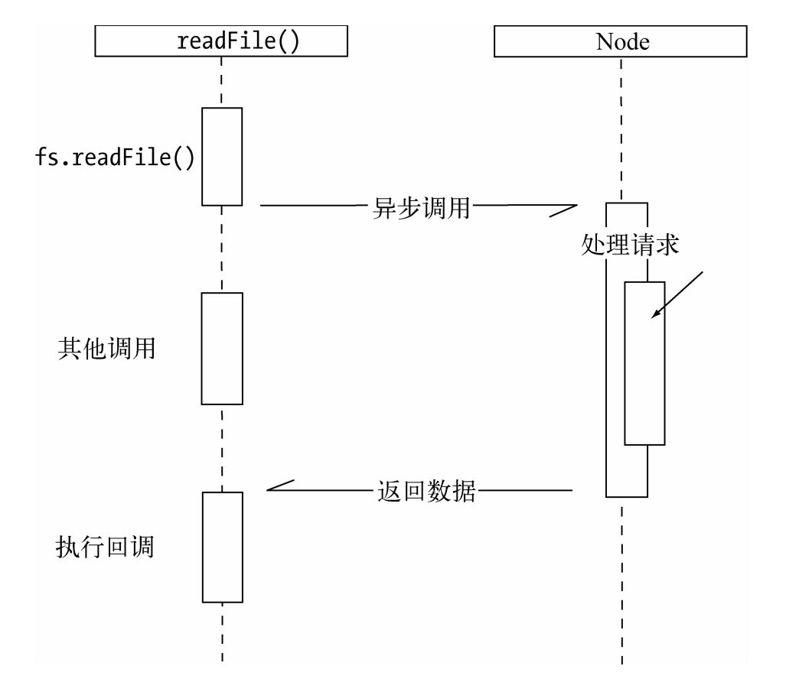

事实上，异步早就存在于操作系统的底层。在底层系统中，异步通过信号量、消息等方式有了广泛的应用。意外的是，在绝大多数高级编程语言中，异步并不多见，疑似被屏蔽了一般。当我们的程序发起一个 `I/O` 调用的时候，通常会直接进入阻塞，然后沉睡等待中断的到来，并且以同步的方式返回数据。造成这个现象的主要原因也许令人惊讶：程序员不太适合通过异步来进行程序设计。

`PHP`这门语言的设计最能体现这个观点。它对调用层不仅屏蔽了异步，甚至连多线程都不提供。`PHP`语言从头到脚都是以同步阻塞的方式来执行的。它的优点十分明显，利于程序员顺序编写业务逻辑；它的缺点在小规模站点中基本不存在，但是在复杂的网络应用中，阻塞导致它无法更好地并发。

## 异步I/O与非阻塞I/O

---------

异步与非阻塞听起来似乎是同一回事。从实际效果而言，异步和非阻塞都达到了我们并行`I/O`的目的。但是从计算机内核`I/O`而言，异步/同步和阻塞/非阻塞实际上是两回事。

操作系统内核对于`I/O`只有两种方式：阻塞与非阻塞。在调用阻塞`I/O`时，应用程序需要等待`I/O`完成才返回结果，如图所示。阻塞`I/O`的一个特点是调用之后一定要等到系统内核层面完成所有操作后，调用才结束。以读取磁盘上的一段文件为例，系统内核在完成磁盘寻道、读取数据、复制数据到内存中之后，这个调用才结束。

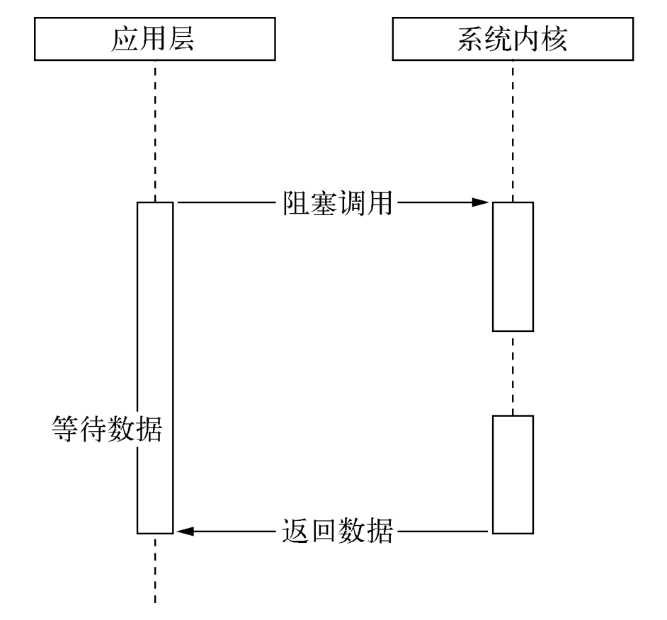

阻塞`I/O`造成`CPU`等待`I/O`，浪费等待时间，`CPU`的处理能力不能得到充分利用。为了提高性能，内核提供了非阻塞`I/O`。非阻塞`I/O`跟阻塞`I/O`的差别为调用之后会立即返回，如图所示。

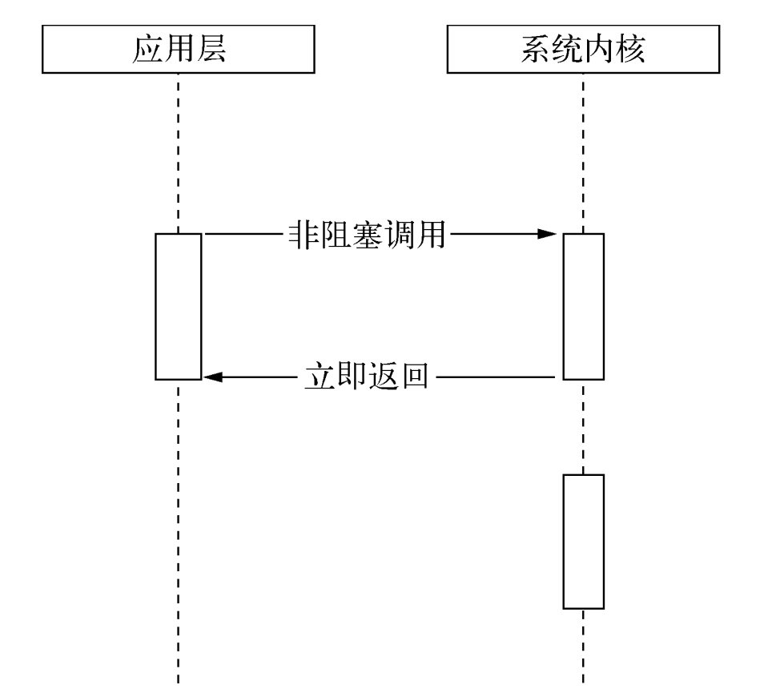

非阻塞``I/O``返回之后，``CPU``的时间片可以用来处理其他事务，此时的性能提升是明显的。**但是非阻塞 `I/O` 其实非常的操蛋，所谓的非阻塞虽然确实是线程/进程在申请 `I/O` 调用之后没有进入阻塞状态，但是它也无法回到逻辑代码，要么就是不断轮询等待数据返回，要么就是休眠等待信号唤醒，讲道理这个阻塞了其实没什么区别，只不过是避免了唤醒时和其他进程抢 `cpu` 的过程，是对`cpu`资源的一种浪费。**

但非阻塞``I/O``也存在一些问题。由于完整的``I/O``并没有完成，立即返回的并不是业务层期望的数据，而仅仅是当前调用的状态。为了获取完整的数据，应用程序需要重复调用``I/O``操作来确认是否完成。这种重复调用判断操作是否完成的技术叫做*轮询*：

任意技术都并非完美的。阻塞`I/O`造成`CPU`等待浪费，非阻塞带来的麻烦却是需要轮询去确认是否完全完成数据获取，它会让`CPU`处理状态判断，是对`CPU`资源的浪费。这里我们且看轮询技术是如何演进的，以减小`I/O`状态判断的`CPU`损耗。

现存的轮询技术主要有以下这些：

+ `read` 它是最原始、性能最低的一种，通过重复调用来检查I/O的状态来完成完整数据的读取。在得到最终数据前，CPU一直耗用在等待上。下图为通过read进行轮询的示意图。

  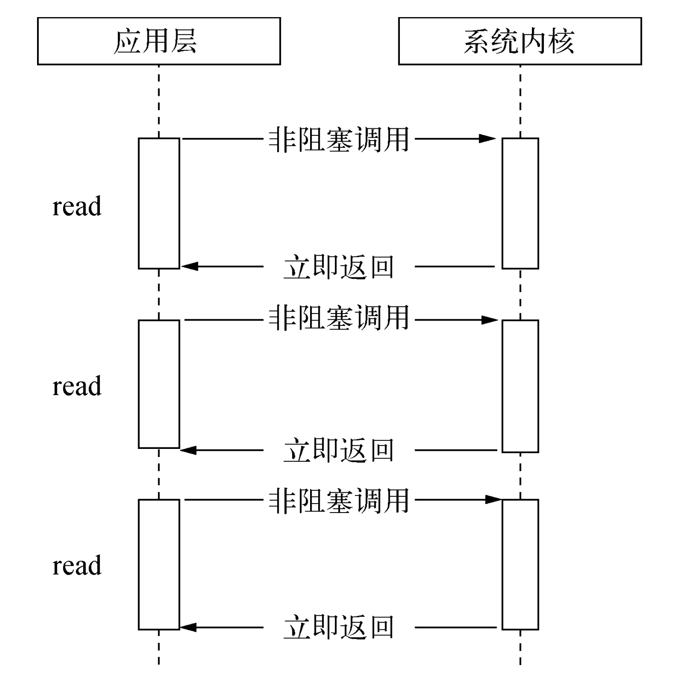

+ `select` 它是在read的基础上改进的一种方案，通过对文件描述符上的事件状态来进行判断。下图为通过select进行轮询的示意图。select轮询具有一个较弱的限制，那就是由于它采用一个1024长度的数组来存储状态，所以它最多可以同时检查1024个文件描述符。

+ `poll` 该方案较select有所改进，采用链表的方式避免数组长度的限制，其次它能避免不需要的检查。但是当文件描述符较多的时候，它的性能还是十分低下的。下图为通过poll实现轮询的示意图，它与select相似，但性能限制有所改善。

  

+ `epoll` 该方案是Linux下效率最高的I/O事件通知机制，在进入轮询的时候如果没有检查到I/O事件，将会进行休眠，直到事件发生将它唤醒。它是真实利用了事件通知、执行回调的方式，而不是遍历查询，所以不会浪费CPU，执行效率较高。下图为通过epoll方式实现轮询的示意图。

  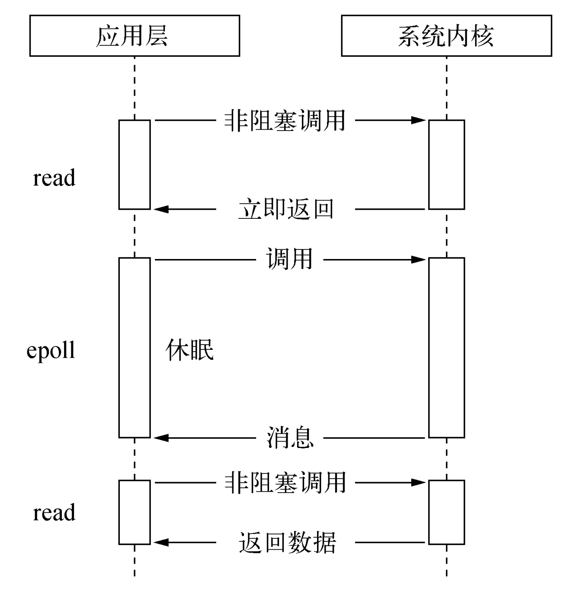

轮询技术满足了非阻塞`I/O`确保获取完整数据的需求，但是对于应用程序而言，它仍然只能算是一种同步，因为应用程序仍然需要等待`I/O`完全返回，依旧花费了很多时间来等待。等待期间，`CPU`要么用于遍历文件描述符的状态，要么用于休眠等待事件发生。结论是它不够好。

#### 理想的非阻塞异步I/O

尽管`epoll`已经利用了事件来降低`CPU`的耗用，但是休眠期间`CPU`几乎是闲置的，对于当前线程而言利用率不够。那么，是否有一种理想的异步`I/O`呢？

我们期望的完美的异步`I/O`应该是应用程序发起非阻塞调用，无须通过遍历或者事件唤醒等方式轮询，可以直接处理下一个任务，只需在`I/O`完成后通过信号或回调将数据传递给应用程序即可。下图为理想中的异步`I/O`示意图。

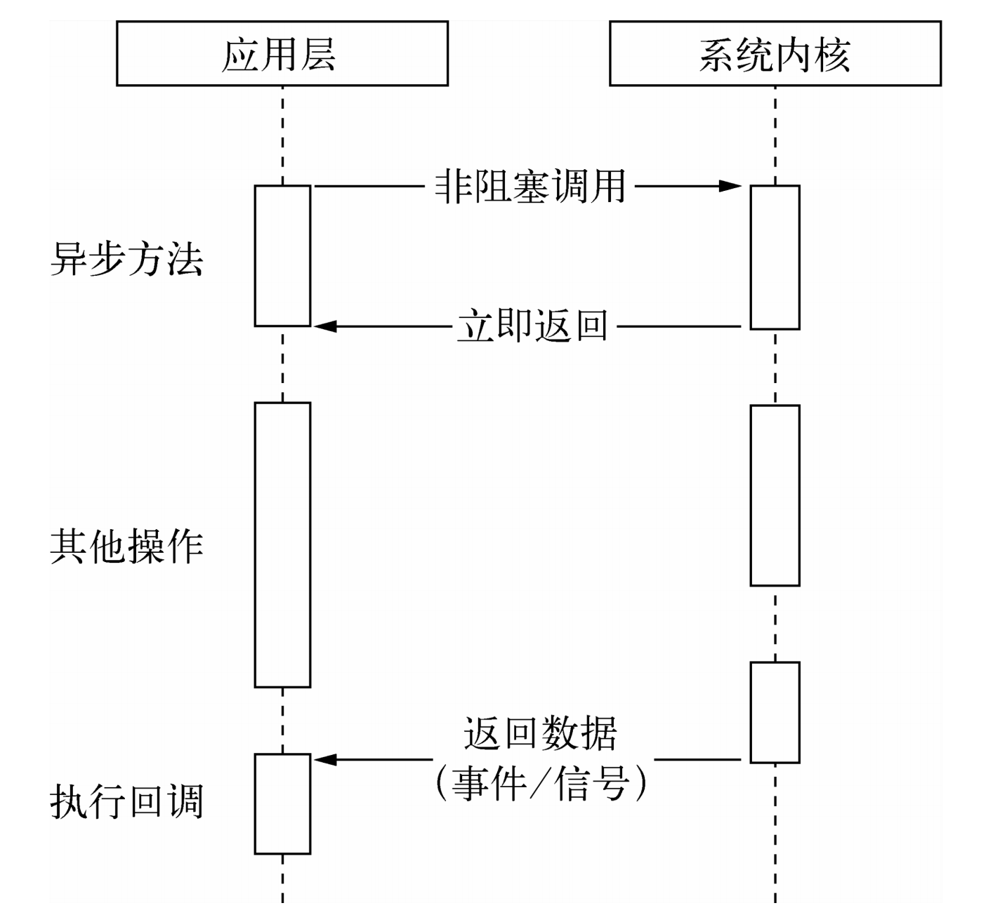

幸运的是，在`Linux`下存在这样一种方式，它原生提供的一种异步`I/O`方式（`AIO`）就是通过信号或回调来传递数据的。

但不幸的是，只有`Linux`下有，而且它还有缺陷——`AIO`仅支持内核`I/O`中的`O`_`DIRECT`方式读取，导致无法利用系统缓存。

#### 现实的异步I/O

现实比理想要骨感一些，但是要达成异步`I/O`的目标，并非难事。前面我们将场景限定在了单线程的状况下，多线程的方式会是另一番风景。通过让部分线程进行阻塞`I/O`或者非阻塞`I/O`加轮询技术来完成数据获取，让一个线程进行计算处理，通过线程之间的通信将`I/O`得到的数据进行传递，这就轻松实现了异步`I/O`（尽管它是模拟的），示意图如图所示。

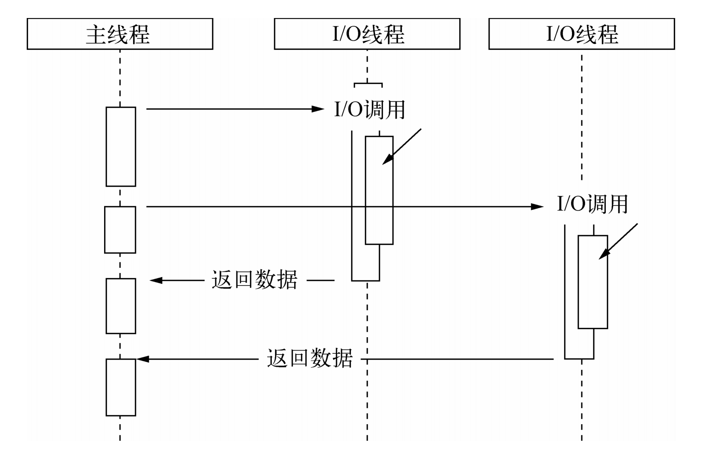

`glibc`的`AIO`便是典型的线程池模拟异步`I/O`。然而遗憾的是，它存在一些难以忍受的缺陷和`bug`，不推荐采用。`libev`的作者`Marc Alexander Lehmann`重新实现了一个异步`I/O`的库：`libeio`。`libeio`实质上依然是采用线程池与阻塞`I/O`模拟异步`I/O`。最初，`Node`在*`nix`平台下采用了`libeio`配合`libev`实现`I/O`部分，实现了异步`I/O`。在`Node v0.9.3`中，自行实现了线程池来完成异步`I/O`。

另一种我迟迟没有透露的异步`I/O`方案则是`Windows`下的`IOCP`，它在某种程度上提供了理想的异步`I/O`：调用异步方法，等待`I/O`完成之后的通知，执行回调，用户无须考虑轮询。但是它的内部其实仍然是线程池原理，不同之处在于这些线程池由系统内核接手管理。

`IOCP`的异步`I/O`模型与`Node`的异步调用模型十分近似。在`Windows`平台下采用了`IOCP`实现异步`I/O`。由于`Windows`平台和*`nix`平台的差异，`Node`提供了`libuv`作为抽象封装层，使得所有平台兼容性的判断都由这一层来完成，并保证上层的`Node`与下层的自定义线程池及`IOCP`之间各自独立。`Node`在编译期间会判断平台条件，选择性编译`unix`目录或是`win`目录下的源文件到目标程序中，其架构如图所示。

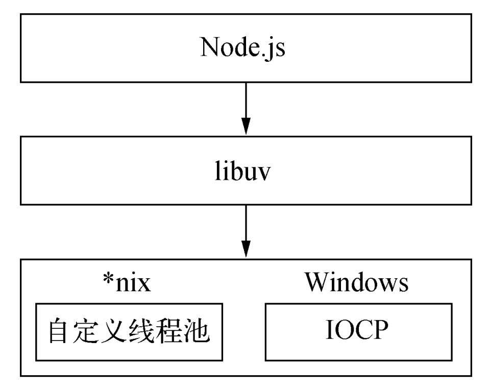

需要强调的地方在于我们时常提到`Node`是单线程的，这里的单线程仅仅只是`JavaScript`执行在单线程中罢了。在`Node`中，无论是*`nix`还是`Windows`平台，内部完成`I/O`任务的另有线程池。

## Node的异步I/O实现

-----

介绍完系统对异步`I/O`的支持后，我们将继续介绍`Node`是如何实现异步`I/O`的。这里我们除了介绍异步`I/O`的实现外，还将讨论`Node`的执行模型。完成整个异步`I/O`环节的有事件循环、观察者和请求对象等。

#### 事件循环

首先，我们着重强调一下`Node`自身的执行模型——事件循环，正是它使得回调函数十分普遍。

在进程启动时，`Node`便会创建一个类似于`while(true)`的循环，每执行一次循环体的过程我们称为`Tick`。每个`Tick`的过程就是查看是否有事件待处理，如果有，就取出事件及其相关的回调函数。如果存在关联的回调函数，就执行它们。然后进入下个循环，如果不再有事件处理，就退出进程。流程图如图`3-11`所示。

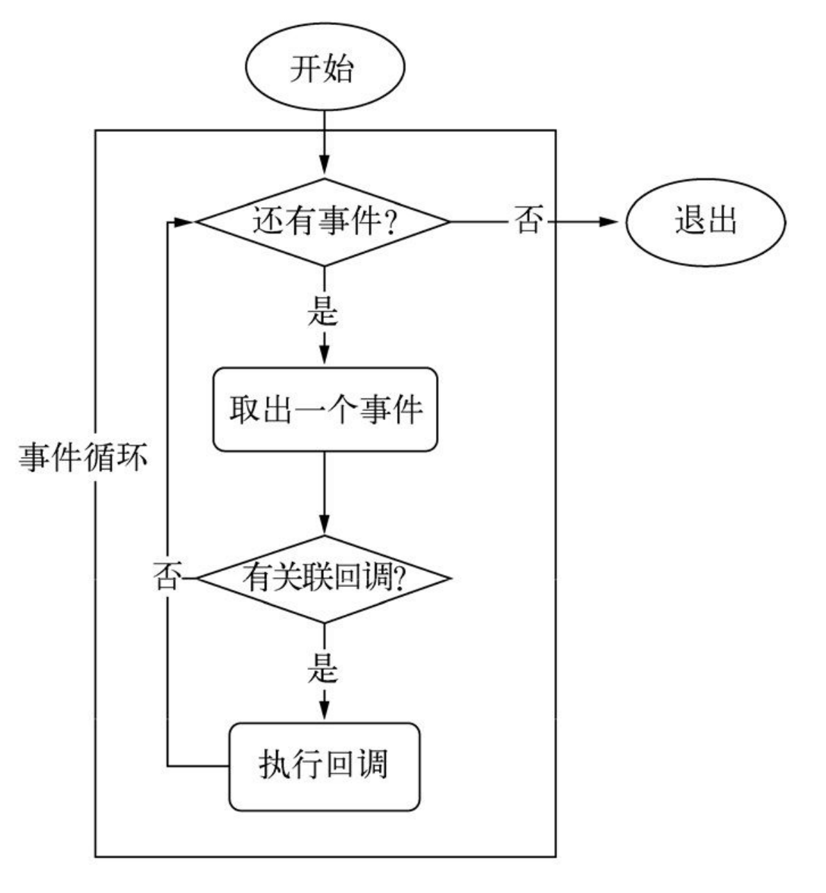

在每个`Tick`的过程中，如何判断是否有事件需要处理呢？这里必须要引入的概念是观察者。每个事件循环中有一个或者多个观察者，而判断是否有事件要处理的过程就是向这些观察者询问是否有要处理的事件。

这个过程就如同饭馆的厨房，厨房一轮一轮地制作菜肴，但是要具体制作哪些菜肴取决于收银台收到的客人的下单。厨房每做完一轮菜肴，就去问收银台的小妹，接下来有没有要做的菜，如果没有的话，就下班打烊了。在这个过程中，收银台的小妹就是观察者，她收到的客人点单就是关联的回调函数。当然，如果饭馆经营有方，它可能有多个收银员，就如同事件循环中有多个观察者一样。收到下单就是一个事件，一个观察者里可能有多个事件。

浏览器采用了类似的机制。事件可能来自用户的点击或者加载某些文件时产生，而这些产生的事件都有对应的观察者。在`Node`中，事件主要来源于网络请求、文件`I/O`等，这些事件对应的观察者有文件`I/O`观察者、网络`I/O`观察者等。观察者将事件进行了分类。

事件循环是一个典型的生产者/消费者模型。异步`I/O`、网络请求等则是事件的生产者，源源不断为`Node`提供不同类型的事件，这些事件被传递到对应的观察者那里，事件循环则从观察者那里取出事件并处理。

在`Windows`下，这个循环基于`IOCP`创建，而在*`nix`下则基于多线程创建。

#### 请求对象

在这一节中，我们将通过解释 `Windows` 下异步 `I/O`（利用 `IOCP` 实现）的简单例子来探寻从 `JavaScript` 代码到系统内核之间都发生了什么。

对于一般的（非异步）回调函数，函数由我们自行调用，如下所示：

```js
var forEach = function (list, callback) { 
	for (var i = 0; i < list.length; i++) { 
		callback(list[i], i, list); 
	} 
};
```

对于`Node`中的异步`I/O`调用而言，回调函数却不由开发者来调用。那么从我们发出调用后，到回调函数被执行，中间发生了什么呢？事实上，从`JavaScript`发起调用到内核执行完`I/O`操作的过渡过程中，存在一种中间产物，它叫做请求对象。

下面我们以最简单的`fs.open()`方法来作为例子，探索`Node`与底层之间是如何执行异步`I/O`调用以及回调函数究竟是如何被调用执行的：

```js
fs.open = function(path, flags, mode, callback) { 

// ... 
binding.open(pathModule._makeLong(path), 	
	stringToFlags(flags), 
	mode, 
	callback); 
};
```

`fs.open()`的作用是根据指定路径和参数去打开一个文件，从而得到一个文件描述符，这是后续所有`I/O`操作的初始操作。从前面的代码中可以看到，`JavaScript`层面的代码通过调用`C`++核心模块进行下层的操作。下图为调用示意图。

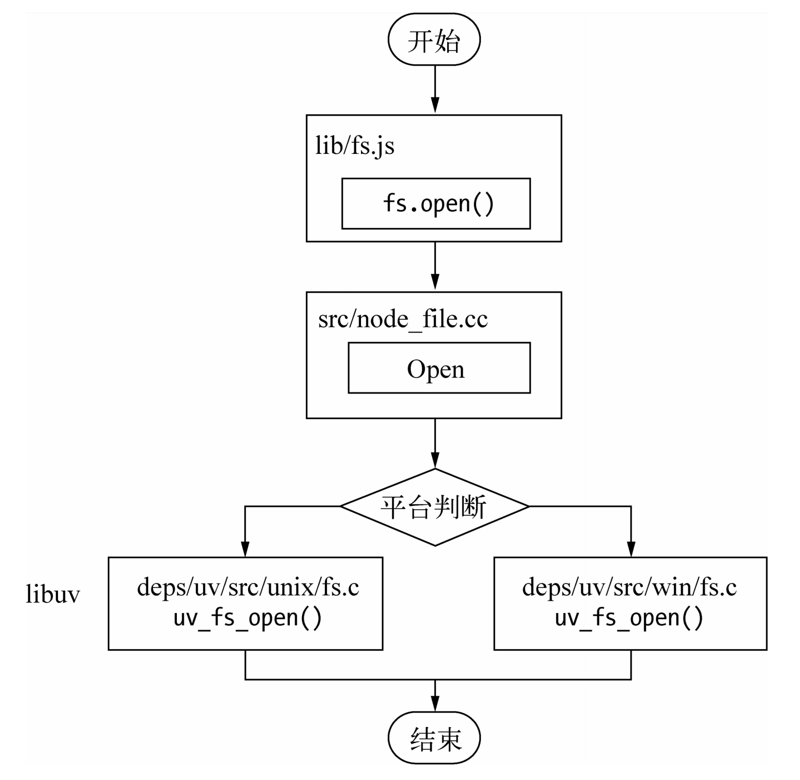

从`JavaScript`调用`Node`的核心模块，核心模块调用`C`++内建模块，内建模块通过`libuv`进行系统调用，这是`Node`里经典的调用方式。这里`libuv`作为封装层，有两个平台的实现，实质上是调用了`uv`_`fs`_`open()`方法。在`uv`_`fs`_`open()`的调用过程中，我们创建了一个`FSReqWrap`请求对象。从`JavaScript`层传入的参数和当前方法都被封装在这个请求对象中，其中我们最为关注的回调函数则被设置在这个对象的`oncomplete`_`sym`属性上：`req`_`wrap->``object`_`->``Set(oncomplete`_`sym, callback)`;对象包装完毕后，在`Windows`下，则调用`QueueUserWorkItem()`方法将这个`FSReqWrap`对象推入线程池中等待执行，该方法的代码如下所示：

```c
QueueUserWorkItem(&uv_fs_thread_proc, \ 
  req, 																\ 
  WT_EXECUTEDEFAULT)
```

`QueueUserWorkItem()`方法接受`3`个参数：第一个参数是将要执行的方法的引用，这里引用的是`uv`_`fs`_`thread`_`proc`，第二个参数是`uv`_`fs`_`thread`_`proc`方法运行时所需要的参数；第三个参数是执行的标志。当线程池中有可用线程时，我们会调用`uv`_`fs`_`thread`_`proc()`方法。`uv`_`fs`_`thread`_`proc()`方法会根据传入参数的类型调用相应的底层函数。以`uv`_`fs`_`open()`为例，实际上调用`fs`__`open()`方法。

至此，`JavaScript`调用立即返回，由`JavaScript`层面发起的异步调用的第一阶段就此结束。`JavaScript`线程可以继续执行当前任务的后续操作。当前的`I/O`操作在线程池中等待执行，不管它是否阻塞`I/O`，都不会影响到`JavaScript`线程的后续执行，如此就达到了异步的目的。

请求对象是异步`I/O`过程中的重要中间产物，所有的状态都保存在这个对象中，包括送入线程池等待执行以及`I/O`操作完毕后的回调处理。

#### 执行回调

组装好请求对象、送入`I/O`线程池等待执行，实际上完成了异步`I/O`的第一部分，回调通知是第二部分。线程池中的`I/O`操作调用完毕之后，会将获取的结果储存在`req->``result`属性上，然后调用`PostQueuedCompletionStatus()`通知`IOCP`，告知当前对象操作已经完成：

```c
PostQueuedCompletionStatus((loop)->iocp, 0, 0, &((req)->overlapped))
```

`PostQueuedCompletionStatus()`方法的作用是向`IOCP`提交执行状态，并将线程归还线程池。通过`PostQueuedCompletionStatus()`方法提交的状态，可以通过`GetQueuedCompletionStatus()`提取。在这个过程中，我们其实还动用了事件循环的`I/O`观察者。在每次`Tick`的执行中，它会调用`IOCP`相关的`GetQueuedCompletionStatus()`方法检查线程池中是否有执行完的请求，如果存在，会将请求对象加入到`I/O`观察者的队列中，然后将其当做事件处理。`I/O`观察者回调函数的行为就是取出请求对象的`result`属性作为参数，取出`oncomplete`_`sym`属性作为方法，然后调用执行，以此达到调用`JavaScript`中传入的回调函数的目的。至此，整个异步`I/O`的流程完全结束，如图`3-13`所示。


事件循环、观察者、请求对象、`I/O`线程池这四者共同构成了`Node`异步`I/O`模型的基本要素。

`Windows`下主要通过`IOCP`来向系统内核发送`I/O`调用和从内核获取已完成的`I/O`操作，配以事件循环，以此完成异步`I/O`的过程。在`Linux`下通过`epoll`实现这个过程，`FreeBSD`下通过`kqueue`实现，`Solaris`下通过`Event ports`实现。不同的是线程池在`Windows`下由内核（`IOCP`）直接提供，*`nix`系列下由`libuv`自行实现。

## 非I/O的异步API

-----

尽管我们在介绍Node的时候，多数情况下都会提到异步I/O，但是Node中其实还存在一些与I/O无关的异步API，这一部分也值得略微关注一下，它们分别是setTimeout()、setInterval()、setImmediate()和process.nextTick()。 

#### 定时器

`setTimeout()`和`setInterval()`与浏览器中的`API`是一致的，分别用于单次和多次定时执行任务。它们的实现原理与异步`I/O`比较类似，只是不需要`I/O`线程池的参与。调用`setTimeout()`或者`setInterval()`创建的定时器会被插入到定时器观察者内部的一个红黑树中。每次`Tick`执行时，会从该红黑树中迭代取出定时器对象，检查是否超过定时时间，如果超过，就形成一个事件，它的回调函数将立即执行。

下图提到的主要是`setTimeout()`的行为。`setInterval()`与之相同，区别在于后者是重复性的检测和执行。

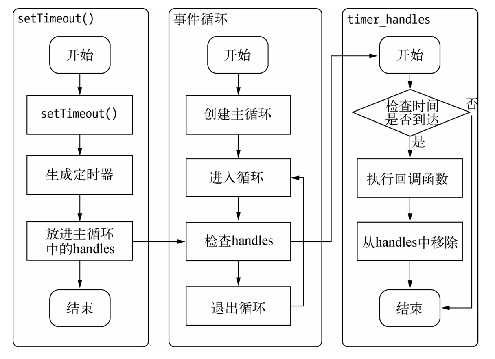

定时器的问题在于，它并非精确的（在容忍范围内）。尽管事件循环十分快，但是如果某一次循环占用的时间较多，那么下次循环时，它也许已经超时很久了。譬如通过`setTimeout()`设定一个任务在`10`毫秒后执行，但是在`9`毫秒后，有一个任务占用了`5`毫秒的`CPU`时间片，再次轮到定时器执行时，时间就已经过期`4`毫秒。

#### process.nextTick()

在未了解 `process.nextTick()`之前，很多人也许为了立即异步执行一个任务，会这样调用`setTimeout()`来达到所需的效果：

```js
setTimeout(function () {
  // TODO 
}, 0);
```

由于事件循环自身的特点，定时器的精确度不够。而事实上，采用定时器需要动用红黑树，创建定时器对象和迭代等操作，而`setTimeout(fn, 0)`的方式较为浪费性能。实上，`process.nextTick()`方法的操作相对较为轻量，具体代码如下：

```js
process.nextTick = function(callback) { 
// on the way out, don't bother. 
// it won't get fired anyway 
	if (process._exiting) return; 
	if (tickDepth >= process.maxTickDepth) maxTickWarn(); 
	var tock = { callback: callback }; 
	if (process.domain) tock.domain = process.domain; 
	nextTickQueue.push(tock); 
	if (nextTickQueue.length) { 
		process._needTickCallback(); 
	} 
};
```

每次调用`process.nextTick()`方法，只会将回调函数放入队列中，在下一轮`Tick`时取出执行。定时器中采用红黑树的操作时间复杂度为`O(lg(n))`，`nextTick()`的时间复杂度为`O(1)`。相较之下，`process.nextTick()`更高效。

#### setImmediate()

`setImmediate()`方法与`process.nextTick()`方法十分类似，都是将回调函数延迟执行。在`Node v0.9.1`之前，`setImmediate()`还没有实现，那时候实现类似的功能主要是通过`process.nextTick()`来完成，该方法的代码如下所示：

```js
process.nextTick(function () { 
	console.log('延迟执行'); 
}); 
console.log('正常执行');
```

上述代码的输出结果如下：

```js
正常执行 
延迟执行
```

而用`setImmediate()`实现时，相关代码如下：

```js
setImmediate(function () { 
	console.log('延迟执行'); 
}); 
console.log('正常执行');
```

其结果完全一样：

```js
正常执行 
延迟执行
```

但是两者之间其实是有细微差别的。将它们放在一起时，又会是怎样的优先级呢。示例代码如下：

```js
process.nextTick(function () { 
	console.log('nextTick延迟执行'); 
}); 

setImmediate(function () { 
	console.log('setImmediate延迟执行'); 
}); 
console.log('正常执行');
```

其执行结果如下：

```js
正常执行 
nextTick延迟执行 
setImmediate延迟执行
```

从结果里可以看到，`process.nextTick()`中的回调函数执行的优先级要高于`setImmediate()`。这里的原因在于事件循环对观察者的检查是有先后顺序的，`process.nextTick()`属于`idle`观察者，`setImmediate()`属于`check`观察者。在每一个轮循环检查中，`idle`观察者先于`I/O`观察者，`I/O`观察者先于`check`观察者。

在具体实现上，`process.nextTick()`的回调函数保存在一个数组中，`setImmediate()`的结果则是保存在链表中。在行为上，`process.nextTick()`在每轮循环中会将数组中的回调函数全部执行完，而`setImmediate()`在每轮循环中执行链表中的一个回调函数。如下的示例代码可以佐证：

```js
// 加入两个nextTick()的回调函数 

process.nextTick(function () { 
	console.log('nextTick延迟执行1'); 
}); 

process.nextTick(function () { 
	console.log('nextTick延迟执行2'); 
}); 

// 加入两个setImmediate()的回调函数 
setImmediate(function () { 
	console.log('setImmediate延迟执行1'); 
	// 进入下次循环 
	process.nextTick(function () { 
		console.log('强势插入'); 
	}); 
}); 

setImmediate(function () { 
	console.log('setImmediate延迟执行2'); 
}); 

console.log('正常执行');
```

其执行结果如下：

```js
正常执行 
nextTick延迟执行1 
nextTick延迟执行2 
setImmediate延迟执行1 
强势插入 
setImmediate延迟执行2
```

从执行结果上可以看出，当第一个`setImmediate()`的回调函数执行后，并没有立即执行第二个，而是进入了下一轮循环，再次按`process.nextTick()`优先、`setImmediate()`次后的顺序执行。之所以这样设计，是为了保证每轮循环能够较快地执行结束，防止`CPU`占用过多而阻塞后续`I/O`调用的情况。

## 事件驱动与高性能服务器

-----

实质上，异步`I/O`不仅仅应用在文件操作中。对于网络套接字的处理，`Node`也应用到了异步`I/O`，网络套接字上侦听到的请求都会形成事件交给`I/O`观察者。事件循环会不停地处理这些网络`I/O`事件。如果`JavaScript`有传入回调函数，这些事件将会最终传递到业务逻辑层进行处理。利用`Node`构建`Web`服务器，正是在这样一个基础上实现的，其流程图如图所示。

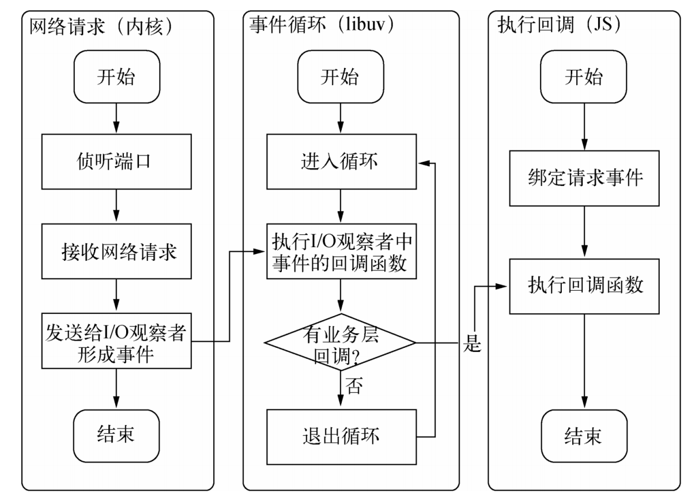

下面为几种经典的服务器模型，这里对比下它们的优缺点。

+ 同步式：对于同步式的服务，一次只能处理一个请求，并且其余请求都处于等待状态。
+ 每进程/每请求：为每个请求启动一个进程，这样可以处理多个请求，但是它不具备扩展性，因为系统资源只有那么多。
+ 每线程/每请求：为每个请求启动一个线程来处理。尽管线程比进程要轻量，但是由于每个线程都占用一定内存，当大并发请求到来时，内存将会很快用光，导致服务器缓慢。每线程/每请求的扩展性比每进程/每请求的方式要好，但对于大型站点而言依然不够。

每线程/每请求的方式目前还被`Apache`所采用。`Node`通过事件驱动的方式处理请求，无须为每一个请求创建额外的对应线程，可以省掉创建线程和销毁线程的开销，同时操作系统在调度任务时因为线程较少，上下文切换的代价很低。这使得服务器能够有条不紊地处理请求，即使在大量连接的情况下，也不受线程上下文切换开销的影响，这是`Node`高性能的一个原因。

事件驱动带来的高效已经渐渐开始为业界所重视。知名服务器`Nginx`，也摒弃了多线程的方式，采用了和`Node`相同的事件驱动。如今，`Nginx`大有取代`Apache`之势。`Node`具有与`Nginx`相同的特性，不同之处在于`Nginx`采用纯`C`写成，性能较高，但是它仅适合于做`Web`服务器，用于反向代理或负载均衡等服务，在处理具体业务方面较为欠缺。`Node`则是一套高性能的平台，可以利用它构建与`Nginx`相同的功能，也可以处理各种具体业务，而且与背后的网络保持异步畅通。两者相比，`Node`没有`Nginx`在`Web`服务器方面那么专业，但场景更大，自身性能也不错。

